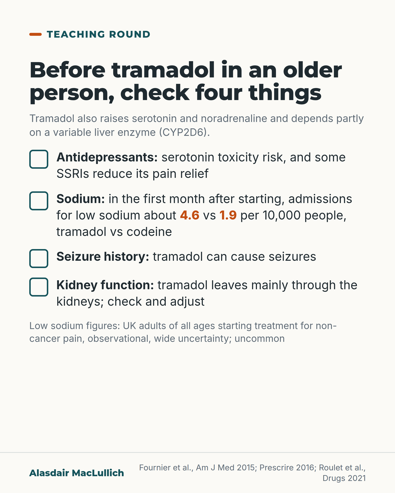

# G101: Tramadol is more than a weak opioid

- Category: C10 Pain
- Audience: practitioners
- Series: Teaching round
- Post type: teaching
- Visual format: checklist
- Status: text text_final, visual final
- Working id: C10-P07 (candidate C10-18)

## Insight

Tramadol also raises serotonin and noradrenaline and depends partly on CYP2D6, so it brings serotonin toxicity, low sodium, low blood sugar and seizure risks; in UK data it was linked with about twice the rate of admission for low sodium compared with codeine, though this is uncommon.

## Angle and position

The 'weak opioid' label invites casual prescribing; a four-item check before prescribing is proposed.

Basis: mixed: pharmacology and the Fournier figures are empirical; that a low dose of another opioid may be more predictable, and the pre-prescribing check, are prescribing judgement.

## X (880 characters)

```text
Calling tramadol a 'weak' opioid tells you little about how safe it is in an older person.

It also raises serotonin and noradrenaline. Much of its opioid effect depends on CYP2D6, a liver enzyme that varies between people and is blocked by some antidepressants.

It can cause serotonin toxicity with some antidepressants, low sodium, low blood sugar and seizures. In UK GP records, about 4.6 in 10,000 people were admitted with low sodium in the first month after starting tramadol, against 1.9 in 10,000 people starting codeine. That is roughly twice the rate, with wide uncertainty. It is still uncommon, the study covered adults of all ages, and it was observational.

Before prescribing, check the antidepressant list, sodium, seizure history and kidney function. In our judgement a low dose of another opioid may be more predictable, with doses adjusted for kidney function.
```

## LinkedIn (1897 characters)

```text
Calling tramadol a 'weak' opioid tells you little about how safe it is in an older person.

Tramadol is an opioid that also raises serotonin and noradrenaline levels by blocking their reuptake. Much of its opioid effect comes from a breakdown product made in the liver by CYP2D6. That enzyme's activity varies a great deal between people, and some antidepressants block it, so the same dose can have quite different effects.

Its non-opioid actions bring their own harms:

1. Serotonin toxicity (agitation, twitching, shaking, sweating, fever) with some antidepressants. The evidence is case reports and pharmacovigilance, so the frequency is unknown, but tramadol is the opioid most often named. Some SSRIs also block CYP2D6, so the combination can mean more side effects and less pain relief.

2. Low sodium. In UK GP records of over 330,000 people starting tramadol or codeine, about 4.6 in every 10,000 people were admitted to hospital with low sodium in the first month after starting tramadol, against about 1.9 for codeine. Roughly twice the rate, but uncommon, with a wide margin of uncertainty. These were adults of all ages, and the study was observational.

3. Low blood sugar. The same group found people starting tramadol were more likely than those starting codeine to be admitted with low blood sugar, mainly in the first month. It is rare.

4. Seizures.

An independent review found no evidence that tramadol is less risky than a low dose of morphine, and its effects are less predictable.

Our prescribing judgement: tramadol needs more checks than its 'weak' label suggests. Before starting it, check the antidepressant list, sodium, any history of seizures and kidney function; tramadol leaves mainly through the kidneys, so check and adjust. A low dose of another opioid may be more predictable, remembering that morphine itself needs adjusting when kidney function is reduced.
```

## Bluesky (278 characters)

```text
Tramadol is often called a weak opioid. It also raises serotonin, relies on a variable liver enzyme, and can cause low sodium, low blood sugar, seizures and serotonin toxicity. Before prescribing it to an older person: check antidepressants, sodium, seizure history and kidneys.
```

## Threads (488 characters)

```text
'Weak opioid' says little about tramadol's safety in older people.

It also raises serotonin and depends on a liver enzyme that some antidepressants block. It can cause serotonin toxicity, low sodium, low blood sugar and seizures.

In UK adults (observational), about 4.6 in 10,000 starting tramadol were admitted with low sodium in the first month, against 1.9 in 10,000 starting codeine. Uncommon, about double, wide uncertainty.

Check antidepressants, sodium, seizures, kidneys first.
```

## Source reply

Sources: Fournier et al., Am J Med 2015 https://doi.org/10.1016/j.amjmed.2014.10.046 ; Fournier et al., JAMA Intern Med 2015 https://doi.org/10.1001/jamainternmed.2014.6512 ; Prescrire 2016 https://pubmed.ncbi.nlm.nih.gov/27042732/ ; Roulet et al., Drugs 2021 https://doi.org/10.1007/s40265-021-01515-z

## Visual



Alt text: Checklist card: before tramadol in an older person, check antidepressants, sodium, seizure history and kidney function. Low sodium admissions in the first month were about 4.6 versus 1.9 per 10,000 people, tramadol versus codeine; UK observational data, wide uncertainty, uncommon.

Editable source: `visuals/src/G101.html`

Design instructions: Single checklist card using .ticks with bold lead words, orange 4.6 and 1.9, grey caveat note. Data: C10-18-e.

## Sources and verification

- C10-18-a (supported): Tramadol blocks the reuptake of serotonin and noradrenaline, and its opioid effect comes mainly from its breakdown product O-desmethyltramadol.
  - Source: Faria J, Barbosa J, Moreira R, Queiros O, Carvalho F, Dinis-Oliveira RJ. Comparative pharmacology and toxicology of tramadol and tapentadol. Eur J Pain. 2018;22(5):827-44.; Coluzzi F, Caputi FF, Billeci D, Pastore AL, Candeletti S, Rocco M, et al. Safe use of opioids in chronic kidney disease and hemodialysis patients: tips and tricks for non-pain specialists. Ther Clin Risk Manag. 2020;16:821-37.
  - Passage: "Faria 2018: "Tramadol is a prodrug that acts through noradrenaline and serotonin reuptake inhibition, with a weak opioid component added by its metabolite O-desmethyltramadol." Coluzzi 2020: "Tramadol is the most commonly involved opioid in the reported cases of serotonin syndrome, alone or in combination with other serotoninergic medications, because of its dual mechanism of action, including inhibition of 5-HT reuptake."" (Faria 2018 abstract; Coluzzi 2020 full text, section 'Combination Therapy with Opioids: Patient Safety Issues in CKD')
- C10-18-b (supported): Tramadol's opioid effect depends on conversion by the liver enzyme CYP2D6, which varies widely between people, making its effect less predictable than morphine's.
  - Source: [No authors listed]. "Weak" opioid analgesics. Codeine, dihydrocodeine and tramadol: no less risky than morphine. Prescrire Int. 2016;25(168):45-50.; Roulet L, Rollason V, Desmeules J, Piguet V. Tapentadol versus tramadol: a narrative and comparative review of their pharmacological, efficacy and safety profiles in adult patients. Drugs. 2021;81(11):1257-72.; Nelson EM, Philbrick AM. Avoiding serotonin syndrome: the nature of the interaction between tramadol and selective serotonin reuptake inhibitors. Ann Pharmacother. 2012;46(12):1712-6.
  - Passage: "Prescrire 2016: "The potency of codeine and tramadol is strongly influenced by the cytochrome P450 isoenzyme CYP2D6 genotype, which varies widely from one person to another. This explains reports of overdosing or underdosing after administration of standard doses of the two drugs. The potency of morphine and that of buprenorphine, an opioid receptor agonist-antagonist, appears to be independent of CYP2D6 activity." Roulet 2021: "...thus overcoming some limitations of tramadol, including the potential for pharmacokinetic drug-drug interactions and interindividual variability due to genetic polymorphisms of cytochrome P450 enzymes." Nelson 2012: "Tramadol is metabolized through CYP2D6 enzymes and all SSRIs are inhibitors of these enzymes."" (Abstracts)
- C10-18-c (supported_with_qualification): Tramadol taken with SSRIs (and other serotonergic medicines) has caused serotonin toxicity; tramadol is the opioid most often involved in reported cases.
  - Source: Nelson EM, Philbrick AM. Avoiding serotonin syndrome: the nature of the interaction between tramadol and selective serotonin reuptake inhibitors. Ann Pharmacother. 2012;46(12):1712-6.; Coluzzi F, Caputi FF, Billeci D, Pastore AL, Candeletti S, Rocco M, et al. Safe use of opioids in chronic kidney disease and hemodialysis patients: tips and tricks for non-pain specialists. Ther Clin Risk Manag. 2020;16:821-37.; Roulet L, Rollason V, Desmeules J, Piguet V. Tapentadol versus tramadol: a narrative and comparative review of their pharmacological, efficacy and safety profiles in adult patients. Drugs. 2021;81(11):1257-72.
  - Passage: "Nelson 2012: "Published documentation describing the interaction between tramadol and SSRIs and its relevance to serotonin syndrome is limited to a few case reports and 1 case series. While both tramadol and SSRIs increase the amount of serotonin in the brain, the interaction is much more complicated. Tramadol is metabolized through CYP2D6 enzymes and all SSRIs are inhibitors of these enzymes. Inhibitors of CYP2D6 can increase the concentration of tramadol in the blood and thus increase its effects on serotonin in the brain, contributing to the development of serotonin syndrome." ... "Coadministration of tramadol and SSRIs has caused serotonin syndrome." Coluzzi 2020: "Tramadol is the most commonly involved opioid in the reported cases of serotonin syndrome, alone or in combination with other serotoninergic medications, because of its dual mechanism of action, including inhibition of 5-HT reuptake."" (Nelson 2012 abstract; Coluzzi 2020 full text)
- C10-18-d (supported): Tramadol has been linked with low sodium, low blood sugar and seizures, adverse effects not shared to the same degree by other opioids.
  - Source: [No authors listed]. "Weak" opioid analgesics. Codeine, dihydrocodeine and tramadol: no less risky than morphine. Prescrire Int. 2016;25(168):45-50.; Roulet L, Rollason V, Desmeules J, Piguet V. Tapentadol versus tramadol: a narrative and comparative review of their pharmacological, efficacy and safety profiles in adult patients. Drugs. 2021;81(11):1257-72.; Owsiany MT, Hawley CE, Triantafylidis LK, Paik JM. Opioid management in older adults with chronic kidney disease: a review. Am J Med. 2019;132(12):1386-93.
  - Passage: "Prescrire 2016: "In addition, tramadol can cause a serotonin syndrome, hypoglycaemia, hyponatraemia and seizures." ... "Tramadol has additional adverse effects unrelated to its opioid effects." Roulet 2021: "tapentadol is likely to result in less exposure to serotoninergic adverse effects (nausea, vomiting, hypoglycaemia)" ... "its residual serotonergic activity (serotonin syndrome, seizures)". Owsiany 2019: "There is also concern for increased risk of seizures and central nervous system adverse effects in older adults with prolonged tramadol use."" (Prescrire 2016 abstract; Roulet 2021 abstract; Owsiany 2019 full text, section 4)
- C10-18-e (supported_with_qualification): In a UK primary care cohort of 332,880 people starting tramadol or codeine, hospital admission for low sodium in the first 30 days was 4.6 per 10,000 person-months with tramadol versus 1.9 with codeine (adjusted HR 2.05).
  - Source: Fournier JP, Yin H, Nessim SJ, Montastruc JL, Azoulay L. Tramadol for noncancer pain and the risk of hyponatremia. Am J Med. 2015;128(4):418-25.e5.
  - Passage: ""Using the UK Clinical Practice Research Datalink and Hospital Episodes Statistics database, a population-based cohort of 332,880 patients initiating tramadol or codeine was assembled from 1998 through 2012." ... "The incidence rates of hospitalization for hyponatremia were 4.6 (95% CI, 2.4-8.0) and 1.9 (95% CI, 1.4-2.5) per 10,000 person-months for tramadol and codeine users, respectively. In the adjusted model, the use of tramadol was associated with a 2-fold increased risk of hospitalization for hyponatremia, compared with codeine (adjusted HR 2.05; 95% CI, 1.08-3.86)."" (Abstract, Methods and Results)
- C10-18-f (supported_with_qualification): In the same UK data, starting tramadol was linked with more hospital admissions for low blood sugar than starting codeine, especially in the first 30 days.
  - Source: Fournier JP, Azoulay L, Yin H, Montastruc JL, Suissa S. Tramadol use and the risk of hospitalization for hypoglycemia in patients with noncancer pain. JAMA Intern Med. 2015;175(2):186-93.
  - Passage: ""The cohort included 334,034 patients, of whom 1105 were hospitalized for hypoglycemia during follow-up (incidence, 0.7 per 1000 per year) and matched to 11,019 controls. Compared with codeine, tramadol use was associated with an increased risk of hospitalization for hypoglycemia (OR, 1.52 [95% CI, 1.09-2.10]), particularly elevated in the first 30 days of use (OR, 2.61 [95% CI, 1.61-4.23]). This 30-day increased risk was confirmed in the cohort (HR, 3.60 [95% CI, 1.56-8.34]) and case-crossover analyses (OR, 3.80 [95% CI, 2.64-5.47])." ... "Additional studies are needed to confirm this rare but potentially fatal adverse event."" (Abstract, Results and Conclusions)
- C10-18-g (supported_with_qualification): There is no evidence that tramadol (or codeine) is less risky than morphine at its lowest effective dose, and its effects vary more between people.
  - Source: [No authors listed]. "Weak" opioid analgesics. Codeine, dihydrocodeine and tramadol: no less risky than morphine. Prescrire Int. 2016;25(168):45-50.
  - Passage: ""In practice, when opioid therapy is needed, there is no evidence that codeine, dihydrocodeine or tramadol is less risky than morphine at its lowest effective dose. Compared to morphine, the efficacy of these drugs varies more from one patient to another, and their multiple pharmacokinetic interactions can be difficult to manage. There is also a sometimes unpredictable risk of serious over-dose. Tramadol has additional adverse effects unrelated to its opioid effects. Weak opioids require at least as much vigilance as morphine, despite the major differences in their reputation and regulation."" (Abstract)
- C10-18-h (supported): Tramadol and its active breakdown products are cleared mainly by the kidneys, so its dose needs adjusting when kidney function is reduced.
  - Source: Coluzzi F, Caputi FF, Billeci D, Pastore AL, Candeletti S, Rocco M, et al. Safe use of opioids in chronic kidney disease and hemodialysis patients: tips and tricks for non-pain specialists. Ther Clin Risk Manag. 2020;16:821-37.; Owsiany MT, Hawley CE, Triantafylidis LK, Paik JM. Opioid management in older adults with chronic kidney disease: a review. Am J Med. 2019;132(12):1386-93.
  - Passage: "Coluzzi 2020: "With the regard to the use of the “weak opioid” tramadol, it is relevant to point out that 90% is renally excreted and its half-life may increase up to twofold in CKD patients." Owsiany 2019: "Tramadol (immediate release) is not recommended for usage in older chronic kidney disease patients. Tramadol and its active metabolites are predominantly renally cleared."" (Coluzzi 2020 full text, 'Pharmacological Update'; Owsiany 2019 full text, section 4)

Verification notes: Faria 2018, Coluzzi 2020 (full text): mechanism. Prescrire 2016, Roulet 2021, Nelson 2012 (abstracts): CYP2D6, serotonin toxicity, hyponatraemia, hypoglycaemia, seizures, not safer than low-dose morphine. Fournier 2015 Am J Med (abstract): 4.6 vs 1.9 per 10,000 person-months, all ages, observational, wide CI. Fournier 2015 JAMA IM (abstract): hypoglycaemia, no absolute figures. Owsiany 2019 (full text): kidney clearance. Beers not cited. Low dose of another opioid framed as judgement with morphine kidney caveat.

## Attention and follow potential

Pause: Prescribers who choose tramadol as a middle step because it sounds mild.

Gain: The mechanism behind its extra risks and a four-item check.

Follow: Pharmacology made usable at the point of prescribing.

## Open issues

None.
