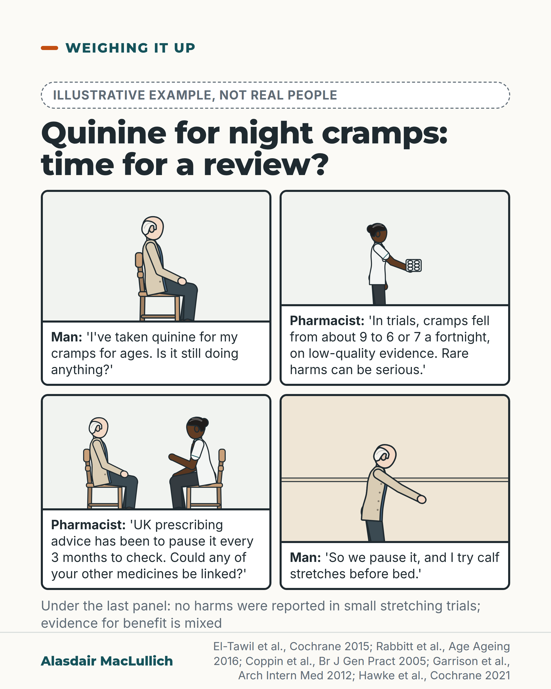

# G102: Night cramps and quinine: a small benefit with rare serious harms

- Category: C10 Pain
- Audience: public
- Series: Weighing it up
- Post type: decision_support
- Visual format: comic strip (4 panels)
- Status: text text_final, visual final
- Working id: C10-P08 (candidate C10-03)

## Insight

Quinine cuts night cramps from about 9 to about 6 or 7 a fortnight, with rare serious harms; specialist advice is to keep it for severe cramps and pause it every few months to check it still helps.

## Angle and position

Anyone on quinine for cramps should ask when it was last reviewed; the reader gets the size of the benefit, the harms and what else to check.

Basis: mixed: benefit, harms, advice and the stopping trial are empirical; that anyone on quinine should have it reviewed is clinical interpretation.

## X (882 characters)

```text
If quinine is on your repeat list for night-time leg cramps, ask when it was last reviewed.

In trials, people on a dummy tablet had about 9 cramps in two weeks. On quinine they had about 6 or 7. The evidence is low quality.

About 3 more people in 100 had minor side effects on quinine, mostly stomach upset. Rarely it causes a sudden fall in platelets (blood cells that help clotting) or heart rhythm problems, and an overdose can kill.

Specialist advice is to keep it for severe cramps and review it regularly. UK prescribing advice, as reported in a 2015 Cochrane review, was to pause it every 3 months to check it still helps. In an English GP trial, advice to try stopping led about 1 in 4 more people to stop. Cramps did not clearly rise. The trial was small and could not rule out a rise for some people.

Also ask whether another medicine might be linked with your cramps.
```

## LinkedIn (1802 characters)

```text
If quinine is on your repeat list for night-time leg cramps, ask when it was last reviewed.

The benefit is modest. In pooled trials, people on a dummy tablet had about 9 cramps in two weeks. People on quinine had about 2 to 3 fewer, so roughly 6 or 7. Cramps were only slightly less painful. The evidence is low quality, and the trials lasted up to about two months.

About 3 more people in every 100 had minor side effects on quinine, mostly stomach upset. The trials were too small to measure rare serious harms. Those come from other reports. They include a sudden fall in platelets (the blood cells that help clotting) and heart rhythm problems, especially after too many tablets. An overdose can kill. A review in Age and Ageing notes that older people are more prone to its dose-related side effects.

What the advice says (a review by specialists in older people's medicine, and UK prescribing advice reported in a Cochrane review):

1. Keep quinine for severe cramps, and talk through benefits and risks.

2. Allow up to 4 weeks to see whether it helps.

3. Pause it every 3 months to check it is still helping.

Stopping is often possible. A trial in 28 English general practices gave people on long-term quinine advice to try stopping, or gave them no such advice. At 12 weeks, about 1 in 4 more of those advised to stop were taking none. The trial did not show a clear difference in cramps, although it could not rule out a rise for some people.

Two more things to ask. Some medicines are linked with night cramps, including some water tablets and long-acting lung inhalers. This is a link, not proof. Do not stop any medicine without advice. Calf and hamstring stretches before bed are reasonable to try. No harms were reported in small trials, although the evidence for benefit is mixed.
```

## Bluesky (295 characters)

```text
On quinine for cramps? In trials, people on quinine had about 6 or 7 cramps in two weeks, against about 9 on a dummy tablet (low-quality evidence). Rare serious harms include a sudden fall in platelets and heart rhythm problems. Ask when it was last reviewed, and whether a pause could be tried.
```

## Threads (492 characters)

```text
Is quinine on your repeat list for cramps?

In trials, cramps fell from about 9 to 6 or 7 a fortnight on quinine. Rare serious harms include a sudden fall in platelets (blood cells that help clotting) and heart rhythm problems.

UK prescribing advice in 2015 was to pause it every 3 months. In an English GP trial, advice to stop led about 1 in 4 more people to stop. Cramps did not clearly rise, though a rise was not ruled out.

Ask when it was last reviewed, and if a pause could be tried.
```

## Source reply

Sources: El-Tawil et al., Cochrane 2015 https://doi.org/10.1002/14651858.CD005044.pub3 ; Rabbitt et al., Age Ageing 2016 https://doi.org/10.1093/ageing/afw139 ; Coppin et al., Br J Gen Pract 2005 https://pubmed.ncbi.nlm.nih.gov/15808033/ ; Garrison et al., Arch Intern Med 2012 https://doi.org/10.1001/archinternmed.2011.1029 ; Hawke et al., Cochrane 2021 https://doi.org/10.1002/14651858.CD008496.pub3

## Visual



Alt text: Illustrative four-panel comic, not real people. An older man asks a pharmacist whether quinine for night cramps still helps. She gives the trial figures, advises a pause every 3 months and a medicines check; he pauses it and tries calf stretches. Evidence for benefit is mixed.

Editable source: `visuals/src/G102.html`

Design instructions: Single card, illustrative badge, .strip.p4 with four Kit panels (seated man; pharmacist holding blister; two seated; man leaning at wall), dialogue in captions, last caption below. No speech balloons.

## Sources and verification

- C10-03-a (supported_with_qualification): Compared with placebo, quinine reduces the number of cramps modestly: about 2 to 3 fewer cramps over two weeks from about 9 on placebo (about a quarter fewer), on low-quality evidence.
  - Source: El-Tawil S, Al Musa T, Valli H, Lunn MP, Brassington R, El-Tawil T, et al. Quinine for muscle cramps. Cochrane Database Syst Rev. 2015;2015(4):CD005044.; Man-Son-Hing M, Wells G, Lau A. Quinine for nocturnal leg cramps: a meta-analysis including unpublished data. J Gen Intern Med. 1998;13(9):600-6.
  - Passage: "Cochrane 2015, Effects of interventions: "Quinine resulted in a significant decrease in cramp number (-2.45 cramps, 95% CI -3.54 to -1.36, random-effects), equivalent to a 28% (95% CI 15% to 40%) reduction over placebo (see Analysis 1.2, Figure 2). It is worth noting the persistent heterogeneity (I2 = 71%) associated with this result." Summary of findings table: "The mean number of cramps over 2 weeks in the control groups was 8.8 cramps"; "The mean number of cramps over 2 weeks in the intervention groups was 2.45 lower (1.36 to 3.54 lower)" [952 participants, 13 studies, GRADE low]. Cramp days: "The remaining seven trials (n = 842) showed that quinine significantly reduced cramp days compared to placebo (-1.15 days, 95% CI -1.93 to -0.38, random-effects) (see Analysis 1.6). This represents a 20% (95% CI 6% to 33%) reduction in cramp days". Abstract: "There is low quality evidence that quinine (200 mg to 500 mg daily) significantly reduces cramp number and cramp days and moderate quality evidence that quinine reduces cramp intensity." Man-Son-Hing 1998, Abstract: "When individual patient data from all crossover studies were pooled, persons had 3.60 (95% confidence interval [CI] 2.15, 5.05) fewer cramps in a 4-week period when taking quinine compared with placebo." Table 3: placebo "17.08 (15.40, 18.76)" cramps per 4-week period (n = 409)." (Cochrane: Results (Effects of interventions, quinine versus placebo), Summary of findings table 1, Abstract. Man-Son-Hing: Abstract, Results, Table 3.)
- C10-03-b (supported): In trials, minor side effects (mainly stomach upset) were slightly more common with quinine; the trials were too small and short to measure rare serious harms.
  - Source: El-Tawil S, Al Musa T, Valli H, Lunn MP, Brassington R, El-Tawil T, et al. Quinine for muscle cramps. Cochrane Database Syst Rev. 2015;2015(4):CD005044.
  - Passage: "Abstract: "A significantly greater number of people suffered minor adverse events on quinine than placebo (risk difference (RD) 3%, 95% confidence interval (CI) 0% to 6%), mainly gastrointestinal symptoms. Overdoses of quinine have been reported elsewhere to cause potentially fatal adverse effects, but in the included trials there was no significant difference in major adverse events compared with placebo (RD 0%, 95% CI -1% to 2%). One participant suffered from thrombocytopenia (0.12% risk) on quinine." Authors' conclusions: "There is moderate quality evidence that with use up to 60 days, the incidence of serious adverse events is not significantly greater than for placebo in the identified trials, but because serious adverse events can be rarely fatal, in some countries prescription of quinine is severely restricted." ... "Because serious adverse events are not common, large population studies are required to more accurately inform incidence."" (Abstract (Main results; Authors' conclusions))
- C10-03-c (supported_with_qualification): Quinine can rarely cause serious harm, including immune reactions that destroy platelets (thrombocytopenia), heart rhythm problems especially in overdose, and death in overdose; dose-related side effects are a particular concern in older people.
  - Source: El-Tawil S, Al Musa T, Valli H, Lunn MP, Brassington R, El-Tawil T, et al. Quinine for muscle cramps. Cochrane Database Syst Rev. 2015;2015(4):CD005044.; Rabbitt L, Mulkerrin EC, O'Keeffe ST. A review of nocturnal leg cramps in older people. Age Ageing. 2016;45(6):776-82.
  - Passage: "Cochrane 2015, Background: "Quinine may have potentially serious adverse effects including fatal hypersensitivity reactions, particularly quinine-induced thrombocytopenia (Barr 1990) which can occur idiosyncratically from the ingestion of even minimal amounts of quinine, such as are present in commercial tonic waters (Schneemann 2006). Other hypersensitivity reactions include angio-oedema, disseminated intravascular coagulation, pancytopenia (Maguire 1993) and haemolytic uraemic syndrome (McDonald 1997)." ... "Quinine can interfere with the conduction pathways in the heart giving rise to arrhythmias, especially in overdosage (White 2007). Acute intoxication (ingestion of 4 to 12 g quinine) can cause convulsions followed by coma; death from respiratory arrest often results with doses exceeding 8 g." Plain language summary: "Quinine can cause serious, even fatal adverse events, especially in overdosage." Discussion: "A case-control study in the USA estimated that quinine-induced thrombocytopenia occurs in 26 of every 1 million users (Kaufman 1993)." Rabbitt 2016, Abstract: "However, the degree of benefit from quinine is modest and the risks include rare but serious immune-mediated reactions and, especially in older people, dose-related side effects."" (Cochrane: Background (Description of the intervention), Plain language summary, Discussion (Adverse events due to quinine). Rabbitt: Abstract.)
- C10-03-d (supported_with_qualification): Guidance restricts quinine for cramps to severe symptoms, as a trial with regular review; UK advice reported in the Cochrane review allows up to 4 weeks to see an effect and a pause every 3 months to check benefit; the MHRA issued a quinine safety update in June 2010.
  - Source: Rabbitt L, Mulkerrin EC, O'Keeffe ST. A review of nocturnal leg cramps in older people. Age Ageing. 2016;45(6):776-82.; El-Tawil S, Al Musa T, Valli H, Lunn MP, Brassington R, El-Tawil T, et al. Quinine for muscle cramps. Cochrane Database Syst Rev. 2015;2015(4):CD005044.; Man-Son-Hing M, Wells G, Lau A. Quinine for nocturnal leg cramps: a meta-analysis including unpublished data. J Gen Intern Med. 1998;13(9):600-6.; Acheampong P, Cooper G, Khazaeli B, Lupton DJ, White S, May MT, et al. Effects of MHRA drug safety advice on time trends in prescribing volume and indices of clinical toxicity for quinine. Br J Clin Pharmacol. 2013;76(6):973-9.
  - Passage: "Rabbitt 2016, Abstract: "Quinine treatment should be restricted to those with severe symptoms, should be subject to regular review and requires discussion of the risks and benefits with patients." Cochrane 2015, Discussion: "The British National Formulary (BNF) advises that it may take up to four weeks for the effect on cramp to become apparent and that if there is improvement, then quinine should be taken continuously with close monitoring for adverse events (BNF 2010). The BNF also advises interruption of treatment every three months for review of benefit." Man-Son-Hing 1998, Discussion: "If this fails and the patient's quality of life is significantly affected, then a trial of quinine (of at least 4 weeks) may be warranted. As with all potentially hazardous medications, physicians prescribing quinine need to closely monitor the benefits and risks in individual patients." Acheampong 2013, Abstract: "To ascertain the effects of the Medicines and Healthcare products Regulatory Agency's (MHRA) safety update in June 2010 on the volume of prescribing of quinine and on indices of quinine toxicity."" (Rabbitt: Abstract. Cochrane: Discussion (Other considerations). Man-Son-Hing: Discussion. Acheampong: Abstract (Aims).)
- C10-03-g (supported_with_qualification): In a UK primary care trial, advising people on long-term quinine to try stopping it led more of them to stop, without a clear difference in cramps at 12 weeks.
  - Source: Coppin RJ, Wicke DM, Little PS. Managing nocturnal leg cramps--calf-stretching exercises and cessation of quinine treatment: a factorial randomised controlled trial. Br J Gen Pract. 2005;55(512):186-91.
  - Passage: ""One hundred and ninety-one patients prescribed quinine for night cramps were randomised to one of four groups defined by two 'advice' factors: undertake exercises and stop quinine." ... "At 12 weeks there was no significant difference in number of cramps in the previous 4 weeks (exercise = 1.95, 95% confidence interval [CI] = -3.01 to 6.90; quinine cessation = 3.45, 95% CI = -1.52 to 8.41) nor symptom burden or severity of cramps. However, after 12 weeks 26.5% (95% CI = 13.3% to 39.7%) more patients who had been advised to stop quinine treatment reported taking no quinine tablets in the previous week (odds ratio [OR] = 3.32, 95% CI = 1.37 to 8.06)" ... "Advising those on long-term repeat prescriptions to try stopping quinine temporarily will result in no major problems for patients, and allow a significant number to stop medication."" (Abstract (Method, Results, Conclusions))
- C10-03-h (supported_with_qualification): Stretching before bed is a low-risk option, but evidence that it reduces night cramps is limited and mixed.
  - Source: Hawke F, Sadler SG, Katzberg HD, Pourkazemi F, Chuter V, Burns J. Non-drug therapies for the secondary prevention of lower limb muscle cramps. Cochrane Database Syst Rev. 2021;5(5):CD008496.; Coppin RJ, Wicke DM, Little PS. Managing nocturnal leg cramps--calf-stretching exercises and cessation of quinine treatment: a factorial randomised controlled trial. Br J Gen Pract. 2005;55(512):186-91.; Rabbitt L, Mulkerrin EC, O'Keeffe ST. A review of nocturnal leg cramps in older people. Age Ageing. 2016;45(6):776-82.
  - Passage: "Hawke 2021, Abstract: "A combination of daily calf and hamstring stretching for six weeks may reduce the severity of night-time lower limb muscle cramps (measured on a 10 cm visual analogue scale (VAS) where 0 = no pain and 10 cm = worst pain imaginable) in people aged 55 years and older, compared to no intervention (mean difference (MD) -1.30, 95% confidence interval (CI) -1.74 to -0.86; 1 RCT, 80 participants; low-certainty evidence). The certainty of evidence was very low for cramp frequency" ... "Calf stretching alone for 12 weeks may make little to no difference to the frequency of night-time lower limb muscle cramps in people aged 60 years and older" ... "No participant in these three studies reported adverse events. The evidence for adverse events was of moderate certainty as the studies were too small to detect uncommon events." Coppin 2005, Conclusions: "Calf-stretching exercises are not effective in reducing the frequency or severity of night cramps." Rabbitt 2016, Abstract: "There is conflicting evidence regarding the efficacy of prophylactic stretching exercises in preventing cramps."" (Hawke: Abstract (Main results, Authors' conclusions). Coppin: Abstract (Conclusions). Rabbitt: Abstract.)
- C10-03-i (supported_with_qualification): Some medicines are linked with night cramps, particularly thiazide-type and potassium-sparing diuretics and long-acting beta-agonist inhalers.
  - Source: Garrison SR, Dormuth CR, Morrow RL, Carney GA, Khan KM. Nocturnal leg cramps and prescription use that precedes them: a sequence symmetry analysis. Arch Intern Med. 2012;172(2):120-6.; Rabbitt L, Mulkerrin EC, O'Keeffe ST. A review of nocturnal leg cramps in older people. Age Ageing. 2016;45(6):776-82.
  - Passage: "Garrison 2012, Abstract: "Adjusted sequence ratios (95% CIs) for the 3 drug classes were 1.47 (1.33-1.63 [P < .001]) for diuretics, 1.16 (1.04-1.29 [P = .004]) for statins, and 2.42 (2.02-2.89 [P < .001]) for LABAs. For diuretic subclasses, adjusted sequence ratios (95% CIs) were 2.12 (1.61-2.78 [P < .001]) for potassium sparing, 1.48 (1.29-1.68 [P < .001]) for thiazidelike, and 1.20 (1.00-1.44 [P = .07]) for loop." ... "Cramp treatment was substantially more likely in the year following introduction of LABAs, potassium-sparing diuretics, or thiazidelike diuretics, and 60.3% of quinine users (individuals experiencing cramp) received at least 1 of these medications during a 13-year period. In contrast, statin and loop diuretic associations were small." Rabbitt 2016, Abstract: "Recent evidence suggests that diuretic and long-acting beta-agonist therapy predispose to leg cramps."" (Garrison: Abstract (Results, Conclusions). Rabbitt: Abstract.)

Verification notes: El-Tawil 2015 (full text) and Man-Son-Hing 1998 (full text): absolute cramp figures, minor side effects 3 in 100, rare harms from background. Rabbitt 2016 (abstract): specialist advice, older people more prone. UK prescribing advice as reported by Cochrane: 4 weeks, pause every 3 months. Coppin 2005 (abstract): 1 in 4 more stopped, no clear difference in cramps. Garrison 2012 (abstract): medicine links, observational. Hawke 2021 (abstract): stretching may reduce severity in one small trial; no adverse events reported but trials too small to detect uncommon ones; evidence mixed. MHRA wording not quoted.

## Attention and follow potential

Pause: People who have taken quinine for years without a review, and their families.

Gain: The real size of the benefit, the harms and a clear request to make.

Follow: Useful medicine review questions for older people.

## Open issues

None.
