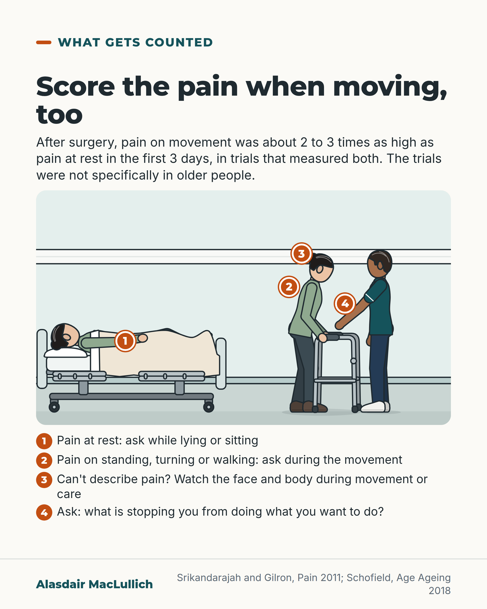

# G103: Score the pain when moving

- Category: C10 Pain
- Audience: practitioners
- Series: What gets counted
- Post type: teaching
- Visual format: annotated scene
- Status: text text_final, visual final
- Working id: C10-P09 (candidate C10-21)

## Insight

Pain on movement is usually much worse than pain at rest and is often unmeasured; recording pain on standing or during a relevant activity alongside rest pain gives a truer picture for rehabilitation.

## Angle and position

A low resting score can sit beside a person who will not stand; the position is to record pain on movement alongside pain at rest.

Basis: mixed: the rest versus movement difference and the back-pain association are empirical; recording both scores is a recommendation (judgement) built on UK guidance.

## X (758 characters)

```text
Pain scored while someone lies in bed tells you little about the pain of standing, turning or walking.

After an operation, pain on movement is usually much worse than pain at rest. In trials of chest surgery, knee replacement and hysterectomy that measured both, it was about 2 to 3 times as high in the first 3 days, depending on the trial. Of the trials reviewed, only about 4 in 10 measured it at all.

In 226 older adults with long-term back pain, more pain after standing from a chair, climbing stairs and walking went with more disability. That was a snapshot, so it shows a link, not a cause.

UK guidance asks how pain affects what the person can do. We would add one line to the chart: pain on standing, next to pain at rest, before therapy starts.
```

## LinkedIn (1645 characters)

```text
Pain scored while someone lies in bed tells you little about the pain of standing, turning or walking.

The difference is large. In postsurgical trials that measured both, pain on movement was about 2 to 3 times as high as pain at rest in the first 3 days, depending on the trial. Yet only about 4 in 10 of the postsurgical trials reviewed measured pain on movement at all. Most of this evidence is from surgical patients of all ages, not specifically older people or ward practice.

Pain researchers now often put pain on movement first, because it is the pain that gets in the way of recovery. That is their reasoning rather than a measured comparison.

There is some direct evidence in older people. A study of 226 older adults with long-term back pain measured pain after standing up from a chair, climbing stairs and walking. Those with more pain also had more disability and did less well on tests of physical function. The study was cross-sectional, the effects were small, and one way of scoring movement pain showed no link.

UK guidance on assessing pain in older people asks how pain affects what the person can do. For people who can't easily describe their pain, it asks staff to watch them during movement or care. One question it suggests: 'What is stopping you from doing what you want to do?'

The guidance does not require a separate movement score for every patient. Our recommendation goes a step further:

1. Record pain at rest.

2. Record pain on standing, turning or walking, or during the activity the person is about to attempt.

3. Look at both before therapy or a transfer, and treat the pain that stops the movement.
```

## Bluesky (281 characters)

```text
A pain score taken lying still misses the pain of standing or walking. In surgical trials that measured both, movement pain was about 2 to 3 times as high as rest pain in the first 3 days. Only about 4 in 10 trials reviewed measured it. Record pain on standing beside pain at rest.
```

## Threads (446 characters)

```text
A pain score taken while someone lies still says little about the pain of standing or walking.

In surgical trials that measured both, pain on movement was about 2 to 3 times as high as pain at rest in the first 3 days, depending on the trial. Of the trials reviewed, only about 4 in 10 measured it.

UK guidance on older people asks how pain affects what they can do. We would record pain on standing next to pain at rest, before therapy starts.
```

## Source reply

Sources: Srikandarajah and Gilron, Pain 2011 https://doi.org/10.1016/j.pain.2011.02.008 ; Corbett et al., Pain 2019 https://doi.org/10.1097/j.pain.0000000000001431 ; Knox et al., Pain Med 2023 https://doi.org/10.1093/pm/pnad034 ; Schofield, Age Ageing 2018 https://doi.org/10.1093/ageing/afx192

## Visual



Alt text: Hospital bay drawing with numbered markers: an older woman lying in bed, and the same woman standing with a walking frame beside a physiotherapist. Key: ask pain at rest, ask during movement, watch face and body if she can't say, ask what stops her. Pain on movement was 2 to 3 times rest pain after surgery.

Editable source: `visuals/src/G103.html`

Design instructions: Single card. Kit hospital bay S=.95: older woman lying propped in bed (left), same woman at standard frame with physio at elbow (right); pins 1 to 4; numbered key below.

## Sources and verification

- C10-21-a (supported_with_qualification): After surgery, pain on movement is usually much worse than pain at rest, yet many trials measure only one kind of pain or do not say which.
  - Source: Srikandarajah S, Gilron I. Systematic review of movement-evoked pain versus pain at rest in postsurgical clinical trials and meta-analyses: a fundamental distinction requiring standardized measurement. Pain. 2011;152(8):1734-9.
  - Passage: ""Only 39% of trials measured MEP and 52% failed to identify pain outcome as pain at rest (PAR) or MEP. Temporal trending did not suggest that MEP measurement is becoming more frequent. Trials measuring both MEP and PAR suggest that MEP is 95-226% more intense than PAR in the first 3 postoperative days. Among trials measuring MEP, 38% did not specify the physical maneuver used to assess MEP. Five of 7 meta-analyses reviewed (71%) did not distinguish between PAR and MEP [...] This is an important problem because MEP is usually more severe than PAR; MEP exerts a more direct adverse impact on postsurgical functional recovery and several current and novel pain treatments differentially affect MEP vs PAR."" (Abstract)
- C10-21-b (supported_with_qualification): Pain on movement is the measure researchers now prioritise because it better reflects functional recovery.
  - Source: Srikandarajah S, Gilron I. Systematic review of movement-evoked pain versus pain at rest in postsurgical clinical trials and meta-analyses: a fundamental distinction requiring standardized measurement. Pain. 2011;152(8):1734-9.; He H, Li C, Wen Z, Zhang W, Doherty M, Zhang Y, et al. Which analgesic should we use to relieve pain after knee or hip arthroplasty? A systematic review and network meta-analysis of RCTs. Clin Orthop Relat Res. 2026;484(4):754-69.
  - Passage: "Srikandarajah 2011: "MEP exerts a more direct adverse impact on postsurgical functional recovery". He 2025/2026: "We prioritized pain during movement over pain at rest, as it better reflects functional recovery."" (Both: Abstract)
- C10-21-c (supported_with_qualification): In older adults with chronic low back pain, more pain after standard movement tasks was linked with worse disability and physical function.
  - Source: Knox PJ, Simon CB, Pohlig RT, Pugliese JM, Coyle PC, Sions JM, et al. Construct validity of movement-evoked pain operational definitions in older adults with chronic low back pain. Pain Med. 2023;24(8):985-92.
  - Passage: ""226 older adults with chronic LBP. [...] LBP intensity was collected before and after the repeated chair rise test, stair climbing test, and 6-minute walk test [...] Greater aggregated posttest MeP was independently associated with worse disability (b = 0.593, t = 2.913, P = .004), self-efficacy (b = -0.870, t = -3.110, P = .002), and physical function (b = -0.017, t = -2.007, P = .039). MeP change scores were not associated with any outcome (all P > .050)."" (Abstract, Results)
- C10-21-d (supported): The most commonly used pain measures record pain at rest or recalled pain, which does not capture pain during movement; measuring movement-evoked pain has been slow to reach clinical care.
  - Source: Corbett DB, Simon CB, Manini TM, George SZ, Riley JL, Fillingim RB. Movement-evoked pain: transforming the way we understand and measure pain. Pain. 2019;160(4):757-61.
  - Passage: ""With musculoskeletal pain, the primary driver is often pain experienced during physical activity, commonly referred to as movement-evoked pain []. Yet, the most common used pain measures assess either spontaneous pain or pain recalled through the lens of questionnaires () []. Assessment of spontaneous pain, that does not involve physical activity, cannot discern pain related to movement." and "Burgeoning research supports movement-evoked pain measurement [;;], yet it remains slow to translate to clinical care []."" (Full text, Introduction (empty brackets are stripped reference markers in the rendered PMC text))
- C10-21-e (supported_with_qualification): UK national guidelines on assessing pain in older people ask for assessment of how pain affects function and activities, and for observation of pain behaviour during movement or care in people who can't self-report reliably.
  - Source: Schofield P. The assessment of pain in older people: UK national guidelines. Age Ageing. 2018;47(suppl 1):i1-i22.
  - Passage: "Section 15, United Kingdom (p i14): "Where pain is present, a detailed clinical assessment of the multidimensional aspects of pain should be undertaken including: • Sensory dimension: the nature, location and intensity of pain • Affective dimension: the emotional component and response to pain • Impact: on functioning at the level of activities and participation." and "In people with very severe impairment, and in situations where procedures might cause pain, an observational assessment of pain behaviour is additionally required." Glossary (p i4 to i5): "Checklist of Non-verbal Pain Indicators (CNPI) A summation score of pain behaviours at rest and on movement"; "Mobilization Observation Behaviour Intensity Dementia (MOBID) An observational tool for use in early morning by carers to assess pain behaviours on five movements". Section 10 (p i10): "Re-wording your question to elicit the presence of pain such as 'Do you hurt anywhere?' or 'What is stopping you from doing what you want to do?' can substantiate the presence or absence of pain."" (Full text (PDF via Undermind): Section 15 UK subsection, p i14; Glossary, p i4 to i5; Section 10, p i10)

Verification notes: Srikandarajah 2011 (abstract): 2 to 3 times (derived from 95 to 226% more intense), about 4 in 10 trials measured; postsurgical, all ages. He 2025 and Srikandarajah: rationale only. Corbett 2019 (full text): rest scores do not capture movement pain. Knox 2023 (abstract): 226 older adults, cross-sectional, small effects, one method no link. Schofield 2018 (full text): function, observation during movement, suggested question. ANZCA not used. Recording both scores framed as recommendation.

## Attention and follow potential

Pause: Nurses and therapists who see low scores on the chart and a person who will not stand.

Gain: A second line on the pain chart that links assessment to rehabilitation.

Follow: Practical changes to routine assessment, grounded in evidence.

## Open issues

None.
