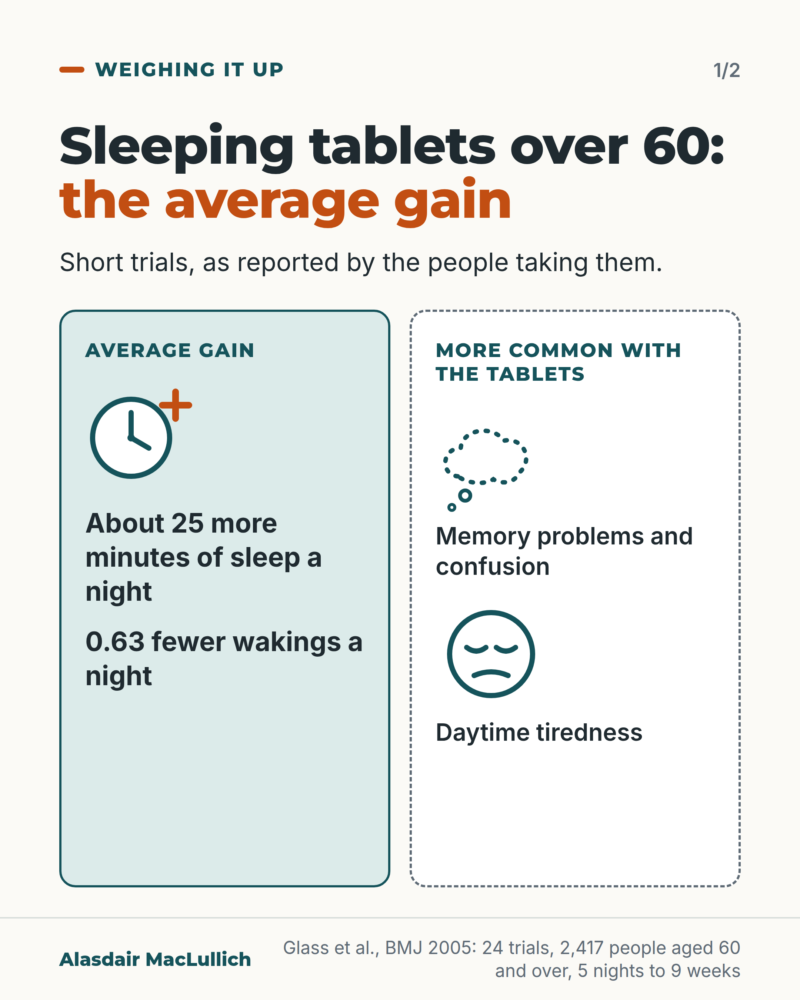
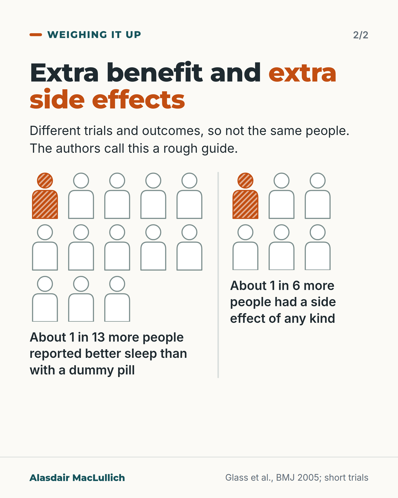

# G104: About 25 minutes a night

- Category: C11 Sleep
- Audience: both
- Series: Weighing it up
- Post type: evidence_interpretation
- Visual format: carousel (comparison card, then two icon arrays)
- Status: text text_final, visual final
- Working id: C11-P01 (candidate C11-16)

## Insight

In short trials in people aged 60 and over, sleeping tablets added about 25 minutes of self-reported sleep a night, while memory problems, confusion and daytime tiredness were more common than with a dummy pill. CBT for insomnia is the recommended first treatment for long-term insomnia.

## Angle and position

Put the benefit in minutes beside the harms in one frame, so a person can weigh them. Position: for most older people with long-term insomnia the average gain is small next to the risks and CBT for insomnia comes first, but a short course can still be a reasonable choice after discussion.

Basis: mixed: the 25 minutes, the 1 in 13 and 1 in 6 figures, the side effects and the hip fracture association are empirical findings (Glass 2005, Berry 2013); the guideline statements are published recommendations; the view that the gain is small next to the risks, and that CBT for insomnia should be offered first, is clinical interpretation consistent with both guidelines.

## X (884 characters)

```text
About 25 extra minutes of sleep a night. That was the average gain from sleeping tablets, compared with a dummy pill, in short trials of people aged 60 and over, as reported by the people taking them.

The same trials found memory problems, confusion and daytime tiredness were more common with the tablets than with a dummy pill.

In 4 of those trials, about 1 more person in 13 rated their sleep quality as improved with a tablet than with a dummy pill. In a different set of trials, about 1 more person in 6 had a side effect of any kind with a tablet than with a dummy pill. These are different trials and outcomes, so they do not describe the same people.

Guidelines recommend CBT for insomnia (a structured talking and sleep-scheduling treatment) first for long-term insomnia, with a short course of tablets open for discussion. If a tablet is offered, ask what gain to expect.
```

## LinkedIn (2173 characters)

```text
About 25 extra minutes of sleep a night, compared with a dummy pill. That was the average gain from sleeping tablets in an analysis that combined 24 trials (2,417 people aged 60 and over) with insomnia. Sleep time was reported by the people taking the tablets. Treatment lasted from 5 nights to 9 weeks. Waking in the night fell by 0.63 wakings a night on average.

The same trials found that memory problems, confusion and daytime tiredness were more common with the tablets than with a dummy pill. The authors also checked for missing trials that found no benefit. After that check, the gain was about 15 minutes.

Two more figures from the same review, to be read as a rough guide only. In 4 of the trials (1,072 people), about 1 more person in 13 rated their sleep quality as improved with a tablet than with a dummy pill. The true figure could be anywhere from 1 in 7 to 1 in 63. The tablets tested were zaleplon, brotizolam, nitrazepam and loprazolam.

In a different set of trials, about 1 more person in 6 who took a tablet had a side effect than with a dummy pill, most often drowsiness or tiredness, headache, nightmares or stomach upset.

The two figures come from different sets of trials and outcomes, so they do not describe the same people. The trials are old (published up to 2003) and short. Most tested benzodiazepines (a group of calming and sleeping tablets) and Z-drugs (a related group).

A US study of care home residents found hip fractures were more likely in periods when residents had been taking a Z-drug, especially when it was newly started. That links the tablets with fractures; it does not show the tablets caused them. The American Geriatrics Society advises avoiding both groups in people aged 65 and over, citing falls, fractures, confusion and only small gains in sleep.

European and American guidelines recommend CBT for insomnia (a structured talking and sleep-scheduling treatment) as the first treatment for long-term insomnia at any adult age. If it is not enough, a tablet can be discussed for short-term use.

We should set the minutes and the side effects side by side before a tablet is started, and agree a date to review it.
```

## Bluesky (297 characters)

```text
In short trials of people over 60, sleeping tablets added about 25 minutes of sleep a night compared with a dummy pill, as reported by the people taking them. Memory problems, confusion and daytime tiredness were also more common. Guidelines recommend CBT for insomnia, a talking treatment, first.
```

## Threads (485 characters)

```text
In short trials of people aged 60 and over, sleeping tablets added about 25 minutes of sleep a night on average compared with a dummy pill, self-reported.

Memory problems, confusion and daytime tiredness were also more common. About 1 more person in 6 had a side effect of any kind than with a dummy pill (a rough guide, from different trials).

Guidelines recommend CBT for insomnia, a talking treatment, first for long-term insomnia. If a tablet is offered, ask what gain to expect.
```

## Source reply

Sources: Glass et al., BMJ 2005 https://doi.org/10.1136/bmj.38623.768588.47 ; Berry et al., JAMA Intern Med 2013 https://doi.org/10.1001/jamainternmed.2013.3795 ; AGS Beers Criteria 2023 https://doi.org/10.1111/jgs.18372 ; European Insomnia Guideline 2023 https://doi.org/10.1111/jsr.14035

## Visual



Alt text: Two panels. Average gain: about 25 more minutes of sleep a night and 0.63 fewer wakings a night. More common with the tablets: memory problems and confusion, and daytime tiredness. From 24 trials in 2,417 people aged 60 and over.



Alt text: Two small grids of person icons. About 1 in 13 more people reported better sleep than with a dummy pill (1 of 13 shaded). About 1 in 6 more people had a side effect of any kind (1 of 6 shaded). Different trials, so not the same people; a rough guide.

Editable source: `visuals/src/G104.html`

Design instructions: carousel (comparison card, then two small icon arrays). Source html visuals/src/C11-P01.html with c11_common.js (person icon grids, hatched filled icons so colour is not the only cue). Grounds: off-white cards, mint/white panels, teal and burnt orange. Data claims: Glass et al., BMJ 2005 (C11-16-a, C11-16-c). Drawings via kit.js only on P04 card 2, P08, P10; numbered pins with HTML key.

## Sources and verification

- C11-16-a (supported_with_qualification): In randomised trials in people aged 60 and over with insomnia, sleeping tablets increased self-reported total sleep time by an average of about 25 minutes a night and reduced night-time awakenings by 0.63 compared with placebo.
  - Source: Glass J, Lanctôt KL, Herrmann N, Sproule BA, Busto UE. Sedative hypnotics in older people with insomnia: meta-analysis of risks and benefits. BMJ. 2005;331(7526):1169.
  - Passage: ""24 studies (involving 2417 participants) with extractable data met inclusion and exclusion criteria. Sleep quality improved (effect size 0.14, P < 0.05), total sleep time increased (mean 25.2 minutes, P < 0.001), and the number of night time awakenings decreased (0.63, P < 0.001) with sedative use compared with placebo." Methods: "total sleep time (total amount of time participants perceive that they have slept, measured in minutes)... Ratings were made by patients and not an observer." Inclusion: "Interventions were pharmacological treatments for insomnia for at least five consecutive nights."" (Abstract (Results); Methods, Outcome measures and Inclusion criteria (pages 1 to 2 of PDF))
- C11-16-b (supported): After correcting for possible publication bias, the estimated gain in total sleep time was smaller, about 15 minutes.
  - Source: Glass J, Lanctôt KL, Herrmann N, Sproule BA, Busto UE. Sedative hypnotics in older people with insomnia: meta-analysis of risks and benefits. BMJ. 2005;331(7526):1169.
  - Passage: ""Funnel plot analyses indicated a possible publication bias on outcomes of sleep quality and total sleep time favouring positive results (rs = 0.78, P ≤ 0.05). The mean effect size did not change after “trim and fill” to correct estimates of effect size, and the result was still significant in favour of sedatives (d = 0.14, P ≤ 0.05 for sleep quality; mean increase in total sleep time = 15 minutes, P ≤ 0.05)."" (Results, Publication bias (page 4 of PDF))
- C11-16-c (supported_with_qualification): About 13 people needed to take a sleeping tablet for one extra person to report better sleep quality, while about 6 needed to take one for one extra person to have an adverse event.
  - Source: Glass J, Lanctôt KL, Herrmann N, Sproule BA, Busto UE. Sedative hypnotics in older people with insomnia: meta-analysis of risks and benefits. BMJ. 2005;331(7526):1169.
  - Passage: ""On the basis of four studies (1072 participants), the number of patients who would need to be treated with a sedative (zaleplon, brotizolam or nitrazepam, or loprazolam) for one to have an improvement in sleep quality is 13 (95% confidence interval 6.7 to 62.9)." "On the basis of all adverse events reported in 16 studies (2220 participants), the number needed to harm for sedative hypnotics compared with placebo is 6 (4.7 to 7.1)." Discussion: "The number needed to treat for improved sleep quality was 13 and the number needed to harm for any adverse event was 6. This ratio indicates that an adverse event is more than twice as likely as enhanced quality of sleep. This ratio can be used as a rough indicator only, as more than double the number of participants contributed to the “harm” data than to the “effectiveness” data (2220 v 1072). The effectiveness estimate is less precise (the confidence interval is wider)."" (Results, Quality of sleep (page 2) and Adverse events (page 3); Discussion, Numbers needed to treat versus numbers needed to harm (page 4) of the PDF; confirmed by Scite full-text snippets)
- C11-16-d (supported_with_qualification): Memory and thinking problems (memory loss, confusion, disorientation) and daytime tiredness were reported more often with sleeping tablets than with placebo; falls-type events were not clearly shown in this analysis.
  - Source: Glass J, Lanctôt KL, Herrmann N, Sproule BA, Busto UE. Sedative hypnotics in older people with insomnia: meta-analysis of risks and benefits. BMJ. 2005;331(7526):1169.
  - Passage: ""Adverse events were more common with sedatives than with placebo: adverse cognitive events were 4.78 times more common (95% confidence interval 1.47 to 15.47, P < 0.01); adverse psychomotor events were 2.61 times more common (1.12 to 6.09, P > 0.05), and reports of daytime fatigue were 3.82 times more common (1.88 to 7.80, P < 0.001) in people using any sedative compared with placebo." Methods: "cognitive adverse events (memory loss, confusion, disorientation); psychomotor-type adverse events (reports of dizziness, loss of balance, or falls)". Results: "The most common adverse events were drowsiness or fatigue, headache, nightmares, and nausea or gastrointestinal disturbances."" (Abstract; Methods, Outcome measures (page 2); Results, Adverse events (page 3))
- C11-16-e (supported_with_qualification): In US nursing home residents, use of Z-drug sleeping tablets was linked with hip fracture, more strongly in new users.
  - Source: Berry SD, Lee Y, Cai S, Dore DD. Nonbenzodiazepine sleep medication use and hip fractures in nursing home residents. JAMA Intern Med. 2013;173(9):754-61.
  - Passage: ""The risk for hip fracture was elevated among users of a nonbenzodiazepine hypnotic drug (OR, 1.66; 95% CI, 1.45-1.90). The association between nonbenzodiazepine hypnotic drug use and hip fracture was somes greater in new users (OR, 2.20; 95% CI, 1.76-2.74)"" (Abstract, Results)
- C11-16-f (supported): The 2023 AGS Beers Criteria advise avoiding benzodiazepines and Z-drugs in older adults.
  - Source: By the 2023 American Geriatrics Society Beers Criteria Update Expert Panel. American Geriatrics Society 2023 updated AGS Beers Criteria for potentially inappropriate medication use in older adults. J Am Geriatr Soc. 2023;71(7):2052-81.
  - Passage: "Table 2 (page 22): Benzodiazepines, rationale "In general, all benzodiazepines increase the risk of cognitive impairment, delirium, falls, fractures, and motor vehicle crashes in older adults." Recommendation "Avoid"; Quality of evidence "Moderate"; Strength "Strong". Nonbenzodiazepine benzodiazepine receptor agonist hypnotics (“Z-drugs”) Eszopiclone, Zaleplon, Zolpidem: "have adverse events similar to those of benzodiazepines in older adults (e.g., delirium, falls, fractures, increased emergency room visits/hospitalizations, motor vehicle crashes); minimal improvement in sleep latency and duration." Recommendation "Avoid"; Quality of evidence "Moderate"; Strength "Strong". Discussion: "“Avoid” is not defined as an absolute contraindication unless specified in the medication’s label."" (Table 2, page 22 of the published PDF (via Undermind read_pdfs); Discussion, Interpreting recommendations (PMC full text))
- C11-16-g (supported): Major guidelines recommend CBT for insomnia as the first treatment for chronic insomnia at any adult age, with sleeping tablets reserved for short-term use if CBT-I is not enough.
  - Source: Riemann D, Espie CA, Altena E, Arnardottir ES, Baglioni C, Bassetti CLA, et al. The European Insomnia Guideline: an update on the diagnosis and treatment of insomnia 2023. J Sleep Res. 2023;32(6):e14035.; Qaseem A, Kansagara D, Forciea MA, Cooke M, Denberg TD; Clinical Guidelines Committee of the American College of Physicians. Management of chronic insomnia disorder in adults: a clinical practice guideline from the American College of Physicians. Ann Intern Med. 2016;165(2):125-33.
  - Passage: "European guideline: "Cognitive-behavioural therapy for insomnia is recommended as the first-line treatment for chronic insomnia in adults of any age (including patients with comorbidities), either applied in-person or digitally (A). When cognitive-behavioural therapy for insomnia is not sufficiently effective, a pharmacological intervention can be offered (A). Benzodiazepines (A), benzodiazepine receptor agonists (A), daridorexant (A) and low-dose sedating antidepressants (B) can be used for the short-term treatment of insomnia (≤ 4 weeks)." ACP: "ACP recommends that all adult patients receive cognitive behavioral therapy for insomnia (CBT-I) as the initial treatment for chronic insomnia disorder. (Grade: strong recommendation, moderate-quality evidence)."" (Abstracts of both guidelines)

Verification notes: Glass 2005 (full text): 25.2 minutes, 0.63 wakings, NNT 13 (4 trials, 1,072 people; CI 6.7 to 62.9), NNH 6 (16 trials, 2,220 people), trim-and-fill 15 minutes, cognitive and daytime fatigue more common (odds ratios not used). Wording says 'short trials' and 'self-reported'; NNT and NNH labelled as different trials. Unsteadiness not claimed. Berry 2013 (abstract): association only, US Z-drugs, care home residents. Beers 2023 (full text) and ACP 2016 and European 2023 guidelines (abstracts) for guideline statements; short-term tablet use allowed by the European guideline. Closing sentence in LinkedIn is marked as judgement.

## Attention and follow potential

Pause: A small, concrete number in minutes that most readers will not expect, with the harms in the same frame.

Gain: A fair basis for a decision: what to expect from a tablet, what else is more common, and that CBT for insomnia is the guideline first step.

Follow: Weighing it up posts set benefits and harms side by side and say what the numbers do not show.

## Open issues

None.
