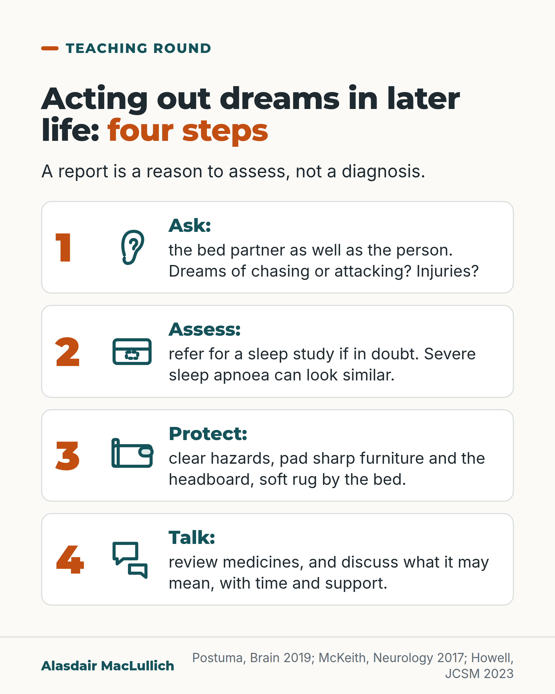

# G105: Acting out dreams

- Category: C11 Sleep
- Audience: practitioners
- Series: Teaching round
- Post type: teaching
- Visual format: checklist card
- Status: text text_final, visual final
- Working id: C11-P02 (candidate C11-21)

## Insight

Shouting, punching or kicking during dreams in later life can be REM sleep behaviour disorder, a recognised early feature of Parkinson's disease and dementia with Lewy bodies. It needs a history from the bed partner, a sleep study where available, bedroom safety, a medicines review and a careful conversation.

## Angle and position

Ask the bed partner, not only the person. A report of dream enactment is a reason to assess, not a diagnosis, and the 12-year figure comes from specialist-centre patients, not from everyone who acts out dreams.

Basis: mixed: the conversion figures, the Swiss prevalence data and the antidepressant data are empirical findings; the bedroom-safety steps are expert consensus (AASM); the view that the conversation about what it may mean should be supported and honest is an ethical and clinical judgement.

## X (793 characters)

```text
Does the person act out dreams, shouting, punching or kicking while asleep? Ask the bed partner as well as the person, and ask about injuries from movements in sleep.

This can be REM sleep behaviour disorder. In 24 specialist centres, 1,280 people had it confirmed by a sleep study. None yet had Parkinson's disease or dementia. About 6 in 100 a year went on to develop Parkinson's disease, dementia with Lewy bodies or a related condition, and the estimate for the whole 12 years was about 3 in 4. They were mostly men, and this is not a personal prognosis.

A report of dream enactment is a reason to assess. In a Swiss study of adults, 368 of about 2,000 reported it, and 21 had the disorder on a sleep study.

If in doubt, refer for a sleep study. Make the bedroom safe. Review medicines.
```

## LinkedIn (2154 characters)

```text
Does the person act out dreams, shouting, punching or kicking while asleep? Ask the bed partner as well as the person, and ask about injuries from movements in sleep.

This can be REM sleep behaviour disorder. It is one of the four core features used to diagnose dementia with Lewy bodies, and it often starts many years before other symptoms.

The numbers need care. A study followed 1,280 people in 24 specialist centres. Each had REM sleep behaviour disorder confirmed by a sleep study. None had Parkinson's disease or dementia at the start.

About 6 in 100 a year went on to develop Parkinson's disease, dementia with Lewy bodies or a related condition. The estimate for the whole 12 years was about 3 in 4. Average follow-up was 4.6 years.

Most (82.5%) were men, and these are specialist-centre patients. This is not a personal prognosis for everyone who acts out dreams.

A report of dream enactment is a reason to assess, not a diagnosis. In a Swiss population study (mean age 59), 368 of about 2,000 adults said they acted out dreams, but only 21 had the disorder on a sleep study. Severe sleep apnoea and other problems can look similar.

1. Ask: the bed partner, and about chasing or attacking dreams and injuries.

2. Assess: refer for a sleep study if in doubt. Access varies.

3. Protect: remove objects that could hurt, pad sharp furniture and the headboard, put a soft rug beside the bed, and consider sleeping apart if episodes are severe.

4. Talk: review medicines, because some antidepressants are linked with the disorder. In one small specialist cohort, some people's symptoms came with antidepressants. They still had abnormalities on tests of nerve-cell loss. Their five-year risk of Parkinson's disease or dementia was 22 in 100, against 59 in 100 in people without antidepressants. So a medicines review should not end the assessment.

We should give people time to talk through what a diagnosis may mean, book a follow-up visit, and say clearly that the future is uncertain. A recent review found that patients and professionals both see this conversation as essential, and professionals find individual prognosis hard to give.
```

## Bluesky (290 characters)

```text
Shouting, punching or kicking in sleep in later life? Ask the bed partner. It can be REM sleep behaviour disorder, linked with later Parkinson's disease or Lewy body dementia. A report is a reason to assess, not a diagnosis. Refer for a sleep study, make the bedroom safe, review medicines.
```

## Threads (472 characters)

```text
Does the person act out dreams, shouting, punching or kicking in sleep? Ask the bed partner too.

It can be REM sleep behaviour disorder. In specialist centres, about 6 in 100 confirmed cases a year went on to develop Parkinson's disease or Lewy body dementia. That is not a prognosis for everyone who acts out dreams. In a Swiss study, only 21 of 368 people who reported it had the disorder.

If in doubt, refer for a sleep study. Make the bedroom safe. Review medicines.
```

## Source reply

Sources: Postuma et al., Brain 2019 https://doi.org/10.1093/brain/awz030 ; McKeith et al., Neurology 2017 https://doi.org/10.1212/WNL.0000000000004058 ; Haba-Rubio et al., Sleep 2018 https://doi.org/10.1093/sleep/zsx197 ; Howell et al., J Clin Sleep Med 2023 https://doi.org/10.5664/jcsm.10424

## Visual



Alt text: Checklist of four steps for acting out dreams in later life. 1 Ask the bed partner and the person about chasing or attacking dreams and injuries. 2 Assess: refer for a sleep study if in doubt; severe sleep apnoea can look similar. 3 Protect: clear hazards, pad furniture and headboard, soft rug. 4 Talk: review medicines.

Editable source: `visuals/src/G105.html`

Design instructions: checklist card. Source html visuals/src/C11-P02.html with c11_common.js (person icon grids, hatched filled icons so colour is not the only cue). Grounds: off-white cards, mint/white panels, teal and burnt orange. Data claims: none (no numbers). Drawings via kit.js only on P04 card 2, P08, P10; numbered pins with HTML key.

## Sources and verification

- C11-21-a (supported_with_qualification): In 1,280 people with polysomnography-confirmed idiopathic REM sleep behaviour disorder (mean age 66, 82.5% men), the rate of developing an overt neurodegenerative syndrome was 6.3% per year, and 73.5% had converted after 12 years.
  - Source: Postuma RB, Iranzo A, Hu M, Högl B, Boeve BF, Manni R, et al. Risk and predictors of dementia and parkinsonism in idiopathic REM sleep behaviour disorder: a multicentre study. Brain. 2019;142(3):744-59.
  - Passage: ""Idiopathic REM sleep behaviour disorder (iRBD) is a powerful early sign of Parkinson's disease, dementia with Lewy bodies, and multiple system atrophy." ... "We combined prospective follow-up data from 24 centres of the International RBD Study Group. At baseline, patients with polysomnographically-confirmed iRBD without parkinsonism or dementia underwent sleep, motor, cognitive, autonomic and special sensory testing." ... "Overall, 1280 patients were recruited. The average age was 66.3 ± 8.4 and 82.5% were male. Average follow-up was 4.6 years (range = 1-19 years). The overall conversion rate from iRBD to an overt neurodegenerative syndrome was 6.3% per year, with 73.5% converting after 12-year follow-up."" (Abstract)
- C11-21-b (supported): REM sleep behaviour disorder is a core clinical feature in the consensus diagnostic criteria for dementia with Lewy bodies.
  - Source: McKeith IG, Boeve BF, Dickson DW, Halliday G, Taylor JP, Weintraub D, et al. Diagnosis and management of dementia with Lewy bodies: fourth consensus report of the DLB Consortium. Neurology. 2017;89(1):88-100.
  - Passage: ""RBD is now included as a core clinical feature because it occurs frequently in autopsy-confirmed cases compared with non-DLB (76% vs 4%). It often begins many years before other symptoms, may become less vigorous or even quiescent over time, and should be screened for using a scale that allows for patient or bed partner report." ... "If the PSG shows REM sleep without atonia in a person with dementia and a history of RBD, there is a ≥90% likelihood of a synucleinopathy,sufficient to justify a probable DLB diagnosis even in the absence of any other core feature or biomarker"" (Full text: Core clinical features, REM sleep behavior disorder; Indicative biomarkers)
- C11-21-c (supported): RBD is often reported by the bed partner; conditions that mimic it (such as severe obstructive sleep apnoea) must be excluded, and doubt should prompt referral to a sleep clinic or polysomnography.
  - Source: McKeith IG, Boeve BF, Dickson DW, Halliday G, Taylor JP, Weintraub D, et al. Diagnosis and management of dementia with Lewy bodies: fourth consensus report of the DLB Consortium. Neurology. 2017;89(1):88-100.
  - Passage: ""RBD is a parasomnia manifested by recurrent dream enactment behavior that includes movements mimicking dream content and associated with an absence of normal REM sleep atonia. It is particularly likely if dreams involve a chasing or attacking theme, and if the patient or bed partner has sustained injuries from limb movements." ... "should be screened for using a scale that allows for patient or bed partner report.Conditions mimicking RBD are common in people with dementia, e.g., confusional awakenings, severe obstructive sleep apnea, and periodic limb movements, all of which must be excluded by careful supplementary questioning to avoid a false-positive diagnosis. If there is any doubt whether a sleep disturbance is due to RBD, referral to a specialist sleep clinic should be made, or polysomnography (PSG) requested."" (Full text: Core clinical features, REM sleep behavior disorder)
- C11-21-d (supported): Injuries to the person or bed partner occur, and bedroom safety measures are recommended.
  - Source: Howell M, Avidan AY, Foldvary-Schaefer N, Malkani RG, During EH, Roland JP, et al. Management of REM sleep behavior disorder: an American Academy of Sleep Medicine clinical practice guideline. J Clin Sleep Med. 2023;19(4):759-68.; McKeith IG, Boeve BF, Dickson DW, Halliday G, Taylor JP, Weintraub D, et al. Diagnosis and management of dementia with Lewy bodies: fourth consensus report of the DLB Consortium. Neurology. 2017;89(1):88-100.
  - Passage: "AASM 2023, Good Practice Statement: "It is critically important to help patients maintain a safe sleeping environment to prevent potentially injurious nocturnal behaviors. In particular, the removal of bedside weapons, or objects that could inflict injury if thrown or wielded against a bed partner, is of paramount importance. Sharp furniture like nightstands should be moved away or their edges and headboard should be padded. To reduce the risk of injurious falls, a soft carpet, rug, or mat should be placed next to the bed. Patients with severe, uncontrolled RBD should be recommended to sleep separately from their partners, or at the minimum, to place a pillow between themselves and their partners." | McKeith 2017: "if the patient or bed partner has sustained injuries from limb movements"" (AASM abstract (Good Practice Statement); McKeith full text)
- C11-21-e (supported_with_qualification): Antidepressants can bring on or worsen REM sleep behaviour disorder, so medicines should be reviewed; but antidepressant-associated RBD can still be a sign of early neurodegeneration.
  - Source: Howell M, Avidan AY, Foldvary-Schaefer N, Malkani RG, During EH, Roland JP, et al. Management of REM sleep behavior disorder: an American Academy of Sleep Medicine clinical practice guideline. J Clin Sleep Med. 2023;19(4):759-68.; Haba-Rubio J, Frauscher B, Marques-Vidal P, Toriel J, Tobback N, Andries D, et al. Prevalence and determinants of rapid eye movement sleep behavior disorder in the general population. Sleep. 2018;41(2):zsx197.; Postuma RB, Gagnon JF, Tuineaig M, Bertrand JA, Latreille V, Desjardins C, et al. Antidepressants and REM sleep behavior disorder: isolated side effect or neurodegenerative signal? Sleep. 2013;36(11):1579-85.
  - Passage: "AASM 2023: "Adult patients with drug-induced RBD" ... "9. * The AASM suggests that clinicians use drug discontinuation (vs drug continuation) for the treatment of drug-induced RBD in adults. (CONDITIONAL)" | Haba-Rubio 2018: "Compared with RBD- participants, RBD+ took more frequently antidepressants and antipsychotics (23.8% vs. 5.4%, p = .005; 14.3% vs. 1.5%, p = .004, respectively)" | Postuma 2013: "Compared to matched controls, RBD patients taking antidepressants demonstrated significant abnormalities of 12/14 neurodegenerative markers tested" ... "However, on prospective follow-up, RBD patients taking antidepressants had a lower risk of developing neurodegenerative disease than those without antidepressant use (5-year risk = 22% vs. 59%, RR = 0.22, 95%CI = 0.06, 0.74)." ... "Development of RBD with antidepressants can be an early signal of an underlying neurodegenerative disease."" (Abstracts: AASM recommendations; HypnoLaus Results; Postuma 2013 Results and Conclusions)
- C11-21-f (supported_with_qualification): Dream enactment reported in the community often turns out not to be RBD on a sleep study, so the specialist-centre conversion figures cannot be applied to everyone who acts out dreams.
  - Source: Haba-Rubio J, Frauscher B, Marques-Vidal P, Toriel J, Tobback N, Andries D, et al. Prevalence and determinants of rapid eye movement sleep behavior disorder in the general population. Sleep. 2018;41(2):zsx197.
  - Passage: ""Full polysomnographic data from 1,997 participants (age = 59 ± 11.1 years, 53.6% women) participating in a population-based study (HypnoLaus, Lausanne, Switzerland) were collected." ... "Three hundred sixty-eight participants endorsed dream-enactment behavior on either of the two MUPS questions, and 21 fulfilled polysomnographic criteria for RBD, resulting in an estimated prevalence of 1.06% (95% CI = 0.61-1.50), with no difference between men and women."" (Abstract: Methods; Results)
- C11-21-g (supported_with_qualification): Discussing what RBD may mean (risk disclosure) is valued by patients and professionals, but individual prognosis is uncertain.
  - Source: Covino S, Borovecki A, Ćurković M, Dalla Vecchia LA, De Maria B, Gino C, et al. Attitudes, strategies and value frameworks guiding risk communication in isolated REM behaviour disorder: a scoping review of perspectives from patients and healthcare professionals. J Sleep Res. 2026:e70455.
  - Passage: ""For healthcare professionals, the main obstacles include uncertainty in formulating individualized prognoses, ethical challenges linked to the principle of beneficence and concerns about the possible emotional impact of disclosure. From the patients' viewpoint, there is a clear need for comprehensive and robust information about their condition, even though obtaining accurate and trustworthy sources can be difficult. Risk disclosure is considered essential by both patients and professionals, but a systematic step-by-step approach has yet to be implemented for people with iRBD on progression to neurodegenerative diseases."" (Abstract)

Verification notes: Postuma 2019 (abstract): 1,280 people, 24 centres, 6.3% a year, 73.5% by 12 years (Kaplan-Meier), 82.5% men, mean follow-up 4.6 years; stated as specialist-centre, not personal prognosis. McKeith 2017 (full text): RBD a core DLB feature, partner history, mimics including severe sleep apnoea, sleep study if in doubt. Howell 2023 (abstract): bedroom safety good practice, stop drug if drug-induced. Haba-Rubio 2018 (abstract): 368 of 1,997 reported, 21 confirmed, mean age 59. Postuma 2013 (abstract): antidepressant-associated RBD still showed neurodegeneration signs; no class named; 'up to 6%' figure not used. Covino 2026 scoping review (8 articles): attitudes to risk disclosure; recommendation to have the conversation is flagged as judgement ('We should'). Editor's guidance: schedule apart from C08-17.

## Attention and follow potential

Pause: A history question most clinicians are not prompted to ask, tied to a link with later Parkinson's disease and Lewy body dementia.

Gain: A history question, a safe-bedroom list and a way to frame the conversation, with the limits of the numbers stated.

Follow: Teaching round posts join sleep, neurology and communication in one usable bedside point.

## Open issues

- Editor's guidance: schedule this post apart from C08-17.
