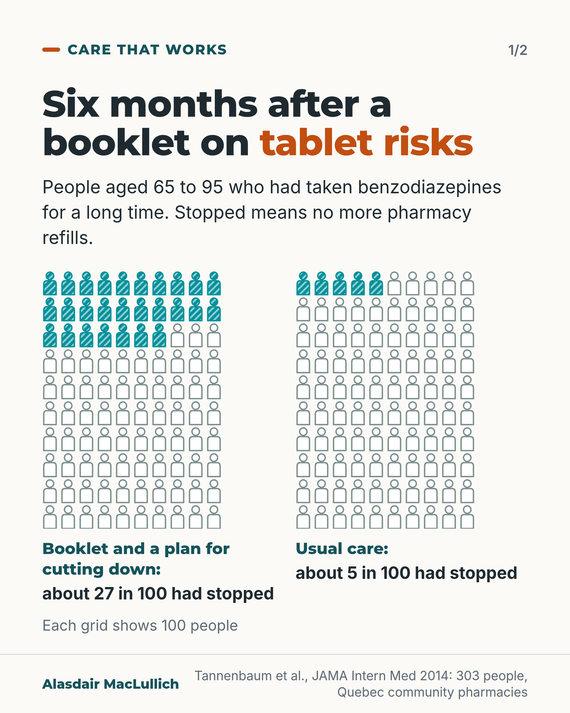
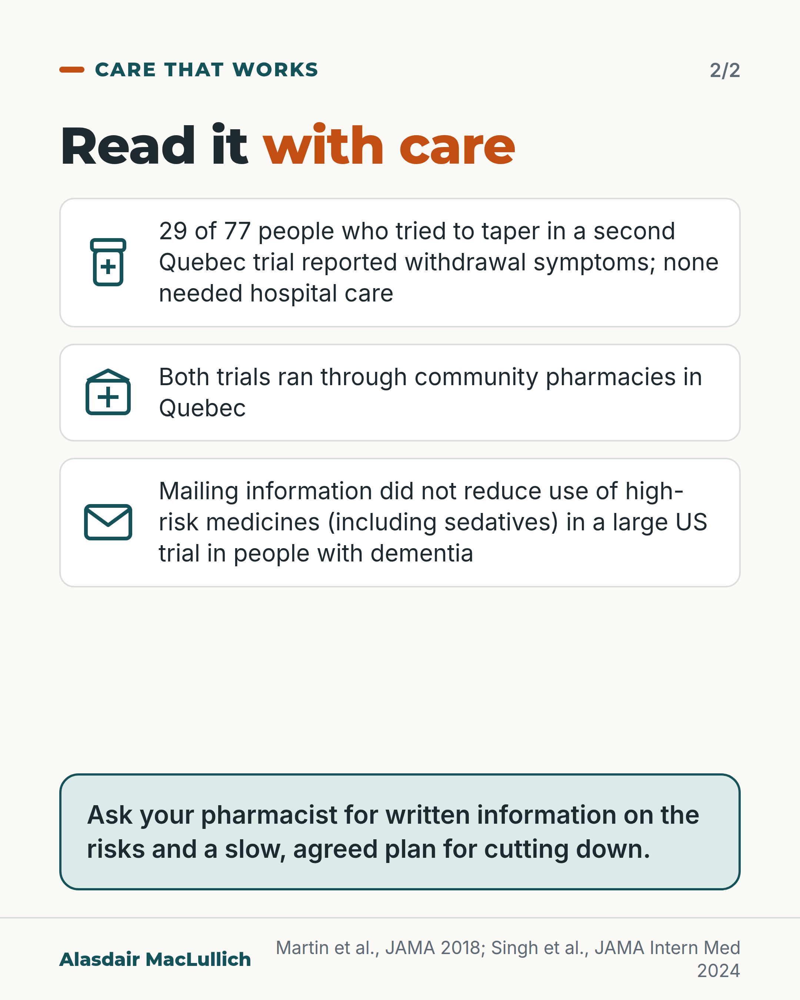

# G106: The booklet that changed the decision

- Category: C11 Sleep
- Audience: both
- Series: Care that works
- Post type: good_care
- Visual format: carousel (two icon arrays, then limits and what to ask)
- Status: text text_final, visual final
- Working id: C11-P03 (candidate C11-03)

## Insight

In a Quebec trial, older people given a booklet about the risks of long-term benzodiazepines and a plan for cutting down were far more likely to have stopped six months later: about 27 in 100 against 5 in 100. The setting counted: it ran through community pharmacies, and posting information alone did not work in a large US trial.

## Angle and position

Treat the person taking the tablet as the decision-maker. Give written information on the risks and a slow, agreed plan, inside a service that follows through. Position: older people on long-term sleeping and calming tablets should be offered this directly; it respects their part in the decision and it worked in trials, with withdrawal symptoms and the pharmacy setting stated.

Basis: mixed: the 27 versus 5 in 100, 43 versus 9 in 100, withdrawal and US mailing results are empirical findings; the view that people should be offered this information directly is an ethical and clinical judgement.

## X (1011 characters)

```text
Older people given a booklet about the risks of long-term benzodiazepines (a group of calming and sleeping tablets), with a plan for cutting down, were far more likely to have stopped six months later. About 27 in 100 had stopped, against about 5 in 100 given usual care (no booklet). A further 11 in 100 had cut their dose.

This was a Quebec trial of 303 people aged 65 to 95, run through community pharmacies. About 62 in 100 who got the booklet raised stopping with their doctor or pharmacist themselves.

The result has limits. Stopped meant no more pharmacy refills. In a second Quebec trial, 29 of 77 people who tried to cut down slowly reported withdrawal symptoms, though none needed hospital care. Mail alone has not always worked: in a large US trial, mailing information to people with dementia and their prescribers did not reduce use of high-risk medicines, including sedatives.

If you take one long term, ask your pharmacist for written information on the risks and a slow plan for cutting down.
```

## LinkedIn (2200 characters)

```text
Older people given a booklet about the risks of long-term benzodiazepines (a group of calming and sleeping tablets), with a plan for cutting down, were far more likely to have stopped six months later: about 27 in 100, against about 5 in 100 with usual care. A further 11 in 100 had cut their dose.

This was a Quebec trial of 303 people aged 65 to 95, run through community pharmacies. The person taking the tablet was the decision-maker: about 62 in 100 of those given the booklet raised stopping with their doctor or pharmacist themselves.

A second Quebec trial encouraged pharmacists to send patients a brochure and to send their doctors a recommendation to stop. Among people taking sleeping tablets or similar sedatives, 43 in 100 had stopped at 6 months, against 9 in 100 with usual care. That intervention included a message to the doctor, so it was not a leaflet alone.

There are limits for anyone planning this. Stopped meant no more pharmacy refills, not confirmed that the person had stopped taking the tablets. Cutting down can be uncomfortable. In the second trial, 29 of 77 people who tried to cut down slowly reported withdrawal symptoms, though none needed hospital care. Cutting down slowly, with a plan agreed with a doctor or pharmacist, is the approach that was tested.

Both trials ran through community pharmacies in Quebec, and the authors of the second trial say the results need testing in other settings. Posting information alone has not always worked. In a US trial of 12,787 people with dementia, mailing information to them and their prescribers did not reduce use of the targeted medicines, which included sedatives (about 77 in 100 were still dispensed a targeted medicine at 6 months in both groups). The people studied (all with dementia), the delivery (mail only, with no pharmacist enrolling them) and the health system all differed. Any of these may explain the difference; this was not tested directly.

If you take one of these tablets long term, you can ask your pharmacist for written information on the risks and a slow, agreed plan for cutting down. We should offer that information directly to older people, and back it with someone who follows through.
```

## Bluesky (295 characters)

```text
In a Quebec trial, older people got a booklet on the risks of long-term benzodiazepines (calming and sleeping tablets) and a plan for cutting down. At 6 months, 27 in 100 had stopped refilling them, against 5 in 100 given usual care. Ask your pharmacist for the risks in writing and a slow plan.
```

## Threads (373 characters)

```text
Older people were given a booklet on the risks of long-term benzodiazepines (calming and sleeping tablets) and a plan for cutting down. At 6 months about 27 in 100 had stopped, against 5 in 100 given usual care (no booklet). This was a Quebec pharmacy trial; stopped meant no more refills.

Cutting down can be uncomfortable, so ask your pharmacist for a slow, agreed plan.
```

## Source reply

Sources: Tannenbaum et al., JAMA Intern Med 2014 https://doi.org/10.1001/jamainternmed.2014.949 ; Martin et al., JAMA 2018 https://doi.org/10.1001/jama.2018.16131 ; Singh et al., JAMA Intern Med 2024 https://doi.org/10.1001/jamainternmed.2024.5632

## Visual



Alt text: Two grids of 100 person icons. After a booklet on tablet risks and a plan for cutting down, about 27 in 100 older long-term benzodiazepine users had stopped at 6 months, against about 5 in 100 with usual care. 303 people aged 65 to 95, Quebec pharmacies.



Alt text: Read it with care. 29 of 77 people who tried to taper in a second Quebec trial reported withdrawal symptoms; none needed hospital care. Both trials were in Quebec pharmacies. Mailing information did not reduce high-risk medicine use in a US trial in dementia. Ask your pharmacist for written information and a slow plan.

Editable source: `visuals/src/G106.html`

Design instructions: carousel (two icon arrays, then limits and what to ask). Source html visuals/src/C11-P03.html with c11_common.js (person icon grids, hatched filled icons so colour is not the only cue). Grounds: off-white cards, mint/white panels, teal and burnt orange. Data claims: C11-03-a, C11-03-d. Drawings via kit.js only on P04 card 2, P08, P10; numbered pins with HTML key.

## Sources and verification

- C11-03-a (supported_with_qualification): In the EMPOWER trial, older long-term benzodiazepine users given written information on the risks and a step-by-step tapering plan were far more likely to have stopped at 6 months than those with usual care (27% versus 5%).
  - Source: Tannenbaum C, Martin P, Tamblyn R, Benedetti A, Ahmed S. Reduction of inappropriate benzodiazepine prescriptions among older adults through direct patient education: the EMPOWER cluster randomized trial. JAMA Intern Med. 2014;174(6):890-8.
  - Passage: ""Participants (303 long-term users of benzodiazepine medication aged 65-95 years, recruited from 30 community pharmacies)" ... "The active arm received a deprescribing patient empowerment intervention describing the risks of benzodiazepine use and a stepwise tapering protocol. The control arm received usual care." ... "Benzodiazepine therapy discontinuation at 6 months after randomization, ascertained by pharmacy medication renewal profiles." ... "At 6 months, 27% of the intervention group had discontinued benzodiazepine use compared with 5% of the control group (risk difference, 23% [95% CI, 14%-32%]; intracluster correlation, 0.008; number needed to treat, 4). Dose reduction occurred in an additional 11% (95% CI, 6%-16%)."" (Abstract)
- C11-03-b (supported): Most people who received the EMPOWER booklet started a conversation about stopping with their doctor or pharmacist themselves.
  - Source: Tannenbaum C, Martin P, Tamblyn R, Benedetti A, Ahmed S. Reduction of inappropriate benzodiazepine prescriptions among older adults through direct patient education: the EMPOWER cluster randomized trial. JAMA Intern Med. 2014;174(6):890-8.
  - Passage: ""Of the recipients in the intervention group, 62% initiated conversation about benzodiazepine therapy cessation with a physician and/or pharmacist."" (Abstract, Results)
- C11-03-c (supported_with_qualification): In the D-PRESCRIBE trial, 43% of sedative-hypnotic users stopped at 6 months with a pharmacist-led educational approach versus 9% with usual care.
  - Source: Martin P, Tamblyn R, Benedetti A, Ahmed S, Tannenbaum C. Effect of a pharmacist-led educational intervention on inappropriate medication prescriptions in older adults: the D-PRESCRIBE randomized clinical trial. JAMA. 2018;320(18):1889-98.
  - Passage: ""Pharmacists in the intervention group were encouraged to send patients an educational deprescribing brochure in parallel to sending their physicians an evidence-based pharmaceutical opinion to recommend deprescribing." ... "discontinuation of inappropriate medication occurred among 63 of 146 sedative-hypnotic drug users (43.2%) vs 14 of 155 (9.0%), respectively (risk difference, 34% [95% CI, 25% to 43%])"" (Abstract)
- C11-03-d (supported): About 4 in 10 people who tapered sedative-hypnotics reported withdrawal symptoms, but no adverse events needing hospital care were reported.
  - Source: Martin P, Tamblyn R, Benedetti A, Ahmed S, Tannenbaum C. Effect of a pharmacist-led educational intervention on inappropriate medication prescriptions in older adults: the D-PRESCRIBE randomized clinical trial. JAMA. 2018;320(18):1889-98.
  - Passage: ""No adverse events requiring hospitalization were reported, although 29 of 77 patients (38%) who attempted to taper sedative-hypnotics reported withdrawal symptoms."" (Abstract, Results)
- C11-03-e (supported): Both trials were in Quebec, and the authors say results may differ elsewhere.
  - Source: Martin P, Tamblyn R, Benedetti A, Ahmed S, Tannenbaum C. Effect of a pharmacist-led educational intervention on inappropriate medication prescriptions in older adults: the D-PRESCRIBE randomized clinical trial. JAMA. 2018;320(18):1889-98.; Tannenbaum C, Martin P, Tamblyn R, Benedetti A, Ahmed S. Reduction of inappropriate benzodiazepine prescriptions among older adults through direct patient education: the EMPOWER cluster randomized trial. JAMA Intern Med. 2014;174(6):890-8.
  - Passage: "D-PRESCRIBE: "Among older adults in Quebec, a pharmacist-led educational intervention compared with usual care resulted in greater discontinuation of prescriptions for inappropriate medication after 6 months. The generalizability of these findings to other settings requires further research." EMPOWER: "recruited from 30 community pharmacies" (Montreal, Quebec author affiliations; trial in Quebec)." (Abstract conclusions (D-PRESCRIBE); Abstract methods (EMPOWER))
- C11-03-f (supported): Mailed education alone, without pharmacist involvement, did not reduce use of sedatives in later US trials.
  - Source: Singh S, Li X, Cocoros NM, Antonelli MT, Avula R, Crawford SL, et al. High-risk medications in persons living with dementia: a randomized clinical trial. JAMA Intern Med. 2024;184(12):1426-33.; Mak SS, Alessi CA, Kaufmann CN, Martin JL, Mitchell MN, Ulmer C, et al. Pilot RCT testing a mailing about sleeping pills and cognitive behavioral therapy for insomnia: impact on benzodiazepines and Z-drugs. Clin Gerontol. 2024;47(3):452-63 (epub 6 Oct 2022).
  - Passage: "Singh 2024: "Patients were randomized to 1 of 3 arms: (1) a mailing of educational materials specific to the medication targeted for deprescribing to both the patient and their prescribing clinician; (2) a mailing to the prescribing clinician only; or (3) a usual care arm." ... "The cumulative incidence of being dispensed a medication targeted for deprescribing was 76.7% (95% CI, 75.4-78.0) in the patient and prescriber mailing group, 77.9% (95% CI, 76.5-79.1) in the prescriber mailing only group, and 77.5% (95% CI, 76.2-78.8) in the usual care group." ... "These findings suggest medication-specific educational mailings targeting patients with AD or ADRD and their clinicians are not effective in reducing the use of high-risk medications." Mak 2022: "Arm 1 was a mailed brochure about BZRA risks that also included information about a free, online cognitive behavioral therapy for the insomnia (CBTI) program. Arm 2 was a mailed brochure (same as arm 1) and telephone reinforcement call. Control: Arm 3 was a mailed brochure without insomnia treatment information." ... "Mailing information about BZRA risks and CBTI did not affect BZRA prescriptions."" (Abstracts)

Verification notes: Tannenbaum 2014 (abstract): 303 people aged 65 to 95, 27% vs 5% stopped at 6 months, difference 23 points, further 11% reduced dose, 62% raised it themselves; 'given', not 'posted', because the abstract does not state delivery. Martin 2018 (abstract): sedative-hypnotic subgroup 63/146 vs 14/155; 29/77 withdrawal symptoms; stated as including a message to the doctor. Singh 2024 (abstract): 12,787 people with dementia, 76.7% vs 77.5% still dispensed; presented as setting and follow-through, not disproof. Mak 2022 not used in captions. Statement that results need testing elsewhere attributed to the D-PRESCRIBE trial text via C11-03-e. Closing sentence 'We should offer...' marked as judgement.

## Attention and follow potential

Pause: A large effect from something as ordinary as a booklet, set against a fair account of what it does not show.

Gain: Older people learn they can ask for written information and a slow plan; practitioners see what worked and the setting it needed.

Follow: Care that works posts show specific models of good care and what made them work.

## Open issues

None.
