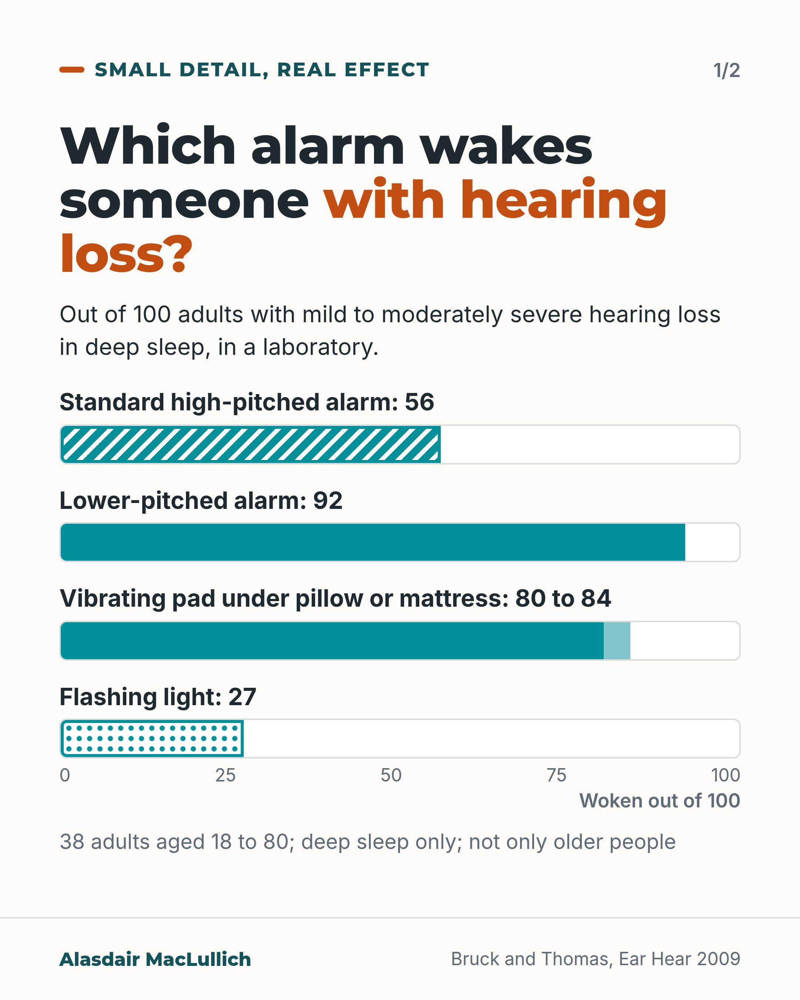
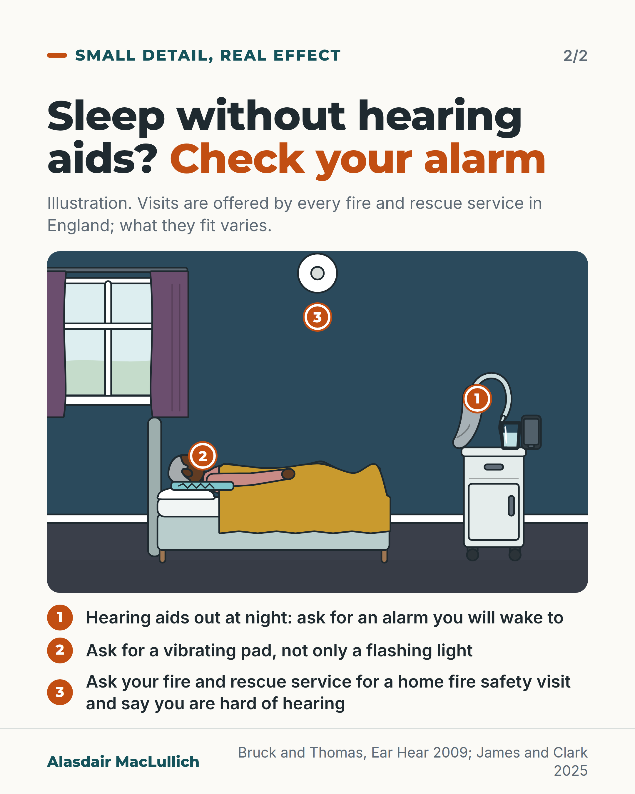

# G107: Hearing aids out, smoke alarm on

- Category: C11 Sleep
- Audience: public
- Series: Small detail, real effect
- Post type: public_explanation
- Visual format: carousel (bar chart, then annotated scene)
- Status: text text_final, visual final
- Working id: C11-P04 (candidate C11-13)

## Insight

In a sleep laboratory, a standard high-pitched smoke alarm woke about 56 in 100 adults with hearing loss from deep sleep, a lower-pitched alarm about 92 in 100, a vibrating pad 80 to 84 in 100 and a flashing light about 27 in 100. People who sleep without hearing aids can ask their fire and rescue service about a home fire safety visit and an alarm with a vibrating pad.

## Angle and position

Taking hearing aids out at night is normal, and it changes which alarm will wake you. Position: anyone with hearing loss who sleeps without hearing aids should have an alarm they can wake to, and can ask for a visit. The study was small, in adults of all ages, in deep sleep only.

Basis: mixed: the waking percentages are empirical findings from one small laboratory study; that fire and rescue services in England offer visits is a published statement; that readers should have an alarm they can wake to is a practical and ethical judgement.

## X (811 characters)

```text
In a sleep laboratory, a standard high-pitched smoke alarm woke about 56 in 100 adults with hearing loss from deep sleep. A lower-pitched alarm at the same loudness woke about 92 in 100.

A vibrating pad under the pillow or mattress woke 80 to 84 in 100. A flashing light woke about 27 in 100, even when brighter than the US standard.

The study was small: 38 adults aged 18 to 80 with mild to moderately severe hearing loss. The group included younger adults. They were tested in deep sleep only. It did not say whether hearing aids were worn.

If you take your hearing aids out at night, you can ask your fire and rescue service for a home fire safety visit, say you are hard of hearing, and ask whether they can fit an alarm with a vibrating pad. Every service in England offers visits; what they fit varies.
```

## LinkedIn (1682 characters)

```text
In a sleep laboratory, a standard high-pitched smoke alarm woke about 56 in 100 adults with hearing loss from deep sleep. A lower-pitched alarm at the same loudness woke about 92 in 100.

A vibrating pad under the pillow or mattress woke 80 to 84 in 100 of the same people. A flashing light woke about 27 in 100, even when brighter than the US standard.

Who was studied affects how far to trust this. There were 38 adults aged 18 to 80 with mild to moderately severe hearing loss, so the group included people of all adult ages. They were tested in a laboratory, in deep sleep only. The report does not say whether they wore hearing aids, so it does not tell us what happens when aids are out. The pads were commercial products tested at the intensity as purchased, and the study was published in 2009.

The practical point is for anyone who sleeps without hearing aids. If an alarm kit is offered for hearing loss, check that it includes a vibrating pad and not only a flashing light.

In England every fire and rescue service offers home fire safety visits, and services across the UK deliver them. You can ask for one and say that you are hard of hearing. Ask whether they can fit an alarm with a vibrating pad. What is offered and who is eligible vary by service.

Whether the visits themselves reduce falls or improve quality of life in older people is unproven. A trial set out to test this. It recruited only 63 of a planned 1,156 people and could not run its planned analyses. Its authors concluded the evidence remains inconclusive. No trial evidence on fires was found.

We should make sure that anyone who sleeps without their hearing aids has an alarm they can wake to.
```

## Bluesky (297 characters)

```text
In a sleep lab, a standard smoke alarm woke 56 in 100 adults with hearing loss from deep sleep. A lower-pitched alarm woke 92 in 100, a vibrating pad 80 to 84 in 100, a flashing light 27 in 100. Small study, ages 18 to 80. If you sleep without hearing aids, ask fire services about vibrating pads.
```

## Threads (483 characters)

```text
In a sleep laboratory, a standard high-pitched smoke alarm woke about 56 in 100 adults with hearing loss from deep sleep. A lower-pitched alarm woke 92 in 100, a vibrating pad 80 to 84 in 100, a flashing light 27 in 100.

Small study: 38 adults aged 18 to 80 with mild to moderately severe hearing loss, deep sleep only.

If you take your hearing aids out at night, ask your fire and rescue service for a home fire safety visit and whether they can fit an alarm with a vibrating pad.
```

## Source reply

Sources: Bruck and Thomas, Ear Hear 2009 https://doi.org/10.1097/AUD.0b013e3181906f89 ; James and Clark, Dementia 2025 https://doi.org/10.1177/14713012251320251 ; Cockayne et al., Public Health Research 2025 https://doi.org/10.3310/DJHF6633

## Visual



Alt text: Bar chart of how many out of 100 adults with hearing loss were woken from deep sleep in a laboratory: standard high-pitched alarm 56, lower-pitched alarm 92, vibrating pad 80 to 84, flashing light 27. 38 adults aged 18 to 80.



Alt text: Illustration of an older Black woman asleep in bed, a hearing aid, glass and phone on the bedside table, a vibrating pad under the pillow and a smoke alarm on the ceiling. Three numbered tips: alarm you will wake to, vibrating pad, and a fire and rescue home safety visit.

Editable source: `visuals/src/G107.html`

Design instructions: carousel (bar chart, then annotated scene). Source html visuals/src/C11-P04.html with c11_common.js (person icon grids, hatched filled icons so colour is not the only cue). Grounds: off-white cards, mint/white panels, teal and burnt orange. Data claims: C11-13-a, C11-13-b. Drawings via kit.js only on P04 card 2, P08, P10; numbered pins with HTML key.

## Sources and verification

- C11-13-a (supported_with_qualification): In a sleep laboratory study of 38 adults aged 18 to 80 with mild to moderately severe hearing loss, tested in deep sleep, the standard high-pitched (3100 Hz) smoke alarm at 75 dBA woke 56%, while a lower-pitched 520 Hz square-wave signal at the same level woke 92%.
  - Source: Bruck D, Thomas IR. Smoke alarms for sleeping adults who are hard-of-hearing: comparison of auditory, visual, and tactile signals. Ear Hear. 2009;30(1):73-80.
  - Passage: "Three auditory signals, a bed shaker, a pillow shaker, and strobe lights were presented to 38 adults (aged 18 to 80 yr) with mild to moderately severe hearing loss of 25 to 70 dB (in both ears), during slow-wave sleep (deep sleep). ... The third auditory signal was the current 3100-Hz smoke alarm. All auditory signals were tested below, at, and above the decibel level prescribed by the applicable standard for bedrooms (75 dBA). ... The most effective signal was a 520-Hz square wave auditory signal, waking 92% at 75 dBA, compared with 56% waking to the 75 dBA high-pitched alarm." (Abstract (Methods, Results))
- C11-13-b (supported_with_qualification): In the same study, bed and pillow shakers woke 80 to 84% at the intensity as purchased, while strobe lights woke only 27% even at an intensity above the US standard.
  - Source: Bruck D, Thomas IR. Smoke alarms for sleeping adults who are hard-of-hearing: comparison of auditory, visual, and tactile signals. Ear Hear. 2009;30(1):73-80.
  - Passage: "In the case of bed and pillow shakers intensities below, at, and above the level as purchased were tested. For strobe lights three levels were used, all of which were above the applicable standard. ... Bed and pillow shakers awoke 80 to 84% at the intensity level as purchased. The strobe lights awoke only 27% at an intensity above the US standard. ... Strobe lights, even at high intensities, are ineffective in reliably waking people with mild to moderate hearing loss." (Abstract (Methods, Results, Conclusions))
- C11-13-c (supported_with_qualification): UK fire and rescue services offer free home fire safety visits (England: all services offer them).
  - Source: James T, Clark A. Fire risk and safety for people living with dementia at home: a narrative review of international literature and case study of fire and rescue services in England. Dementia (London). 2025;24(5):977-95.; Hampton S, Anderson H, Scantlebury A, Adamson J. Home Fire Safety Visits by the Fire and Rescue Service: a qualitative study of the perspectives of firefighters, advocates and service leaders. BMC Public Health. 2025;25(1):3196.; Cockayne S, Fairhurst C, Cunningham-Burley R, Mann J, Stanford-Beale R, Hampton S, et al. Effectiveness of Safe and Well Visits in reducing falls and improving quality of life among older people: the FIREFLI RCT. Public Health Res (Southampt). 2025;13(7):1-62.
  - Passage: "James and Clark 2025: "All English fire services offer 'Home Fire Safety Visits', designed to help those vulnerable to fire identify and reduce risk at home however, only four specify that people living with dementia are eligible." Hampton 2025: "The UK Fire and Rescue Service (FRS) routinely deliver Home Fire Safety Visits (HFSVs) in people's homes. HFSVs offer support with fire safety and a range of health-related issues." Cockayne 2025: "Fire and rescue services in England routinely carry out Home Fire Safety Visits which aim to reduce risk of fire, support independent living and improve quality of life."" (Abstracts)
- C11-13-d (partly_supported): UK fire and rescue services can provide, often free, smoke alarm kits for people who are deaf or hard of hearing, with a flashing light and a vibrating pad.
  - Source: Avon Fire and Rescue Service. Deaf Awareness Week: raising awareness of free hard-of-hearing smoke alarms [web page not opened]; with search results for Kent, Lancashire, Merseyside, Essex and Surrey fire and rescue service pages on alarms for deaf or hard of hearing people.
  - Passage: "Search-engine page titles only: 'Deaf Awareness Week: rasing awarness of free hard- of- hearing smoke alarms' (Avon Fire and Rescue Service); 'Flashing and vibrating smoke alarms providing peace of mind for deaf people' (Kent Fire and Rescue Service); 'Sensory Smoke Alarms' (Essex County Fire and Rescue Service); 'Fire safety for People with Hearing Difficulties' (Lancashire Fire and Rescue Service)." (WebSearch result titles and summary (pages not opened))

Verification notes: Bruck and Thomas 2009 (abstract): 38 adults aged 18 to 80, hearing loss 25 to 70 dB, deep sleep, laboratory; 56% standard, 92% 520 Hz square wave at 75 dBA, shakers 80 to 84% as purchased, strobe 27%. Hearing aid use not stated; post is conditional. 520 Hz alarm purchase not advised (UK availability not checked). James and Clark 2025 and Hampton 2025 (abstracts): home fire safety visits offered by all English services; delivered across the UK. Cockayne 2025 (abstract): FIREFLI randomised 63 of 1,156 planned; evidence inconclusive. C11-13-d (vibrating pad kits) is partly supported from a fire service web extract, so it appears only as a question to ask, per the safe wording. Scotland not separately verified, so the England statement is not generalised. Final sentence of the LinkedIn caption is marked as judgement.

## Attention and follow potential

Pause: A safety fact almost nobody has considered: the alarm that wakes you with your aids in may not wake you with them out.

Gain: A specific check and a service to contact, with the small size and adult age range of the study stated.

Follow: Small detail, real effect posts take one everyday practical detail with a measurable effect on safety.

## Open issues

- C11-13-d is partly supported (search extract only); used only as a question to ask. Editor may prefer to move this post to C14 (hearing) if the sleep category is crowded.
