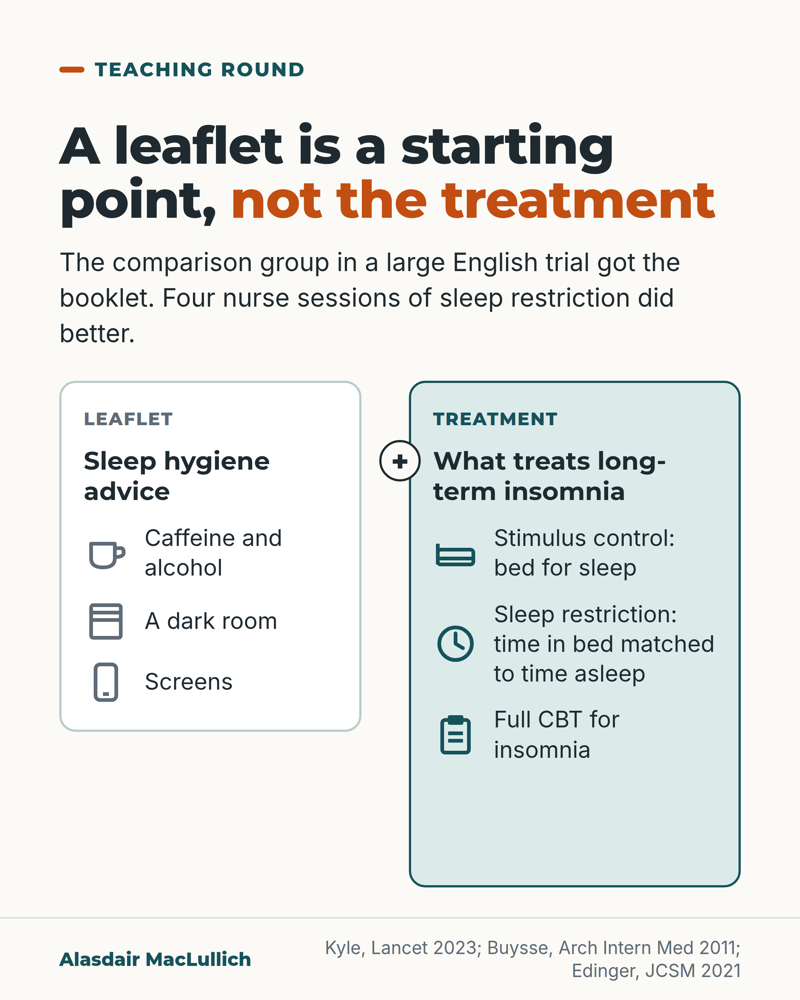

# G108: The sleep hygiene booklet was the comparison

- Category: C11 Sleep
- Audience: practitioners
- Series: Teaching round
- Post type: teaching
- Visual format: comparison card
- Status: text text_final, visual final
- Working id: C11-P05 (candidate C11-11)

## Insight

In a large English general practice trial, the comparison group received a sleep hygiene booklet, and four nurse sessions of sleep restriction therapy did better. In older adults, brief behavioural treatment beat printed information. A sleep hygiene leaflet is a starting point, not the treatment.

## Angle and position

Sleep hygiene advice alone is not what treats long-term insomnia. Position: offer the active behavioural parts, using older-adult evidence (Buysse) alongside the general-practice trial (Kyle), which had a mean age of 55.

Basis: mixed: the trial results and the guideline recommendations are empirical and published; the view that a leaflet should not be the whole response is clinical interpretation consistent with the AASM recommendation.

## X (937 characters)

```text
In a large English insomnia trial, everyone got a sleep hygiene booklet: advice on caffeine, alcohol, a dark room and screens. Some people also had four sessions of sleep restriction therapy from a practice nurse (time in bed matched to time asleep). At 6 months their insomnia was less severe: an average score of 10.9, against 13.9 for booklet only, on a 0 to 28 scale where lower is less severe. The treatment was likely to be good value for the NHS.

That trial had 642 adults in 35 practices, mean age 55. In a small US trial of 79 older adults (average age 72), about 2 in 3 had responded at 4 weeks after two nurse sessions and two phone calls of behavioural treatment, against 1 in 4 given printed information.

The American Academy of Sleep Medicine suggests against sleep hygiene alone for long-term insomnia (a conditional recommendation). Offer sleep restriction therapy or other behavioural treatment, not the booklet alone.
```

## LinkedIn (1768 characters)

```text
The comparison group in a large English insomnia trial got a sleep hygiene booklet: advice on caffeine, alcohol, a dark room and screens. People who also had four sessions of sleep restriction therapy from a practice nurse, which sets time in bed close to time asleep, did better.

The HABIT trial randomised 642 adults in 35 English general practices. At 6 months the average Insomnia Severity Index was 10.9 with sleep restriction plus the booklet against 13.9 with the booklet only (scale 0 to 28, lower is better). The probability that the treatment was cost-effective was 95.3% at the usual NHS threshold of £20,000 per quality-adjusted life year. The trial was open label with a self-reported outcome.

HABIT was not an older-adult trial. Mean age was 55 (range 19 to 88). The older-adult evidence is smaller. A US trial of 79 adults with chronic insomnia (mean age 72) compared brief behavioural treatment, two nurse sessions and two phone calls, with printed information. About 2 in 3 responded against 1 in 4 at 4 weeks, and the benefit held at 6 months. About half (55%) no longer had insomnia against 13%. It was a small single-centre trial, and the printed information is comparable to a leaflet but not identical to a sleep hygiene leaflet.

The guidelines agree. The American Academy of Sleep Medicine conditionally advises against sleep hygiene as a single treatment for long-term insomnia. It strongly recommends full multicomponent CBT for insomnia. It suggests stimulus control, sleep restriction or relaxation therapy as single treatments. The American College of Physicians recommends CBT for insomnia first.

Sleep hygiene can remain part of a multicomponent treatment. It should not be the whole response to long-term insomnia in an older person.
```

## Bluesky (296 characters)

```text
In a large English trial all got a sleep hygiene booklet. Four nurse sessions of sleep restriction did better: insomnia score 10.9 against 13.9, lower being better. In a small US trial of 79 older adults, behavioural treatment beat printed information at 4 weeks: 2 in 3 responded against 1 in 4.
```

## Threads (461 characters)

```text
A sleep hygiene booklet was the comparison group in a large English insomnia trial. Four nurse sessions of sleep restriction did better at 6 months (average score 10.9 against 13.9 on a 0 to 28 scale, lower being better). Mean age was 55.

In a small US trial of 79 older adults, brief behavioural treatment helped about 2 in 3 at 4 weeks, against 1 in 4 given printed information.

Offer sleep restriction or other behavioural treatment, not the leaflet alone.
```

## Source reply

Sources: Kyle et al., Lancet 2023 https://doi.org/10.1016/S0140-6736(23)00683-9 ; Buysse et al., Arch Intern Med 2011 https://doi.org/10.1001/archinternmed.2010.535 ; Edinger et al., J Clin Sleep Med 2021 https://doi.org/10.5664/jcsm.8986 ; Qaseem et al., Ann Intern Med 2016 https://doi.org/10.7326/M15-2175

## Visual



Alt text: Comparison card. Left: leaflet sleep hygiene advice about caffeine and alcohol, a dark room and screens. Right: what treats long-term insomnia: stimulus control, sleep restriction and full CBT for insomnia. A leaflet is a starting point, not the treatment.

Editable source: `visuals/src/G108.html`

Design instructions: comparison card. Source html visuals/src/C11-P05.html with c11_common.js (person icon grids, hatched filled icons so colour is not the only cue). Grounds: off-white cards, mint/white panels, teal and burnt orange. Data claims: none (no numbers). Drawings via kit.js only on P04 card 2, P08, P10; numbered pins with HTML key.

## Sources and verification

- C11-11-a (supported): The AASM suggests that clinicians not use sleep hygiene as a single-component therapy for chronic insomnia, and recommends multicomponent CBT-I; stimulus control, sleep restriction and relaxation are suggested as single components.
  - Source: Edinger JD, Arnedt JT, Bertisch SM, Carney CE, Harrington JJ, Lichstein KL, et al. Behavioral and psychological treatments for chronic insomnia disorder in adults: an American Academy of Sleep Medicine clinical practice guideline. J Clin Sleep Med. 2021;17(2):255-62.
  - Passage: ""1. We recommend that clinicians use multicomponent cognitive behavioral therapy for insomnia for the treatment of chronic insomnia disorder in adults. (STRONG). 2. We suggest that clinicians use multicomponent brief therapies for insomnia for the treatment of chronic insomnia disorder in adults. (CONDITIONAL). 3. We suggest that clinicians use stimulus control as a single-component therapy for the treatment of chronic insomnia disorder in adults. (CONDITIONAL). 4. We suggest that clinicians use sleep restriction therapy as a single-component therapy for the treatment of chronic insomnia disorder in adults. (CONDITIONAL). 5. We suggest that clinicians use relaxation therapy as a single-component therapy for the treatment of chronic insomnia disorder in adults. (CONDITIONAL). 6. We suggest that clinicians not use sleep hygiene as a single-component therapy for the treatment of chronic insomnia disorder in adults. (CONDITIONAL)."" (Abstract, Recommendations)
- C11-11-b (supported_with_qualification): In the HABIT trial in English general practice, four nurse-delivered sleep restriction sessions plus a sleep hygiene booklet reduced insomnia severity at 6 months more than the booklet alone, and were likely cost-effective.
  - Source: Kyle SD, Siriwardena AN, Espie CA, Yang Y, Petrou S, Ogburn E, et al. Clinical and cost-effectiveness of nurse-delivered sleep restriction therapy for insomnia in primary care (HABIT): a pragmatic, superiority, open-label, randomised controlled trial. Lancet. 2023;402(10406):975-87.
  - Passage: ""We did a pragmatic, superiority, open-label, randomised controlled trial of sleep restriction therapy versus sleep hygiene. Adults with insomnia disorder were recruited from 35 general practices across England and randomly assigned (1:1) using a web-based randomisation programme to either four sessions of nurse-delivered sleep restriction therapy plus a sleep hygiene booklet or a sleep hygiene booklet only." ... "we randomly assigned 642 participants to sleep restriction therapy (n=321) or sleep hygiene (n=321). Mean age was 55·4 years (range 19-88)" ... "At 6 months, mean ISI score was 10·9 (SD 5·5) for sleep restriction therapy and 13·9 (5·2) for sleep hygiene (adjusted mean difference -3·05, 95% CI -3·83 to -2·28; p<0·0001; Cohen's d -0·74)" ... "The incremental cost per QALY gained was £2076, giving a 95·3% probability that treatment was cost-effective at a cost-effectiveness threshold of £20 000."" (Abstract: Methods; Findings)
- C11-11-c (supported_with_qualification): In older adults with chronic insomnia, brief behavioural treatment produced a response in 67% versus 25% with printed educational material (RCT).
  - Source: Buysse DJ, Germain A, Moul DE, Franzen PL, Brar LK, Fletcher ME, et al. Efficacy of brief behavioral treatment for chronic insomnia in older adults. Arch Intern Med. 2011;171(10):887-95.
  - Passage: ""A total of 79 older adults (mean age, 71.7 years; 54 women [70%]) with chronic insomnia and common comorbidities were recruited from the community and 1 primary care clinic. Participants were randomly assigned to either BBTI, consisting of individualized behavioral instructions delivered in 2 intervention sessions and 2 telephone calls, or IC, consisting of printed educational material. Both interventions were delivered by a nurse clinician. The primary outcome was categorically defined treatment response at 4 weeks" ... "Categorically defined response (67% [n = 26] vs 25% [n = 10]; χ(2) = 13.8) (P < .001) and the proportion of participants without insomnia (55% [n = 21] vs 13% [n = 5]; χ(2) = 15.5) (P < .001) were significantly higher for BBTI than for IC. The number needed to treat was 2.4 for each outcome." ... "Improvements were maintained at 6 months."" (Abstract: Methods; Results)
- C11-11-d (supported): CBT for insomnia is the recommended initial treatment for chronic insomnia in adults.
  - Source: Qaseem A, Kansagara D, Forciea MA, Cooke M, Denberg TD; Clinical Guidelines Committee of the American College of Physicians. Management of chronic insomnia disorder in adults: a clinical practice guideline from the American College of Physicians. Ann Intern Med. 2016;165(2):125-33.
  - Passage: ""ACP recommends that all adult patients receive cognitive behavioral therapy for insomnia (CBT-I) as the initial treatment for chronic insomnia disorder. (Grade: strong recommendation, moderate-quality evidence)."" (Abstract, Recommendations)

Verification notes: Kyle 2023 (abstract): 642 adults, 35 practices, mean age 55.4 (19 to 88), ISI 10.9 vs 13.9, 95.3% probability cost-effective at £20,000 per QALY; open label, self-reported. Buysse 2011 (abstract): 79 adults mean age 71.7, response 67% vs 25%, 55% vs 13% no insomnia at 4 weeks, maintained at 6 months; stated as small single-centre. Edinger 2021 (abstract): conditional recommendation against sleep hygiene alone; strong for multicomponent CBT-I. Qaseem 2016: ACP CBT-I first. Sleep hygiene definition (caffeine, alcohol, dark room, screens) and the plain gloss of sleep restriction follow the candidate's visual specification. Final LinkedIn sentence is clinical interpretation.

## Attention and follow potential

Pause: Challenges a near-universal habit: handing over a leaflet and calling it treatment.

Gain: The active components to offer instead, with older-adult evidence and the age limits of the English trial.

Follow: Teaching round posts update routine practice one distinction at a time.

## Open issues

None.
