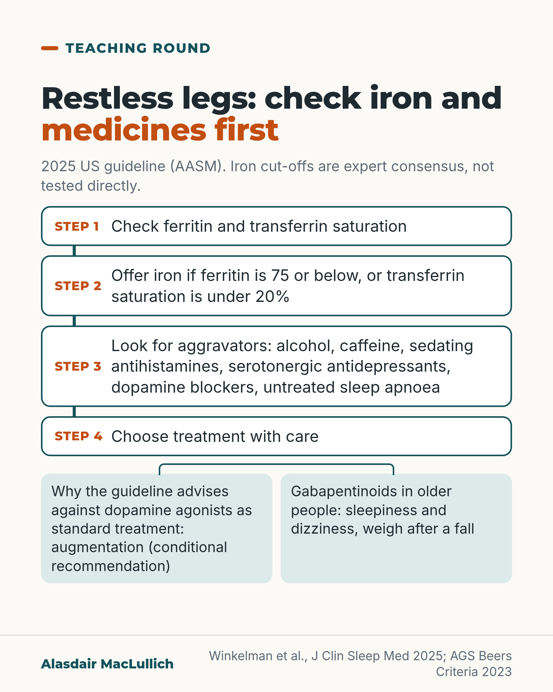

# G109: Restless legs: iron and the medicines list first

- Category: C11 Sleep
- Audience: practitioners
- Series: Teaching round
- Post type: teaching
- Visual format: diagram (flow)
- Status: text text_final, visual final
- Working id: C11-P06 (candidate C11-22)

## Insight

A 2025 US guideline advises checking ferritin and transferrin saturation in everyone with troublesome restless legs, offering iron at ferritin 75 or below or transferrin saturation under 20%, removing aggravating medicines and substances, and conditionally advising against pramipexole, ropinirole or rotigotine as standard treatment because of augmentation. Gabapentinoids carry sleepiness and dizziness in older people.

## Angle and position

A ferritin that is normal by the usual standard can still be low enough for iron to help. Check iron and the medicines list before starting or increasing treatment, and weigh gabapentinoid side effects in older people as a trade-off.

Basis: mixed: the guideline recommendations and the Beers statements are published recommendations; the iron thresholds are expert consensus not directly tested; the advice to check iron and medicines before writing a new prescription is clinical interpretation of the guideline.

## X (1093 characters)

```text
A ferritin that is normal by the usual standard can still be low enough for iron to help restless legs. The 2025 US sleep medicine guideline (AASM) says some people with normal iron results benefit from iron. It advises checking ferritin and transferrin saturation in everyone with troublesome restless legs. It advises offering iron if ferritin is 75 or below (ng/mL, the same as micrograms per litre), or transferrin saturation is under 20%. Those cut-offs are expert consensus and have not been tested directly.

Then look for aggravators: alcohol, caffeine, sedating antihistamines, serotonergic antidepressants, medicines that block dopamine and untreated sleep apnoea.

The guideline advises against pramipexole, ropinirole and rotigotine as standard treatment (a conditional recommendation) because of augmentation: symptoms starting earlier in the day and spreading. It strongly recommends gabapentin and pregabalin, and intravenous iron where iron status is appropriate. In older people gabapentin and pregabalin cause sleepiness and dizziness, so weigh that, especially after a fall.
```

## LinkedIn (2043 characters)

```text
Before treating restless legs in an older person, check iron and the medicines list.

A ferritin that is normal by the usual standard can still be low enough for iron to help. The 2025 US sleep medicine guideline (AASM) says some people with normal iron results benefit from iron, and it uses a higher cut-off than for iron deficiency in general. It advises checking ferritin and transferrin saturation in everyone with troublesome restless legs, and offering iron if ferritin is 75 or below (ng/mL, the same as micrograms per litre) or transferrin saturation is under 20%. Between 75 and 100 it suggests intravenous iron only. These cut-offs come from expert consensus and have not been tested directly. Test in the morning, off iron for 24 hours.

Next, look for things that make it worse: alcohol, caffeine, sedating antihistamines, serotonergic antidepressants, medicines that block dopamine (some anti-sickness drugs and antipsychotics) and untreated sleep apnoea. This list is also from expert consensus.

The guideline strongly recommends gabapentin and pregabalin, and intravenous iron where iron status is appropriate. It conditionally advises against pramipexole, ropinirole and rotigotine as standard treatment. The reason is augmentation: over months to years these drugs can make restless legs start earlier in the day, come on faster at rest and spread to other parts of the body. The advice against them is conditional. Dopamine agonists do work in the short term, and the guideline allows them where short-term relief is valued over long-term risk.

The trade-off in older people: gabapentin and pregabalin commonly cause sleepiness and dizziness. The AGS Beers Criteria advise a lower dose when kidney function is reduced, avoiding them with opioids, and avoiding three or more drugs that act on the brain together. For someone who has already fallen, weigh this carefully. The AASM guideline itself does not address falls or older adults.

This is a US guideline. Check how it fits local UK guidance before changing practice.
```

## Bluesky (277 characters)

```text
Restless legs in an older person: check ferritin and medicines first. The 2025 US guideline (AASM) advises iron if ferritin is 75 or below, even if the result looks normal; this cut-off is untested consensus. It advises against pramipexole and ropinirole as standard treatment.
```

## Threads (499 characters)

```text
Restless legs: a ferritin normal by the usual standard can still be low enough for iron to help. The 2025 US guideline suggests iron if ferritin is 75 or below or transferrin saturation is under 20%; those cut-offs are untested consensus.

Check for aggravators, such as sedating antihistamines. The guideline advises against pramipexole and ropinirole as standard treatment, because of augmentation (symptoms starting earlier and spreading).

Check ferritin and the medicines list before you treat.
```

## Source reply

Sources: Winkelman et al., J Clin Sleep Med 2025 https://doi.org/10.5664/jcsm.11390 ; AGS Beers Criteria 2023 https://doi.org/10.1111/jgs.18372

## Visual



Alt text: Flow diagram for restless legs, from a 2025 US guideline. Step 1 check ferritin and transferrin saturation. Step 2 offer iron if ferritin is 75 or below or saturation under 20%. Step 3 look for aggravating medicines and causes. Step 4 choose treatment with care. Notes on dopamine agonists and gabapentinoids.

Editable source: `visuals/src/G109.html`

Design instructions: diagram (flow). Source html visuals/src/C11-P06.html with c11_common.js (person icon grids, hatched filled icons so colour is not the only cue). Grounds: off-white cards, mint/white panels, teal and burnt orange. Data claims: none (no numbers). Drawings via kit.js only on P04 card 2, P08, P10; numbered pins with HTML key.

## Sources and verification

- C11-22-a (supported_with_qualification): The 2025 AASM guideline says all patients with clinically significant restless legs should have iron studies (ferritin and transferrin saturation), and that iron should be given if ferritin is 75 ng/mL or less or transferrin saturation is below 20% (and only intravenously if ferritin is 75 to 100 ng/mL); these thresholds are consensus that has not been empirically tested.
  - Source: Winkelman JW, Berkowski JA, DelRosso LM, Koo BB, Scharf MT, Sharon D, et al. Treatment of restless legs syndrome and periodic limb movement disorder: an American Academy of Sleep Medicine clinical practice guideline. J Clin Sleep Med. 2025;21(1):137-52.
  - Passage: ""In all patients with clinically significant RLS, clinicians should regularly test serum iron studies including ferritin and transferrin saturation (calculated from iron and total iron binding capacity). Testing should ideally be administered in the morning avoiding all iron-containing supplements and foods at least 24 hours prior to blood draw. ... Consensus guidelines, which have not been empirically tested, suggest that supplementation of iron in adults with RLS should be instituted with oral or IV iron if serum ferritin ≤ 75 ng/mL or transferrin saturation < 20%, and only with IV iron if serum ferritin is between 75 and 100 ng/mL. ... These iron supplementation guidelines are different than for the general population."" (Abstract, Good Practice Statement 1 (also page 140 of PDF))
- C11-22-b (supported): Normal iron results do not rule out benefit from iron in restless legs: the iron thresholds differ from those used in the general population.
  - Source: Winkelman JW, Berkowski JA, DelRosso LM, Koo BB, Scharf MT, Sharon D, et al. Treatment of restless legs syndrome and periodic limb movement disorder: an American Academy of Sleep Medicine clinical practice guideline. J Clin Sleep Med. 2025;21(1):137-52.
  - Passage: "Discussion (page 148): "In the general population, iron administration is generally recommended for those with evidence of iron deficiency as determined by serum iron studies. In RLS, however, it is likely brain iron deficiency, particularly in specific brain regions, is involved in its pathophysiology. Therefore, there are patients with normal serum iron studies who benefit from iron administration, which is borne out by the clinical trials." Good Practice Statement: "These iron supplementation guidelines are different than for the general population."" (Discussion, page 148 (Undermind read_pdfs); Abstract, Good Practice Statement)
- C11-22-c (supported): The first step in managing restless legs is addressing aggravating factors: alcohol, caffeine, antihistaminergic, serotonergic and antidopaminergic medicines, and untreated obstructive sleep apnoea.
  - Source: Winkelman JW, Berkowski JA, DelRosso LM, Koo BB, Scharf MT, Sharon D, et al. Treatment of restless legs syndrome and periodic limb movement disorder: an American Academy of Sleep Medicine clinical practice guideline. J Clin Sleep Med. 2025;21(1):137-52.
  - Passage: ""The first step in the management of RLS should be addressing exacerbating factors, such as alcohol, caffeine, antihistaminergic, serotonergic, antidopaminergic medications, and untreated obstructive sleep apnea." Future Directions (page 150): "RLS is often comorbid with mood, anxiety, and pain disorders, which present challenges to treatment because the most common treatments—serotonergic reuptake inhibitors—often worsen RLS."" (Abstract, Good Practice Statement 2; Future Directions, page 150)
- C11-22-d (supported): The AASM now recommends gabapentin, gabapentin enacarbil and pregabalin (strong, moderate certainty) and suggests against the standard use of levodopa, pramipexole, ropinirole and rotigotine (conditional), mainly because of augmentation, a treatment-induced worsening of restless legs over months to years.
  - Source: Winkelman JW, Berkowski JA, DelRosso LM, Koo BB, Scharf MT, Sharon D, et al. Treatment of restless legs syndrome and periodic limb movement disorder: an American Academy of Sleep Medicine clinical practice guideline. J Clin Sleep Med. 2025;21(1):137-52.
  - Passage: ""2. In adults with RLS, the AASM recommends the use of gabapentin over no gabapentin (strong recommendation, moderate certainty of evidence). 3. In adults with RLS, the AASM recommends the use of pregabalin over no pregabalin (strong recommendation, moderate certainty of evidence)." "12. In adults with RLS, the AASM suggests against the standard use of pramipexole (conditional recommendation, moderate certainty of evidence). Remarks: pramipexole may be used to treat RLS in patients who place a higher value on the reduction of restless legs symptoms with short-term use and a lower value on adverse effects with long-term use (particularly augmentation)." Introduction (page 139): "Augmentation clinically describes a gradual worsening of RLS symptom intensity and duration, which occurs over months to years of exposure to dopaminergic agents." "Augmentation manifests as 1 or more of the following: earlier symptom onset than prior to dopaminergic treatment (eg, from nighttime to daytime), reduced latency to symptom onset with sedentary activities, and/or extension to other areas of the body." Discussion (page 148): "Thus, in balancing the risks of augmentation against the clinical benefits of dopamine agonists or levodopa, this CPG suggests against their use as standard treatments in adults with RLS."" (Abstract, Recommendations 1 to 3 and 11 to 14 with remarks; Introduction page 139; Discussion page 148)
- C11-22-e (supported_with_qualification): Gabapentinoids cause somnolence and dizziness; in older people, the Beers Criteria advise dose reduction when creatinine clearance is below 60 mL/min, avoiding combination with opioids, and avoiding three or more CNS-active drugs (including gabapentinoids) because of falls and fracture risk; for people with a history of falls, antiepileptics are to be avoided except for seizures and mood disorders.
  - Source: Winkelman JW, Berkowski JA, DelRosso LM, Koo BB, Scharf MT, Sharon D, et al. Treatment of restless legs syndrome and periodic limb movement disorder: an American Academy of Sleep Medicine clinical practice guideline. J Clin Sleep Med. 2025;21(1):137-52.; By the 2023 American Geriatrics Society Beers Criteria Update Expert Panel. American Geriatrics Society 2023 updated AGS Beers Criteria for potentially inappropriate medication use in older adults. J Am Geriatr Soc. 2023;71(7):2052-81.
  - Passage: "AASM (Recommendations 1 to 3): "Adverse effects included somnolence and dizziness." "Patients who are at a high risk of side effects with this class of medications may choose other treatment options." Discussion (page 148): "This class of medications can have adverse effects, including dizziness and somnolence, which may influence shared decision-making for prescribers and patients." Beers 2023 Table 6 (page 34): Gabapentin, CrCl <60, "CNS adverse effects", "Reduce dose", Moderate, Strong; Pregabalin, same. Table 5 (page 31): Opioids + Gabapentin, Pregabalin: "Increased risk of severe sedation-related adverse events, including respiratory depression and death." "Avoid; exceptions are when transitioning from opioid therapy to gabapentin or pregabalin, or when using gabapentinoids to reduce opioid dose, although caution should be used in all circumstances." Table 5: "Antiepileptics (including gabapentinoids)" ... "Any combination of ≥3 of these CNS-active drugs": "Increased risk of falls and of fracture"; "Avoid concurrent use of ≥3 CNS-active drugs". Table 3 (page 27), History of falls or fractures: Antiepileptics ... "May cause ataxia, impaired psychomotor function, syncope, or additional falls." Recommendation: "Avoid unless safer alternatives are not available. Antiepileptics: avoid except for seizures and mood disorders."" (AASM recommendation text pages 140 to 143 and Discussion page 148 (Undermind read_pdfs); Beers 2023 Tables 3, 5, 6, pages 27, 31, 34 (Undermind read_pdfs))

Verification notes: Winkelman 2025 (full text): ferritin 75 or below, TSAT under 20%, 75 to 100 IV only, consensus 'not empirically tested'; aggravators good practice statement; conditional recommendations against pramipexole, ropinirole, rotigotine; gabapentin and pregabalin recommended; dopamine agonists effective short term. Beers 2023 (full text): kidney dose reduction, avoid with opioids, avoid 3 or more CNS-active drugs; antiepileptics (including gabapentinoids) to be avoided after falls except for seizures or mood disorders. Tension between AASM and Beers stated as a trade-off. Labelled as a US guideline; UK guidance (C11-22-f, search extract only) not described. Closing sentence about local UK guidance is advice to check, not a claim about it.

## Attention and follow potential

Pause: A guideline change many clinicians have not caught up with, and the point that a normal ferritin can still be too low.

Gain: An up-to-date sequence to follow, with the evidence grade and the older-adult trade-off stated.

Follow: Teaching round posts keep practice current with the strength of the evidence stated.

## Open issues

None.
