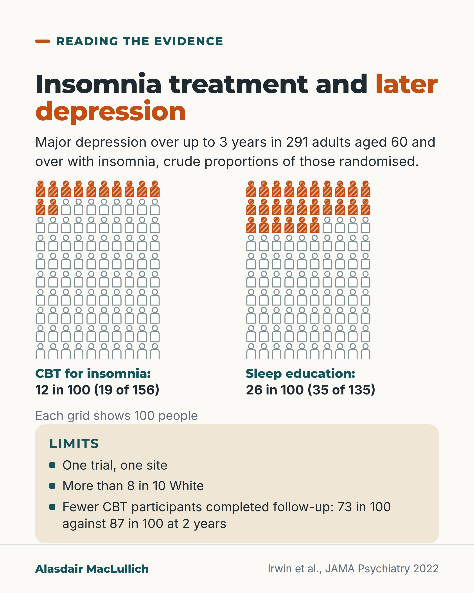

# G110: Treating insomnia and later depression

- Category: C11 Sleep
- Audience: both
- Series: Reading the evidence
- Post type: evidence_interpretation
- Visual format: chart (two 10 by 10 icon arrays with limitation strip)
- Status: text text_final, visual final
- Working id: C11-P07 (candidate C11-28)

## Insight

In a trial of 291 older adults with insomnia, 12 in 100 who had CBT for insomnia developed major depression over up to 3 years, against 26 in 100 who had sleep education. The result is promising but comes from one trial, one site, with more drop-out in the CBT group.

## Angle and position

Treating insomnia properly may protect against depression as well as improve nights. Read with care: single site, more than 8 in 10 White participants, uneven drop-out, and only about half completed 3 years. Position: insomnia in later life deserves proper treatment with CBT for insomnia; the depression finding is promising, not settled.

Basis: mixed: the proportions, hazard ratio and limitations are empirical findings from one trial; the view that insomnia in later life deserves proper treatment with CBT for insomnia is clinical interpretation backed by guidelines.

## X (857 characters)

```text
Treating insomnia in later life may lower the chance of depression, according to one trial of 291 people aged 60 and over. All had insomnia but were not depressed. They had 2 months of either CBT for insomnia (a structured talking and sleep-scheduling treatment) or sleep education.

Over up to 3 years, 12 in 100 who had CBT developed major depression, against 26 in 100 who had sleep education. The risk over time was about half as high.

The trial has limits. It was one trial at one site, and more than 8 in 10 were White. More people in the CBT group dropped out of follow-up: 73 in 100 of the CBT group completed 2 years, against 87 in 100 of the sleep education group. Only just over half in each group completed 3 years.

Insomnia in later life is worth treating with CBT for insomnia. Whether that lowers the chance of depression needs more trials.
```

## LinkedIn (1560 characters)

```text
Treating insomnia in later life may lower the chance of depression, according to one trial.

In Los Angeles, 291 people aged 60 and over (average age 70) who had insomnia but were not depressed were randomised to 2 months of CBT for insomnia (a structured talking and sleep-scheduling treatment) or sleep education.

Over up to 3 years of follow-up, 19 of 156 people in the CBT group (12 in 100) developed major depression, against 35 of 135 (26 in 100) in the sleep education group. The main analysis was time to first episode. The risk over time was about half as high with CBT (hazard ratio 0.51). The true reduction could be smaller or larger (95% confidence interval 0.29 to 0.88). The 12 and 26 in 100 are simple proportions of everyone randomised, without adjustment for time.

Three things to know about this trial:

1. One trial at one site, not yet replicated in the sources read. More than 8 in 10 participants were White, and people with a major health event in the past year were excluded, so frailer older people are under-represented.

2. Uneven drop-out. 73 in 100 of the CBT group completed 2 years of follow-up against 87 in 100 of the sleep education group, and just over half in each (52% and 57%) completed 3 years. That could bias the result in either direction.

3. Insomnia remission that lasted through follow-up was uncommon in both groups: 26% with CBT and 19% with sleep education.

Insomnia in later life deserves proper treatment with CBT for insomnia. The depression finding is a reason to offer it, and a reason for more trials.
```

## Bluesky (286 characters)

```text
One trial of 291 people aged 60+ with insomnia: over up to 3 years, 12 in 100 who had CBT for insomnia (a talking and sleep-scheduling treatment) developed major depression, against 26 in 100 who had sleep education. One site, and more drop-out from the CBT group. It needs more trials.
```

## Threads (474 characters)

```text
In one trial of 291 people aged 60 and over with insomnia, 12 in 100 who had CBT for insomnia (a structured talking and sleep-scheduling treatment) developed major depression over up to 3 years, against 26 in 100 who had sleep education.

One site, more than 8 in 10 White, and more drop-out in the CBT group: 73 in 100 of the CBT group completed 2 years, against 87 in 100 of the sleep education group. It is a reason to offer CBT for insomnia and a reason for more trials.
```

## Source reply

Sources: Irwin et al., JAMA Psychiatry 2022 https://doi.org/10.1001/jamapsychiatry.2021.3422

## Visual



Alt text: Two grids of 100 person icons. Major depression over up to 3 years: 12 in 100 after CBT for insomnia (19 of 156) and 26 in 100 after sleep education (35 of 135), 291 adults aged 60 and over. Limits: one trial, one site, more than 8 in 10 White, fewer CBT participants completed follow-up.

Editable source: `visuals/src/G110.html`

Design instructions: chart (two 10 by 10 icon arrays with limitation strip). Source html visuals/src/C11-P07.html with c11_common.js (person icon grids, hatched filled icons so colour is not the only cue). Grounds: off-white cards, mint/white panels, teal and burnt orange. Data claims: C11-28-b. Drawings via kit.js only on P04 card 2, P08, P10; numbered pins with HTML key.

## Sources and verification

- C11-28-a (supported): The trial randomised 291 adults aged 60 and over (mean 70.1) with insomnia and no current major depression to 2 months of CBT-I or sleep education therapy.
  - Source: Irwin MR, Carrillo C, Sadeghi N, Bjurstrom MF, Breen EC, Olmstead R. Prevention of incident and recurrent major depression in older adults with insomnia: a randomized clinical trial. JAMA Psychiatry. 2022;79(1):33-41.
  - Passage: ""This assessor-blinded, parallel-group, single-site randomized clinical trial assessed a community-based sample of 431 people and enrolled 291 adults 60 years or older with insomnia disorder who had no major depression or major health events in past year." ... "Participants were randomized to 2 months of CBT-I (n = 156) or SET (n = 135)." ... "Among 291 randomized participants (mean [SD] age, 70.1 [6.7] years; 168 [57.7%] female"" (Abstract: Design, Setting, and Participants; Interventions; Results)
- C11-28-b (supported_with_qualification): Incident or recurrent major depression occurred in 12.2% of the CBT-I group and 25.9% of the sleep education group over follow-up (HR 0.51).
  - Source: Irwin MR, Carrillo C, Sadeghi N, Bjurstrom MF, Breen EC, Olmstead R. Prevention of incident and recurrent major depression in older adults with insomnia: a randomized clinical trial. JAMA Psychiatry. 2022;79(1):33-41.
  - Passage: ""Incident or recurrent major depression occurred in 19 participants (12.2%) in the CBT-I group and in 35 participants (25.9%) in the SET group, with an overall benefit (hazard ratio, 0.51; 95%, CI 0.29-0.88; P = .02) consistent across subgroups." ... "The findings of this randomized clinical trial indicate that treatment of insomnia with CBT-I has an overall benefit in the prevention of incident and recurrent major depression in older adults with insomnia disorder."" (Abstract: Results; Conclusions and Relevance)
- C11-28-c (supported): Follow-up completion at 24 months was lower in the CBT-I group (73%) than the comparison group (87%); follow-up was extended from 24 to 36 months by protocol amendment; the sample was 83% White.
  - Source: Irwin MR, Carrillo C, Sadeghi N, Bjurstrom MF, Breen EC, Olmstead R. Prevention of incident and recurrent major depression in older adults with insomnia: a randomized clinical trial. JAMA Psychiatry. 2022;79(1):33-41.
  - Passage: ""The trial protocol was modified to extend follow-up from 24 to 36 months, with follow-up completion in July 2018." ... "7 [2.4%] Asian, 32 [11.0%] Black, 3 [1.0%] Pacific Islander, 241 [82.8%] White, 6 [2.1%] multiracial, and 2 [0.7%] unknown" ... "A total of 140 participants (89.7%) completed CBT-I and 130 (96.3%) participants completed SET (χ2 = 4.9, P = .03), with 114 (73.1%) completing 24 months of follow-up in the CBT-I group and 117 (86.7%) in the SET group (χ2 = 8.4, P = .004). After protocol modification, 92 (59.0%) of the CBT-I participants and 86 (63.7%) of the SET participants agreed to extended follow-up (χ2 = 0.7, P = .41), with 81 (51.9%) of the CBT-I participants and 77 (57.0%) of the SET group completing 36 months of follow-up"" (Abstract: Design; Results)

Verification notes: Irwin 2022 (abstract): 291 people aged 60+, mean age 70.1, 2 months CBT-I vs sleep education; 19/156 (12.2%) vs 35/135 (25.9%), HR 0.51 (0.29 to 0.88); completion at 24 months 73.1% vs 86.7%, at 36 months 51.9% vs 57.0%; 82.8% White; sustained remission 26.3% vs 19.3%. 82.6% remitter figure deliberately not used (non-randomised comparison). 'Not yet replicated in the sources read' reflects the claim's conflicting-evidence note.

## Attention and follow potential

Pause: An unexpected possible benefit of a sleep treatment, set beside a fair account of how far to trust it.

Gain: A reason to treat insomnia properly and a worked example of reading a trial fairly.

Follow: Reading the evidence posts give the result and its limits.

## Open issues

None.
