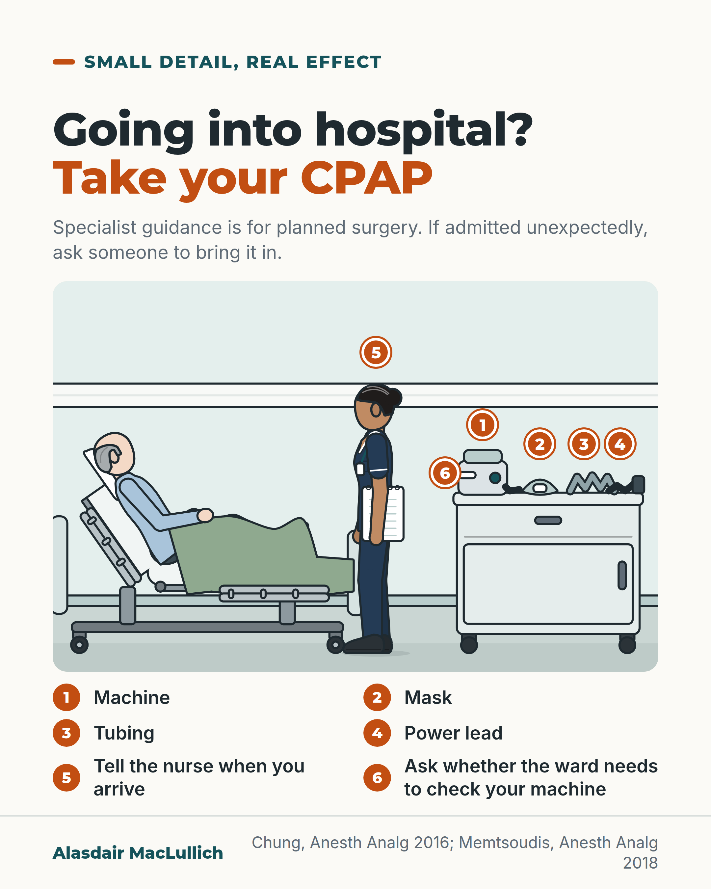

# G111: Your CPAP machine goes to hospital with you

- Category: C11 Sleep
- Audience: public
- Series: Small detail, real effect
- Post type: public_explanation
- Visual format: annotated scene
- Status: text text_final, visual final
- Working id: C11-P08 (candidate C11-10)

## Insight

Anaesthesia and sleep specialists advise that people who use CPAP keep using it around an operation, and suggest that hospitals consider holding machines or asking patients to bring their own. Strong painkillers and some sedatives may make breathing problems more likely in sleep apnoea. Pack the machine, mask, tubing and power lead, and tell staff.

## Angle and position

Sleep apnoea does not stop on admission. Position: people who use CPAP should bring it and be helped to use it in hospital. The guidance is for surgical admissions; advice for emergency admissions is a practical suggestion.

Basis: mixed: the guideline statements and the cautious drug-risk statement are published recommendations with graded evidence; extending the advice to unplanned admissions, and the question about a ward check, are practical suggestions, not guideline statements; the view that people should be helped to use CPAP in hospital is a practical and ethical judgement.

## X (813 characters)

```text
If you sleep with a CPAP machine, pack it for hospital: machine, mask, tubing and power lead. Tell the staff you use it.

CPAP is a machine and mask worn in sleep that keep your airway open if you have sleep apnoea, where breathing repeatedly stops and starts. Anaesthesia and sleep specialists advise that people who use it keep using it around an operation, before and after. Their guidance suggests hospitals should consider either having a machine available or asking patients to bring their own.

Strong painkillers such as morphine-type drugs, and some sedatives, may make breathing problems more likely in people with sleep apnoea. The evidence is limited, which is one more reason to tell staff.

The guidance is for planned surgery. If you are admitted unexpectedly, ask someone to bring your machine in.
```

## LinkedIn (1674 characters)

```text
If you sleep with a CPAP machine, pack it for hospital: machine, mask, tubing and power lead. Tell the staff you use it, including for planned surgery.

CPAP is a machine and mask worn in sleep that keep your airway open if you have sleep apnoea, where breathing repeatedly stops and starts. Sleep apnoea does not stop because you are in hospital.

The Society of Anesthesia and Sleep Medicine (SASM) guidance for the period around surgery advises that people who use CPAP keep using it in hospital before and after an operation. It also suggests hospitals should consider either having a machine available or asking patients to bring their own. This guidance is North American-led, not UK, and is for surgical admissions. Local hospital policy decides how equipment is handled, and settings may need adjusting after surgery.

A second SASM guideline covers care during surgery. It says strong painkillers such as morphine-type drugs may make breathing problems more likely in people with sleep apnoea. It says the same of sedatives of the benzodiazepine type given into a vein. The guideline calls these recommendations weak, and rates the evidence for the painkiller statement as low. Staff still need to monitor breathing in people who use CPAP.

A short checklist to pack:

1. The machine, mask, tubing and power lead.

2. Tell the nurse when you arrive that you use CPAP.

3. Ask whether the ward needs to check your machine before you use it.

4. If you are admitted unexpectedly, ask someone to bring your machine in. That advice goes beyond the surgical guidance and is a practical suggestion.

Hospitals should ask about CPAP on admission and help people to use it.
```

## Bluesky (299 characters)

```text
If you use a CPAP machine for sleep apnoea (breathing that repeatedly stops and starts in sleep), take it to hospital with the mask, tubing and power lead. Specialists advise using it before and after a planned operation. Strong painkillers may worsen breathing problems in sleep apnoea. Tell staff.
```

## Threads (400 characters)

```text
If you sleep with a CPAP machine (it keeps your airway open if you have sleep apnoea), pack it for hospital: machine, mask, tubing and power lead. Tell the staff.

Anaesthesia and sleep specialists advise using it before and after a planned operation. Strong painkillers and some sedatives may make breathing problems more likely in sleep apnoea. If admitted unexpectedly, ask someone to bring it in.
```

## Source reply

Sources: Chung et al., Anesth Analg 2016 https://doi.org/10.1213/ANE.0000000000001416 ; Memtsoudis et al., Anesth Analg 2018 https://doi.org/10.1213/ANE.0000000000003434

## Visual



Alt text: Illustration of a hospital bedside. An older man sits up in bed while a nurse with a notepad stands beside him; on the bedside cabinet are a CPAP machine, mask, tubing and power lead. Numbered tips: bring each part, tell the nurse on arrival, ask whether the ward needs to check the machine.

Editable source: `visuals/src/G111.html`

Design instructions: annotated scene. Source html visuals/src/C11-P08.html with c11_common.js (person icon grids, hatched filled icons so colour is not the only cue). Grounds: off-white cards, mint/white panels, teal and burnt orange. Data claims: none (no numbers). Drawings via kit.js only on P04 card 2, P08, P10; numbered pins with HTML key.

## Sources and verification

- C11-10-a (supported_with_qualification): Specialist guidance recommends that people with obstructive sleep apnoea who use CPAP continue using it during a hospital stay for surgery, before and after the operation, and that the hospital either has equipment available or the patient brings their own.
  - Source: Chung F, Memtsoudis SG, Ramachandran SK, Nagappa M, Opperer M, Cozowicz C, et al. Society of Anesthesia and Sleep Medicine guidelines on preoperative screening and assessment of adult patients with obstructive sleep apnea. Anesth Analg. 2016;123(2):452-73.
  - Passage: ""Recommendation 3.1.4: Patients Should Continue to Wear Their PAP Device at Appropriate Times During Their Stay in the Hospital, Both Preoperatively and Postoperatively (Level of Evidence: Moderate. Grade of Recommendation: Strong for)" "We recommend the continued use of PAP therapy at previously prescribed settings during periods of sleep while hospitalized. Adjustments may need to be made to the settings to account for perioperative changes, such as facial swelling, upper airway edema, fluid shifts, pharmacotherapy, and respiratory function. It should be noted that PAP therapy is not an alternative to appropriate monitoring." "Recommendation 3.1.3: We Suggest That Facilities Should Consider Having PAP Equipment for Perioperative Use Available or Have the Patient Bring Their Own PAP Equipment to the Surgical Facility (Level of Evidence: Low. Grade of Recommendation: Strong for)" "Local institutional policies may determine how this matter is to be handled as logistical capabilities and expertise may vary."" (Section 3.1, Recommendations 3.1.3 (page 463) and 3.1.4 (page 464); Executive Summary page 467 (Undermind read_pdfs of published PDF))
- C11-10-b (supported_with_qualification): Opioid painkillers and sedatives may increase the risk of breathing problems in people with obstructive sleep apnoea.
  - Source: Memtsoudis SG, Cozowicz C, Nagappa M, Wong J, Joshi GP, Wong DT, et al. Society of Anesthesia and Sleep Medicine guideline on intraoperative management of adult patients with obstructive sleep apnea. Anesth Analg. 2018;127(4):967-87.
  - Passage: ""2.2.1 Recommendation: Patients with OSA may be at increased risk for adverse respiratory events from the use of opioid medications." "Level of evidence: Low; Grade of recommendation: Weak". Executive Summary (page 980): "Given the respiratory depressant effects of opioids, patients with OSA may be at increased risk for respiratory complications from the use of these analgesic drugs." Rationale (page 974): "In a volunteer study, Bernards et al directly demonstrated that opioid administration during sleep increased the number of central apneas, leading to decreased saturation levels in patients with OSA versus those without OSA." "In summary, limited literature suggests that patients with OSA may be at increased risk for opioid-related respiratory adverse events. However, high-quality evidence to support and prove this notion is largely lacking". "2.6.1 Recommendation: Patients with OSA may be at increased risk for adverse respiratory events from intravenous benzodiazepine sedation. Intravenous benzodiazepine sedation should be used with caution." (Level of evidence: Moderate; Grade: Weak)" (Sections 2.2 (pages 973 to 974) and 2.6 (page 977); Executive Summary page 980 (Undermind read_pdfs of published PDF))
- C11-10-c (not_found): UK hospitals may need to safety-check a patient's own CPAP machine before it is used on the ward.
  - Source: 
  - Passage: "" (Not found)

Verification notes: Chung 2016 SASM guideline (full text): continue PAP in hospital before and after surgery (moderate evidence, strong recommendation); facilities have equipment or patients bring their own. Memtsoudis 2018 SASM guideline (full text): opioids and IV benzodiazepine sedation may increase risk in OSA (low evidence, weak); PAP is not an alternative to monitoring. Unplanned admissions and the ward-check question are practical suggestions (C11-10-c not found as policy; used only as a question). CPAP and sleep apnoea glosses are standard definitions. CPAP and nocturia claim left out. Final LinkedIn sentence is a judgement.

## Attention and follow potential

Pause: A concrete, easily overlooked packing detail that affects many households.

Gain: An easy action that supports breathing in hospital, with the drug-risk evidence graded.

Follow: Small detail, real effect posts take everyday details that prevent avoidable harm.

## Open issues

None.
