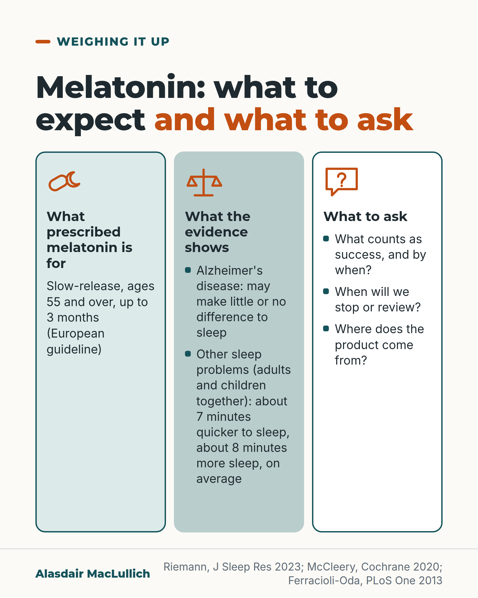

# G112: Melatonin: realistic expectations

- Category: C11 Sleep
- Audience: public
- Series: Weighing it up
- Post type: decision_support
- Visual format: three-column card
- Status: text text_final, visual final
- Working id: C11-P09 (candidate C11-24)

## Insight

In trials in people with Alzheimer's disease and poor sleep, melatonin may make little or no difference to sleep. In people with sleep problems generally the average gain is a few minutes. European guidance supports prescribed slow-release melatonin for up to 3 months in people aged 55 and over. Supplements sold in the US and Canada often did not contain what the label said.

## Angle and position

Feeling natural does not tell you whether a product works or how much is in it. Position: melatonin can be a short, reviewed trial for some older people with realistic expectations, it is not a proven treatment for sleep problems in dementia, and prescribed products are preferable to supplements.

Basis: mixed: the Cochrane finding, the meta-analysis averages, the guideline statement and the product tests are empirical or published; the view that it can be a reasonable short trial with a review date, and that prescribed products are preferable, is clinical judgement.

## X (906 characters)

```text
Melatonin (up to 10 mg) may make little or no difference to sleep in people with Alzheimer's disease and poor sleep, in trials lasting 8 to 10 weeks. So decide what would count as success before trying it. The evidence is limited and no serious side effects were reported. The same review found some evidence of benefit for other medicines.

In a review of adults and children with insomnia and other sleep problems, melatonin helped people fall asleep about 7 minutes sooner than a dummy pill. They slept about 8 minutes longer. These are averages.

European guidance says prescribed slow-release melatonin can be used for up to 3 months in people aged 55 and over, and does not recommend ordinary fast-release melatonin for insomnia. In tests of supplements sold in the US and Canada, most did not contain what the label said.

Before a trial of melatonin, decide when you will stop if it has not helped.
```

## LinkedIn (1790 characters)

```text
Melatonin (up to 10 mg) may make little or no difference to sleep in people with Alzheimer's disease and poor sleep, in trials lasting 8 to 10 weeks. A Cochrane review (a systematic review of trials) found we can have little confidence in the result. The trials were small. For total night-time sleep, melatonin gave about 11 minutes more (from two small trials of 184 people). The true figure could lie anywhere from 16 minutes less to 38 minutes more. No serious side effects were reported. The same review found some evidence of benefit for other medicines.

Outside dementia, the average gains are also small. A review of adults and children with insomnia and other sleep problems found melatonin helped people fall asleep about 7 minutes sooner than a dummy pill. They slept about 8 minutes longer. European guidance says prescribed slow-release melatonin can be used for up to 3 months in people aged 55 and over with insomnia. It does not recommend ordinary fast-release melatonin for insomnia.

The product can differ from the label. In a 2023 US study, 22 of 25 melatonin gummies were wrongly labelled. Amounts ranged from about three quarters to more than three times the stated dose, and one contained none. A Canadian study of supplements found amounts from 83% under to 478% over the label. These were North American supplements. They do not describe prescribed tablets in the UK, and UK shop products were not tested.

Before a trial of melatonin, decide what would count as success for you, and by when. Decide when you will stop or review it if it has not helped. Ask where the product comes from, and whether it is prescribed or a regulated medicine.

Melatonin can be a short trial with a review date, but it is not an established treatment for sleep problems in dementia.
```

## Bluesky (299 characters)

```text
Melatonin may make little or no difference to sleep in people with Alzheimer's disease, in trials. Decide what counts as success and when to stop. In other sleep problems, adults and children fell asleep about 7 minutes sooner than with a dummy pill. Many tested supplements did not match the label.
```

## Threads (492 characters)

```text
Melatonin may make little or no difference to sleep in people with Alzheimer's disease and poor sleep, in trials. Decide what counts as success and when you will stop if it has not helped.

In adults and children with insomnia and other sleep problems, melatonin helped people fall asleep about 7 minutes sooner and sleep about 8 minutes longer than a dummy pill.

Supplements tested in the US and Canada often did not match the label: in one US study, 22 of 25 gummies were wrongly labelled.
```

## Source reply

Sources: McCleery and Sharpley, Cochrane 2020 https://doi.org/10.1002/14651858.CD009178.pub4 ; Riemann et al., J Sleep Res 2023 https://doi.org/10.1111/jsr.14035 ; Ferracioli-Oda et al., PLoS One 2013 https://doi.org/10.1371/journal.pone.0063773 ; Cohen et al., JAMA 2023 https://doi.org/10.1001/jama.2023.2296

## Visual



Alt text: Three columns on melatonin. What prescribed melatonin is for: slow-release, ages 55 and over, up to 3 months. What the evidence shows: little or no difference in Alzheimer's disease; about 7 minutes quicker to sleep and 8 more minutes in other sleep problems. What to ask: success, review, product source.

Editable source: `visuals/src/G112.html`

Design instructions: three-column card. Source html visuals/src/C11-P09.html with c11_common.js (person icon grids, hatched filled icons so colour is not the only cue). Grounds: off-white cards, mint/white panels, teal and burnt orange. Data claims: no chart; C11-24-e figures as text. Drawings via kit.js only on P04 card 2, P08, P10; numbered pins with HTML key.

## Sources and verification

- C11-24-a (supported): Prolonged-release melatonin can be used for short-term treatment of insomnia in people aged 55 and over (up to 3 months in the European guideline); fast-release melatonin is not recommended.
  - Source: Riemann D, Espie CA, Altena E, Arnardottir ES, Baglioni C, Bassetti CLA, et al. The European Insomnia Guideline: an update on the diagnosis and treatment of insomnia 2023. J Sleep Res. 2023;32(6):e14035.; Hajak G, Lemme K, Zisapel N. Lasting treatment effects in a postmarketing surveillance study of prolonged-release melatonin. Int Clin Psychopharmacol. 2015;30(1):36-42.
  - Passage: "European guideline: "Prolonged-release melatonin can be used for up to 3 months in patients ≥ 55 years (B). Antihistaminergic drugs, antipsychotics, fast-release melatonin, ramelteon and phytotherapeutics are not recommended for insomnia treatment (A)." Hajak 2015: "Prolonged-release melatonin (PRM; Circadin) was approved in Europe for the management of primary insomnia patients age 55 years or older suffering from poor quality of sleep."" (Abstracts)
- C11-24-c (supported): In people with Alzheimer's disease and sleep problems, melatonin up to 10 mg may make little or no difference to sleep over 8 to 10 weeks.
  - Source: McCleery J, Sharpley AL. Pharmacotherapies for sleep disturbances in dementia. Cochrane Database Syst Rev. 2020;11(11):CD009178.
  - Passage: ""We found low-certainty evidence that melatonin doses up to 10 mg may have little or no effect on any major sleep outcome over eight to 10 weeks in people with AD and sleep disturbances. We could synthesise data for two of our primary sleep outcomes: total nocturnal sleep time (TNST) (MD 10.68 minutes, 95% CI -16.22 to 37.59; 2 studies, n = 184)" ... "There were no serious adverse effects of melatonin reported." Conclusions: "We found no evidence for beneficial effects of melatonin (up to 10 mg) or a melatonin receptor agonist. There was evidence of some beneficial effects on sleep outcomes from trazodone and orexin antagonists and no evidence of harmful effects in these small trials"" (Abstract, Main results and Authors' conclusions)
- C11-24-d (supported_with_qualification): Melatonin supplements bought without prescription have been found to contain amounts very different from the label.
  - Source: Cohen PA, Avula B, Wang YH, Katragunta K, Khan I. Quantity of melatonin and CBD in melatonin gummies sold in the US. JAMA. 2023;329(16):1401-2.; Erland LA, Saxena PK. Melatonin natural health products and supplements: presence of serotonin and significant variability of melatonin content. J Clin Sleep Med. 2017;13(2):275-81.
  - Passage: "Cohen 2023: "The 30 unique brands entered into the database in 2021 were purchased online." ... "25 products were analyzed. One product did not contain detectable levels of melatonin but did contain 31.3 mg of CBD." ... "In products that contained melatonin, the actual quantity of melatonin ranged from 74% to 347% of the labeled quantity. Twenty-two of 25 products (88%) were inaccurately labeled, and only 3 products (12%) contained a quantity of melatonin that was within ±10% of the declared quantity." Erland 2017: "Melatonin content was found to range from -83% to +478% of the labelled content. Additionally, lot-to-lot variable within a particular product varied by as much as 465%." ... "Melatonin content did not meet label within a 10% margin of the label claim in more than 71% of supplements and an additional 26% were found to contain serotonin."" (Cohen: Methods and Results (Scite full-text excerpts); Erland: Abstract)
- C11-24-e (supported_with_qualification): In people with primary sleep disorders, melatonin modestly shortened the time to fall asleep and slightly increased total sleep.
  - Source: Ferracioli-Oda E, Qawasmi A, Bloch MH. Meta-analysis: melatonin for the treatment of primary sleep disorders. PLoS One. 2013;8(5):e63773.
  - Passage: ""Nineteen studies involving 1683 subjects were included in this meta-analysis. Melatonin demonstrated significant efficacy in reducing sleep latency (weighted mean difference (WMD) = 7.06 minutes [95% CI 4.37 to 9.75], Z = 5.15, p<0.001) and increasing total sleep time (WMD = 8.25 minutes [95% CI 1.74 to 14.75], Z = 2.48, p = 0.013)." ... "The effects of melatonin on sleep are modest but do not appear to dissipate with continued melatonin use."" (Abstract)

Verification notes: European Insomnia Guideline 2023 (abstract): slow-release melatonin up to 3 months at 55+, fast-release not recommended; UK licence wording (Circadin SPC, C11-24-b) not used because only a search extract. McCleery 2020 Cochrane (abstract): melatonin up to 10 mg, 8 to 10 weeks, total sleep difference 10.68 min (-16.22 to 37.59), low certainty; other medicines showed some benefit (trazodone, orexin antagonists), not named. Ferracioli-Oda 2013: 7.06 and 8.25 minutes, mixed ages including children. Cohen 2023 (full text): 22 of 25 gummies mislabelled, 74 to 347%, one contained none. Erland 2016: Canadian supplements -83% to +478%. UK prescription status not stated. Follow invitation carried here (one in this set).

## Attention and follow potential

Pause: A widely used product that many assume is safe and effective because it feels natural.

Gain: Realistic expectations and three questions to ask before starting.

Follow: Weighing it up posts give fair, practical judgements, one treatment decision at a time.

## Open issues

None.
