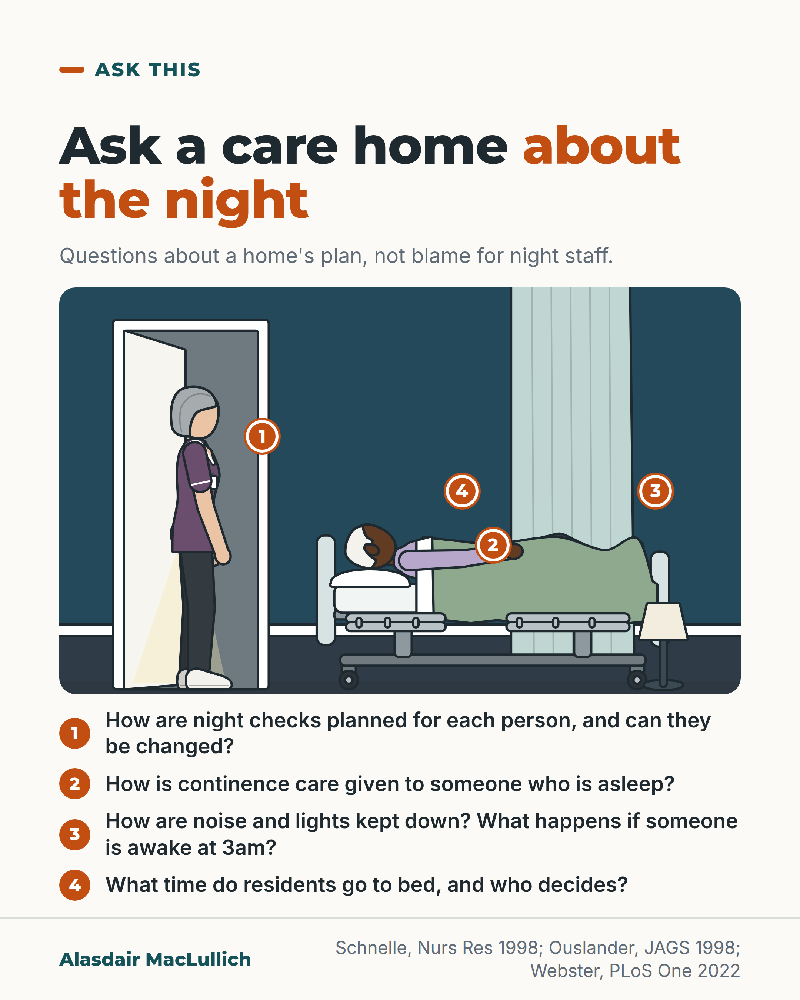

# G113: Ask a care home about the night

- Category: C11 Sleep
- Audience: public
- Series: Ask this
- Post type: decision_support
- Visual format: annotated scene
- Status: text text_final, visual final
- Working id: C11-P10 (candidate C11-27)

## Insight

Four questions about the night are worth asking when choosing or reviewing a care home: how night checks are planned for each person, how continence care is given to someone who is asleep, how noise and lights are kept down and what happens if someone is awake at 3am, and what time residents go to bed and who decides. US studies, small and old, found that planning night checks by each person's skin risk cut care-related waking without harming skin.

## Angle and position

Ask the home to explain its plan for the night, as an invitation and not an accusation. Some checks are needed for skin and safety. The studies are small, old and American, and UK staff describe too few night staff. The bedtime question is about choice, with no sleep claim.

Basis: mixed: the figures on night-time waking, wet episodes and individualised checks are empirical findings from small US studies; the UK staff statements are from qualitative interviews; the view that residents and families are entitled to ask, and that bedtimes are a question of choice, is an ethical judgement.

## X (1052 characters)

```text
Ask a care home how it plans the night. Four questions: how are night checks planned for each person, and can they be changed? How is continence care (help for someone with bladder or bowel leaks) given to someone who is asleep? How are noise and lights kept down, and what happens if someone is awake at 3am? What time do residents go to bed, and who decides?

These questions come from US nursing home studies of residents with incontinence. A wet episode was linked with about 4 in 100 night-time awakenings, and the light and noise of night-time checks were linked with waking. In the studies, care set each person's checks by their own skin risk and gave care when they were already awake. Waking caused by care fell, and skin was not harmed.

Some checks are needed for skin and safety, and the studies were small and old. In interviews in four UK care homes, staff caring for residents with dementia said there are too few night staff to help residents who wake. Ask the home to explain its plan for the night, and ask who is responsible for it.
```

## LinkedIn (1934 characters)

```text
Ask a care home how it plans the night, as well as the day. Four questions you can use on a visit or at a review:

1. How are night checks planned for each person, and can they be changed?

2. How is continence care (help for someone with bladder or bowel leaks) given to someone who is asleep?

3. How are noise and lights kept down, and what happens if someone is awake at 3am?

4. What time do residents go to bed, and who decides?

What the studies found. In US nursing home studies of residents with incontinence, being wet rarely woke residents: about 4 in 100 night-time awakenings were linked with a wet episode (73 residents in three homes; the authors caution that the sleep and wetness sensors had limits). Setting each person's checks every 2 or 4 hours by their own skin risk, and giving care when they were already awake, cut care-related waking with no harm to skin.

Another US trial included 267 residents with incontinence in eight nursing homes. Staff were given feedback on noise, tried to reduce noise, and gave less disruptive night continence care. Noise and light changes fell. Awakenings linked with light, and with noise plus light, also fell, but most other measures of sleep did not improve.

What the studies do not show. They were small and old, with care given by research staff, so they do not tell us how common any of this is in UK homes. The tailored schedule was 2 or 4 hourly, not no checks. Some checks are needed for skin and safety. UK staff interviewed in four care homes about residents with dementia described settling people into dark, quiet rooms, and said there are too few night staff to help residents who wake.

The fourth question is about choice. The studies did not test whether it changes sleep. We should expect residents and families to be able to ask it, and a good home to have a clear answer.

Ask the home to explain its plan for the night, and ask who is responsible for it.
```

## Bluesky (283 characters)

```text
Ask a care home about the night. How are checks planned for each person? How is help with bladder or bowel leaks given to someone asleep? How are noise and lights kept down? Who decides bedtimes? In small US studies, checks set by skin risk cut care-related waking with no skin harm.
```

## Threads (478 characters)

```text
Ask a care home how it plans the night. Are night checks planned for each person and can they be changed? How is help with bladder or bowel leaks given to someone asleep? How are noise and lights kept down? Who decides bedtimes?

In small US studies of residents with incontinence, checks were set by each person's skin risk. Waking caused by care fell. Skin health did not get worse over the study period. Some checks are needed. Ask the home to explain its plan for the night.
```

## Source reply

Sources: Schnelle et al., Nurs Res 1998 https://doi.org/10.1097/00006199-199807000-00004 ; Ouslander et al., JAGS 1998 https://doi.org/10.1111/j.1532-5415.1998.tb02467.x ; Schnelle et al., JAGS 1999 https://doi.org/10.1111/j.1532-5415.1999.tb07235.x ; Webster et al., PLoS One 2022 https://doi.org/10.1371/journal.pone.0272814

## Visual



Alt text: Illustration of a care home bedroom at night. An older man sleeps in bed; a care worker stands in the lit doorway. Four numbered questions to ask a home: how night checks are planned, continence care while asleep, keeping noise and lights down, and bedtimes and who decides.

Editable source: `visuals/src/G113.html`

Design instructions: annotated scene. Source html visuals/src/C11-P10.html with c11_common.js (person icon grids, hatched filled icons so colour is not the only cue). Grounds: off-white cards, mint/white panels, teal and burnt orange. Data claims: none (no numbers). Drawings via kit.js only on P04 card 2, P08, P10; numbered pins with HTML key.

## Sources and verification

- C11-27-b (supported_with_qualification): Night-time noise and light changes are associated with residents waking; in a US trial, noise peaks above 50 dB occurred in an average of 83 two-minute intervals a night before intervention, but reducing noise and light did not improve most sleep measures.
  - Source: Schnelle JF, Alessi CA, Al-Samarrai NR, Fricker RD, Ouslander JG. The nursing home at night: effects of an intervention on noise, light, and sleep. J Am Geriatr Soc. 1999;47(4):430-8.
  - Passage: ""The sleep of nursing home residents is fragmented by frequent awakening episodes associated, at least in part, with environmental variables, including noise and light changes." "Noise was reduced significantly, from an average of 83 intervals per night with peak noises recorded above 50 dBs to an average of 58 intervals per night in the group that received the initial intervention ... light changes were reduced from an average of four per night per resident to two per night (P < .001). Despite these significant changes in the environmental variables, there was a significant differential improvement in the intervention group on only two night sleep measures: awakening associated with a combination of noise plus light (P < .001) and awakening associated with light (P < .001)." "The significant reductions in noise and light events resulting from the intervention did not lead to significant improvements in the day sleep and most night sleep measures."" (Abstract (Background, Results, Conclusions))
- C11-27-c (supported_with_qualification): Routine night-time continence checks can wake residents; tailoring the check schedule to each resident's skin risk, and giving care when residents are found awake, reduced care-related awakenings without harming skin. Wet episodes themselves rarely woke residents.
  - Source: Schnelle JF, Cruise PA, Alessi CA, Al-Samarrai N, Ouslander JG. Individualizing nighttime incontinence care in nursing home residents. Nurs Res. 1998;47(4):197-204.; Ouslander JG, Buxton WG, Al-Samarrai NR, Cruise PA, Alessi C, Schnelle JF. Nighttime urinary incontinence and sleep disruption among nursing home residents. J Am Geriatr Soc. 1998;46(4):463-6.; Ostaszkiewicz J, O'Connell B, Dunning T. Night-time continence care in Australian residential aged care facilities: findings from a grounded theory study. Contemp Nurse. 52(2-3):152-62. Epub 2015 Jun 10.
  - Passage: "Schnelle 1998: "A previous study of incontinent NH residents demonstrated that noise from the staff and other residents and light and noise from staff-initiated incontinence care routines were associated with waking episodes." "Subjects were assigned to a 2- or 4-hour incontinence care schedule based on each resident's risk of skin problems using objective data of spontaneous body movements at night and skin health during baseline, and the research staff provided incontinence care if residents were found awake." "Awakenings due to light and sound associated with incontinence care were significantly reduced during the intervention phases (p < .001), and there were no adverse changes in skin health or on most risk factors associated with skin (e.g., exposure to moisture, body turns)." Ouslander 1998: "Recordings covered 403 nights, during which 1715 awakenings from 10 consecutive minutes of sleep were detected as were 1168 incontinent episodes. Only 4% of the awakenings were associated with an incontinence episode". Ostaszkiewicz 2015: "Most residents were checked overnight. This practice was underpinned by staffs' concern that residents were intractably incontinent and at risk of pressure injuries. ... Decisions were also influenced by beliefs about limited staff-to-resident ratios." "Night-time continence care should be audited to ensure decisions are based on residents' preferences, skin health, sleep/wake status, ability to move in bed, and the frequency, severity and type of residents' actual incontinence."" (Abstracts)
- C11-27-d (supported_with_qualification): In UK care homes, staff settle residents into dark, quiet bedrooms and describe insufficient night staffing as a barrier to good night care.
  - Source: Webster L, Costafreda SG, Powell K, Livingston G. How do care home staff use non-pharmacological strategies to manage sleep disturbances in residents with dementia: the SIESTA qualitative study. PLoS One. 2022;17(8):e0272814.; Nunez KM, Khan Z, Testad I, Lawrence V, Creese B, Corbett A. Current practice and challenges in night-time care for people with dementia living in care homes: a qualitative study. Int J Geriatr Psychiatry. 33(1):e140-9. Epub 2017 May 26.
  - Passage: "Webster 2022: "In the evening, staff settled residents into dark, quiet, comfortable bedrooms often after a snack. When residents woke at night, they gave them caffeinated tea or food, considered possible pain and discomfort, and reassured residents they were safe. ... Staff found minimising daytime napping difficult, described insufficient staffing at night to attend to reorient and guide awake residents and said residents frequently did not know it was night-time." "Some common techniques, such as caffeinated drinks, may be counterproductive." Nunez 2017: "Thematic analysis revealed eight key themes in the management of sleep disturbance in people with dementia living in care homes: current night-time care practices, dissonance in perceived causes of sleep disturbances, inconsistencies in treatment options, insufficient staffing levels, working relationships between shifts, nurse burden and responsibility, communication as a critical challenge, connecting with residents and one overarching theme of balance."" (Abstracts)

Verification notes: Ouslander 1998 and Schnelle 1998/1999 (abstracts): 4% of 1,715 awakenings over 403 nights associated with wet episodes; tailored 2 or 4 hourly checks by skin risk cut care-related waking without skin harm; noise and light changes with limited effect on sleep. Webster 2022 and Nunez 2017 (abstracts): UK staff interviews, dark quiet rooms, too few night staff. Regulations and standards deliberately not cited. Bedtime question flagged as a values question; no sleep claim made. The 7 in 10 daytime sleeping figure (C11-27-a) not used. Final LinkedIn sentence 'We should expect...' is a judgement. Nunez 2017 (abstract) supports the point that UK staff describe constraints at night.

## Attention and follow potential

Pause: Families rarely think to ask about nights, and visits usually see the day.

Gain: Four ready questions for a visit or review, with the limits of the evidence stated.

Follow: Ask this posts turn worry into specific questions.

## Open issues

None.
