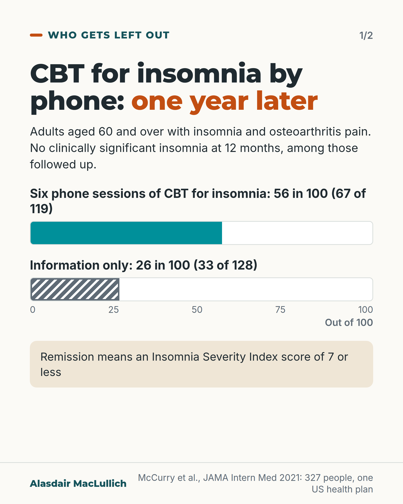
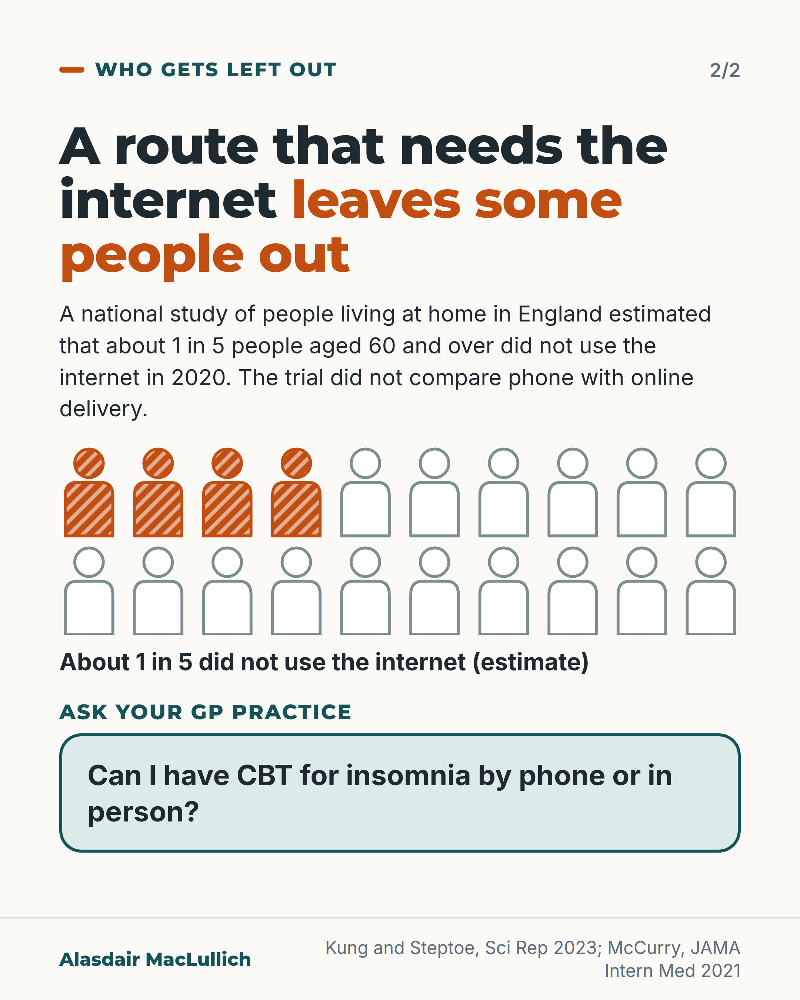

# G114: CBT for insomnia down the phone

- Category: C11 Sleep
- Audience: both
- Series: Who gets left out
- Post type: good_care
- Visual format: carousel (bar comparison, then access card)
- Status: text text_final, visual final
- Working id: C11-P11 (candidate C11-09)

## Insight

CBT for insomnia, the recommended first treatment for long-term insomnia, has been tested by telephone in older adults: a year later 56 in 100 had no clinically significant insomnia, against 26 in 100 given information only. A national study of people living at home in England estimated that about 1 in 5 people aged 60 and over did not use the internet at all in 2020, so a route that needs the internet leaves them out.

## Angle and position

A treatment that needs the internet leaves out people who are offline. Telephone delivery has trial evidence of lasting benefit. Position: services that offer CBT for insomnia to older people should also offer a route that does not need the internet, such as telephone sessions. The trial did not compare phone with online delivery.

Basis: mixed: the trial results and the internet-use figure are empirical findings; the guideline statement is a published recommendation; the argument that services should offer a route that does not need the internet is an ethical and service judgement, not a trial finding.

## X (1020 characters)

```text
CBT for insomnia (a structured talking and sleep-scheduling treatment) can be delivered by phone. In a US trial of 327 people aged 60 and over with insomnia and osteoarthritis pain, six phone sessions (20 to 30 minutes each, over 8 weeks) improved sleep more than information about sleep and arthritis. A year later, among those followed up, 56 in 100 in the phone group had insomnia that was no longer bad enough to count as a clinical problem, against 26 in 100 in the information group.

CBT for insomnia is the recommended first treatment for long-term insomnia. A national study of people living at home in England estimated that about 79 in 100 people aged 60 and over used the internet at all in 2020. So about 1 in 5 did not. A route that needs the internet leaves them out. This is an argument, not a test result: the trial did not compare phone with online delivery, and people also kept sleep diaries and had written materials.

You can ask your GP practice: can I have CBT for insomnia by phone or in person?
```

## LinkedIn (2189 characters)

```text
CBT for insomnia (a structured talking and sleep-scheduling treatment) can be delivered by phone. In a US trial of 327 people aged 60 and over with insomnia and osteoarthritis pain, six phone sessions (20 to 30 minutes each, over 8 weeks) improved sleep more than information about sleep and arthritis. A year later, 56 in 100 of those followed up in the phone group (67 of 119) had insomnia no longer bad enough to count as a clinical problem, against 26 in 100 (33 of 128) in the information group.

CBT for insomnia is the initial treatment recommended for long-term insomnia by the American College of Physicians, and is strongly recommended by the American Academy of Sleep Medicine. In a national study of people living at home in England, the authors estimated that about 79 in 100 people aged 60 and over used the internet at all in 2020. So about 1 in 5 did not. Daily use was lower in the oldest age groups, in more deprived areas and among lonelier people. Care home residents were not included, and the real share of people offline is probably higher. A route to CBT for insomnia that needs the internet leaves these people out.

The trial authors present phone delivery as a way to reach older people in rural and underserved areas. Whether it reaches people who are offline was not tested, so that part is an argument, not a finding. Limits: everyone in the trial had osteoarthritis pain, in one US health plan, and the comparison was information only. It did not compare phone with online or face-to-face delivery, so it does not show that phone is better. The sessions were by phone, but people also kept sleep diaries and received written materials, so a phone alone is not the whole package.

In England, a trial showed practice nurses can deliver sleep restriction therapy (limiting time in bed to time asleep), a core part of CBT for insomnia, in four sessions. That is evidence it can work, not proof that it is routinely available, and the trial was mostly in middle-aged adults.

We should offer older people a route to CBT for insomnia that does not need the internet. If you want it, you can ask your GP practice: can I have CBT for insomnia by phone or in person?
```

## Bluesky (297 characters)

```text
In a US trial, CBT for insomnia (talking therapy) by phone helped older adults with osteoarthritis pain and insomnia. A year on, 56 in 100 of those followed up had insomnia that was no longer a clinical problem, against 26 in 100 given information. 1 in 5 over 60s in England were offline in 2020.
```

## Threads (494 characters)

```text
CBT for insomnia (a talking and sleep-scheduling treatment) has been tested by phone. In a US trial of 327 people aged 60+ with insomnia and osteoarthritis pain, 56 in 100 of those followed up a year later had insomnia that was no longer a clinical problem, against 26 in 100 given information.

About 1 in 5 people aged 60+ living at home in England did not use the internet in 2020. We should offer a route that does not need it. Ask your GP practice if you can have it by phone or in person.
```

## Source reply

Sources: McCurry et al., JAMA Intern Med 2021 https://doi.org/10.1001/jamainternmed.2020.9049 ; Kung and Steptoe, Sci Rep 2023 https://doi.org/10.1038/s41598-023-30882-8 ; Qaseem et al., Ann Intern Med 2016 https://doi.org/10.7326/M15-2175 ; Kyle et al., Lancet 2023 https://doi.org/10.1016/S0140-6736(23)00683-9

## Visual



Alt text: Bar chart: no clinically significant insomnia at 12 months, 56 in 100 after six phone sessions of CBT for insomnia (67 of 119) against 26 in 100 with information only (33 of 128). Adults 60 and over with osteoarthritis pain.



Alt text: Grid of 20 person icons, 4 shaded: about 1 in 5 people aged 60 and over in England did not use the internet in 2020 (estimate). A route needing the internet leaves some out. Ask your GP practice: can I have CBT for insomnia by phone or in person?

Editable source: `visuals/src/G114.html`

Design instructions: carousel (bar comparison, then access card). Source html visuals/src/C11-P11.html with c11_common.js (person icon grids, hatched filled icons so colour is not the only cue). Grounds: off-white cards, mint/white panels, teal and burnt orange. Data claims: C11-09-a, C11-09-d. Drawings via kit.js only on P04 card 2, P08, P10; numbered pins with HTML key.

## Sources and verification

- C11-09-a (supported): In a randomised trial of 327 adults aged 60 and over with insomnia and osteoarthritis pain, six 20 to 30 minute telephone sessions of CBT for insomnia over 8 weeks reduced insomnia severity more than education only, and at 12 months 56% versus 26% were in remission.
  - Source: McCurry SM, Zhu W, Von Korff M, Wellman R, Morin CM, Thakral M, et al. Effect of telephone cognitive behavioral therapy for insomnia in older adults with osteoarthritis pain: a randomized clinical trial. JAMA Intern Med. 2021;181(4):530-8.
  - Passage: ""This is a randomized clinical trial of 327 participants 60 years and older who were recruited statewide through Kaiser Permanente Washington from September 2016 to December 2018." ... "Six 20- to 30-minute telephone sessions provided over 8 weeks. Participants submitted daily diaries and received group-specific educational materials. The CBT-I instruction included sleep restriction, stimulus control, sleep hygiene, cognitive restructuring, and homework. The EOC group received information about sleep and OA." ... "Of the 327 participants, the mean (SD) age was 70.2 (6.8) years, and 244 (74.6%) were women. In the 282 participants with follow-up ISI data, the total 2-month posttreatment ISI scores decreased 8.1 points in the CBT-I group and 4.8 points in the EOC group, an adjusted mean between-group difference of -3.5 points (95% CI, -4.4 to -2.6 points; P < .001). Results were sustained at 12-month follow-up (adjusted mean difference, -3.0 points; 95% CI, -4.1 to -2.0 points; P < .001). At 12-month follow-up, 67 of 119 (56.3%) participants receiving CBT-I remained in remission (ISI score, ≤7) compared with 33 of 128 (25.8%) participants receiving EOC."" (Abstract: Design, Setting, and Participants; Interventions; Results)
- C11-09-b (supported_with_qualification): Telephone CBT-I needs only a phone for the sessions and was designed as an access route for people who lack ready access to insomnia treatment.
  - Source: McCurry SM, Zhu W, Von Korff M, Wellman R, Morin CM, Thakral M, et al. Effect of telephone cognitive behavioral therapy for insomnia in older adults with osteoarthritis pain: a randomized clinical trial. JAMA Intern Med. 2021;181(4):530-8.
  - Passage: ""Scalable delivery models of cognitive behavioral therapy for insomnia (CBT-I), an effective treatment, are needed for widespread implementation, particularly in rural and underserved populations lacking ready access to insomnia treatment." ... Key Points, Meaning: "Telephone CBT-I may improve access to an individualized and effective treatment for chronic insomnia among older persons with osteoarthritis pain, including those in rural and medically underserved areas."" (Abstract (Importance) and Key Points (Meaning), via PMC)
- C11-09-c (supported): CBT for insomnia is the recommended first-line treatment for chronic insomnia in adults (ACP and AASM guidelines).
  - Source: Qaseem A, Kansagara D, Forciea MA, Cooke M, Denberg TD; Clinical Guidelines Committee of the American College of Physicians. Management of chronic insomnia disorder in adults: a clinical practice guideline from the American College of Physicians. Ann Intern Med. 2016;165(2):125-33.; Edinger JD, Arnedt JT, Bertisch SM, Carney CE, Harrington JJ, Lichstein KL, et al. Behavioral and psychological treatments for chronic insomnia disorder in adults: an American Academy of Sleep Medicine clinical practice guideline. J Clin Sleep Med. 2021;17(2):255-62.
  - Passage: "ACP 2016, Abstract: "ACP recommends that all adult patients receive cognitive behavioral therapy for insomnia (CBT-I) as the initial treatment for chronic insomnia disorder. (Grade: strong recommendation, moderate-quality evidence)." | AASM 2021, Abstract: "1. We recommend that clinicians use multicomponent cognitive behavioral therapy for insomnia for the treatment of chronic insomnia disorder in adults. (STRONG)."" (Abstracts, Recommendations)
- C11-09-d (supported_with_qualification): A substantial share of older people in the UK do not use the internet.
  - Source: Kung CSJ, Steptoe A. Changes in Internet use patterns among older adults in England from before to after the outbreak of the COVID-19 pandemic. Sci Rep. 2023;13(1):3932.
  - Passage: "Discussion: "In contrast, comparable ELSA estimates (i.e., proportion of users of any frequency, aged 60 +) suggest that in England, this remained constant at 79% before and during the pandemic." | Results: "Weighted estimates from the nationally representative English Longitudinal Study of Ageing suggest that the prevalence of daily Internet use among adults aged 50 + in England increased from 52·9% in 2012/2013 (Wave 6), to 71·8% in 2018/2019 (Wave 9), and finally to 73·9% in June/July 2020" | "This discrepancy increased with age, with those aged 85 + being 17 percentage points less likely (or 22·1% relative to the June/July 2020 average) than those aged 50–64 to use the Internet daily." | Abstract: "Daily use in June/July 2020 was negatively related to age, neighbourhood deprivation, and loneliness, and positively related to partnership status, education, employment, income, and organisation membership." | Discussion: "It is also worth noting that older adults in care homes have been excluded by design. There could be an under-representation of infrequent or non-users in our sample, in which case, the rates of Internet use would be lower than estimated."" (Results (Daily Internet use; Factors predicting use); Discussion)
- C11-09-f (supported_with_qualification): In the UK, CBT for insomnia components can be delivered without an app: in an English trial, general practice nurses delivered sleep restriction therapy in four sessions.
  - Source: Kyle SD, Siriwardena AN, Espie CA, Yang Y, Petrou S, Ogburn E, et al. Clinical and cost-effectiveness of nurse-delivered sleep restriction therapy for insomnia in primary care (HABIT): a pragmatic, superiority, open-label, randomised controlled trial. Lancet. 2023;402(10406):975-87.
  - Passage: ""Adults with insomnia disorder were recruited from 35 general practices across England and randomly assigned (1:1) using a web-based randomisation programme to either four sessions of nurse-delivered sleep restriction therapy plus a sleep hygiene booklet or a sleep hygiene booklet only." ... "Brief nurse-delivered sleep restriction therapy in primary care reduces insomnia symptoms, is likely to be cost-effective, and has the potential to be widely implemented as a first-line treatment for insomnia disorder."" (Abstract: Methods; Interpretation)

Verification notes: McCurry 2021 (abstract): 327 people aged 60+, mean 70.2, six sessions of 20 to 30 minutes over 8 weeks, remission (ISI 7 or less) 67/119 (56.3%) vs 33/128 (25.8%) at 12 months, denominators are those with 12-month data; comparator education only; pain difference not sustained. Kung and Steptoe 2023 (full text): the 79% of those 60+ using the internet at any frequency is a single Discussion estimate (comparable ELSA data), not a reported result, so it is worded as an estimate; the Results report daily use in adults 50+ (73.9% in June and July 2020); care homes excluded, non-users may be under-represented; daily use lower with age (85+ vs 50 to 64, 17 points adjusted), deprivation and loneliness. Kyle 2023 (abstract): practice nurses delivered sleep restriction in four sessions; mean age 55; not stated to be by phone. ACP 2016 and AASM 2021: CBT-I first line. NICE and Sleepio claims dropped as unverified. The access argument is flagged as judgement. Slide 2 art: 4 of 20 icons equals about 1 in 5 (79% used the internet).

## Attention and follow potential

Pause: A plain, inclusive answer to an access problem, with the argument and the evidence kept apart.

Gain: Knowing that the option exists, that it can be asked for, and how far the evidence goes.

Follow: Who gets left out posts attend to people excluded by default designs.

## Open issues

None.
