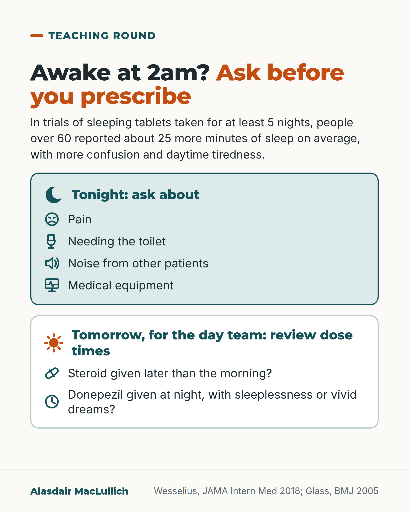

# G115: The 2am sleep call

- Category: C11 Sleep
- Audience: practitioners
- Series: Teaching round
- Post type: teaching
- Visual format: checklist card (two lists)
- Status: text text_final, visual final
- Working id: C11-P12 (candidate C11-02)

## Insight

For an older patient awake at night, ask first about the disturbances inpatients report most (noise, equipment, pain, the toilet), because in trials of at least 5 nights, sleeping tablets added about 25 minutes of self-reported sleep on average in people over 60, with more confusion and daytime tiredness. The next day, the day team can review dose times of steroids and donepezil.

## Angle and position

The call to prescribe a sedative comes at night, but the cause is often in the ward or the drug chart. Tonight, check the common disturbers; tomorrow, review dose times. The position is that a sedative should follow, not replace, this check.

Basis: mixed: the survey findings, the 25 minutes and the side-effect findings are empirical; the steroid and donepezil points are expert advice and review-level evidence (no trial of timing), stated as such; the ordering of checks before a sedative is clinical interpretation.

## X (894 characters)

```text
Before writing up a sleeping tablet for an older patient who is awake at night, ask what is keeping them awake.

In a one-night survey of 2,005 adult patients of all ages in 39 Dutch hospitals (median age 68), people reported sleeping 83 minutes less than at home. Noise from other patients, medical equipment, pain and needing the toilet were the disturbances reported most.

In trials in people over 60, sleeping tablets added only about 25 minutes of self-reported sleep, and memory problems, confusion and daytime tiredness were more common. Those trials were of nightly use over at least 5 nights, not one dose on a ward.

For the day team: is a steroid given later than the morning? Expert advice favours a single morning dose where possible. Is donepezil given at night to someone with sleeplessness or vivid dreams? Reviews suggest morning dosing may help; raise it with the prescriber.
```

## LinkedIn (1603 characters)

```text
Before writing up a sleeping tablet for an older patient who is awake at night, ask what is keeping them awake. Two lists, one for tonight and one for tomorrow.

Tonight. In a survey of 2,005 patients in 39 Dutch hospitals (median age 68, all adult ages, one night, self-reported), people reported sleeping 83 minutes less than at home. Noise from other patients, medical equipment, pain and needing the toilet were the disturbances reported most. These are reported disturbers, not established causes in any one patient, but they are the first things to ask about.

In trials in people over 60, sleeping tablets added only about 25 minutes of self-reported sleep, and memory problems, confusion and daytime tiredness were more common than with a dummy pill. Those trials were of nightly use over at least 5 nights, not a single as-required dose on a ward.

Tomorrow, for the day team: review dose times.

Steroids. Steroid tablets such as prednisolone can disturb sleep. Expert guidance advises a single morning dose where possible, which may reduce this. This is expert advice, not trial evidence, and split or evening dosing is sometimes clinically intended, so check whether the evening dose is needed.

Donepezil. It can cause sleeplessness and vivid dreams. Reviews suggest that taking it in the morning may help. The evidence is from reviews and a case series of 8, not a randomised trial of timing. So raise it with the prescriber the next day. Do not change it overnight.

Moving a dose is a plan for tomorrow night. Tonight's call is to ask about pain, needing the toilet, noise and equipment.
```

## Bluesky (298 characters)

```text
Awake at night, an older inpatient? Ask first about noise, equipment, pain and the toilet (reported most by 2,005 Dutch inpatients). In trials of 5+ nights in over 60s, sleeping tablets added about 25 minutes of self-reported sleep, with more confusion and daytime tiredness than with a dummy pill.
```

## Threads (449 characters)

```text
Before a sleeping tablet for an older patient awake at night, ask what is keeping them awake. In 2,005 Dutch inpatients, noise, equipment, pain and the toilet were reported most.

In trials of at least 5 nights in people over 60, tablets added only about 25 minutes of self-reported sleep on average compared with a dummy pill, with more confusion and daytime tiredness.

Next day, review dose times: steroids later than morning, donepezil at night.
```

## Source reply

Sources: Wesselius et al., JAMA Intern Med 2018 https://doi.org/10.1001/jamainternmed.2018.2669 ; Glass et al., BMJ 2005 https://doi.org/10.1136/bmj.38623.768588.47 ; Liu et al., Allergy Asthma Clin Immunol 2013 https://doi.org/10.1186/1710-1492-9-30 ; Moderie et al., Encephale 2022 https://doi.org/10.1016/j.encep.2021.08.014

## Visual



Alt text: Checklist. Tonight ask about pain, needing the toilet, noise from other patients and medical equipment. Tomorrow, for the day team, review dose times: steroid given later than morning, donepezil at night with sleeplessness or vivid dreams. Sleeping tablets gave about 25 more minutes of sleep in over 60s.

Editable source: `visuals/src/G115.html`

Design instructions: checklist card (two lists). Source html visuals/src/C11-P12.html with c11_common.js (person icon grids, hatched filled icons so colour is not the only cue). Grounds: off-white cards, mint/white panels, teal and burnt orange. Data claims: C11-16-a (25 minutes). Drawings via kit.js only on P04 card 2, P08, P10; numbered pins with HTML key.

## Sources and verification

- C11-02-a (supported_with_qualification): In hospital, patients sleep less than at home, and the most reported sleep disturbers are noise from other patients, medical devices, pain and toilet visits.
  - Source: Wesselius HM, van den Ende ES, Alsma J, Ter Maaten JC, Schuit SCE, Stassen PM, et al. Quality and quantity of sleep and factors associated with sleep disturbance in hospitalized patients. JAMA Intern Med. 2018;178(9):1201-8.
  - Passage: ""Compared with habitual sleep at home, the total sleep time in the hospital was 83 minutes (95% CI, 75-92 minutes; P < .001) shorter." "A total of 1344 patients (70.4%) reported having been awakened by external causes, which in 718 (35.8%) concerned hospital staff." "The most reported sleep-disturbing factors were noise of other patients, medical devices, pain, and toilet visits."" (Abstract, Results)
- C11-02-b (supported_with_qualification): In people over 60, sedative hypnotics give small sleep gains with more memory and thinking side effects and daytime tiredness than placebo.
  - Source: Glass J, Lanctôt KL, Herrmann N, Sproule BA, Busto UE. Sedative hypnotics in older people with insomnia: meta-analysis of risks and benefits. BMJ. 2005;331(7526):1169.
  - Passage: ""Improvements in sleep with sedative use are statistically significant, but the magnitude of effect is small. The increased risk of adverse events is statistically significant and potentially clinically relevant in older people at risk of falls and cognitive impairment. In people over 60, the benefits of these drugs may not justify the increased risk, particularly if the patient has additional risk factors for cognitive or psychomotor adverse events."" (Abstract, Conclusions (numbers in C11-16-a to d))
- C11-02-c (supported_with_qualification): Corticosteroids can disturb sleep, and giving them as a single morning dose may reduce this.
  - Source: Liu D, Ahmet A, Ward L, Krishnamoorthy P, Mandelcorn ED, Leigh R, et al. A practical guide to the monitoring and management of the complications of systemic corticosteroid therapy. Allergy Asthma Clin Immunol. 2013;9(1):30.
  - Passage: ""GC use can lead to a wide range of psychiatric and cognitive disturbances, including memory impairment, agitation, anxiety, fear, hypomania, insomnia, irritability, lethargy, mood lability, and even psychosis." "GC therapy may also be associated with sleep disturbances and unpleasant dreams [72]; the risk of these events can potentially be decreased by modifying the timing of GC administration (e.g., a single morning dose) and/or night-time administration of drugs with sedative effects." Table 10: "Administer as single daily dose (given in the morning), if possible"" (Adverse events, Adults, Psychiatric and cognitive disturbances (page 7); Table 10 (page 14) of the PDF, via Undermind read_pdfs)
- C11-02-d (supported_with_qualification): Donepezil can cause insomnia and vivid dreams or nightmares, and moving the dose to the morning may help.
  - Source: Jackson S, Ham RJ, Wilkinson D. The safety and tolerability of donepezil in patients with Alzheimer's disease. Br J Clin Pharmacol. 2004;58 Suppl 1:1-8.; Moderie C, Carrier J, Dang-Vu TT. [Sleep disorders in patients with a neurocognitive disorder]. Encephale. 2022;48(3):325-34 (epub 14 Dec 2021).; Singer M, Romero B, Koenig E, Förstl H, Brunner H. [Nightmares in patients with Alzheimer's disease caused by donepezil. Therapeutic effect depends on the time of intake]. Nervenarzt. 2005;76(9):1127-9.
  - Passage: "Jackson 2004: "Although insomnia and other sleep disorders have been reported following administration of donepezil, lengthening the time period before increasing the dose of donepezil from 5 to 10 mg day(-1) or switching to morning dosing can reduce these events to the levels of placebo-treated patients." Moderie 2021: "Medications should also be reviewed, and time of administration should be optimized (diuretics and stimulating medications in the morning, sedating medications in the evening). Importantly, cholinesterase inhibitors (especially donepezil) may trigger insomnia. Switching to morning dosing or to an alternative drug may help." Singer 2005: "We observed a clear-cut relationship between the occurrence of nightmares and an evening dose of donepezil in eight patients with DAT. None of these patients reported nightmares when donepezil was taken in the morning."" (Abstracts (Jackson: review; Moderie: English abstract of French review; Singer: English abstract of German case series))

Verification notes: Wesselius 2018 (abstract): 2,005 inpatients, median age 68, 39 Dutch hospitals, 83 minutes shorter, disturbers; all adult ages, one night. Glass 2005 (full text): 25.2 minutes, cognitive and daytime fatigue more common; trials of at least 5 consecutive nights. Liu 2013: expert advice, single morning dose of glucocorticoid. Jackson 2004, Singer 2005 case series of 8, Moderie 2022: donepezil morning dosing, review and case-series evidence; UK product advice not stated. Diuretic timing (C11-02-e, partly supported) and Parkinson's medicines (C11-02-f, not found) deliberately omitted.

## Attention and follow potential

Pause: Every doctor knows the 2am call; the useful answer is often in front of them.

Gain: A short check for tonight and a drug-chart review for tomorrow that may avoid a sedative.

Follow: Teaching round posts give a usable point for the next night shift.

## Open issues

None.
