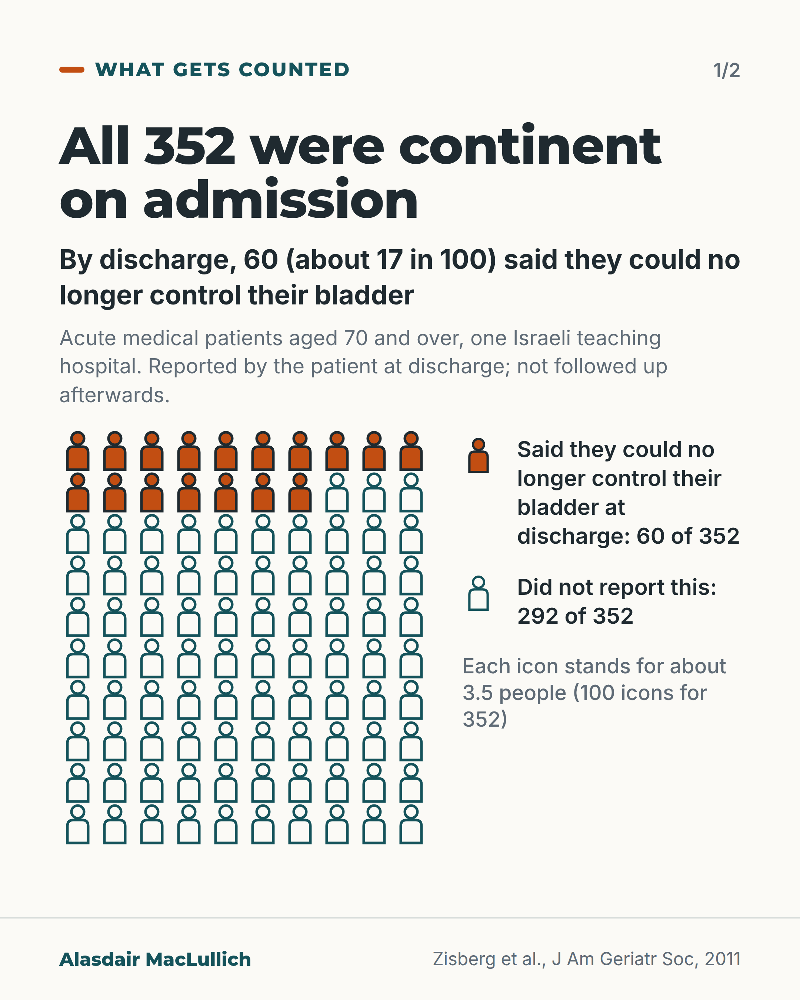
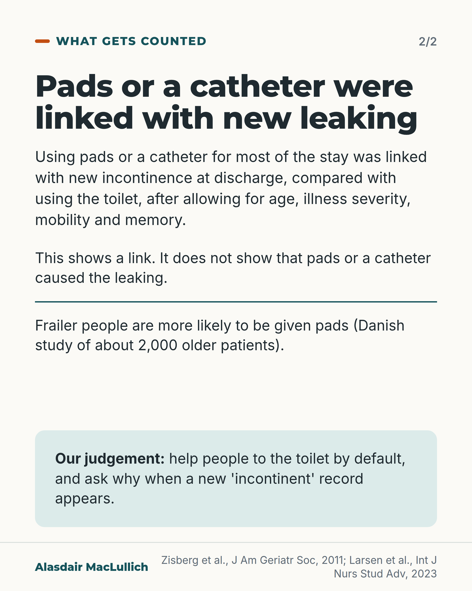

# G116: Continent on admission, incontinent at discharge

- Category: C12 Continence, bladder and bowels
- Audience: practitioners
- Series: What gets counted
- Post type: criticism
- Visual format: chart (10 by 10 icon array) plus statement card, 2 slides
- Status: text text_final, visual final
- Working id: C12-P01 (candidate C12-09)

## Insight

In one Israeli hospital study of 352 people aged 70 and over who were continent on admission, 60 said at discharge that they could no longer control their bladder, and pad or catheter use was linked with it. The link is open to confounding, because frailer people are more likely to be given pads.

## Angle and position

A new 'incontinent' record in hospital should prompt a search for the reason, and help to the toilet should be the default. The fix depends on staffing and call-bell response, so it is framed as a system question, not a criticism of nurses.

Basis: Mixed. Empirical finding: 60 of 352 reported new incontinence at discharge; adjusted association with pads and catheters (link only). Clinical and ethical judgement, marked as such: help to the toilet by default; a new record should prompt a search for the reason; staffing conditions.

## X (639 characters)

```text
Sixty of 352 people aged 70 and over said they could no longer control their bladder when they left an Israeli hospital medical ward. All 352 had been able to control it before they were admitted.

People who wore pads or had a catheter for most of the stay were more likely to report new leaking than people who used the toilet. This is a link only. Frailer people are more likely to be given pads and the study could not fully allow for that, so pads may not be the cause.

We should help people to the toilet by default, and treat a new "incontinent" record as a reason to ask why. That takes staff time and call bells answered quickly.
```

## LinkedIn (1897 characters)

```text
In one Israeli teaching hospital, researchers followed 352 acute medical patients aged 70 and over. All of them had been able to control their bladder before admission. At discharge, 60 (about 1 in 6) said they could no longer control it. They were not followed after discharge, so we do not know how many recovered.

During the stay, 58 people wore adult pads for most of it and 27 had a urinary catheter (a tube that drains urine from the bladder). Both groups were more likely than people who used the toilet themselves to report new incontinence at discharge. This held after the researchers allowed for age, illness severity, mobility and memory. The adjusted odds of new incontinence were about 2.6 times higher with pads and 4.3 times higher with a catheter. Odds are not the same as the chance of it happening, so these figures do not say how many more people were affected, and the range of uncertainty was wide.

This is a link only. Frailer people are more likely to be given pads (a Danish study of about 2,000 older patients found this), so part of the link may come from who is given pads, and pads or catheters may not be the cause. No observational study can fully remove that.

US infection control guidance (CDC, 2009) says catheters should not be used to manage incontinence. It lists using one as a substitute for nursing care as inappropriate. This rests mainly on expert consensus, and the guidance does not cover pads.

A judgement, not a finding: a person who was continent before admission should be helped to the toilet by default, and a new "incontinent" record should prompt a search for the reason. That depends on staffing and on call bells being answered quickly, so it is a question for the people who run wards as much as for the people who work on them.

On your ward, who decides that a person who walked in continent needs a pad, and is the reason written down?
```

## Bluesky (297 characters)

```text
In an Israeli hospital study, 60 of 352 people aged 70 and over who were continent on admission said at discharge they could no longer control their bladder. Pads and catheters were linked with new leaking, though frailer people get pads more often. We should help people to the toilet by default.
```

## Threads (493 characters)

```text
60 of 352 people aged 70 and over said they could no longer control their bladder when they left an Israeli hospital ward. All 352 could control it before admission.

Pads or a catheter for most of the stay were linked with new leaking. This is a link only: frailer people are more likely to be given pads, so pads may not be the cause.

We should help people to the toilet by default, and ask why when a new "incontinent" record appears. That takes staff time and call bells answered quickly.
```

## Source reply

Sources: https://doi.org/10.1111/j.1532-5415.2011.03413.x (Zisberg 2011); https://doi.org/10.1016/j.ijnsa.2023.100131 (Larsen 2023); https://doi.org/10.1086/651091 (CDC 2009)

## Visual



Alt text: Icon array of 100 person icons standing for 352 older hospital patients who were all continent on admission. 17 icons are filled orange with a ring, the rest are teal outlines. By discharge 60 of 352, about 17 in 100, said they could no longer control their bladder. Acute medical patients aged 70 and over, one Israeli hospital.



Alt text: Text card. Pads or a catheter for most of the stay were linked with new incontinence at discharge, after allowing for age, illness, mobility and memory. It shows a link, not cause; frailer people get pads more often. Our judgement, in a mint panel: help people to the toilet by default and ask why when a new incontinent record appears.

Editable source: `visuals/src/G116.html`

Design instructions: 2-card carousel, 1080x1350. Card 1 light ground: h1.m headline, lead kicker, small population note, 10x10 person icon array (17 filled orange with dark ring, 83 teal outlines) left, legend and rounding note right. Card 2: headline, body, two ruled blocks (link not cause; frailty), mint panel for our judgement. Data claim C12-09-a (60/352).

## Sources and verification

- C12-09-a (supported_with_qualification): In a prospective cohort of 352 acute medical patients aged 70 and over who were continent before admission, 60 (about 1 in 6) reported new urinary incontinence at discharge.
  - Source: Zisberg A, Sinoff G, Gur-Yaish N, Admi H, Shadmi E. In-hospital use of continence aids and new-onset urinary incontinence in adults aged 70 and older. J Am Geriatr Soc. 2011;59(6):1099-104.
  - Passage: ""A 900-bed teaching hospital in Israel." "Three hundred fifty-two acute medical patients aged 70 and older who were continent before admission." "The development of new UI was defined as participant report of inability to control voiding at discharge." "Of the 352 participants, 58 (16.5%) used adult diapers, and 27 (7.7%) had a UC during most of the hospital stay. Sixty (17.1%) participants developed new UI at discharge."" (Abstract (Setting, Participants, Measurements, Results))
- C12-09-b (supported_with_qualification): Pad use for most of the stay was associated with higher odds of new incontinence (adjusted OR 2.62) and catheter use with higher odds again (adjusted OR 4.26), compared with self-toileting; association, not proof of cause.
  - Source: Zisberg A, Sinoff G, Gur-Yaish N, Admi H, Shadmi E. In-hospital use of continence aids and new-onset urinary incontinence in adults aged 70 and older. J Am Geriatr Soc. 2011;59(6):1099-104.
  - Passage: ""Multivariate analyses modeled the association between use of continence aids (vs self-toileting) and the development of new UI, controlling for baseline functional and cognitive status, disease severity, age, and length of stay." "The odds of developing new UI were 4.26 (95% confidence interval (CI)=1.53-11.83) times higher for UC users and 2.62 (95% CI=1.17-5.87) times higher for adult diaper users than for the self-toileting group, controlling for the above risk factors." "The use of adult diapers and UCs during acute hospitalization is associated with the development of new UI at discharge."" (Abstract (Measurements, Results, Conclusion))
- C12-09-c (supported): Sicker, frailer people are more likely to be given pads in hospital, so a link between pads and new incontinence may partly reflect who gets pads.
  - Source: Larsen EB, Fahnøe CL, Jensen PE, Gregersen M. Absorbent incontinence pad use and the association with urinary tract infection and frailty: a retrospective cohort study. Int J Nurs Stud Adv. 2023;5:100131.; Zisberg A, Sinoff G, Gur-Yaish N, Admi H, Shadmi E. In-hospital use of continence aids and new-onset urinary incontinence in adults aged 70 and older. J Am Geriatr Soc. 2011;59(6):1099-104.
  - Passage: "Larsen 2023: "Patients identified as severely frail had a higher probability of becoming pad users during hospitalization (Odds Ratio=1.57 (95% Confidence Interval: 1.45-1.71);<.001) compared to non/mild/moderate frail patients. Patients who became pad users during hospitalization had a higher risk of a hospital-acquired urinary tract infection (Odds Ratio=4.28 (95% Confidence Interval: 1.92-9.52);<.001)." Zisberg 2011: "controlling for baseline functional and cognitive status, disease severity, age, and length of stay."" (Larsen 2023 abstract (Results); Zisberg 2011 abstract (Measurements))
- C12-09-d (supported): The CDC catheter guideline says urinary catheters should not be used to manage incontinence and lists using an indwelling catheter as a substitute for nursing care of a person with incontinence as inappropriate.
  - Source: Gould CV, Umscheid CA, Agarwal RK, Kuntz G, Pegues DA; Healthcare Infection Control Practices Advisory Committee (HICPAC). Guideline for prevention of catheter-associated urinary tract infections 2009. Infect Control Hosp Epidemiol. 2010;31(4):319-26.
  - Passage: ""2. Avoid use of urinary catheters in patients and nursing home residents for management of incontinence. (Category IB) (Key Question 1A)" Table 2: "B. Examples of inappropriate uses of indwelling catheters: As a substitute for nursing care of the patient or resident with incontinence ... NOTE. These indications are based primarily on expert consensus."" (Section II Summary of Recommendations, I.A.2 (p. 321); Table 2 (p. 320))

Verification notes: C12-09-a and -b from the Zisberg 2011 abstract (abstract access): 352 people, 60 (17.1%) new self-reported incontinence at discharge; adjusted ORs 2.62 (pads) and 4.26 (catheter), used only in the practitioner version, never as 'times more likely'. C12-09-c from Larsen 2023 abstract (frailer people more likely to become pad users; used only for direction of confounding) and Zisberg. C12-09-d from the CDC 2009 guideline full text: catheters not for managing incontinence; indications table based mainly on expert consensus. C12-09-e (records reflect products) not found and not used; no statement about how the label affects discharge planning or care home referral. Staffing and call-bell wording is the post's judgement, marked as such.

## Attention and follow potential

Pause: A concrete number for a group the reader assumes would stay continent: 60 of 352 people who could control their bladder on admission.

Gain: A reason to ask why a new 'incontinent' label has appeared and a default to try (help to the toilet), with the study's limits stated so the finding is not over-read.

Follow: Shows the account separates a link from proof of cause and names staffing conditions, not individual blame.

## Open issues

None.
