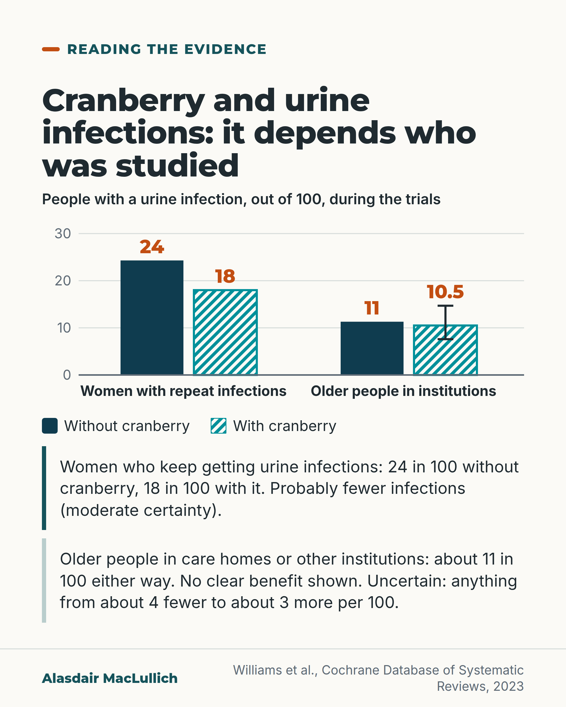

# G117: Cranberry: who the evidence covers

- Category: C12 Continence, bladder and bowels
- Audience: both
- Series: Reading the evidence
- Post type: evidence_interpretation
- Visual format: chart (grouped bars)
- Status: text text_final, visual final
- Working id: C12-P02 (candidate C12-23)

## Insight

The 2023 Cochrane review found cranberry products probably reduce repeat urine infections in women who keep getting them (about 18 in 100 against 24 in 100), but the trials in older people in institutions did not show a clear benefit (about 11 in 100 either way).

## Angle and position

A result applies to the kind of people who were studied. Care homes should not rely on cranberry to prevent infections in residents, and women with repeated infections can reasonably discuss it.

Basis: Mixed. Empirical finding: Cochrane 2023 results by group. Judgement, marked as such: do not rely on cranberry to prevent infections in care home residents; women with repeat infections can discuss it.

## X (613 characters)

```text
Cranberry products probably help women who keep getting urine infections, though the benefit could be small. In the trials, about 18 in 100 women taking cranberry had an infection over the time each trial followed them, against about 24 in 100 not taking it.

For older people living in care homes or other institutions, the trials did not show a clear benefit: about 11 in 100 had an infection with or without cranberry. The result is uncertain: the true effect could be anywhere from about 4 fewer to about 3 more infections per 100 people.

We should not rely on cranberry to prevent infections in a care home.
```

## LinkedIn (1779 characters)

```text
A 2023 Cochrane review of cranberry products combined the results of 50 trials with 8,857 people. Cochrane is a group that reviews the evidence from trials. The answer depends on who was studied.

Women who keep getting urine infections: cranberry products probably reduced infections. About 18 in 100 women taking cranberry had a symptomatic infection confirmed by a urine culture, over the time each trial followed them, compared with about 24 in 100 not taking it. The certainty was moderate, and the range of uncertainty means the benefit could be small.

Older people living in care homes or other institutions: three trials with 1,489 people did not show a clear benefit. About 11 in 100 had an infection with or without cranberry. The result is uncertain: the true effect could be anywhere from about 4 fewer to about 3 more infections per 100. The review rates how sure we can be as moderate in its summary table and as low in its discussion, so the fair reading is that cranberry may make little or no difference for this group.

The same review found cranberry products probably reduce infections in children and in people prone to infection after a medical intervention. Stomach side effects probably did not differ from a dummy treatment or no treatment. The estimate fits anything from no difference to about three-quarters more stomach side effects. Its authors concluded that the evidence supports cranberry for women with repeated infections, for children and for people prone to infection after procedures, and does not support it for older people in institutions.

A judgement from this: a care home should not rely on cranberry to prevent infections in its residents, and a woman who keeps getting infections could reasonably discuss cranberry with her doctor.
```

## Bluesky (299 characters)

```text
Cranberry products probably help women with repeat urine infections, maybe only a little: 18 in 100 women taking them had an infection, against 24 in 100 not. In older people in institutions, trials showed no clear benefit: about 11 in 100 either way. We should not rely on cranberry in a care home.
```

## Threads (480 characters)

```text
Cranberry products probably help women who keep getting urine infections, though the benefit could be small. Over the trials' follow-up, about 18 in 100 women taking cranberry had an infection, against about 24 in 100 not taking it.

In older people in institutions such as care homes, the trials showed no clear benefit: about 11 in 100 had an infection either way. It could be anywhere from about 4 fewer to about 3 more per 100.

We should not rely on cranberry in a care home.
```

## Source reply

Sources: https://doi.org/10.1002/14651858.CD001321.pub7 (Williams, Cochrane 2023); https://pubmed.ncbi.nlm.nih.gov/37947276/

## Visual



Alt text: Bar chart of urine infections per 100 people during trials. Women with repeat infections: 24 without cranberry, 18 with it (probably fewer, moderate certainty). Older people in institutions: about 11 without, about 10.5 with, no clear benefit, with a range line showing the result is uncertain. Cochrane review 2023.

Editable source: `visuals/src/G117.html`

Design instructions: Single card. Custom SVG grouped vertical bars on shared 0 to 30 axis: women 24.3 vs 18.0 (C12-23-b), institutions 11.3 vs 10.5 (C12-23-c) with whisker 7.6 to 14.7 on cranberry bar; dark teal solid vs teal hatched; orange value labels; legend; two bordered text blocks.

## Sources and verification

- C12-23-a (supported): The 2023 Cochrane review included 50 studies with 8,857 participants.
  - Source: Williams G, Stothart CI, Hahn D, Stephens JH, Craig JC, Hodson EM. Cranberries for preventing urinary tract infections. Cochrane Database Syst Rev. 2023;11(11):CD001321.
  - Passage: ""For this update, 26 new studies were added, bringing the total number of included studies to 50 (8857 randomised participants)."" (Abstract (Main results))
- C12-23-b (supported): In women with recurrent UTIs, cranberry products probably reduced symptomatic, culture-verified UTIs (RR 0.74, moderate certainty): about 18 in 100 vs 24 in 100.
  - Source: Williams G, Stothart CI, Hahn D, Stephens JH, Craig JC, Hodson EM. Cranberries for preventing urinary tract infections. Cochrane Database Syst Rev. 2023;11(11):CD001321.
  - Passage: "Abstract: "cranberry products probably reduced the risk of symptomatic, culture-verified UTIs in women with recurrent UTIs (8 studies, 1555 participants: RR 0.74, 95% CI 0.55 to 0.99; I² = 54%)". Summary of findings 1 (p. 6): "Symptomatic, culture-verified UTI - Women with recurrent UTI"; risk with placebo/control "243 per 1,000"; risk with any cranberry product "180 per 1,000 (134 to 241)"; "RR 0.74 (0.55 to 0.99)"; "1555 (8)"; "MODERATE 1"; footnote "1 Inconsistency: increased heterogeneity"." (Abstract; Summary of findings 1, pp. 6 to 7)
- C12-23-c (supported_with_qualification): In older people living in institutions, cranberry products may make little or no difference (3 studies, 1,489 participants, RR 0.93, 95% CI 0.67 to 1.30): about 11 in 100 with or without cranberry.
  - Source: Williams G, Stothart CI, Hahn D, Stephens JH, Craig JC, Hodson EM. Cranberries for preventing urinary tract infections. Cochrane Database Syst Rev. 2023;11(11):CD001321.
  - Passage: "Abstract: "However, there may be little or no benefit in elderly institutionalised men and women (3 studies, 1489 participants: RR 0.93, 95% CI 0.67 to 1.30; I² = 9%; moderate certainty evidence)". Summary of findings 1 (p. 6): "Elderly men and women in institutions"; risk with placebo/control "113 per 1,000"; risk with any cranberry product "105 per 1,000 (76 to 147)"; "RR 0.93 (0.67 to 1.30)"; "1489 (3)"; "MODERATE 2"; footnote "2 Imprecision: small studies and wide CIs". Quality of the evidence (p. 23): "was considered to be low for elderly men and women and for adults with bladder emptying issues because of imprecision and heterogeneity between studies". Implications for practice (p. 23): "The data did not support the use of cranberry products to reduce the risk of symptomatic UTIs in elderly men and women ... However, data in these latter groups are limited to small studies with considerable uncertainty around the results."" (Abstract; Summary of findings 1 p. 6; Discussion p. 23; Implications for practice p. 23)
- C12-23-d (supported): Cranberry products probably reduced UTIs in children and in people susceptible after an intervention; the review's conclusion supports use in women with recurrent UTIs, children and after interventions, not in older people, people with bladder emptying problems or pregnant women.
  - Source: Williams G, Stothart CI, Hahn D, Stephens JH, Craig JC, Hodson EM. Cranberries for preventing urinary tract infections. Cochrane Database Syst Rev. 2023;11(11):CD001321.
  - Passage: ""cranberry products probably reduced the risk of symptomatic, culture-verified UTIs in women with recurrent UTIs (8 studies, 1555 participants: RR 0.74, 95% CI 0.55 to 0.99; I² = 54%), in children (5 studies, 504 participants: RR 0.46, 95% CI 0.32 to 0.68; I² = 21%) and in people with a susceptibility to UTIs due to an intervention (6 studies, 1434 participants: RR 0.47, 95% CI 0.37 to 0.61; I² = 0%)." "These data support the use of cranberry products to reduce the risk of symptomatic, culture-verified UTIs in women with recurrent UTIs, in children, and in people susceptible to UTIs following interventions. The evidence currently available does not support its use in the elderly, patients with bladder emptying problems, or pregnant women." "The number of participants with gastrointestinal side effects probably does not differ between those taking cranberry products and those receiving a placebo or no specific treatment (10 studies, 2166 participants: RR 1.33, 95% CI 1.00 to 1.77; I² = 0%; moderate certainty evidence)."" (Abstract (Main results; Authors' conclusions))

Verification notes: All figures from the Cochrane 2023 abstract and Summary of findings table (full text): 50 studies, 8,857 participants; women with recurrent UTI RR 0.74 (0.55 to 0.99), 243 vs 180 per 1,000, moderate certainty; institutions 3 studies, 1,489 participants, RR 0.93 (0.67 to 1.30), 113 vs 105 per 1,000 (CI 76 to 147), so about 4 fewer to 3 more per 100. Certainty is moderate in abstract and table but low in the review's text; wording is 'did not show a clear benefit' and 'may make little or no difference'. Conclusions for children and post-intervention groups and the side-effect result from C12-23-d; no per-100 numbers given for them. C12-23-e (care homes routinely give cranberry) not found and not stated. 'Women who keep getting infections' used instead of 'living at home'. The invitation to follow is in the X and LinkedIn versions only.

## Attention and follow potential

Pause: A familiar remedy with a clear split: it probably helps one group and showed no clear benefit in the group many readers care about.

Gain: The numbers per 100 for each group, and a way to read any 'it works' claim: ask who was studied.

Follow: The closing line names the series and what it does: who a study covers and who it leaves out.

## Open issues

None.
