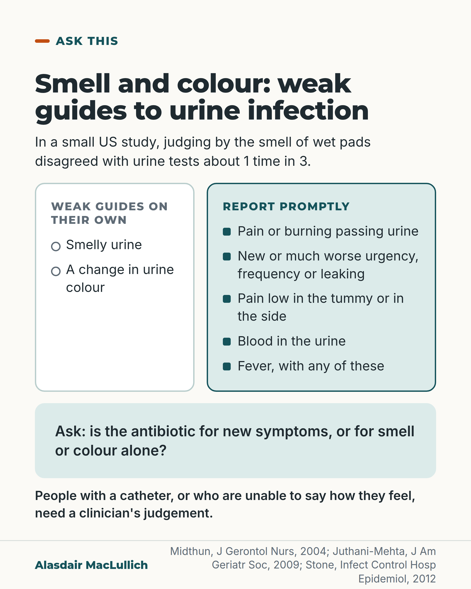

# G118: Smell and colour are weak guides to infection

- Category: C12 Continence, bladder and bowels
- Audience: both
- Series: Ask this
- Post type: evidence_interpretation
- Visual format: comparison card
- Status: text text_final, visual final
- Working id: C12-P03 (candidate C12-17)

## Insight

Smelly or changed-colour urine is a weak guide to urine infection on its own in older people; new urinary symptoms are what to report, and antibiotics for bacteria without symptoms brought more side effects and no clear benefit in care home trials.

## Angle and position

A widely held belief is tested with the evidence that points both ways: smell and colour changes raise the chance of laboratory signs a little, but those signs are common in people without infection.

Basis: Mixed. Empirical findings: Midthun 2004, Juthani-Mehta 2009, Lemoine 2018, Krzyzaniak 2022. Expert criteria: Stone 2012. Judgement, marked as such: smell or colour alone is too weak a reason to start antibiotics.

## X (1190 characters)

```text
Many people, including care staff, take smelly urine or a change in urine colour as a sign of infection. In a French survey of 444 treated episodes of suspected urine infection in 134 nursing homes, smelly urine was given as a reason in about 3 in 10.

Smell and colour alone are weak signs of infection. In a small US study of 97 wet pads, judging by smell disagreed with urine tests about 1 time in 3. Those tests find bacteria in the urine, which many residents have without any infection. A larger US study looked at residents already suspected of having an infection. When the urine had changed in colour or smell, or showed blood, laboratory signs of infection were found in about 47 in 100. When it had not, they were found in about 31 in 100. So a change raised the chance, but the same laboratory signs are common in residents with no infection.

Report new pain or burning passing urine, new or much worse urgency or leaking, pain low in the tummy or in the side, or blood in the urine, and fever with any of these. Ask whether antibiotics are being suggested for smell or colour alone. People with a catheter, or who are unable to say how they feel, need a clinician's judgement.
```

## LinkedIn (2156 characters)

```text
Many people, including care staff, take smelly urine or a change in urine colour as a sign of infection. In a French survey of 444 treated episodes of suspected urine infection in 134 nursing homes, smelly urine was given as a reason in about 3 in 10.

Smell and colour alone are weak signs of infection. In a small US study of 97 wet pads from nursing home residents, judging by smell disagreed with urine tests about 1 time in 3. The tests looked for bacteria in the urine, which many residents have without any infection, so this compares smell with a laboratory finding, not confirmed infection.

The result that went the other way: in a larger US nursing home study, when staff suspected an infection, laboratory signs of infection (bacteria plus white cells in the urine) were found in about 47 in 100 cases where the urine had changed in colour or smell or shown blood, and about 31 in 100 where it had not. So a change in the urine raised the chance of these signs, but the same laboratory signs are common in residents with no infection.

Infection experts wrote criteria for care homes. They note that changes in colour or smell often occur without infection, for example when someone is not drinking enough. Their criteria look for new urinary symptoms. These are pain or burning passing urine, new or much worse urgency, frequency or leaking, pain low in the tummy or in the side, visible blood in the urine, or fever with any of these. The authors say the criteria track infections across a care home and may not suit decisions such as starting antibiotics. People with a catheter, or who are unable to report symptoms, need separate judgement.

In care home trials, antibiotics for bacteria without symptoms cleared the bacteria more often but did not reduce deaths or complications, and caused more side effects (the estimate is very uncertain; one trial reported diarrhoea, rash and thrush). It also adds to unnecessary antibiotic use, which encourages resistant bacteria.

A judgement: smell or colour alone is too weak a reason to start antibiotics. Report new symptoms promptly, and ask whether antibiotics are for smell or colour alone.
```

## Bluesky (292 characters)

```text
Smelly or changed-colour urine is often read as infection, but smell and colour alone are weak signs: in one study smell disagreed with urine tests 1 time in 3. Report new pain or burning, urgency or leaking, low tummy or side pain, or blood. Ask if antibiotics are for smell or colour alone.
```

## Threads (495 characters)

```text
Smelly or changed-colour urine is often taken as a sign of infection. In a small US study of 97 wet pads, judging by smell disagreed with urine tests 1 time in 3. The tests can find bacteria that many residents have without infection.

Report new pain or burning, new urgency or leaking, low tummy or side pain, blood in the urine, or fever with any of these. Ask if antibiotics are for smell or colour alone. People with a catheter, or who can't say how they feel, need a clinician's judgement.
```

## Source reply

Sources: https://doi.org/10.3928/0098-9134-20040601-04 (Midthun 2004); https://doi.org/10.1111/j.1532-5415.2009.02227.x (Juthani-Mehta 2009); https://doi.org/10.1086/667743 (Stone 2012); https://doi.org/10.1016/j.medmal.2018.04.387 (Lemoine 2018); https://doi.org/10.3399/BJGP.2022.0059 (Krzyzaniak 2022); https://doi.org/10.1093/cid/ciy1121 (Nicolle 2019, IDSA)

## Visual



Alt text: Comparison card. Smell and colour of urine are weak guides to urine infection; wet pad smell disagreed with urine tests about 1 time in 3. Report promptly: pain or burning, new urgency, frequency or leaking, pain in the tummy or side, blood in urine, or fever. Ask whether an antibiotic is for new symptoms. Catheter users need clinician judgement.

Editable source: `visuals/src/G118.html`

Design instructions: Single card. Headline, intro line, two-column compare: left white with hollow markers (weak guides), right mint with solid markers (report promptly); mint ask panel; catheter note. No drawing. No chart data.

## Sources and verification

- C12-17-a (supported_with_qualification): In a study of 97 recently wet pads from nursing home residents, judging infection by urine odour disagreed with the laboratory result in about one third of cases.
  - Source: Midthun SJ, Paur R, Lindseth G. Urinary tract infections. Does the smell really tell? J Gerontol Nurs. 2004;30(6):4-9.
  - Passage: ""Ninety-seven recently wet incontinence pads of residents in six Midwestern nursing homes were evaluated for odor within 1 hour of voiding. These results were compared to microscopy and culture results of clean-catch urine samples from these individuals. Defining a UTI as either bacteriuria or bacteriuria and pyuria, using urine odor to identify a UTI resulted in error in one third of cases. Results of this study indicate smell of urine in incontinence pads may be an absent or misleading symptom for UTIs in elderly nursing home residents."" (Abstract)
- C12-17-b (supported_with_qualification): Changes in urine colour, smell or visible blood were only modestly linked with laboratory signs of infection in nursing home residents, and those laboratory signs do not by themselves mean infection.
  - Source: Juthani-Mehta M, Quagliarello V, Perrelli E, Towle V, Van Ness PH, Tinetti M. Clinical features to identify urinary tract infection in nursing home residents: a cohort study. J Am Geriatr Soc. 2009;57(6):963-70.
  - Passage: "Definition (Methods, p. 3): "change in character of urine (i.e., gross hematuria, change in color of urine, change in odor of urine)". Abstract: "After 178,914 person-days of follow-up, 228 participants had 399 episodes of clinically suspected UTI with a urinalysis and urine culture performed; 147 episodes (36.8%) had bacteriuria plus pyuria. The clinical features associated with bacteriuria plus pyuria were dysuria (relative risk (RR)=1.58, 95% confidence interval (CI)=1.10-2.03), change in character of urine (RR=1.42, 95% CI=1.07-1.79), and change in mental status (RR=1.38, 95% CI=1.03-1.74)." "Diagnostic uncertainty still remains for the vast majority of residents who meet only one clinical feature." Introduction (p. 2): "Thus, bacteriuria plus pyuria alone are not sufficient to make the diagnosis of UTI in a nursing home resident." Table 3 (p. 14, as read with Undermind): change in character of urine present in 144 of 399 episodes, of which 68 (47.2%) had bacteriuria plus pyuria, vs 79 of 255 (31.0%) without it." (Abstract; Methods p. 3; Introduction p. 2; Table 3 p. 14)
- C12-17-c (supported_with_qualification): Expert surveillance criteria for care homes note that changes in urine colour or odour often occur with harmless bacteria in the urine and other conditions such as dehydration, and require new urinary symptoms plus a positive culture to count a UTI.
  - Source: Stone ND, Ashraf MS, Calder J, Crnich CJ, Crossley K, Drinka PJ, et al. Surveillance definitions of infections in long-term care facilities: revisiting the McGeer criteria. Infect Control Hosp Epidemiol. 2012;33(10):965-77.
  - Passage: ""Acute change in mental status and change in the character of the urine (eg, change in color or odor) were each independently associated with bacteriuria (≥10^5 colony-forming units [cfu]/mL) plus pyuria (≥10 white blood cells per high-power field) in a prospective study of LTCF residents with clinically suspected UTI; however, these 2 symptoms are frequently demonstrated in the presence of asymptomatic bacteriuria due to other confounding clinical conditions, such as dehydration." "The revised definitions take into account the low probability of UTI in residents without indwelling catheters if localizing symptoms are not present, as well as the need for microbiologic confirmation for diagnosis." Table 5 criteria for residents without a catheter: "a. Acute dysuria or acute pain, swelling, or tenderness of the testes, epididymis, or prostate"; "b. Fever or leukocytosis ... and at least 1 of the following localizing urinary tract subcriteria: i. Acute costovertebral angle pain or tenderness; ii. Suprapubic pain; iii. Gross hematuria; iv. New or marked increase in incontinence; v. New or marked increase in urgency; vi. New or marked increase in frequency"; "c. In the absence of fever or leukocytosis, then 2 or more of the following localizing urinary tract subcriteria". For residents with a catheter: "a. Fever, rigors, or new-onset hypotension, with no alternate site of infection"; "c. New-onset suprapubic pain or costovertebral angle pain or tenderness". Note: "Pyuria does not differentiate symptomatic UTI from asymptomatic bacteriuria." Caveat: "the surveillance definitions presented here may not be adequate for real-time case finding, diagnosis, or clinical decision making (eg, antibiotic initiation)."" (Urinary Tract Infections section and Guiding Principles (PMC full text); Table 5, p. 17 (Undermind read_pdfs); superscripts restored from PDF)
- C12-17-e (supported_with_qualification): Bacteria in the urine without symptoms are common in care home residents; in trials, antibiotics for them brought no clear benefit in deaths or complications and more side effects.
  - Source: Krzyzaniak N, Forbes C, Clark J, Scott AM, Del Mar C, Bakhit M. Antibiotics versus no treatment for asymptomatic bacteriuria in residents of aged care facilities: a systematic review and meta-analysis. Br J Gen Pract. 2022;72(722):e649-58.; Nicolle LE, Gupta K, Bradley SF, Colgan R, DeMuri GP, Drekonja D, et al. Clinical practice guideline for the management of asymptomatic bacteriuria: 2019 update by the Infectious Diseases Society of America. Clin Infect Dis. 2019;68(10):e83-e110.
  - Passage: "Krzyzaniak 2022 abstract: "Asymptomatic bacteriuria (ASB) is common among residents of residential aged care facilities (RACFs)." "Nine randomised controlled trials, comprising 1391 participants were included; two of which used a placebo comparator, and the remaining seven used no therapy control groups. There was a relatively small number of studies assessed per outcome and an overall moderate risk of bias. Outcomes related to mortality, development of ASB, and complications were comparable between the two groups. Antibiotic therapy was associated with a higher number of adverse effects (four studies; 303 participants; risk ratio [RR] 5.62, 95% confidence interval [CI] = 1.07 to 29.55,= 0.04) and bacteriological cure (nine studies; 888 participants; RR 1.89, 95% CI = 1.08 to 3.32,= 0.03)." "The harms and lack of clinical benefit of antibiotic use for older patients in RACFs may outweigh the benefits." Full text (results): "Only Nicolle 1987 reported a breakdown of the types of adverse events experienced by participants. For the antibiotic group, these included: diarrhoea, rash, candidiasis, and swollen mouth. The corresponding comparator group (no therapy) reported only one side effect of dizziness." IDSA 2019 abstract: "Asymptomatic bacteriuria (ASB) is a common finding in many populations"." (Krzyzaniak abstract (PubMed) and Results (Scite full-text excerpt); Nicolle (IDSA) abstract)
- C12-17-f (supported): Treating bacteria in the urine without symptoms adds to unnecessary antibiotic use, which drives antibiotic resistance.
  - Source: Nicolle LE, Gupta K, Bradley SF, Colgan R, DeMuri GP, Drekonja D, et al. Clinical practice guideline for the management of asymptomatic bacteriuria: 2019 update by the Infectious Diseases Society of America. Clin Infect Dis. 2019;68(10):e83-e110.
  - Passage: ""In addition, antimicrobial treatment of ASB has been recognized as an important contributor to inappropriate antimicrobial use, which promotes emergence of antimicrobial resistance."" (Abstract)
- C12-17-h (supported): Nursing home staff commonly use smelly or cloudy urine as a reason to diagnose urine infection.
  - Source: Lemoine L, Dupont C, Capron A, Cerf E, Yilmaz M, Verloop D, et al. Prospective evaluation of the management of urinary tract infections in 134 French nursing homes. Med Mal Infect. 2018;48(5):359-64.; Juthani-Mehta M, Quagliarello V, Perrelli E, Towle V, Van Ness PH, Tinetti M. Clinical features to identify urinary tract infection in nursing home residents: a cohort study. J Am Geriatr Soc. 2009;57(6):963-70.
  - Passage: "Lemoine 2018: "Of 397 contacted facilities, 134 participated and informed 444 UTI episodes. Reported diagnostic criteria were burning urination (32%), malodorous urine (29%), confusion (28%), and turbid urine (19%). Twenty-one percent of diagnoses were based on erroneous criteria." Juthani-Mehta 2009 (Table 2, p. 13, via Undermind): change in character of urine was cited as a reason for suspecting UTI in 62 of 399 episodes (15.5%)." (Lemoine abstract; Juthani-Mehta Table 2)

Verification notes: C12-17-a (Midthun abstract): 97 pads, six US nursing homes, odour wrong in one third against bacteriuria or bacteriuria plus pyuria; stated as a comparison with a laboratory finding. C12-17-b (Juthani-Mehta full text): 68 of 144 (47 in 100) vs 79 of 255 (31 in 100) with bacteriuria plus pyuria; the feature combines colour, odour and visible blood; the post says 'raised the chance a little'. C12-17-c (Stone 2012 full text): criteria wording and the authors' caveat on clinical decisions carried. C12-17-e (Krzyzaniak 2022 plus IDSA abstract): no clear benefit in deaths or complications, more side effects (diarrhoea, rash, thrush from one trial), no multiplier given. C12-17-f (IDSA abstract): resistance. C12-17-h (Lemoine 2018): smelly urine reason in 29% of 444 treated episodes. C12-17-i used only as 'not drinking enough'. Not used: C12-17-d (UKHSA, not found), C12-17-g (C. difficile, not supported), cloudy urine, foods and medicines. The 'judgement' sentence is marked as such.

## Attention and follow potential

Pause: Opens on a belief readers recognise, then gives the result that points the other way so the correction is fair.

Gain: A list of symptoms worth reporting and one question to ask when antibiotics are suggested.

Follow: Shows the account states evidence that cuts against its own position.

## Open issues

None.
