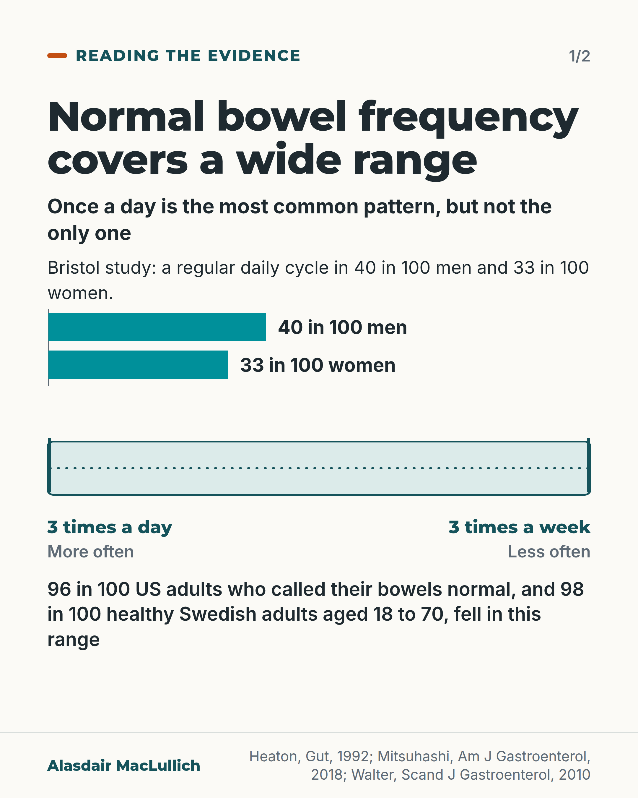
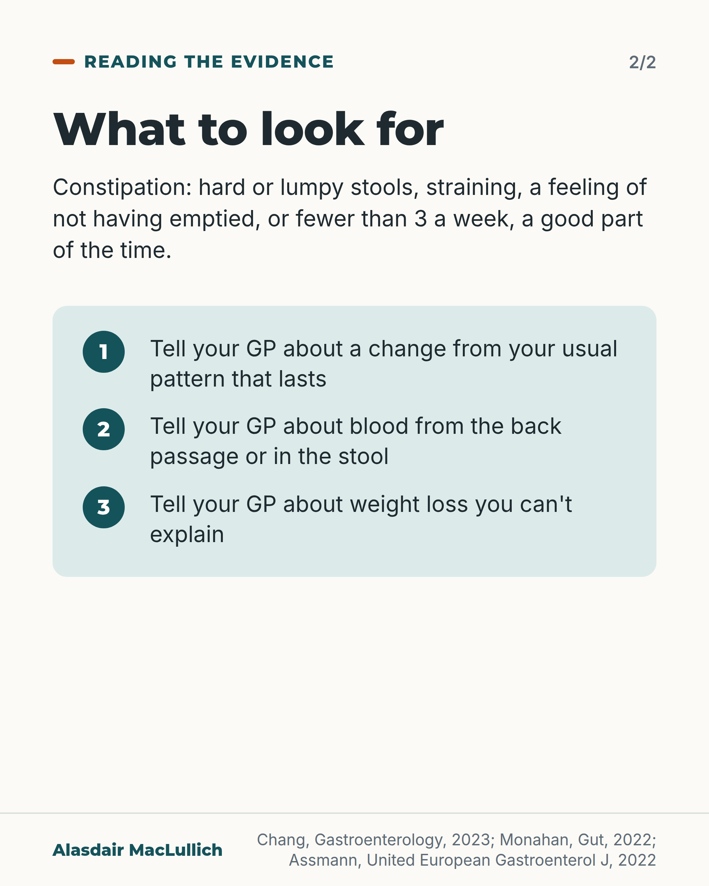

# G119: Once a day is one normal among many

- Category: C12 Continence, bladder and bowels
- Audience: public
- Series: Reading the evidence
- Post type: public_explanation
- Visual format: diagram (scale), 2 slides
- Status: text text_final, visual final
- Working id: C12-P04 (candidate C12-25)

## Insight

Opening the bowels once a day is the most common pattern but a minority one; nearly all adults with normal bowels go between 3 times a day and 3 times a week. A lasting change from your own pattern, blood or unexplained weight loss should be checked.

## Angle and position

Going less than once a day is not constipation on its own. The signals worth acting on are a lasting change from your own usual pattern, blood, or weight loss you can't explain.

Basis: Empirical findings (Bristol, NHANES, Popcol) plus guideline definitions and referral advice. No ethical judgement. The studies cover adults and say little about people in their 80s or 90s.

## X (845 characters)

```text
Once a day is the most common bowel pattern. In a 1992 Bristol study of about 1,900 adults, only 40 in 100 men and 33 in 100 women had a bowel movement every day. Most people did not follow a fixed daily pattern, and a third of the women went less often than once a day.

Among US adults who called their bowels normal, 96 in 100 went somewhere between 3 times a week and 3 times a day. A Swedish study of healthy adults aged 18 to 70 found the same range for 98 in 100. These studies do not tell us what is usual for people in their 80s or 90s.

GPs may use a simple stool test, called FIT, to help decide who needs urgent bowel tests. A normal result does not rule out a problem if symptoms last. Tell your GP about a change from your own usual pattern that lasts, blood from the back passage or in the stool, or weight loss you can't explain.
```

## LinkedIn (1600 characters)

```text
Once a day is the most common bowel pattern. In a random sample of about 1,900 adults in East Bristol (published in 1992), only 40 in 100 men and 33 in 100 women had a bowel movement every day. Most people did not follow a fixed daily pattern, and a third of the women went less often than once a day.

Two other studies describe the range in people with normal bowels. Among 4,775 US adults who said their bowel patterns were normal, 96 in 100 went between 3 times a week and 3 times a day. In a Swedish study of healthy adults aged 18 to 70, 98 in 100 fell in the same range. The US figure describes people who call their own bowels normal; it is not a line that separates healthy from unwell.

Doctors call it constipation when hard or lumpy stools, straining, or a feeling of not having emptied happen a good part of the time. Going fewer than 3 times a week for much of the time can also count. Going less than once a day is not constipation on its own, and some straining now and then is common in healthy people.

These studies cover adults. They do not tell us what is usual for people in their 80s or 90s.

Tell your GP about a change from your own usual pattern that lasts, blood from the back passage or in the stool, or weight loss you can't explain. UK specialist guidance recommends that GPs use a simple stool test, called FIT. It helps decide who needs urgent bowel tests. Changes in bowel habit and bleeding often have harmless causes, and the same guidance says people with lasting, unexplained symptoms and ongoing concern should still be referred, even after a normal test result.
```

## Bluesky (298 characters)

```text
Once a day is the most common bowel pattern. In a Bristol study only 40 in 100 men and 33 in 100 women went daily. Nearly all adults who called their bowels normal went 3 times a week to 3 times a day. Little is known for people in their 80s. See your GP about lasting change, blood or weight loss.
```

## Threads (463 characters)

```text
Once a day is the most common bowel pattern. In a Bristol study of about 1,900 adults, only 40 in 100 men and 33 in 100 women had a bowel movement every day.

Among US adults who called their bowels normal, 96 in 100 went between 3 times a week and 3 times a day. These studies say little about people in their 80s or 90s.

Tell your GP about a lasting change from your usual pattern, blood from the back passage or in the stool, or weight loss you can't explain.
```

## Source reply

Sources: https://doi.org/10.1136/gut.33.6.818 (Heaton 1992); https://doi.org/10.1038/ajg.2017.213 (Mitsuhashi 2018); https://doi.org/10.3109/00365520903551332 (Walter 2010); https://doi.org/10.1053/j.gastro.2023.03.214 (Chang 2023); https://doi.org/10.1136/gutjnl-2022-327985 (FIT guideline 2022); https://doi.org/10.1002/ueg2.12213 (Assmann 2022)

## Visual



Alt text: Chart and scale. Bristol study: a regular daily bowel cycle in 40 in 100 men and 33 in 100 women. A wide band from 3 times a day to 3 times a week held 96 in 100 US adults reporting normal bowels and 98 in 100 healthy Swedish adults. Arrows mark more often and less often.



Alt text: Text card. Constipation means hard or lumpy stools, straining, feeling not emptied, or fewer than 3 a week, a good part of the time. Three numbered points: tell your GP about a lasting change, blood from the back passage or in the stool, or unexplained weight loss.

Editable source: `visuals/src/G119.html`

Design instructions: 2-card carousel. Card 1: headline, kicker, Bristol bars 40 and 33 of 100 (C12-25-a), scale band between 3 times a day and 3 times a week with end labels, more/less often, 96/98 in 100 statement (C12-25-c). Card 2: definition and mint panel with three numbered GP items.

## Sources and verification

- C12-25-a (supported_with_qualification): In a random population sample of about 1,900 adults in East Bristol, going once a day was the most common bowel pattern but only a minority had a regular daily cycle; most people had irregular bowels and a third of women went less often than daily.
  - Source: Heaton KW, Radvan J, Cripps H, Mountford RA, Braddon FE, Hughes AO. Defecation frequency and timing, and stool form in the general population: a prospective study. Gut. 1992;33(6):818-24.
  - Passage: ""Because the range of bowel habits and stool types in the community is unknown we questioned 838 men and 1059 women, comprising 72.2% of a random stratified sample of the East Bristol population." "Although the most common bowel habit was once daily this was a minority practice in both sexes; a regular 24 hour cycle was apparent in only 40% of men and 33% of women. Another 7% of men and 4% of women seemed to have a regular twice or thrice daily bowel habit. Thus most people had irregular bowels. A third of women defecated less often than daily and 1% once a week or less."" (Abstract)
- C12-25-b (supported_with_qualification): Age made little difference to bowel frequency in adult population studies (apart from younger women in Bristol); these studies did not include people over about 70.
  - Source: Heaton KW, Radvan J, Cripps H, Mountford RA, Braddon FE, Hughes AO. Defecation frequency and timing, and stool form in the general population: a prospective study. Gut. 1992;33(6):818-24.; Walter SA, Kjellström L, Nyhlin H, Talley NJ, Agréus L. Assessment of normal bowel habits in the general adult population: the Popcol study. Scand J Gastroenterol. 2010;45(5):556-66.
  - Passage: "Heaton: "In women of child bearing age bowel habit and the spectrum of stool types were shifted towards constipation and irregularity compared with older women and three cases of severe slow transit constipation were discovered in young women. Otherwise age had little effect on bowel habit or stool type." Walter (Popcol): "Two hundred and sixty-eight randomly selected subjects between 18 and 70 years completed symptom diaries for one week" ... "We could not demonstrate any gender or age differences in terms of stool frequency, defecatory symptoms or abdominal bloating."" (Abstracts)
- C12-25-c (supported_with_qualification): Almost all adults with normal bowels go between three times a day and three times a week.
  - Source: Mitsuhashi S, Ballou S, Jiang ZG, Hirsch W, Nee J, Iturrino J, et al. Characterizing normal bowel frequency and consistency in a representative sample of adults in the United States (NHANES). Am J Gastroenterol. 2018;113(1):115-23.; Walter SA, Kjellström L, Nyhlin H, Talley NJ, Agréus L. Assessment of normal bowel habits in the general adult population: the Popcol study. Scand J Gastroenterol. 2010;45(5):556-66.
  - Passage: "Mitsuhashi (NHANES): "This study used data from adult participants who completed bowel health questions as part of the National Health and Nutrition Examination Survey (NHANES) in 2009-2010 and who reported normal bowel patterns (N=4,775)." "95.9% of the sample reported between 3 and 21 BMs per week." "The current findings bolster the common \"3 and 3\" metric of normal frequency (3 BMs/day to 3 BMs/week)". Walter (Popcol): "One hundred and twenty-four subjects had no organic gastrointestinal abnormality, IBS, or relevant medication; 98% of them had between three stools per day and three per week."" (Abstracts)
- C12-25-d (supported_with_qualification): Constipation is defined by a combination of symptoms (hard stools, straining, feeling of incomplete emptying, fewer than 3 bowel movements a week) rather than by not going every day; occasional straining is common in healthy people.
  - Source: Chang L, Chey WD, Imdad A, Almario CV, Bharucha AE, Diem S, et al. American Gastroenterological Association-American College of Gastroenterology Clinical Practice Guideline: pharmacological management of chronic idiopathic constipation. Gastroenterology. 2023;164(7):1086-106.; Walter SA, Kjellström L, Nyhlin H, Talley NJ, Agréus L. Assessment of normal bowel habits in the general adult population: the Popcol study. Scand J Gastroenterol. 2010;45(5):556-66.
  - Passage: "Chang (AGA-ACG guideline): "Two of these studies were multicenter trials conducted in Italy and enrolled participants aged 18–70 years with chronic constipation defined in accordance with the Rome criteria, that is, less than 2 bowel movements per week for at least 12 months or the presence of 2 or more of the following symptoms: <3 bowel movements per week, straining at defecation, sense of incomplete evacuation, and hard stools on at least 25% of occasions." "The third study was conducted in the United States and included 304 participants with chronic constipation based on modified Rome criteria, where participants reported <3 bowel movements per week for at least 3 months and one or more of the following: straining, lumpy or hard stools, and sensation of incomplete evacuation in >25% of defecations." Walter (Popcol): "Urgency was reported by 36%; straining by 47% and incomplete defecation by 46%." "Some degree of urgency, straining, and incomplete evacuation should be considered normal."" (Chang 2023: full text, Polyethylene Glycol, Summary of evidence; Walter 2010: Abstract)
- C12-25-e (supported_with_qualification): A lasting change in your usual bowel pattern, bleeding from the back passage or unexplained weight loss should be checked by a GP; in UK primary care a stool test (FIT) is now recommended to decide who needs urgent bowel investigation.
  - Source: Monahan KJ, Davies MM, Abulafi M, Banerjea A, Nicholson BD, Arasaradnam R, et al. Faecal immunochemical testing (FIT) in patients with signs or symptoms of suspected colorectal cancer (CRC): a joint guideline from the Association of Coloproctology of Great Britain and Ireland (ACPGBI) and the British Society of Gastroenterology (BSG). Gut. 2022;71(10):1939-62.; Assmann SL, Keszthelyi D, Kleijnen J, Anastasiou F, Bradshaw E, Brannigan AE, et al. Guideline for the diagnosis and treatment of faecal incontinence: a UEG/ESCP/ESNM/ESPCG collaboration. United European Gastroenterol J. 2022;10(3):251-86.
  - Passage: "Monahan (ACPGBI/BSG FIT guideline): "FIT provides an opportunity to effectively triage patients with bowel symptoms into two groups: those who require ‘Fast Track’ referral on an urgent suspected cancer pathway and lower risk patients who may potentially be managed in primary care." "We recommend that FIT should be used by primary care clinicians to prioritise patients with clinical features of CRC for referral for urgent investigation" "GRADE of evidence: low; Strength of recommendation: Strong." "Pathway for FIT in patients with signs or symptoms of a suspected diagnosis of colorectal cancer (CRC), including symptoms such as those with per rectal bleeding, and signs including iron deficiency anaemia." "We suggest that patients with an fHb <10 µg Hb/g but with persistent and unexplained symptoms for whom the GP has ongoing clinical concern should be referred to secondary care for evaluation" "Those with an anal/rectal mass or anal ulceration should be referred urgently from primary care without a FIT." Assmann (UEG guideline): "The presence of other diseases generally causing diarrhoea such as colorectal cancer, inflammatory bowel disease (IBD), coeliac disease, diabetes and prolapse should be ruled out, considering factors such as age at presentation and red flag features (weight loss, rectal blood loss, sudden change in stool consistency etc.)."" (Monahan 2022: full text (Background; Executive summary of recommendations; Figure 1 legend; Scope); Assmann 2022: full text (Diagnosis, History taking))

Verification notes: C12-25-a (Heaton 1992 abstract): about 1,900 adults, East Bristol, 40% of men and 33% of women regular 24-hour cycle, a third of women less often than daily; no age range stated and none claimed. C12-25-c (Mitsuhashi 2018 and Walter 2010 abstracts): 95.9% of 4,775 NHANES adults reporting normal patterns; 98% of 124 healthy Swedish adults aged 18 to 70; the range is attributed to those studies, not the Bristol study, and described as people who call their bowels normal. C12-25-b: not extended to people over about 70. C12-25-d (AGA-ACG guideline, Popcol): constipation described by combined symptoms 'a good part of the time', no set durations, not called the NHS definition. C12-25-e (FIT guideline 2022 full text, UEG 2022 full text): red-flag list and FIT; no NICE NG12 weeks or ages; normal FIT does not rule out a problem when symptoms last. C12-25-f (laxative overuse) not found and not used.

## Attention and follow potential

Pause: A reassuring, specific finding: a daily bowel habit is the most common pattern yet a minority one.

Gain: Permission not to worry about missing a day, and a clear list of changes to tell the GP about.

Follow: Shows careful use of population data, with its age limits stated.

## Open issues

None.
