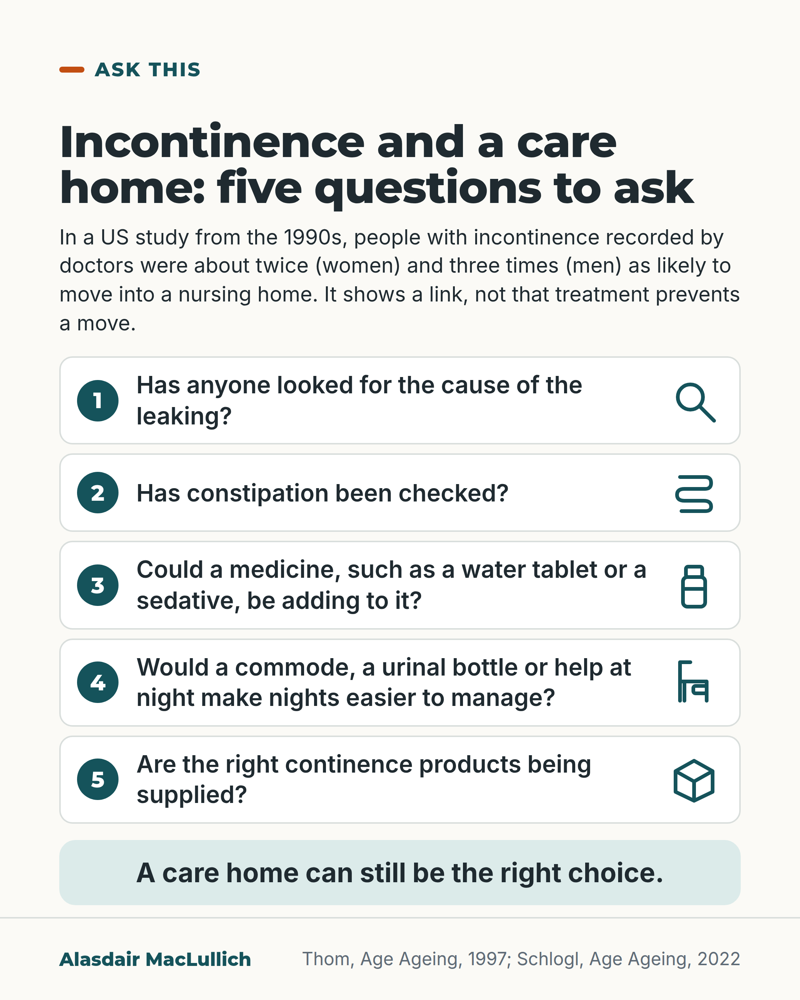

# G120: Questions to ask when incontinence is part of the care home discussion

- Category: C12 Continence, bladder and bowels
- Audience: public
- Series: Ask this
- Post type: decision_support
- Visual format: checklist or question card
- Status: text text_final, visual final
- Working id: C12-P05 (candidate C12-08)

## Insight

Incontinence is linked with moving into a care home. When it is part of why a care home is being discussed, a continence assessment can look for causes and options (medicines, constipation, getting to the toilet, equipment, products, help at night), though research on help at home is thin.

## Angle and position

Respects the person's preferences and the carer's limits: an assessment may find something that helps, and a care home can still be the right choice. Written strictly about assessment and treatment options.

Basis: Mixed. Empirical: the Thom 1997 association (US, 1990s), the UK carer interview study, the research gap at home. Judgement, marked as such: a continence assessment should be part of the discussion when incontinence is a main reason a care home is being considered. SCHEDULING: place well away from C03-12, which owns the timing argument.

## X (774 characters)

```text
Ask for a continence assessment (a check for the causes of leaking, and for what could help) when incontinence is part of why a care home is being discussed.

A US study from the 1990s followed about 6,000 people aged 65 and over. Women whose incontinence had been recorded by doctors were about twice as likely to move into a nursing home as women without it, and men about three times as likely, after allowing for age and other illnesses. This is a link in records. The study did not test whether treating incontinence prevents a move.

An assessment can look at medicines such as water tablets and sedatives, constipation, difficulty getting to the toilet, equipment, products and help at night. It may find something that helps, though research on help at home is thin.
```

## LinkedIn (1791 characters)

```text
Ask for a continence assessment (a check for the causes of leaking, and for what could help) when incontinence is part of why a care home is being discussed.

A US study followed about 6,000 people aged 65 and over. Women whose incontinence had been recorded by doctors were about twice as likely to move into a nursing home as women without it, and men about three times as likely, after allowing for age and other illnesses. These are relative figures; the published summary does not say how many in 100 moved. The data are from the 1990s. This is a link in records. The study did not test whether treating incontinence prevents a move.

In a UK interview study of 32 family carers of people with dementia, most said they held off asking health professionals for help with incontinence, and found access to continence products inconsistent.

Specialists in older people's care advise that clinicians ask about continence. They advise that an assessment looks for causes, usually with more than one professional. Some contributors can be looked for and changed: medicines such as water tablets and sedatives, difficulty getting to the toilet, and constipation. In one small before-and-after study of 52 older people, treating constipation was followed by less urgency and frequency of passing urine.

Research on help at home is thin. A 2024 review found only seven trials, and a 2012 review in dementia found too little evidence to recommend any approach. An assessment may find something that helps; it may not.

A judgement: when incontinence is a main reason a care home is being considered, a continence assessment should be part of the discussion. It can cover the cause, medicines, constipation, equipment such as a commode or urinal bottle, the products supplied, and help at night.
```

## Bluesky (296 characters)

```text
A 1990s US study found recorded incontinence linked with moving into a nursing home: women about twice as likely, men about three times, as people without it. That is a link only. If incontinence is part of a care home discussion, ask for a continence assessment (a check for causes and options).
```

## Threads (495 characters)

```text
Ask for a continence assessment (a check for causes of leaking) when incontinence is part of a care home discussion.

In a 1990s US study, women with recorded incontinence were about twice as likely to move into a nursing home as women without it, and men about three times as likely. This is a link; the study did not test whether treatment prevents a move.

An assessment can look at medicines, constipation, toilet access, equipment, products and night help. Research on help at home is thin.
```

## Source reply

Sources: https://doi.org/10.1093/ageing/26.5.367 (Thom 1997); https://doi.org/10.1186/1471-2318-11-75 (Drennan 2011); https://doi.org/10.1093/ageing/afac199 (Schlogl 2022); https://doi.org/10.1159/000052776 (Charach 2001); https://doi.org/10.1186/1471-2318-12-77 (Drennan 2012); https://doi.org/10.1093/ageing/afae126 (Buck 2024)

## Visual



Alt text: Question card with five numbered questions and small line icons: has anyone looked for the cause of leaking, constipation checked, could a medicine contribute, would a commode, urinal bottle or night help make nights easier, are the right products supplied. A US 1990s study links incontinence with nursing home moves. A care home can still be the right choice.

Editable source: `visuals/src/G120.html`

Design instructions: Single card. Headline, small link-not-cause note, five white rows each with number circle, question and teal line icon (magnifier, bowel, bottle, commode, box), mint closing panel. No people.

## Sources and verification

- C12-08-a (supported_with_qualification): Medically recognised incontinence was linked with higher adjusted risk of nursing home admission.
  - Source: Thom DH, Haan MN, Van Den Eeden SK. Medically recognized urinary incontinence and risks of hospitalization, nursing home admission and mortality. Age Ageing. 1997;26(5):367-74.
  - Passage: "The adjusted risk of admission to a nursing facility was 2.0 times greater for incontinent women (95% CI = 1.7-2.4) and 3.2 times greater for incontinent men (95% CI = 2.7-3.8)." (Abstract, Results)
- C12-08-b (supported_with_qualification): Family carers of people with dementia often do not seek professional help with incontinence until a crisis, and find product access inconsistent.
  - Source: Drennan VM, Cole L, Iliffe S. A taboo within a stigma? A qualitative study of managing incontinence with people with dementia living at home. BMC Geriatr. 2011;11:75.
  - Passage: "Most carers reported protecting the person's dignity by not seeking health professionals help often until the point of a crisis. ... carers report local health service policies on access to continence products to be inconsistent and often inappropriate to their circumstances." (Abstract, Results)
- C12-08-c (supported): Clinicians should ask about continence, and assessment should be comprehensive and multidisciplinary.
  - Source: Schlogl M, Umbehr MH, Habib MH, Wagg A, Gordon AL, Harwood R. Promoting continence in older people. Age Ageing. 2022;51(9):afac199.
  - Passage: "As a minimum, clinicians should actively ask patients about continence, especially in older adults living with frailty. Careful evaluation and establishment of any underpinning diagnosis and aetiological factors requires comprehensive, multimodal, usually multidisciplinary, assessment." (Abstract)
- C12-08-d (supported_with_qualification): Medicines, extra urine output, difficulty getting to the toilet and constipation can contribute to incontinence in older people.
  - Source: Drug-induced urinary incontinence. Prescrire Int. 2015;24(162):180,182.; Frank C, Szlanta A. Office management of urinary incontinence among older patients. Can Fam Physician. 2010;56(11):1115-20.; Charach G, Greenstein A, Rabinovich P, Groskopf I, Weintraub M. Alleviating constipation in the elderly improves lower urinary tract symptoms. Gerontology. 2001;47(2):72-6.
  - Passage: "Other causes do not directly affect the urinary system but are related to difficulties in reacting to the urge to urinate or getting to the toilet alone, or an increase in urine output. ... Drugs known to cause urinary incontinence are often prescribed for older patients ...: sedatives, neuroleptics, antidepressants, cholinesterase inhibitors used in Alzheimer's disease, diuretics, alpha blockers ... | Among older patients the effects of decreased cognition and impaired mobility can be substantial, and environmental barriers can play a role. When managing older patients with UI, emphasis on treating concurrent conditions, optimizing medications, and working on lifestyle and behavioural factors is at least as important as pharmacologic treatment. | Fewer patients reported urgency (16 versus 34, p < 0.001), frequency (25 versus 47, p < 0.001)" (Abstracts)
- C12-08-e (supported): Trial evidence for continence treatments delivered at home, especially in dementia, is limited.
  - Source: Buck J, Fromings Hill J, Collins R, Booth J, Fleming J. Effectiveness of non-pharmacological interventions delivered at home for urinary and faecal incontinence with homebound older people: systematic review of randomised controlled trials. Age Ageing. 2024;53(6):afae126.; Drennan VM, Greenwood N, Cole L, Fader M, Grant R, Rait G, et al. Conservative interventions for incontinence in people with dementia or cognitive impairment, living at home: a systematic review. BMC Geriatr. 2012;12:77.
  - Passage: "Two studies focusing on multicomponent behavioural interventions showed benefit ... Three, which included cognitively impaired people, reported improvement with toileting assistance programmes, but the effects were not all significant. ... There is scant evidence for continence supporting interventions delivered in older people's own homes. | There was insufficient evidence from any studies to recommend any strategies." (Abstracts)

Verification notes: C12-08-a (Thom 1997 abstract): 5,986 HMO members 65+, adjusted relative risk 2.0 (women) and 3.2 (men), written as 'about twice' and 'about three times' with 'allowing for age and other illnesses', a link, 1990s US. C12-08-b (Drennan 2011 abstract): 32 UK family carers; 'held off asking' used, 'harder than behavioural symptoms' dropped. C12-08-c (Schlogl 2022 abstract, expert review): ask about continence, comprehensive assessment. C12-08-d: medicines, difficulty getting to the toilet, constipation from three abstracts; the constipation study (Charach 2001, n=52) is described as small and before-and-after. C12-08-e: 7 trials (Buck 2024), insufficient evidence in dementia (Drennan 2012). Equipment, products and help at night are offered as questions to ask, not as proven treatments. Editor's rule applied: no timing-of-decision language. Schedule well away from C03-12.

## Attention and follow potential

Pause: Names a practical situation (incontinence is part of the care home discussion) and offers something to ask for.

Gain: Five concrete questions and an honest account of how thin the evidence for help at home is.

Follow: Shows the account gives practical questions that respect the family's choices.

## Open issues

- Scheduling: place well away from C03-12 (editor's instruction).
