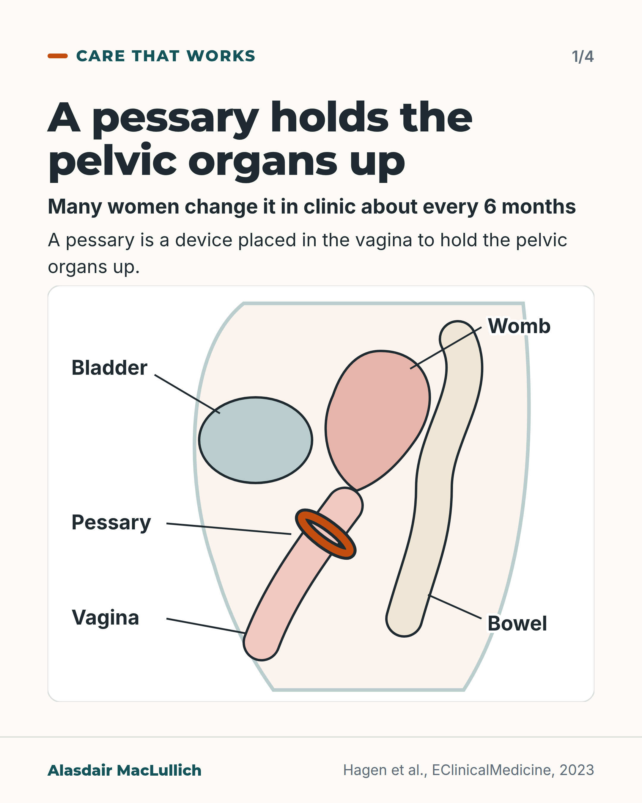
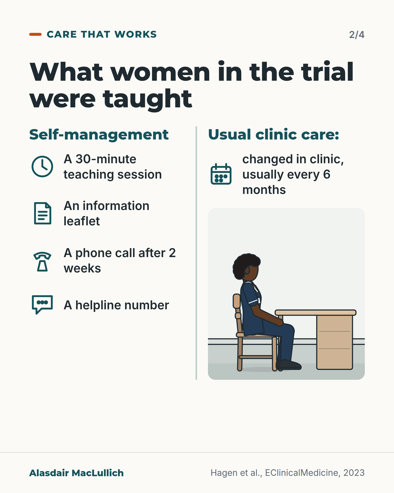
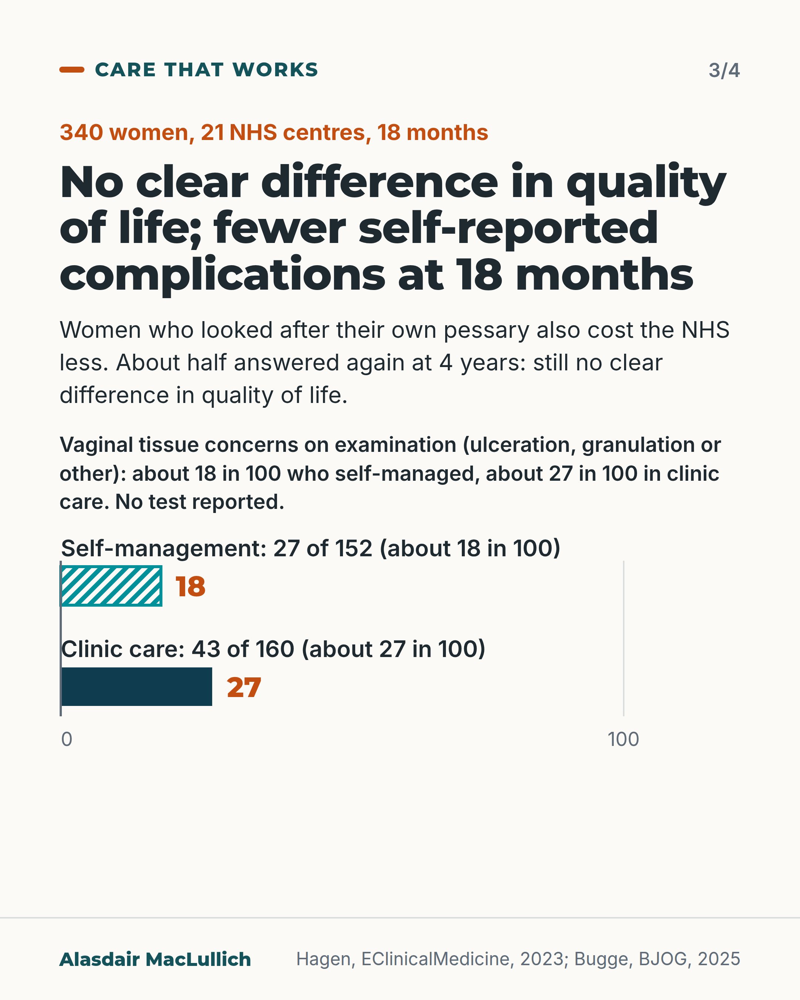
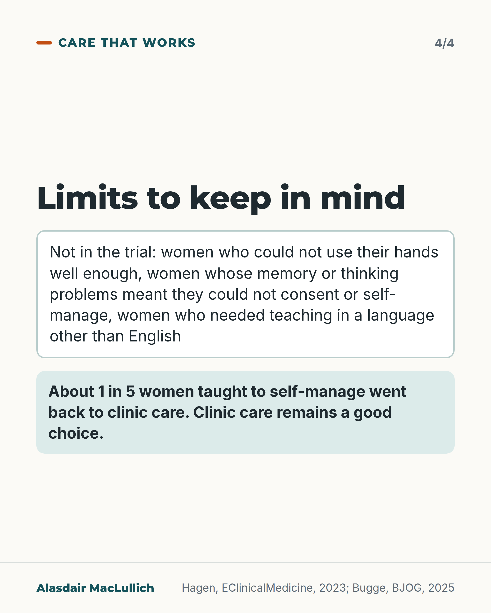

# G121: Looking after your own pessary

- Category: C12 Continence, bladder and bowels
- Audience: public
- Series: Care that works
- Post type: good_care
- Visual format: carousel (4 slides): labelled drawing, what was taught, results, limits
- Status: text text_final, visual final
- Working id: C12-P06 (candidate C12-36)

## Insight

In a UK trial of 340 women using a pessary for prolapse, learning to remove and replace it themselves showed no clear difference in quality of life at 18 months, fewer self-reported complications, and lower cost than clinic changes. The trial left out women who could not use their hands well enough, women with memory or thinking problems that prevented self-care, and women who needed teaching in another language.

## Angle and position

Respects agency and saves clinic trips for women who can and want to do it. Clinic care remains a good option, and many women prefer it.

Basis: Mixed. Empirical: TOPSY trial results at 18 months and 4 years, exclusions, switching. Judgement, marked as such: women who can manage should be offered the choice, and the choice of clinic care deserves respect.

## X (1187 characters)

```text
Women who use a pessary (a device placed in the vagina to hold the pelvic organs up) usually go back to clinic about every 6 months to have it changed. In a UK trial at 21 NHS centres, 340 women were randomly assigned to learn to do it themselves or to keep going to clinic.

At 18 months there was no clear difference in quality of life. Women who looked after their own pessary reported slightly fewer pessary problems on a questionnaire. The women knew which group they were in. On examination, fewer had sores or other concerns about the vaginal tissues: about 18 in 100 who looked after their own, against 27 in 100 in clinic care. The paper did not test whether that gap could be down to chance, so it is unclear whether it is real.

The trial left out women who could not use their hands well enough to remove a pessary, women whose memory or thinking problems meant they could not consent or self-manage, and women who needed teaching in a language other than English. About 1 in 5 women taught to self-manage went back to clinic care. Clinic care remains a good choice, and many women prefer it. If you use a pessary and think you could manage it, ask whether you can be taught.
```

## LinkedIn (2183 characters)

```text
Women who use a pessary (a device placed in the vagina to hold the pelvic organs up) usually go back to clinic about every 6 months to have it removed and replaced.

A UK trial randomly assigned 340 women at 21 NHS centres to self-management or usual clinic care. Self-management support was a 30-minute teaching session, a leaflet, a phone call after 2 weeks and a helpline. The women were typically in their mid-60s.

At 18 months there was no clear difference in quality of life between the two groups. Women who looked after their own pessary reported slightly fewer pessary problems on a questionnaire (women knew which group they were in), such as difficulty emptying the bladder or bowel. On examination, sores, raw or overgrown tissue or other concerns about the vaginal tissues were found in about 18 in 100 women who self-managed. In clinic care it was about 27 in 100 (27 of 152 against 43 of 160 examined). The paper does not report a test of this examination difference. Self-management cost the NHS less (about £578 per woman over 18 months, against £728) and was probably good value for money (about an 8 in 10 chance).

About half the women answered again at 4 years, so those results are less certain. There was still no clear difference in quality of life. The difference in reported pessary problems was similar in size but no longer clearly more than chance.

The limits: about 1 in 5 women taught to self-manage went back to clinic care during the trial, 11 of them because they could not remove the pessary. The trial left out three groups. They were women who could not use their hands well enough, women whose memory or thinking problems meant they could not consent or self-manage, and women who needed teaching in a language other than English. Results did not differ clearly by age (under or over 65), but the authors caution that they may apply less to older women who have used a pessary for a long time. Many women prefer clinic care, and that choice deserves respect.

If you use a pessary and think you could manage it yourself, ask whether you can be taught. The authors conclude that women who can self-manage should routinely be offered the choice.
```

## Bluesky (299 characters)

```text
In a UK trial of 340 women, some learned to manage their own pessary (a device holding up pelvic organs). At 18 months there was no clear difference in quality of life from clinic care, and slightly fewer problems. It left out women with poor hand use or memory problems. Ask if you could be taught.
```

## Threads (495 characters)

```text
Women who use a pessary (a device placed in the vagina to hold the pelvic organs up) usually have it changed in clinic about every 6 months. In a UK trial of 340 women, those taught to do it themselves had no clear difference in quality of life at 18 months compared with clinic care. They reported slightly fewer pessary problems.

The trial left out women with poor hand use or memory problems. Clinic care remains a good choice. If you could manage it yourself, ask whether you can be taught.
```

## Source reply

Sources: https://doi.org/10.1016/j.eclinm.2023.102326 (Hagen 2023, TOPSY); https://doi.org/10.1111/1471-0528.18333 (Bugge 2025, 4 years); https://doi.org/10.3310/NWTB5403 (Bugge 2024); https://doi.org/10.1016/j.jval.2024.03.004 (Manoukian 2024, costs)

## Visual



Alt text: Schematic side view of the pelvis with labels: a ring pessary sits in the vagina below the womb, with bladder in front and bowel behind. A pessary holds the pelvic organs up. Many women change it in clinic about every 6 months.



Alt text: Two columns. Self-management taught: a 30-minute session, a leaflet, a phone call after 2 weeks, a helpline number. Usual clinic care: changed in clinic, usually every 6 months, shown with a nurse seated at a desk.



Alt text: Trial of 340 women, 21 NHS centres, 18 months. No clear difference in quality of life; fewer self-reported complications. Bar chart: vaginal tissue concerns on examination 27 of 152 self-managing (about 18 in 100) and 43 of 160 clinic care (about 27 in 100). Self-management also cost the NHS less.



Alt text: Limits of the trial. Not included: women who could not use their hands well, women with memory or thinking problems who could not consent or self-manage, women needing teaching in another language. About 1 in 5 women taught to self-manage went back to clinic care. Clinic care remains a good choice.

Editable source: `visuals/src/G121.html`

Design instructions: 4-card carousel (original brief 3 cards; results split to avoid overcrowding). Card 1 schematic SVG pelvis side view with orange ring pessary and leader-line labels. Card 2 two lanes with teal line icons and a kit-drawn seated nurse (Black woman, navy tunic) at a desk. Card 3 hatched vs solid bars 17.8 and 26.9 (C12-36-c). Card 4 limits and 1 in 5 mint panel.

## Sources and verification

- C12-36-a (supported): The TOPSY trial randomised 340 women using a vaginal pessary for prolapse at 21 UK NHS centres to self-management (30-minute teaching session, leaflet, phone call at 2 weeks, helpline) or usual clinic-based care (clinic changes about every 6 months).
  - Source: Hagen S, Kearney R, Goodman K, Best C, Elders A, Melone L, et al. Clinical effectiveness of vaginal pessary self-management vs clinic-based care for pelvic organ prolapse (TOPSY): a randomised controlled superiority trial. EClinicalMedicine. 2023;66:102326.; Bugge C, Hagen S, Elders A, Mason H, Goodman K, Dembinsky M, et al. Clinical and cost-effectiveness of pessary self-management versus clinic-based care for pelvic organ prolapse in women: the TOPSY RCT with process evaluation. Health Technol Assess. 2024;28(23):1-121.
  - Passage: "Hagen 2023: "The requisite 340 women were randomised (169 SM, 171 CBC) across 21 centres." "SM group received a 30-min teaching session; information leaflet; 2-week follow-up call; and telephone support. CBC group received usual routine appointments." "Women in the clinic-based care group received usual care comprising appointments where their pessary was removed, cleaned and re-inserted or renewed by a healthcare professional. The frequency of appointments was determined by the usual practice of the centre, with most centres seeing women every 6 months." Bugge 2024 (plain language summary): "Women who use a vaginal pessary usually come back to clinic every 6 months to have their pessary removed and replaced; this is called clinic-based care. However, it is possible for a woman to look after the pessary herself; this is called self-management."" (Hagen 2023: Abstract (Findings, Methods) and full text (Procedures); Bugge 2024: plain language summary)
- C12-36-b (supported): At 18 months there was no clear difference in prolapse-related quality of life between self-management and clinic care.
  - Source: Hagen S, Kearney R, Goodman K, Best C, Elders A, Melone L, et al. Clinical effectiveness of vaginal pessary self-management vs clinic-based care for pelvic organ prolapse (TOPSY): a randomised controlled superiority trial. EClinicalMedicine. 2023;66:102326.; Bugge C, Hagen S, Elders A, Mason H, Goodman K, Dembinsky M, et al. Clinical and cost-effectiveness of pessary self-management versus clinic-based care for pelvic organ prolapse in women: the TOPSY RCT with process evaluation. Health Technol Assess. 2024;28(23):1-121.
  - Passage: "Hagen 2023: "There was not a statistically significant difference between groups in PFIQ-7 at 18 months (mean SM 32.3 vs CBC 32.5, adjusted mean difference SM-CBC -0.03, 95% CI -9.32 to 9.25)." "The confidence intervals also rule out any clinical difference between groups, the smallest assumed meaningful difference being 20 points." "Pessary self-management is cost-effective, does not improve or worsen QoL compared to CBC, and has a lower complication rate." Bugge 2024: "There was no group difference in prolapse-specific quality of life at 18 months (adjusted mean difference -0.03, 95% confidence interval -9.32 to 9.25)."" (Hagen 2023: Abstract (Findings, Interpretation) and full text (Primary outcome); Bugge 2024: Abstract)
- C12-36-c (supported_with_qualification): Women who self-managed reported fewer pessary complications at 18 months, including fewer problems emptying the bladder or bowel, and fewer vaginal tissue problems were found on examination.
  - Source: Hagen S, Kearney R, Goodman K, Best C, Elders A, Melone L, et al. Clinical effectiveness of vaginal pessary self-management vs clinic-based care for pelvic organ prolapse (TOPSY): a randomised controlled superiority trial. EClinicalMedicine. 2023;66:102326.
  - Passage: ""A lower percentage of pessary complications was reported in the SM group (mean SM 16.7% vs CBC 22.0%, adjusted mean difference -3.83%, 95% CI -6.86% to -0.81%)." "study-specific questionnaires for pessary complications (15 items, percentage of relevant items reported calculated for each participant)" "difficulties with emptying the bladder (17.7% vs 27.9%) and bowel (24.3% vs 36.4%) were more prevalent in the clinic-based care group, as were issues with vaginal tissues on examination at 18-month follow-up (17.8% vs 26.9%)." "Ulceration, granulation or other clinical concerns about the vaginal tissues (e.g., vaginal atrophy, erythema) on examination at 18 months were less common in the self-management group (27/152, 17.8% vs 43/160, 26.9%)."" (Abstract (Findings); full text (Outcomes; Secondary outcomes; Discussion))
- C12-36-d (supported_with_qualification): Self-management cost the NHS less and was likely to be cost-effective.
  - Source: Hagen S, Kearney R, Goodman K, Best C, Elders A, Melone L, et al. Clinical effectiveness of vaginal pessary self-management vs clinic-based care for pelvic organ prolapse (TOPSY): a randomised controlled superiority trial. EClinicalMedicine. 2023;66:102326.; Manoukian S, Mason H, Hagen S, Kearney R, Goodman K, Best C, et al. Cost-effectiveness of 2 models of pessary care for pelvic organ prolapse: findings from the TOPSY randomized controlled trial. Value Health. 2024;27(7):889-96.; Bugge C, Hagen S, Elders A, Mason H, Goodman K, Dembinsky M, et al. Clinical and cost-effectiveness of pessary self-management versus clinic-based care for pelvic organ prolapse in women: the TOPSY RCT with process evaluation. Health Technol Assess. 2024;28(23):1-121.
  - Passage: "Hagen 2023: "SM was less costly than CBC. The incremental net benefit of SM was £564 (SE £581, 95% CI -£576 to £1704)." Manoukian 2024: "There was no significant difference in the mean number of QALYs gained between SM and CBC (1.241 vs 1.221), but mean cost was lower for SM (£578 vs £728). The incremental net benefit estimated at a willingness to pay of £20 000 per QALY gained was £564, with an 80.8% probability of cost-effectiveness." "Results suggest that pessary SM is likely to be cost-effective." Hagen 2023 (Discussion): "Self-management was less costly than clinic-based care, and this was driven by less resource use and health-seeking behaviour in the self-management group."" (Hagen 2023: Abstract and Discussion; Manoukian 2024: Abstract)
- C12-36-e (supported_with_qualification): At 4 years (about half of women responding) there was still no clear difference in quality of life, fewer complications with self-management but not statistically clear, and self-management remained cost-effective.
  - Source: Bugge C, Kearney R, Best C, Goodman K, Manoukian S, Melone L, et al. Four year clinical and cost effectiveness of vaginal pessary self-management versus clinic-based care for pelvic organ prolapse (TOPSY): long term follow-up of a randomised controlled superiority trial. BJOG. 2025;132(12):1762-71.
  - Passage: ""Of 340 women randomised, 186 (55%) responded at 4 years (86/169 [51%] SM, 100/171 [58%] CBC). There was no statistically significant group difference in PFIQ-7 at 4 years (mean SM 32.9 vs. CBC 31.4, adjusted mean difference [AMD] SM-CBC 4.86, 95% CI −6.41 to 16.12). There was a statistically non-significant lower percentage of pessary complications for SM (SM 17.7% vs. CBC 22.0%, AMD 3.01 CI −0.58 to 6.61). At 4-years, SM was cost-effective (INB £2240)." "The probability SM is cost-effective was more than 92% at a willing-to-pay threshold of £20 000 per QALY gained" "Pessary continuation rates were high with 93% (173/186) of responders having used a pessary within the last 6 months" "Loss to follow-up of participants at 4 years did result in a loss of statistical power, which may explain the lack of a statistical difference in complications between the SM and CBC groups." "Of those randomised to the SM group and currently using a pessary, 80% (60/75) continued to self-manage (i.e., 15 crossed over to CBC) and 39% (35/90) currently using a pessary of the original CBC group had crossed over to self-manage by the 4-year follow-up"" (Abstract (Results); full text (Results 3.2 to 3.5; Strengths and Limitations))
- C12-36-f (supported): The trial excluded women with limited manual dexterity, cognitive impairment preventing consent or self-management, pregnancy, or who needed teaching in a language other than English.
  - Source: Hagen S, Kearney R, Goodman K, Best C, Elders A, Melone L, et al. Clinical effectiveness of vaginal pessary self-management vs clinic-based care for pelvic organ prolapse (TOPSY): a randomised controlled superiority trial. EClinicalMedicine. 2023;66:102326.; Bugge C, Kearney R, Best C, Goodman K, Manoukian S, Melone L, et al. Four year clinical and cost effectiveness of vaginal pessary self-management versus clinic-based care for pelvic organ prolapse (TOPSY): long term follow-up of a randomised controlled superiority trial. BJOG. 2025;132(12):1762-71.
  - Passage: "Hagen 2023: "Women were excluded if they had limited manual dexterity that would impede their ability to remove and replace their own pessary; were judged by their healthcare team to have a cognitive deficit such that it was not possible for them to give informed consent or to self-manage; were pregnant; or had insufficient understanding of English language (the self-management teaching was only available in English)." Bugge 2025: "Our participants predominately self-reported their ethnicity as White."" (Hagen 2023: full text (Participants); Bugge 2025: full text (Strengths and Limitations))
- C12-36-g (supported_with_qualification): Women in the trial were typically in their mid-60s; the effect did not differ clearly between women under and over 65; many eligible women preferred to stay with clinic care.
  - Source: Hagen S, Kearney R, Goodman K, Best C, Elders A, Melone L, et al. Clinical effectiveness of vaginal pessary self-management vs clinic-based care for pelvic organ prolapse (TOPSY): a randomised controlled superiority trial. EClinicalMedicine. 2023;66:102326.; Dwyer L, Rajai A, Dowding D, Kearney R. Understanding factors that affect willingness to self-manage a pessary for pelvic organ prolapse: a questionnaire-based cross-sectional study of pessary-using women in the UK. Int Urogynecol J. 2024;35(8):1627-34.
  - Passage: "Hagen 2023: "Women who were randomised were slightly younger (64 vs 67 years) and less likely to be an existing user (68% vs 80%) than those who were eligible but did not participate. This may mean the trial findings are less generalisable to older, existing pessary users. Although there were no significant subgroup effects relating to age or pessary user type, the direction of the effect favoured self-management for older and existing users" "Subgroup analysis of the primary outcome showed no significant effect of treatment group by subgroup interactions (subgroups were age <65 vs ≥65, p = 0.287" "Thirty-nine percent declined randomisation because they had a treatment preference (33% CBC, 6% SM)." "Thirty-four women (20.1%) crossed over from self-management to clinic-based care, including 11 women who had been unable to remove their pessary" Dwyer 2024: "Thirty-three women (38%) had previously been taught pessary self-management. Of the remaining women, 12 (21%) were willing to learn, 28 (50%) were not willing and 16 (29%) were unsure." "Younger women were more willing to learn self-management (p =  < 0.001)."" (Hagen 2023: full text (Results; Discussion); Dwyer 2024: Abstract)
- C12-36-h (supported_with_qualification): Women using a pessary who are able to manage it should be offered teaching to look after it themselves (position).
  - Source: Hagen S, Kearney R, Goodman K, Best C, Elders A, Melone L, et al. Clinical effectiveness of vaginal pessary self-management vs clinic-based care for pelvic organ prolapse (TOPSY): a randomised controlled superiority trial. EClinicalMedicine. 2023;66:102326.; Bugge C, Kearney R, Best C, Goodman K, Manoukian S, Melone L, et al. Four year clinical and cost effectiveness of vaginal pessary self-management versus clinic-based care for pelvic organ prolapse (TOPSY): long term follow-up of a randomised controlled superiority trial. BJOG. 2025;132(12):1762-71.
  - Passage: "Hagen 2023: "These findings support routinely offering women who can self-manage the option to do so. This is currently not widespread practice" "The UK Clinical Guideline for best practice in vaginal pessary use for prolapse recommends that women who are assessed to be willing and suitable should be offered self-management." Bugge 2025: "Clinical services should consider implementing robust self-management protocols for women with the capacity to self-manage."" (Hagen 2023: Research in context (Implications) and Discussion; Bugge 2025: Conclusion)

Verification notes: C12-36-a, -b, -c, -f, -g (Hagen 2023 full text): 340 women, 21 centres; PFIQ-7 difference -0.03 (95% CI -9.32 to 9.25) with a prespecified meaningful difference of 20; written as 'no clear difference in quality of life' per the editor (superiority trial). Complications: examination figures 27/152 (17.8%) vs 43/160 (26.9%) given as about 18 vs 27 in 100; the questionnaire percentage (16.7% vs 22.0%) is not turned into 'women with complications'. C12-36-d (Manoukian 2024; Hagen): costs about £578 vs £728 per woman, 'likely' cost-effective (80.8% probability at 18 months). C12-36-e (Bugge 2025 full text): 186 of 340 (55%) responded at 4 years; no clear difference in quality of life; complications lower but not statistically clear; 'fewer complications' is claimed only for 18 months. C12-36-f: exclusions carried on slide 3. C12-36-g: 'mid-60s', 'did not differ clearly', 34 (20.1%) switched, 11 could not remove it; cautions for long-term users. C12-36-h: authors' conclusion about offering the choice. The UK pessary guideline is not cited. English-only teaching and mainly White sample noted in the claim; the post says teaching in a language other than English was not included.

## Attention and follow potential

Pause: A routine clinic task most women are never offered the option to take over, in a trial of about 340 women with a UK NHS setting.

Gain: A question to ask a clinic (could I be taught?) and the honest limits that decide whether it suits a given woman.

Follow: Shows the account respects choice, and states who a trial left out.

## Open issues

None.
