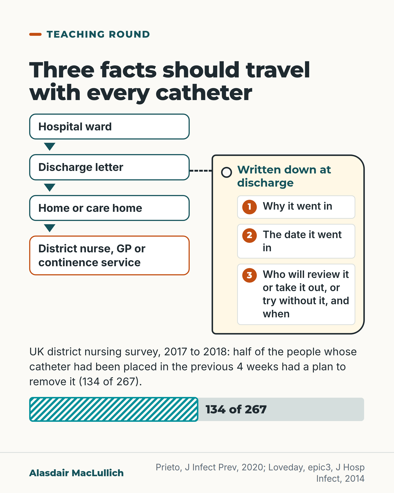

# G122: Every catheter needs a leaving date

- Category: C12 Continence, bladder and bowels
- Audience: practitioners
- Series: Teaching round
- Post type: teaching
- Visual format: diagram (timeline with a travelling tag)
- Status: text text_final, visual final
- Working id: C12-P07 (candidate C12-05)

## Insight

In a UK survey of district nursing caseloads, only half of people with a newly placed urinary catheter had any plan for removing it. National hospital guidance says the reason, date and removal plan should be documented and that nobody should be discharged or transferred with a short-term catheter without a plan.

## Angle and position

Each service can reasonably assume the next one owns the removal decision. Three written facts break that loop.

Basis: Mixed. Empirical: the CCaMa survey, and the longer-catheter-higher-risk background. Guideline (expert opinion, Class D/GPP): epic3 documentation and discharge recommendations. Judgement, marked as such: a catheter without a recorded reason and removal plan is an incomplete discharge. Inpatient reminder evidence is not applied to discharge or community.

## X (786 characters)

```text
In a 2017 to 2018 survey of 267 people on UK district nursing caseloads whose urinary catheter had been placed in the previous 4 weeks, only half had any plan for taking it out. A plan meant a review date, a date to try without it, or a referral to district nurses, urology or a continence service. The share with a plan ranged from 20 in 100 to 96 in 100 between organisations.

National guidance for NHS hospitals in England (epic3) says the record should state why the catheter went in, when, and the planned removal date, and that nobody should be discharged or transferred with a short-term catheter without a documented plan. The longer a catheter stays in, the higher the infection risk.

We should treat a catheter without a reason and a removal plan as an incomplete discharge.
```

## LinkedIn (2151 characters)

```text
In a 2017 to 2018 UK survey of 267 people on district nursing caseloads whose urinary catheter had been placed in the previous 4 weeks, only half (134) had any plan for taking it out. A plan meant a review date, a date to try without it, or a referral to district nurses, urology or a continence service. The share with a plan ranged from 20 in 100 to 96 in 100 between organisations. About 77 in 100 had a documented reason for the catheter.

National guidance for NHS hospitals in England (epic3, 2014) says the record should state why the catheter went in, the date, the expected duration and the planned date of removal, that the need should be checked every day, and that nobody should be discharged or transferred with a short-term catheter without a documented plan. It also says patients, relatives and carers should be told the reason and the plan for review and removal. These are expert-opinion recommendations, not trial results.

The longer a catheter stays in, the higher the risk of infection, and almost everyone with a catheter has bacteria in their urine within a month (bacteria in the urine are not the same as an infection). A review of 14 hospital studies looked at reminders and automatic stop orders together. They cut the rate of catheter infections by about half and shortened catheter use by about 2.6 days per patient. The shortening was clear for stop orders but not for reminders alone. Those studies were of hospital inpatients, most were before-and-after comparisons that tend to overestimate benefit, and the figure should not be applied to discharge, care homes or home care.

Some services use a catheter passport, a record the person keeps of why the catheter is there and the plan. In the survey, 13 in 100 (36 of 267) had one, and those who did were more likely to have a removal plan (78 in 100 against 46 in 100), though this does not show that the passport made the difference.

A judgement: when a catheter goes home or to a care home, three facts should go with it in writing. Why it went in, when, and who will review it or take it out, or try without it. A catheter without them is an incomplete discharge.
```

## Bluesky (265 characters)

```text
In a 2017 to 2018 UK survey of 267 people whose urinary catheter was placed in the previous 4 weeks, only half had a plan to remove it. National guidance says to record why it went in, when, and the removal plan. A catheter without those is an incomplete discharge.
```

## Threads (500 characters)

```text
In a 2017 to 2018 UK survey of district nursing caseloads, only half of 267 people with a catheter placed in the last 4 weeks had any plan for taking it out, such as a review date or a referral.

National hospital guidance (epic3) says to record why the catheter went in, when, and the removal date, and not to discharge anyone with a short-term catheter without a documented plan. Longer catheter use raises infection risk.

A catheter without a reason and a removal plan is an incomplete discharge.
```

## Source reply

Sources: https://doi.org/10.1177/1757177420901550 (Prieto 2020, CCaMa survey); https://doi.org/10.1016/S0195-6701(13)60012-2 (epic3 2014); https://doi.org/10.1086/655133 (Meddings 2010)

## Visual



Alt text: Flow from hospital ward to discharge letter to home or care home to district nurse, GP or continence service, with a tag marked written down at discharge listing three facts: why the catheter went in, the date, and who will review or remove it and when. A bar shows 134 of 267 new catheters had a removal plan.

Editable source: `visuals/src/G122.html`

Design instructions: Single card. Vertical flow of four boxes, luggage-style cream tag with three numbered fields joined by dashed line to the discharge letter step, body text and half-bar 134 of 267 hatched (C12-05-e). No people.

## Sources and verification

- C12-05-a (supported): Duration of catheterisation is the main risk factor for catheter-associated urinary tract infection; almost everyone with a catheter develops bacteria in the urine within a month.
  - Source: Loveday HP, Wilson JA, Pratt RJ, Golsorkhi M, Tingle A, Bak A, et al. epic3: national evidence-based guidelines for preventing healthcare-associated infections in NHS hospitals in England. J Hosp Infect. 2014;86 Suppl 1:S1-70.; Meddings J, Rogers MAM, Macy M, Saint S. Systematic review and meta-analysis: reminder systems to reduce catheter-associated urinary tract infections and urinary catheter use in hospitalized patients. Clin Infect Dis. 2010;51(5):550-60.
  - Passage: "epic3: "After a few days of catheterisation, microorganisms may be isolated from urine and, in the absence of any symptoms of UTI, this is called 'bacteriuria'. The duration of catheterisation is the dominant risk factor for CAUTI, and virtually all catheterised patients develop bacteriuria within 1 month." Meddings 2010 abstract: "Prolonged catheterization is the primary risk factor for catheter-associated urinary tract infection (CAUTI)."" (epic3 short-term urethral catheters background (PMC full text); Meddings abstract (background))
- C12-05-b (supported_with_qualification): In hospital studies, reminders and stop orders to remove catheters cut the rate of catheter-associated UTI by about half.
  - Source: Meddings J, Rogers MAM, Macy M, Saint S. Systematic review and meta-analysis: reminder systems to reduce catheter-associated urinary tract infections and urinary catheter use in hospitalized patients. Clin Infect Dis. 2010;51(5):550-60.; Loveday HP, Wilson JA, Pratt RJ, Golsorkhi M, Tingle A, Bak A, et al. epic3: national evidence-based guidelines for preventing healthcare-associated infections in NHS hospitals in England. J Hosp Infect. 2014;86 Suppl 1:S1-70.
  - Passage: "Meddings abstract: "Only interventional studies that used reminders to physicians or nurses that a urinary catheter was in use or stop orders to prompt catheter removal in hospitalized adults were included." "The rate of CAUTI (episodes per 1000 catheter-days) was reduced by 52% (P < .001) with use of a reminder or stop order. The mean duration of catheterization decreased by 37%, resulting in 2.61 fewer days of catheterization per patient in the intervention versus control groups" "Recatheterization rates were similar in control and intervention groups." epic3: "It included 14 studies (one RCT, one NRCT, three controlled before-after studies and nine uncontrolled before-after studies)." "Many studies in this area are uncontrolled before-after designs and therefore susceptible to bias in favour of the intervention."" (Meddings abstract (Methods, Results); epic3 evidence synopsis for UC23)
- C12-05-c (supported): UK national guidance recommends documenting the reason for a catheter, date of insertion, expected duration and planned date of removal, and reviewing the need daily.
  - Source: Loveday HP, Wilson JA, Pratt RJ, Golsorkhi M, Tingle A, Bak A, et al. epic3: national evidence-based guidelines for preventing healthcare-associated infections in NHS hospitals in England. J Hosp Infect. 2014;86 Suppl 1:S1-70.
  - Passage: ""UC2 Document the clinical indication(s) for catheterisation, date of insertion, expected duration, type of catheter and drainage system, and planned date of removal. Class D/GPP" "UC3 Assess and record the reasons for catheterisation every day. Remove the catheter when no longer clinically indicated. Class D/GPP"" (epic3, Short-term indwelling urethral catheters recommendations UC2, UC3)
- C12-05-d (supported_with_qualification): UK guidance says no patient should be discharged or transferred with a short-term catheter without a documented plan, and patients and families should be told the reason and the plan for review and removal.
  - Source: Loveday HP, Wilson JA, Pratt RJ, Golsorkhi M, Tingle A, Bak A, et al. epic3: national evidence-based guidelines for preventing healthcare-associated infections in NHS hospitals in England. J Hosp Infect. 2014;86 Suppl 1:S1-70.
  - Passage: ""UC24 No patient should be discharged or transferred with a short-term indwelling urethral catheter without a plan documenting the: New recommendation Class D/GPP" "UC22 Ensure patients, relatives and carers are given information regarding the reason for the catheter and the plan for review and removal. If discharged with a catheter, the patient should be given written information and shown how to: Class D/GPP"" (epic3, recommendations UC22 and UC24 (list items after the colon lost in the PMC text))
- C12-05-e (supported): In a UK survey, only half of people with a newly placed catheter on district nursing caseloads had a plan for its removal.
  - Source: Prieto J, Wilson J, Bak A, Denton A, Flores A, Lusardi G, et al. A prevalence survey of patients with indwelling urinary catheters on district nursing caseloads in the United Kingdom: the Community Urinary Catheter Management (CCaMa) Study. J Infect Prev. 2020;21(4):129-35.
  - Passage: "Abstract: "A total of 49,575 patients were included in the survey, of whom 5352 had an indwelling urinary catheter." "Of catheters, 5% were newly placed (within four weeks). Of these, most (77%) had a documented indication for insertion. Only half of patients with a newly placed catheter had a plan for its removal. This varied between organisations in the range of 20%–96%." Full text: "An active removal plan was defined as a plan that included one or more of the following: (1) a date for review of the ongoing need for the catheter; (2) a date for removal of the catheter ('trial without catheter' [TWOC]); and (3) referral to DN/urology/continence service." "Only half (134/267 [50%]) of patients had an active plan for the removal of the catheter. Patients were more likely to have an active removal plan if discharged from urology (23/34 [67%]) or A&E (11/13 [85%]; P = 0.024)." Discussion: "Given the high proportion of newly catheterised patients discharged from hospital without an active plan for removal of the catheter, the establishment of an optimal management pathway ... should be the focus of future prevention efforts."" (Abstract (Findings); Methods, Results and Discussion (Scite full-text excerpts))
- C12-05-f (supported_with_qualification): Catheter passports recording the indication and removal plan are used in the NHS, but only by a minority.
  - Source: Prieto J, Wilson J, Bak A, Denton A, Flores A, Lusardi G, et al. A prevalence survey of patients with indwelling urinary catheters on district nursing caseloads in the United Kingdom: the Community Urinary Catheter Management (CCaMa) Study. J Infect Prev. 2020;21(4):129-35.; Thornley T, Ashiru-Oredope D, Beech E, Howard P, Kirkdale CL, Elliott H, et al. Antimicrobial use in UK long-term care facilities: results of a point prevalence survey. J Antimicrob Chemother. 2019;74(7):2083-90.
  - Passage: "Prieto 2020: "Only 13% of patients had a patient-held management plan or 'catheter passport' but these patients were significantly more likely to also have an active removal plan (28/36 [78%] vs. 106/231 [46%];< 0.0001)." Thornley 2019: "Data were analysed for 17909 residents in 644 LTCFs across the UK." "7.1% of LTCFs reported use of a catheter passport scheme."" (Prieto abstract; Thornley abstract)

Verification notes: C12-05-e (Prieto 2020 full text): 134 of 267 (50%) with an active removal plan, range 20% to 96%, 77% with a documented indication, survey Nov 2017 to Jan 2018, voluntary organisations, not all catheters from hospital (stated as 'newly placed'). C12-05-c and -d (epic3 full text): UC2, UC3, UC22, UC24; Class D/GPP; the UC24 list is not quoted. C12-05-a (epic3 background; Meddings background): duration dominant risk factor; bacteriuria within a month (not infection). C12-05-b (Meddings 2010 abstract; epic3 synopsis): 52% reduction in CAUTI rate and 2.61 fewer catheter days, hospital inpatients, mostly before-after studies; not applied to discharge or community. C12-05-f: passport 13% (36/267), 78% vs 46%, association only; 'some services' used, no national passport verified. The 'incomplete discharge' sentence is the post's judgement and is marked as such.

## Attention and follow potential

Pause: A UK figure that half of newly catheterised people on district nursing caseloads had no removal plan.

Gain: Three facts to write down at handover, with the national guidance behind them.

Follow: Shows the account keeps inpatient evidence separate from discharge and community care.

## Open issues

None.
