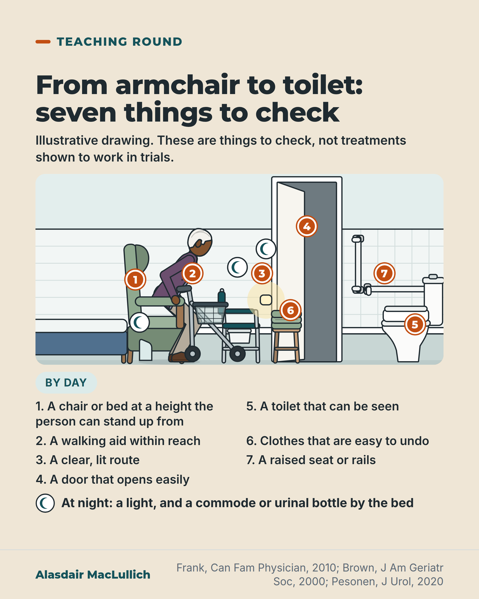

# G123: From the urge to the seat

- Category: C12 Continence, bladder and bowels
- Audience: both
- Series: Teaching round
- Post type: teaching
- Visual format: annotated scene (drawn cutaway with numbered callouts)
- Status: text text_final, visual final
- Working id: C12-P08 (candidate C12-11)

## Insight

Some leaks happen because the toilet is hard to reach or use. A continence assessment in an older person should include watching them get from chair or bed to the toilet, by day and by night.

## Angle and position

Looks at the route as well as the bladder. Offered as a practical checklist, not as trial-proven treatments, with two research links (urgency leaking and falls; getting up at night and falls) stated as links.

Basis: Mixed. Empirical: reviews on causes, the Brown 2000 and Pesonen 2020 associations. Judgement, marked as such: a continence assessment should include watching the journey to the toilet, and the checklist items are things to check rather than proven treatments.

## X (1077 characters)

```text
Some leaks happen because the toilet is hard to reach or hard to use: slow walking, memory problems, or the layout of the route and room. Getting there in time means standing up, walking, opening a door, finding the toilet, undoing clothes and sitting down.

Two links from research. In a US study of about 6,000 older women, leaking after a sudden strong need to pass urine at least weekly was linked with more falls and fractures over about 3 years than in women without it. Getting up at night to pass urine is also linked with falls. Neither link shows cause.

We should include watching someone make that trip, from chair or bed to toilet, by day and by night, in a continence assessment (a check for the causes of leaking). Check the chair height, whether a walking aid is within reach, and whether the route is clear and lit. Check that the door opens easily and clothes are easy to undo. At night, check for a commode or urinal bottle. No trial evidence was found for each of these changes on its own.

Ask for the trip to the toilet to be watched, by day and by night.
```

## LinkedIn (1550 characters)

```text
Some leaks happen because the toilet is hard to reach or hard to use: slow walking, memory problems, or the route and room itself. Getting there in time is a sequence: standing up from a chair or bed, walking, opening a door, finding the toilet, undoing clothes and sitting down.

A judgement: a continence assessment (a check for the causes of leaking) in an older person should include watching the person make that trip, by day and by night. Practical things to check are the height of the chair or bed, whether the walking aid is within reach, and a clear and lit route. Also check that the door opens easily, the toilet can be seen, clothes are easy to undo, and a raised seat or rails are in place. At night, check for a light and a commode or urinal bottle by the bed. No trial evidence was found for each of these changes on its own.

Two links from research. In a US study of about 6,000 women (average age 78), leaking after a sudden strong need to pass urine, at least weekly, was linked with more falls and fractures over about 3 years; leaking on coughing was not. The authors suggested that rushing to the toilet may contribute, which was not tested. A review of nine studies found that getting up at night to pass urine is linked with a somewhat higher risk of falls than in people who do not get up at night; whether it causes falls is uncertain.

If you or someone you care for leaks on the way to the toilet, describe the whole route to the doctor or nurse, not only the bladder. A problem with one step may be what needs to change.
```

## Bluesky (290 characters)

```text
Some leaks happen because the toilet is hard to reach or use: slow walking, memory problems, the route or room. We should include watching the trip from chair or bed to toilet, by day and night, in a continence assessment (a check for the causes of leaking). Ask for the trip to be watched.
```

## Threads (480 characters)

```text
Some leaks happen because the toilet is hard to reach or use: slow walking, memory problems, the route or room.

A continence assessment (a check for causes of leaking) should include watching the trip from chair or bed to toilet, by day and night. Check the chair height, walking aid within reach, a clear lit route, a door that opens easily, clothes that are easy to undo, and a commode or bottle at night. No trial has tested each change alone.

Ask for the trip to be watched.
```

## Source reply

Sources: https://pubmed.ncbi.nlm.nih.gov/21075990/ (Frank 2010); https://doi.org/10.1111/j.1532-5415.2000.tb04744.x (Brown 2000); https://doi.org/10.1097/JU.0000000000000459 (Pesonen 2020)

## Visual



Alt text: Cutaway drawing of a home. An older man with white hair rises from a green armchair beside a bed, with a four-wheeled walker in reach. A night light lights the hall, a bay door opens to a bathroom with a raised toilet seat and grab rails. Seven numbered markers match seven things to check; a commode and urinal bottle by the bed are marked for night.

Editable source: `visuals/src/G123.html`

Design instructions: Single sand card. Kit-drawn cutaway on 1000x560 viewBox: bedroom (domestic bed, armchair, older man with brown skin and white hair rising, rollator, commode, urinal bottle), hall (night light, stool with folded clothes), bathroom (open door, raised seat toilet with grab rails). Seven orange pins, three moon markers for night. Key in two columns below, By day badge, night line.

## Sources and verification

- C12-11-a (supported): Incontinence can arise from difficulty reaching or using the toilet (mobility, cognition, environment).
  - Source: Drug-induced urinary incontinence. Prescrire Int. 2015;24(162):180,182.; Frank C, Szlanta A. Office management of urinary incontinence among older patients. Can Fam Physician. 2010;56(11):1115-20.
  - Passage: "Other causes do not directly affect the urinary system but are related to difficulties in reacting to the urge to urinate or getting to the toilet alone ... | Among older patients the effects of decreased cognition and impaired mobility can be substantial, and environmental barriers can play a role." (Abstracts)
- C12-11-b (supported_with_qualification): Weekly urge incontinence linked with falls and fractures in older women.
  - Source: Brown JS, Vittinghoff E, Wyman JF, Stone KL, Nevitt MC, Ensrud KE, et al. Urinary incontinence: does it increase risk for falls and fractures? J Am Geriatr Soc. 2000;48(7):721-5.
  - Passage: "weekly or more frequent urge incontinence was associated independently with risk of falling (odds ratio = 1.26; 95% confidence interval (CI), 1.14-1.40) and with non-spine nontraumatic fracture (relative hazard 1.34 ...). Stress incontinence was not associated independently with falls or fracture." (Abstract)
- C12-11-c (supported_with_qualification): Night-time toilet trips (nocturia) are linked with falls.
  - Source: Pesonen JS, Vernooij RWM, Cartwright R, et al. The impact of nocturia on falls and fractures: a systematic review and meta-analysis. J Urol. 2020;203(4):674-83.
  - Passage: "Nocturia is probably associated with an approximately 1.2-fold increased risk of falls ... We rated the quality of evidence for nocturia as a prognostic factor as moderate for falls ... and as very low as a cause of falls/fractures." (Abstract)

Verification notes: C12-11-a (Frank 2010, Prescrire 2015 abstracts): leaks can arise from difficulty reaching or using the toilet; not quantified, no 'one broken link' claim. C12-11-b (Brown 2000 abstract): 6,049 women, mean age 78.5, weekly urge incontinence linked with falls (OR 1.26) and fractures; stress incontinence not; the OR is not turned into 'times'; 'rushing' is the authors' suggestion. C12-11-c (Pesonen 2020 abstract): nocturia linked with about 1.2-fold increased risk of falls (not quoted as a multiplier), whether causal is uncertain. C12-11-d: partly supported; the adaptations are presented as things to check, not as trial-proven. Earlier posts E072 and E084 treat the route to the toilet as a falls issue; this post treats it as part of a continence assessment.

## Attention and follow potential

Pause: Shifts the question from 'what is wrong with the bladder?' to 'can the person get there?', which readers can check at home.

Gain: A concrete checklist for the route to the toilet by day and night, with honest labelling of its evidence.

Follow: Shows the account turns reviews into practical checks and says what is and is not proven.

## Open issues

None.
