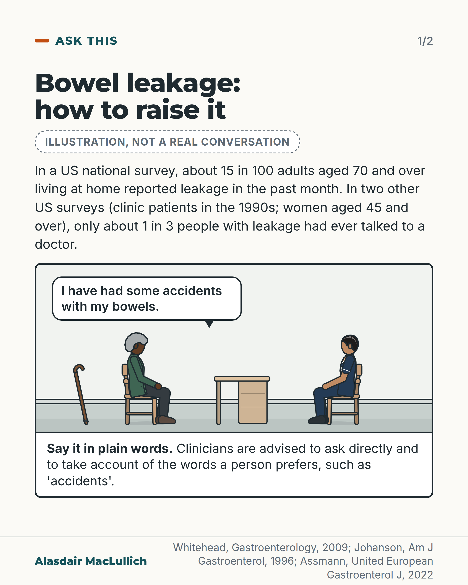
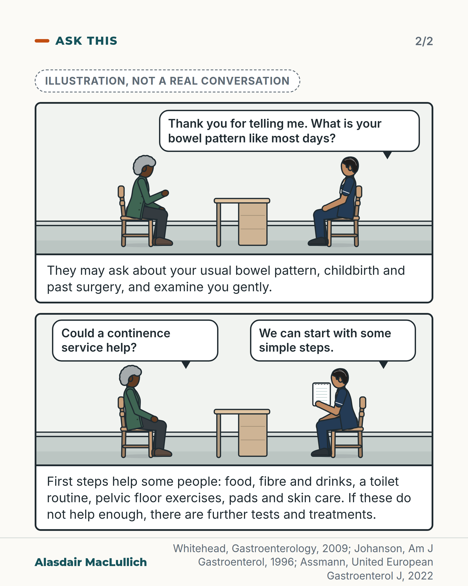

# G124: The bowel leakage people rarely mention

- Category: C12 Continence, bladder and bowels
- Audience: public
- Series: Ask this
- Post type: public_explanation
- Visual format: comic strip (3 panels, captions under panels, labelled illustration)
- Status: text text_final, visual final
- Working id: C12-P09 (candidate C12-26)

## Insight

Accidental bowel leakage is more common in older age groups (about 15 in 100 US adults aged 70 and over living at home reported some in the past month), often has causes that can be treated, and only about 1 in 3 people with it had ever talked to a doctor in two US surveys.

## Angle and position

Gives the reader words to raise it and an idea of what a GP or nurse may check and offer, without promising results.

Basis: Empirical findings (US surveys, with era and place stated) and guideline advice (UEG 2022, mostly expert opinion). The advice to raise it with a GP or nurse is framed as practical guidance; no further judgement.

## X (1125 characters)

```text
"I have had some accidents with my bowels" is a sentence your GP or practice nurse can act on. European guidance tells doctors and nurses to ask about bowel leakage directly and to take account of the words a person prefers, such as "accidents".

Leakage is more common in older age groups. A US national survey asked adults living at home about bowel leakage in the past month, including small amounts of liquid or mucus. About 3 in 100 people in their 20s reported it. For those aged 70 and over it was about 15 in 100, roughly 1 in 7. Two US surveys asked people with leakage whether they had told a doctor. One surveyed clinic patients in the 1990s, the other women aged 45 and over. Only about 1 in 3 had.

Loose stools, and constipation with leakage around hard stool, are common causes that can be treated. First steps include advice on food, fibre and drinks, a toilet routine, and pads and skin care. These steps help some people, though the evidence for each is modest, and there are further tests and treatments if not. You can ask whether a continence service (a team that assesses and treats leaking) could help.
```

## LinkedIn (1718 characters)

```text
"I have had some accidents with my bowels" is a sentence your GP or practice nurse can act on. European guidance tells doctors and nurses to ask about bowel leakage directly rather than wait for you to raise it, and to take account of the words a person prefers, such as "accidents". In a US survey of women aged 45 and over with leakage, 7 in 10 preferred the term "accidental bowel leakage" to "faecal incontinence".

Leakage is more common in older age groups. In a US national survey of adults living at home, about 3 in 100 people in their 20s reported any bowel leakage in the past month, including small amounts of liquid or mucus. For those aged 70 and over it was about 15 in 100, roughly 1 in 7. Two US surveys asked people with leakage whether they had told a doctor. One surveyed clinic patients in the 1990s, the other women aged 45 and over. Only about 1 in 3 had.

What the GP or nurse may ask: your usual bowel pattern, childbirth if you are a woman, and past surgery near the back passage. A gentle examination checks the muscle and looks for hard stool. Loose stools, and constipation with leakage around hard stool, are common causes that can be treated. Leakage is also linked with bladder leakage and with conditions such as stroke.

First steps are advice on food, fibre and drinks, a regular toilet routine, and pads and skin care. A fibre supplement, a medicine that firms up loose stools such as loperamide, or pelvic floor exercises may also be tried. These simple steps help some people, though the evidence for each is modest. If they do not help enough, there are further tests and treatments.

You can ask whether a continence service (a team that assesses and treats leaking) could help.
```

## Bluesky (297 characters)

```text
Bowel leakage rises with age: about 15 in 100 US adults aged 70 and over at home reported some in the past month. In two US surveys, only about 1 in 3 people with leakage had told a doctor. Loose stools and constipation are treatable causes. Try saying: "I have had some accidents with my bowels."
```

## Threads (496 characters)

```text
"I have had some accidents with my bowels" is a sentence your GP or practice nurse can act on.

In a US survey, about 15 in 100 adults aged 70 and over living at home reported bowel leakage in the past month. In two other US surveys (clinic patients; women 45 and over), only about 1 in 3 people with leakage had talked to a doctor. Loose stools and constipation are common causes that can be treated. You can ask whether a continence service (a team that assesses and treats leaking) could help.
```

## Source reply

Sources: https://doi.org/10.1053/j.gastro.2009.04.054 (Whitehead 2009); https://pubmed.ncbi.nlm.nih.gov/8561140/ (Johanson 1996); https://doi.org/10.1002/ueg2.12213 (Assmann 2022, UEG guideline); https://doi.org/10.1097/SPV.0b013e31828016d3 (Brown 2013); https://doi.org/10.1111/ijcp.12018 (Brown 2012)

## Visual



Alt text: Comic strip, illustration only. A nurse and an older Black woman with grey hair and a walking stick sit across a desk. She says she has had some accidents with her bowels. Text gives the US survey figures: about 15 in 100 adults aged 70 and over reported leakage; only about 1 in 3 had told a doctor. Say it in plain words.



Alt text: Two comic panels. The nurse thanks her and asks about her bowel pattern, and may ask about childbirth and surgery. In the next panel she asks if a continence service could help; he holds a leaflet and says they can start with simple steps. Caption lists first steps: food, fibre, drinks, toilet routine, pelvic floor exercises, pads, skin care.

Editable source: `visuals/src/G124.html`

Design instructions: 2-card comic carousel, illustrative badge on both. Kit-drawn gp_room panels: older Black woman (grey coily hair, green cardigan, crook stick) and male nurse (olive skin, navy tunic) seated across a desk. Speech bubbles as HTML. Card 1 headline, stats, panel 1. Card 2 panels 2 and 3 with captions. Speech and caption prefixes removed.

## Sources and verification

- C12-26-a (supported_with_qualification): Accidental bowel leakage becomes more common with age.
  - Source: Whitehead WE, Borrud L, Goode PS, Meikle S, Mueller ER, Tuteja A, et al. Fecal incontinence in US adults: epidemiology and risk factors. Gastroenterology. 2009;137(2):512-7.; Johanson JF, Lafferty J. Epidemiology of fecal incontinence: the silent affliction. Am J Gastroenterol. 1996;91(1):33-6.
  - Passage: "Whitehead: "Participants were 2229 women and 2079 men aged 20 years or older. FI was defined as accidental leakage of solid, liquid, or mucus at least once in the preceding month." "The estimated prevalence of FI in noninstitutionalized US adults is 8.3% (95% confidence interval, 7.1-9.5) and consists of liquid stool in 6.2%, solid stool in 1.6%, and mucus in 3.1%. It occurs at least weekly in 2.7%. Prevalence is similar in women (8.9%) and men (7.7%) and increases with age from 2.6% in 20 to 29 year olds up to 15.3% in participants aged 70 years and older." "FI is a prevalent age-related disorder." Johanson: "Incontinence increased progressively with age"" (Abstracts)
- C12-26-b (supported_with_qualification): Most people with bowel leakage have never talked to a doctor about it: in two US surveys only about one in three had.
  - Source: Johanson JF, Lafferty J. Epidemiology of fecal incontinence: the silent affliction. Am J Gastroenterol. 1996;91(1):33-6.; Brown HW, Wexner SD, Lukacz ES. Factors associated with care seeking among women with accidental bowel leakage. Female Pelvic Med Reconstr Surg. 2013;19(2):66-71.; Assmann SL, Keszthelyi D, Kleijnen J, Anastasiou F, Bradshaw E, Brannigan AE, et al. Guideline for the diagnosis and treatment of faecal incontinence: a UEG/ESCP/ESNM/ESPCG collaboration. United European Gastroenterol J. 2022;10(3):251-86.
  - Passage: "Johanson: "Eight hundred and eighty-one individuals 18 yr or older were included in the analysis." "Only one-third of individuals with fecal incontinence had ever discussed the problem with a physician." Brown 2013: "Women with ABL were asked, \"Have you ever talked to a physician about accidental leakage of stool and/or gas?\"" "Only 29% (268/938) of those with ABL sought care. Multivariate analysis demonstrated that care seekers were more likely to have a primary care physician (PCP), to have heard of ABL, and to have suffered longer with more severe leakage." "More than two thirds of women with ABL do not seek care." Assmann (UEG): "Patients who suffer from FI often feel ashamed to talk about their problem and may find it difficult to describe their complaints." "Many people who suffer from FI delay seeking help or never discuss their problem with a healthcare professional at all."" (Johanson 1996 and Brown 2013: Abstracts; Assmann 2022: full text, Diagnosis, History taking)
- C12-26-c (supported): Many people prefer the words 'accidental bowel leakage' or 'accidents', and guidance tells health professionals to ask about it directly.
  - Source: Brown HW, Wexner SD, Segall MM, Brezoczky KL, Lukacz ES. Accidental bowel leakage in the mature women's health study: prevalence and predictors. Int J Clin Pract. 2012;66(11):1101-8.; Assmann SL, Keszthelyi D, Kleijnen J, Anastasiou F, Bradshaw E, Brannigan AE, et al. Guideline for the diagnosis and treatment of faecal incontinence: a UEG/ESCP/ESNM/ESPCG collaboration. United European Gastroenterol J. 2022;10(3):251-86.
  - Passage: "Brown 2012: "Among 938 respondents with FI, 71.1% (667) preferred the term 'accidental bowel leakage' (ABL) over faecal or bowel incontinence." Assmann (UEG): "When FI is suspected, health care professionals should take it upon themselves to ask the patient whether they suffer from FI, rather than waiting for the patient to mention this problem." "Direct questioning rather than talking around the issue should be aimed for when talking about FI." "Asking the patient about their unwanted loss of faeces should be done in a sensitive manner, cultural preferences for wording should be taken into account (e.g. ‘accidents’, ‘unwanted loss of faeces’, etc.)."" (Brown 2012: Abstract; Assmann 2022: full text, Diagnosis, History taking)
- C12-26-d (supported_with_qualification): Common, checkable causes include loose stools, constipation with overflow, damage to the anal sphincter (for example from childbirth or surgery) and faecal impaction; leakage is also linked with urinary incontinence, multiple chronic illnesses and neurological conditions.
  - Source: Assmann SL, Keszthelyi D, Kleijnen J, Anastasiou F, Bradshaw E, Brannigan AE, et al. Guideline for the diagnosis and treatment of faecal incontinence: a UEG/ESCP/ESNM/ESPCG collaboration. United European Gastroenterol J. 2022;10(3):251-86.; Whitehead WE, Borrud L, Goode PS, Meikle S, Mueller ER, Tuteja A, et al. Fecal incontinence in US adults: epidemiology and risk factors. Gastroenterology. 2009;137(2):512-7.; Brown HW, Wexner SD, Segall MM, Brezoczky KL, Lukacz ES. Accidental bowel leakage in the mature women's health study: prevalence and predictors. Int J Clin Pract. 2012;66(11):1101-8.
  - Passage: "Assmann (UEG): "Bowel habit should be thoroughly assessed to ensure diarrhoea and overflow constipation are not the cause for the unwanted loss of faeces." "The patient should be asked about any possible underlying reason for the presence of FI and about their obstetric history (in women)." "Inspection and physical examination of the anorectal region should be performed to exclude other anorectal pathology, to assess for previous perianal surgery/trauma and faecal impaction and to evaluate anal state/tone at rest and during voluntary effort." "Any patient group with FI with any type of neurological disease and/or cognitive impairment, whether mild or severe (e.g., Dementia, Parkinson, Spinal Cord Injury, Stroke etc.) were included in this section." Whitehead: "Independent risk factors in women are advancing age, loose or watery stools, more than 21 stools per week, multiple chronic illnesses, and urinary incontinence. Independent risk factors in men are age, loose or watery stools, poor self-rated health, and urinary incontinence." "Chronic diarrhea is a strong modifiable risk factor that may form the basis for prevention and treatment." Brown 2012: "Bowel disorders, urinary incontinence, stroke, age 55-64, diabetes mellitus and prior vaginal delivery were associated with an increased odds of FI"" (Assmann 2022: full text, Diagnosis (History taking; Physical examination) and Special situations; Whitehead 2009: Abstract; Brown 2012: Abstract)
- C12-26-e (supported_with_qualification): First-line treatments include diet and fibre advice, a toilet routine, fibre supplements or anti-diarrhoea medicine such as loperamide, pelvic floor exercises, and pads and skin care; many people improve with these simple steps, and further treatments exist if they do not work.
  - Source: Assmann SL, Keszthelyi D, Kleijnen J, Anastasiou F, Bradshaw E, Brannigan AE, et al. Guideline for the diagnosis and treatment of faecal incontinence: a UEG/ESCP/ESNM/ESPCG collaboration. United European Gastroenterol J. 2022;10(3):251-86.
  - Passage: ""First line treatment includes lifestyle adjustments, dietary advice (fibre and water intake, possibly reduction of caffeine and FODMAP intake), basic behavioural advice (toilet routine/bowel training), stool bulking agents and/or anti‐diarrheal medication, pelvic floor muscle exercises, absorbent products for containment and possibly skin care products to treat irritation of the skin around the anus." "Fibre supplementation, especially Psyllium helps reduce FI episodes." "Anti‐diarrheal medication has a positive impact on diarrheal and/or FI symptoms." "Loperamide is not significantly better in reducing FI complaints compared to Psyllium." "Constipation was the most common adverse event for loperamide use (29.1%)" "No significant differences were found between any of the groups in mean number of FI episodes per week (= 0.51 KW), severity of FI (St. Mark's) (= 0.54 KW) or quality of life (QoL) (numerical data not available) after 1 year follow‐up, however both groups improved in all outcomes compared to baseline" "An education pamphlet regarding FI may be effective in treatment of FI. Results should be interpreted with caution." "Biofeedback may not be superior to education only." "In patients where initial first line treatment has not resulted in acceptable symptom reduction additional diagnostic test could be considered prior to starting second line treatment."" (Assmann 2022: full text, First line treatment for faecal incontinence (Introduction, evidence summaries); Diagnostic tests prior to second line treatment)

Verification notes: C12-26-a (Whitehead 2009 abstract): NHANES 2005-06, 2.6% (20 to 29) and 15.3% (70+) any leakage in the past month, adults living at home; 'any leakage, including small amounts of liquid or mucus'; Johanson clinic prevalence not used. C12-26-b (Johanson 1996, Brown 2013 abstracts; UEG guideline text): given as 'two US surveys', era and place stated, 'about 1 in 3', not 'most never tell anyone'. C12-26-c (Brown 2012 abstract; UEG): 7 in 10 US women aged 45+ preferred 'accidental bowel leakage'; direct questioning is expert opinion. C12-26-d (UEG full text, Whitehead, Brown 2012): causes and assessment; associations written as 'linked with'; medicines not named as a cause. C12-26-e (UEG full text): first-line treatments, modest evidence for each; no claim that pelvic floor exercises beat advice; 'many people improve' as in the safe wording. No UK service named.

## Attention and follow potential

Pause: A sentence the reader can say aloud, plus a figure showing how common the problem is at 70 and over.

Gain: Words to raise it, what the GP or nurse may ask, and what first steps exist.

Follow: Shows the account takes an embarrassing subject seriously and gives practical words.

## Open issues

None.
