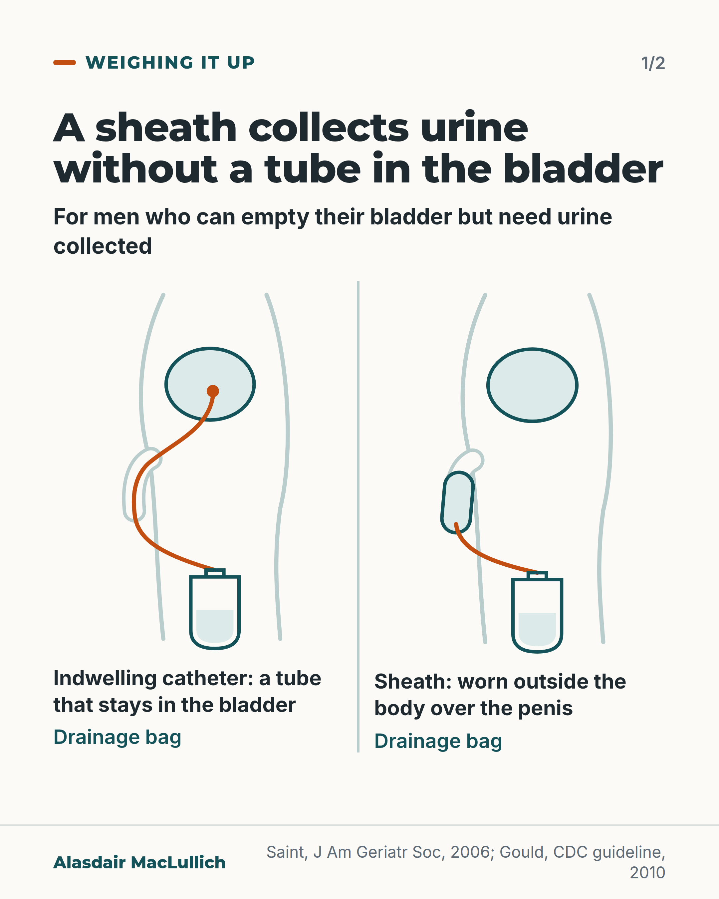
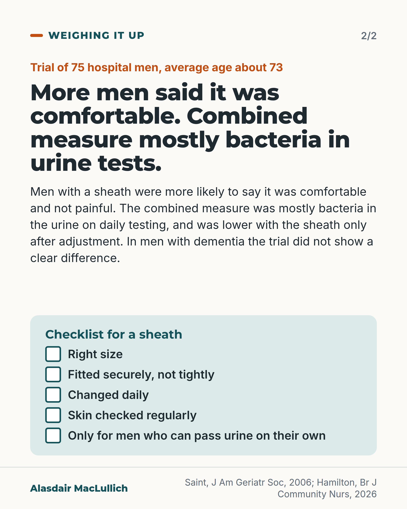

# G125: For men, consider a sheath before a catheter

- Category: C12 Continence, bladder and bowels
- Audience: practitioners
- Series: Weighing it up
- Post type: good_care
- Visual format: drawn illustration: non-graphic line diagram comparison, 2 slides
- Status: text text_final, visual final
- Working id: C12-P10 (candidate C12-24)

## Insight

For a man who can empty his bladder but needs urine collected, a sheath avoids a tube in the bladder and was more often reported as comfortable in a small randomised trial. The combined measure of problems was driven by bacteriuria, and the unadjusted difference was not clear.

## Angle and position

An under-used device that avoids an invasive tube for men without retention, with its limits stated: small trial, composite outcome driven by bacteriuria, no clear difference in men with dementia, correct fit and skin checks.

Basis: Mixed. Empirical: Saint 2006 trial. Guideline: CDC 2009 Category II. Judgement, marked as such: for men without retention who need urine collected, consider a sheath before an indwelling catheter.

## X (971 characters)

```text
An indwelling catheter is a tube that stays in the bladder. For a man who can empty his bladder but needs urine collected, a sheath worn over the penis collects it without one. US infection control guidance (CDC, 2009) suggests considering one for cooperative men without retention or blockage; it is a weaker, category II recommendation.

In a US trial of 75 men in a veterans' hospital, aged about 73 on average, men with a sheath were more likely to say it was comfortable and not painful. A combined measure of problems (bacteria in the urine on daily testing, symptomatic infection or death) was lower with the sheath after adjustment but not clearly before it. Bacteria in the urine drove the result. Similar shares of men had an event (about 44 in 100 with a sheath against 49 in 100 with a catheter). In men with dementia the trial did not show a clear difference.

A sheath needs the right size, a secure but not tight fit, daily changes and regular skin checks.
```

## LinkedIn (2195 characters)

```text
An indwelling catheter is a tube that stays in the bladder. For a man who can empty his bladder but needs urine collected, a sheath (an external catheter) worn over the penis collects urine without one. US infection control guidance (CDC, 2009) suggests considering an external catheter for cooperative men without urinary retention or bladder outlet obstruction. It is a Category II recommendation, which is weaker.

The main trial gave 75 men in a US veterans' hospital, average age about 73, who needed urine collected and had no retention, either a sheath or an indwelling catheter by random choice. Men with a sheath were more likely to say it was comfortable and not painful. There was no difference on restriction of movement, embarrassment or inconvenience. The authors note that sheaths tend to fall off.

The combined measure of problems was bacteriuria (bacteria in the urine found on daily testing), symptomatic urine infection or death. It occurred at 70 per 1,000 patient-days with sheaths and 131 per 1,000 with catheters. The unadjusted difference was not statistically clear. After the researchers allowed for age, memory scores and earlier urine infection or catheter use, it was. Bacteriuria was by far the most frequent event and drove the result. Similar shares of men had at least one event: about 44 in 100 with a sheath and 49 in 100 with a catheter. That counts men, while the rate above counts events per 1,000 days of follow-up, so the two figures measure different things. Symptomatic infections and deaths were few and not clearly different on their own.

In men without dementia the difference was larger. In men with dementia the trial did not show a clear difference, and by chance more men with dementia were assigned to sheaths (61 in 100 against 21 in 100). The trial was small, ran from 1997 to 2001 and used one product.

A 2026 nursing review advises the correct size, a secure but not tight fit, daily changes and regular skin checks. Problems are usually minor, such as sore or damp skin; a badly sized sheath can rarely cut off blood flow.

A judgement: for men without retention who need urine collected, consider a sheath before an indwelling catheter.
```

## Bluesky (300 characters)

```text
For a man who can empty his bladder but needs urine collected, a sheath avoids a tube in the bladder. In a 75-man trial, more sheath users said it was comfortable. A combined problem measure (bacteria in urine, infection, death) was lower with sheaths after adjustment, mostly from bacteria in urine.
```

## Threads (491 characters)

```text
An indwelling catheter is a tube that stays in the bladder. For a man who can empty his bladder but needs urine collected, a sheath avoids it. In a trial of 75 hospital men, more of them said it was comfortable. A combined measure of problems was lower after adjustment but not clearly lower before it, driven mostly by bacteria in the urine. In men with dementia the trial did not show a clear difference.

It needs the right size, a secure but not tight fit, daily changes and skin checks.
```

## Source reply

Sources: https://doi.org/10.1111/j.1532-5415.2006.00785.x (Saint 2006); https://doi.org/10.1086/651091 (CDC 2009); https://doi.org/10.12968/bjcn.2025.0205 (Hamilton 2026)

## Visual



Alt text: Two line diagrams of the lower body from the side. Left, indwelling catheter: a tube runs from the bladder out to a drainage bag at the thigh. Right, sheath: worn outside over the penis with a short tube to a drainage bag, nothing inside the bladder. For men who can empty their bladder but need urine collected.



Alt text: Trial of 75 hospital men, average age about 73. Men with a sheath were more likely to say it was comfortable and not painful. The combined measure was mostly bacteria in urine on daily testing, lower with the sheath only after adjustment. No clear difference in dementia. Checklist of five points for a sheath.

Editable source: `visuals/src/G125.html`

Design instructions: 2-card carousel. Card 1: two side-view schematic SVG line diagrams (teal outlines, orange tubing, drainage bags), catheter left, sheath right, divided by a rule, captions below. Card 2: kicker, headline, findings body, mint checklist panel with box icons.

## Sources and verification

- C12-24-a (supported): A randomised trial compared external (sheath/condom) catheters with indwelling catheters in 75 hospitalised men aged 40 and over who needed urine collection and did not have urinary retention.
  - Source: Saint S, Kaufman SR, Rogers MAM, Baker PD, Ossenkop K, Lipsky BA. Condom versus indwelling urinary catheters: a randomized trial. J Am Geriatr Soc. 2006;54(7):1055-61.
  - Passage: ""Potential subjects were male veterans aged 40 and older who were newly admitted to or currently hospitalized in the nursing home care unit or an acute medicine, neurology, or rehabilitation ward within the VAPSHCS from August 1997 through March 2001." "Patients were excluded if they had evidence, according to history or previous diagnostic studies, of urinary retention or severe bladder outlet obstruction; ... were bacteriuric; ..." "During the 3.5 years of the study, 4,241 patients were screened for eligibility; 4,144 did not qualify based on the inclusion and exclusion criteria, and 22 refused to participate. Of the 75 eligible consenting patients, 34 were randomized to the condom catheter group and 41 to the indwelling catheter group." "The mean age of the subjects in the two groups was similar (73.4 and 73.7)"" (Methods; Results (Scite full text))
- C12-24-b (supported_with_qualification): Adverse outcomes (bacteriuria, symptomatic UTI or death) occurred at 70 per 1,000 patient-days with sheaths and 131 per 1,000 with indwelling catheters; unadjusted difference not significant, adjusted difference significant; the composite was driven by bacteriuria.
  - Source: Saint S, Kaufman SR, Rogers MAM, Baker PD, Ossenkop K, Lipsky BA. Condom versus indwelling urinary catheters: a randomized trial. J Am Geriatr Soc. 2006;54(7):1055-61.
  - Passage: ""Of those in the condom catheter group, 15 (44.1%) experienced one or more adverse events (i.e., bacteriuria, symptomatic UTI, or death) during the trial, compared with 20 (48.8%) in the indwelling catheter group. The incidence of an adverse event was 70/1,000 patient-days in those with a condom catheter and 131/1,000 patient-days in those with an indwelling catheter (P=.07)." "The unadjusted HR was 1.82 (95% confidence interval (CI)=0.90–3.67) for all patients" "After adjustment for age, aMMSE score, prior UTI, and prior urethral catheterization, the incidence of an adverse study outcome was statistically significantly lower in the condom catheter group than in the indwelling catheter group. ... (HR=2.26, 95% CI=1.10–4.62) or was the same across all patients (HR=2.11, 95% CI=1.03–4.31)." "One outcome in particular—bacteriuria—which was by far the most frequent, greatly affected these results. The results would not have been substantially different if bacteriuria alone had been considered." "During the study period, 30 patients developed bacteriuria: 13 (38.2%) in the condom catheter group and 17 (41.5%) in the indwelling catheter group (Table 2). Of the six patients who died during the trial, two (5.9%) were in the condom catheter group, and four (9.8%) were in the indwelling catheter group." Bacteriuria definition: "≧10^3 colony‐forming units per mL of a single or predominant species of bacteria", with urine cultured daily." (Results and Methods (Scite full text, pages 2 to 3))
- C12-24-c (supported): Men rated sheaths as more comfortable and less painful than indwelling catheters.
  - Source: Saint S, Kaufman SR, Rogers MAM, Baker PD, Ossenkop K, Lipsky BA. Condom versus indwelling urinary catheters: a randomized trial. J Am Geriatr Soc. 2006;54(7):1055-61.
  - Passage: ""Based on questionnaire results, patients with a condom catheter were more likely to report their device to be comfortable (P=.02) and not painful (P=.02) than were patients with an indwelling catheter (Table 4). On other measures of preference, there were no significant differences."" (Results (Scite full text))
- C12-24-d (supported_with_qualification): The difference was clearest in men without dementia.
  - Source: Saint S, Kaufman SR, Rogers MAM, Baker PD, Ossenkop K, Lipsky BA. Condom versus indwelling urinary catheters: a randomized trial. J Am Geriatr Soc. 2006;54(7):1055-61.
  - Passage: ""By chance, a significantly (P<.01) greater percentage of patients with dementia were assigned to the condom catheter group (60.6%) than to the indwelling group (20.5%)." "When the analysis was restricted to patients without dementia, the effect was stronger, with an HR of 4.84 (95% CI=1.46–16.02)" "Figures 1B and C show that the difference in adverse outcomes was even greater for patients without dementia (P=.01) but was not significantly different for those with dementia (P=.78)." "For men without dementia, use of a condom catheter rather than an indwelling urinary catheter appears to be highly beneficial in reducing clinically important adverse outcomes, but there may be no benefit in using a condom catheter in patients with dementia."" (Results; Discussion (Scite full text))
- C12-24-e (supported): The CDC guideline suggests considering external catheters for cooperative men without urinary retention or bladder outlet obstruction.
  - Source: Gould CV, Umscheid CA, Agarwal RK, Kuntz G, Pegues DA; Healthcare Infection Control Practices Advisory Committee (HICPAC). Guideline for prevention of catheter-associated urinary tract infections 2009. Infect Control Hosp Epidemiol. 2010;31(4):319-26.
  - Passage: ""B. Consider using alternatives to indwelling urethral catheterization in selected patients when appropriate. 1. Consider using external catheters as an alternative to indwelling urethral catheters in cooperative male patients without urinary retention or bladder outlet obstruction. (Category II) (Key Question 2A)"" (Section II Summary of Recommendations, I.B.1 (p. 321))
- C12-24-f (supported_with_qualification): Sheaths need correct sizing, secure but not tight application, daily changes and regular skin checks; complications include skin irritation, maceration, pressure damage and rarely penile ischaemia from poor sizing.
  - Source: Hamilton C, McCloy O. Optimising outcomes in condom catheter use for male urinary incontinence. Br J Community Nurs. 2026;31(6):294-8.; Saint S, Kaufman SR, Rogers MAM, Baker PD, Ossenkop K, Lipsky BA. Condom versus indwelling urinary catheters: a randomized trial. J Am Geriatr Soc. 2006;54(7):1055-61.
  - Passage: "Hamilton 2026: "It is primarily indicated for patients with urinary incontinence who have the ability to void spontaneously but require continuous collection of urine for comfort, hygiene or skin protection. Condom catheters should be avoided for long-term use in patients with impaired sensation or high risk of skin breakdown without careful monitoring. Adverse effects are typically minor but can include skin irritation, maceration, pressure necrosis, allergic dermatitis and urinary tract infections. Rare complications include penile ischaemia, oedema and urethral injury from improper sizing or application. This article includes guidance for safe use such as appropriate sizing, secure but non-constrictive application, daily changes and regular inspection of penile skin." Saint 2006: "Although indwelling catheters generally cause discomfort, condom catheters tend to fall off, and both are associated with bacteriuria."" (Hamilton abstract; Saint Discussion)

Verification notes: C12-24-a, -b, -c, -d (Saint 2006 full text): 75 men (34 sheath, 41 catheter), mean age about 73; composite 70 vs 131 per 1,000 patient-days, unadjusted P=.07, adjusted HR 2.11 (1.03 to 4.31) used only for 'after adjustment'; 'bacteriuria ... by far the most frequent, greatly affected these results'; 44.1% vs 48.8% with an event; comfort and pain P=.02 each; no difference on other measures; dementia imbalance 60.6% vs 20.5% and weaker effect in dementia; 'condom catheters tend to fall off'. Wording follows the editor: 'more comfortable, with a composite outcome driven by bacteriuria', and never 'fewer infections or deaths'. C12-24-e (CDC 2010 full text): Category II. C12-24-f (Hamilton 2026 abstract, narrative nursing review): fitting, daily change, skin checks, rare ischaemia from poor sizing. RCN guidance not opened.

## Attention and follow potential

Pause: Opens on a plain definition and an alternative to a tube that stays in the bladder.

Gain: A device option, the trial evidence with its limits, and the five practical points for safe use.

Follow: Shows the account reports a trial's limits (a composite driven by bacteriuria) when an abstract overstates.

## Open issues

None.
