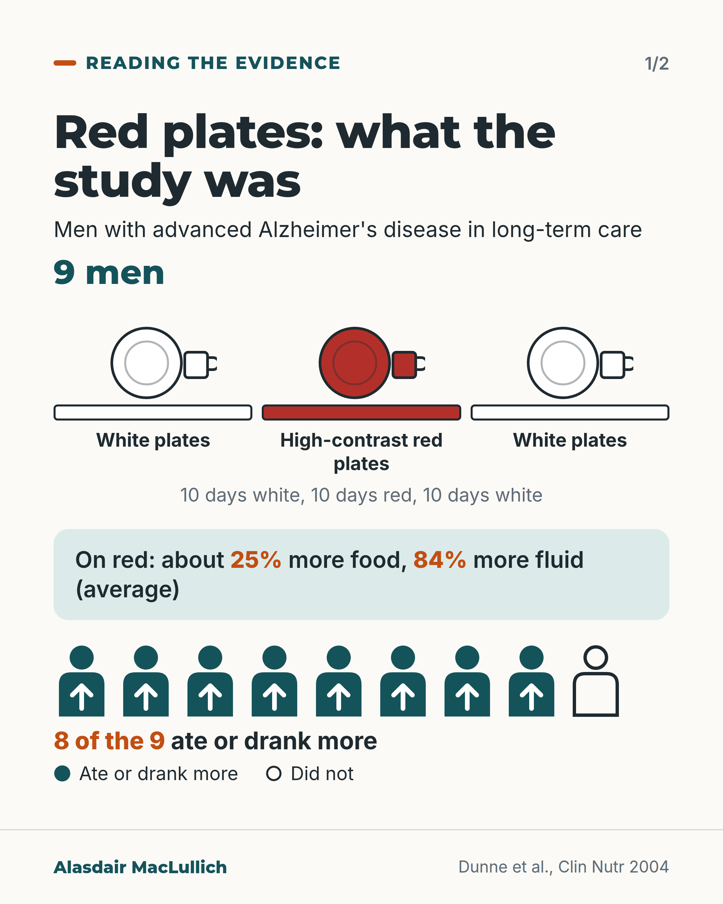
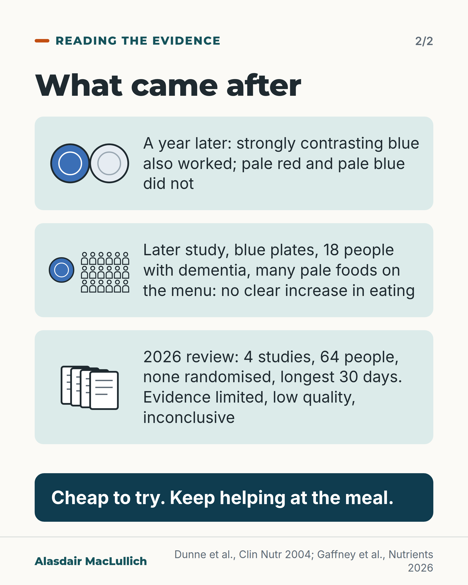

# G126: Red plates: what the study was

- Category: C13 Nutrition, swallowing, hydration and mouth care
- Audience: practitioners
- Series: Reading the evidence
- Post type: evidence_interpretation
- Visual format: carousel (2 slides)
- Status: text text_final, visual final
- Working id: C13-P01 (candidate C13-33)

## Insight

The 2004 study that tested red plates had nine men with advanced Alzheimer's disease; blue plates worked too and pale ones did not, so contrast rather than redness is the suggested reason. A 2026 review found the evidence limited, low quality and inconclusive.

## Angle and position

Read a popular tip against its source. Contrast plates are reasonable to try, but they are unproven and should not be counted in place of help with eating.

Basis: Empirical finding: the Dunne 2004 results, the Donnelly result reported in the 2026 review, and the review's verdict. Ethical and clinical judgement, marked as such: that contrast plates are cheap to try and should not replace help at the meal.

## X (906 characters)

```text
The 2004 study that tested red plates for people with dementia had nine men.

They had advanced Alzheimer's disease and lived in long-term care. Over 10 days with high-contrast red plates and cups, they ate about a quarter more food and drank 84% more, on average, than over 10 days with white ones. Eight of the nine ate or drank more.

A year later, strongly contrasting blue plates also increased eating and drinking, and pale red and pale blue plates did not. That suggests contrast, rather than the colour red, was the reason.

A later study of blue plates in 18 people with dementia, on a menu with many pale foods such as white rice and mashed potato, did not show a clear increase in eating. A 2026 review found four small studies in all and called the evidence limited, low quality and inconclusive.

Contrast plates are cheap to try. We should not count one as a replacement for help at the meal.
```

## LinkedIn (1862 characters)

```text
The 2004 study that tested red plates for people with dementia had nine men.

They had advanced Alzheimer's disease and lived in long-term care. The researchers weighed what the men ate for 10 days on white plates and cups, 10 days on high-contrast red ones, then 10 days on white again. On red, the men ate about a quarter more food and drank 84% more on average. Eight of the nine ate or drank more. These are increases in average intake, and nobody measured weight or health.

A year later the same team tried other plates. Strongly contrasting blue plates also increased eating and drinking; pale red and pale blue plates did not. That suggests the contrast between food and plate, rather than the colour red, was the reason.

The result that went the other way: a later study of blue plates in 18 people with dementia, on a menu with many pale foods such as white rice and mashed potato, did not find a clear increase in eating. Fewer than a third of the 18 people ate at least a tenth more food on blue plates.

A 2026 systematic review searched five databases up to March 2025 for studies of contrast at mealtimes and found four, with 64 people in total, the largest with 25. None was randomised, and the longest test period was 30 days. The reviewers called the evidence limited, low quality and inconclusive. None of the studies showed whether contrast plates prevent weight loss or malnutrition.

Reviews of mealtime changes for people with dementia have found no change that is established to help people eat more. This includes help with eating. The studies are small and short. Better trials are needed of contrast plates and of help with eating.

Contrast plates are cheap to try, and families and staff who use them are doing something reasonable. We should not count a plate as a replacement for a person who sits with someone and helps them eat.
```

## Bluesky (297 characters)

```text
The 2004 study that tested red plates for dementia had nine men with advanced Alzheimer's: about a quarter more food and 84% more fluid than on white plates over 10 days. A 2026 review found four small studies and called the evidence inconclusive. Cheap to try; no substitute for help at the meal.
```

## Threads (496 characters)

```text
The 2004 study that tested red plates for dementia had nine men with advanced Alzheimer's. Over 10 days they ate about a quarter more and drank 84% more on average than on white.

A year later, high-contrast blue plates increased eating; pale ones did not. So contrast looks like the reason. A later study of blue plates in 18 people, with many pale foods on the menu, found no clear increase. A 2026 review called the evidence inconclusive.

Cheap to try. Not a replacement for help at the meal.
```

## Source reply

Sources: Dunne 2004 https://doi.org/10.1016/j.clnu.2003.09.015 ; 2026 review https://doi.org/10.3390/nu18142338 ; Cochrane review of mealtime changes in dementia https://doi.org/10.1002/14651858.CD011542.pub2

## Visual



Alt text: Card 1 of 2. Red plates study: nine men with advanced Alzheimer's disease in long-term care had 10 days on white plates, 10 on red, 10 on white. On red they ate about 25% more food and drank 84% more on average. Eight of the nine ate or drank more; one did not. Dunne 2004.



Alt text: Card 2 of 2. What came after: a year later strong blue also worked, pale red and pale blue did not. A later blue plate study in 18 people with dementia, with many pale foods, showed no clear increase. A 2026 review: 4 small studies, 64 people, none randomised; evidence limited and inconclusive. Cheap to try; keep helping.

Editable source: `visuals/src/G126.html`

Design instructions: Carousel 2 cards, 1080x1350. Card 1 light: h1, 9 men, three plate-and-cup icons (white, red, white) over three equal 10-day bar segments, mint panel with 25% and 84% in orange, 9 person icons (8 filled teal with up arrow, 1 outline) and legend. Card 2: three mint bands with icons (blue and pale plates; blue plate with 18 person outlines; four documents), deep teal strip. Claims C13-33-a, C13-33-c, C13-33-d.

## Sources and verification

- C13-33-a (supported_with_qualification): In a study of nine men with advanced Alzheimer's disease in long-term care, mean food intake was 25% higher and mean liquid intake 84% higher with high-contrast red tableware than with white tableware, and 8 of 9 men increased their intake.
  - Source: Dunne TE, Neargarder SA, Cipolloni PB, Cronin-Golomb A. Visual contrast enhances food and liquid intake in advanced Alzheimer's disease. Clin Nutr. 2004;23(4):533-8.; Gaffney M, Ryan M, Loetscher T, Singh B, Murphy KJ. Modification of visual contrast in the dining environment and its impact on dietary intake in older adults: a systematic review. Nutrients. 2026;18(14):2338.
  - Passage: "Participants were nine men with advanced AD. ... Data were collected for 30 days (10 days per condition) for two meals per day. White tableware was used for the baseline and post-intervention conditions, and high-contrast red tableware for the intervention condition. ... Mean percent increase was 25% for food and 84% for liquid for the high-contrast intervention (red) versus baseline (white) condition, with 8 of 9 participants exhibiting increased intake. [Gaffney 2026, Limitations:] Dunne et al. [] attempted to measure acuity colour discrimination and visual contrast; however, none of the participants could complete the assessments." (Dunne 2004 Abstract (Methods, Results); Gaffney 2026 full text section 4.2)
- C13-33-b (supported_with_qualification): In a follow-up a year later, high-contrast blue tableware also increased intake, while low-contrast red and low-contrast blue did not, which points to contrast rather than the colour red.
  - Source: Dunne TE, Neargarder SA, Cipolloni PB, Cronin-Golomb A. Visual contrast enhances food and liquid intake in advanced Alzheimer's disease. Clin Nutr. 2004;23(4):533-8.; Gaffney M, Ryan M, Loetscher T, Singh B, Murphy KJ. Modification of visual contrast in the dining environment and its impact on dietary intake in older adults: a systematic review. Nutrients. 2026;18(14):2338.
  - Passage: "In a follow-up study 1 year later, other contrast conditions were examined (high-contrast blue, low-contrast red and low-contrast blue). ... In the follow-up study, the high-contrast intervention (blue) resulted in significant increases in food and liquid intake; the low-contrast red and low-contrast blue interventions were ineffectual. [Gaffney 2026:] In a follow-up study a year later, they used high-contrast blue tableware with low-contrast (pastel) red and low-contrast blue tableware []." (Dunne 2004 Abstract (Methods, Results); Gaffney 2026 full text section 3.5)
- C13-33-c (supported): A 2026 systematic review found only four small studies of visual contrast at meals (64 participants in all), none randomised, and judged the evidence limited, low quality and inconclusive; it is not established that high-contrast tableware improves nutrition.
  - Source: Gaffney M, Ryan M, Loetscher T, Singh B, Murphy KJ. Modification of visual contrast in the dining environment and its impact on dietary intake in older adults: a systematic review. Nutrients. 2026;18(14):2338.
  - Passage: "Of 2901 records screened, four studies (five reports) met the inclusion criteria, involving a total of 64 participants. ... Limited and low-quality evidence suggests a possible effect of modifying the dining environment to improve visual contrast for enhancing dietary intake in older adults, with visual contrast sensitivity, particularly those with dementia. However, the evidence gap is large and remains inconclusive. [Full text:] A total of 64 participants were included across the studies; sample sizes were small, ranging from 9 to 25. ... The studies consisted of mixed methods (= 1) and non-randomised quantitative designs (= 4). ... with the longest test period lasting 30 days. ... MMAT scores ranged from 40 to 60%. ... this review has identified a clear evidence gap instead of establishing the effectiveness of visual contrast interventions. ... Although the studies included in this review have demonstrated increases in food intakes, it remains unclear whether these translate to meaningful outcomes in the long term, such as reduced prevalence of malnutrition, reduced unintentional weight loss, or optimised nutritional status among older adults in long-term aged care." (Gaffney 2026 Abstract; full text sections 3.2, 3.3, 3.4, 4 and 4.3)
- C13-33-d (supported_with_qualification): Another study of blue versus white dishware in people with dementia did not show a clear increase in food intake.
  - Source: Gaffney M, Ryan M, Loetscher T, Singh B, Murphy KJ. Modification of visual contrast in the dining environment and its impact on dietary intake in older adults: a systematic review. Nutrients. 2026;18(14):2338.
  - Passage: "In comparison, Donnelly et al. [] reported that the average number of participant observations was 19 ± 2 meals and found that only less than a third (28%) of participants increased intake by at least 10% during the intervention periods when blue tableware was used. ... Donnelly et al. [] challenged this, finding no significant improvement in food intake with blue dishware compared to white in meals containing low-contrast foods, like mashed potato and white rice, indicating that colour alone may not be sufficient to improve dietary intake." (Gaffney 2026 full text sections 3.7 and 4)
- C13-33-e (supported): More broadly, systematic reviews have not established any specific mealtime environment change, or form of eating assistance, as effective for people with dementia.
  - Source: Herke M, Fink A, Langer G, Wustmann T, Watzke S, Hanff AM, et al. Environmental and behavioural modifications for improving food and fluid intake in people with dementia. Cochrane Database Syst Rev. 2018;7(7):CD011542.; Abdelhamid A, Bunn D, Copley M, Cowap V, Dickinson A, Gray L, et al. Effectiveness of interventions to directly support food and drink intake in people with dementia: systematic review and meta-analysis. BMC Geriatr. 2016;16:26.
  - Passage: "[Herke 2018:] We included nine studies, investigating 1502 people. ... The overall quality of evidence was mainly low to very low. ... Due to the quantity and quality of the evidence currently available, we cannot identify any specific environmental or behavioural modifications for improving food and fluid intake in people with dementia. [Abdelhamid 2016:] Forty-three controlled interventions were included, disappointingly none were judged at low risk of bias. ... Eating assistance studies provided inconsistent evidence ... We found no definitive evidence on effectiveness, or lack of effectiveness, of specific interventions but studies were small and short term." (Herke 2018 Abstract (Main results, Authors' conclusions); Abdelhamid 2016 Abstract (Results, Conclusions))

Verification notes: C13-33-a and -b from Dunne 2004 (PMID 15297089, abstract) as relayed and checked in the 2026 systematic review (PMID 42514407, full text). C13-33-c and -d (Donnelly result, 18 people, 28% ate at least 10% more) from Gaffney 2026 full text; Donnelly primary paper not opened, so it is reported via the review. C13-33-e from Herke 2018 Cochrane and Abdelhamid 2016 abstracts. Qualifications carried: nine men, not randomised (white, red, white), 10 days per condition, relative increases in average intake, no weight or health outcomes, 'points to' contrast, 'not established' and 'inconclusive' rather than 'does not work'. The statement that plates should not replace help with eating is marked as judgement ('We should'). 'Cheap to try' is judgement. The post does not use 'best-known study', 'one facility' or 'harmless'. Eating assistance in dementia is itself described as unproven in reviews, stated in the LinkedIn version.

## Attention and follow potential

Pause: A tip that many clinicians and families already use, traced to nine men. Practitioners who have recommended red plates will want to see what the source was.

Gain: A way to describe the evidence honestly to a family (small, short, suggestive of contrast), and the reassurance that trying contrast plates is reasonable while help with eating comes first.

Follow: Shows the account reads the source behind a popular tip, states the result that went the other way, and stays generous to people who use the tip.

## Open issues

None.
