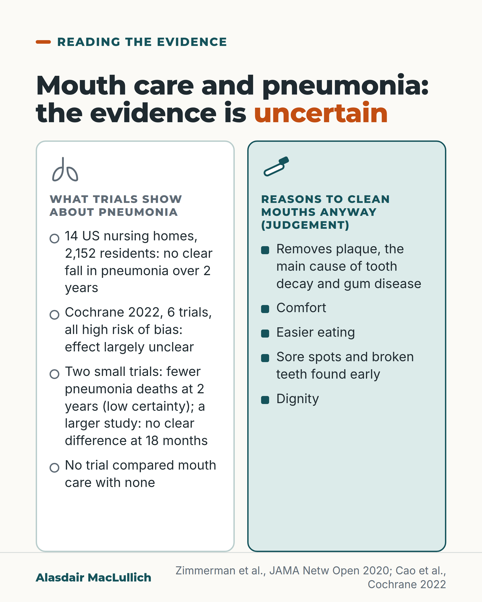

# G127: Mouth care and pneumonia: uncertain

- Category: C13 Nutrition, swallowing, hydration and mouth care
- Audience: practitioners
- Series: Reading the evidence
- Post type: evidence_interpretation
- Visual format: comparison
- Status: text text_final, visual final
- Working id: C13-P02 (candidate C13-14)

## Insight

Trials have not shown a clear fall in pneumonia from mouth care programmes in care homes, and the Cochrane review calls the effect largely unclear. The firmer reasons to clean an older person's mouth are plaque control, comfort, eating, finding sore spots and dignity.

## Angle and position

Describe the pneumonia claim as uncertain in both directions, including the signals that point towards benefit, and justify mouth care on its direct benefits.

Basis: Empirical finding: the Zimmerman 2020 trial and Cao 2022 Cochrane results, with their uncertainty. Established dental background: plaque causes decay and gum disease. Clinical and ethical judgement, marked 'we should': that comfort, eating, early detection of problems and dignity are reasons to keep doing mouth care.

## X (808 characters)

```text
A mouth care programme in 14 US nursing homes did not show a clear fall in pneumonia over two years.

Across 2,152 residents there were 0.67 pneumonia cases per 1,000 resident-days with the programme and 0.72 without. An analysis of the first year alone found fewer cases, but that analysis was not planned in advance. In year two, pneumonia was slightly more common in programme homes, but not clearly so.

A 2022 Cochrane review of six trials, all at high risk of bias, judged the effect largely unclear. Two small trials suggested fewer pneumonia deaths at two years, with low certainty; a larger study found no clear difference at 18 months. None compared mouth care with no mouth care.

We should keep cleaning mouths for comfort, eating and finding sore spots, whatever the trials show about pneumonia.
```

## LinkedIn (2093 characters)

```text
A mouth care programme in 14 US nursing homes did not show a clear fall in pneumonia over two years.

The trial included 2,152 residents. The homes were chosen because their residents were often readmitted to hospital with pneumonia. They were randomised in matched pairs to a staff mouth care programme or usual care. Over two years there were 0.67 pneumonia cases per 1,000 resident-days (days lived in the home) with the programme and 0.72 without. That is not a clear difference.

Two other results add to this. An analysis of the first year alone found fewer pneumonias in programme homes, but it was not planned in advance. In the second year pneumonia was slightly more common in programme homes, again without a clear difference. The authors suggest the lack of a clear result in year two may relate to difficulty sustaining the programme, and that dedicated oral care aides may be needed.

An earlier Japanese trial in 11 nursing homes (417 residents) reported fewer pneumonias and fewer pneumonia deaths when staff brushed teeth after every meal and a dentist or hygienist visited weekly. Cochrane rates trials like it at high risk of bias.

The 2022 Cochrane review included six trials, all at high risk of bias, and judged the effect of professional mouth care on pneumonia largely unclear. Two small Japanese trials suggested fewer pneumonia deaths at two years, with low certainty, but a larger study (2,513 people) found no clear difference in pneumonia deaths at 18 months. The Cochrane review found no trial of mouth care against no mouth care at all. Each trial compared extra, professional care with usual care.

So the evidence on pneumonia is uncertain in both directions.

The other reasons for mouth care are firmer. Cleaning removes plaque, the main cause of tooth decay and gum disease. We should also keep doing it for comfort, for being able to eat, for noticing sore spots and broken teeth early, and for dignity, whatever the trials show about pneumonia.

Where mouth care is taught as a way to prevent pneumonia, it is worth adding that the evidence is uncertain.
```

## Bluesky (281 characters)

```text
A mouth care programme in 14 US nursing homes (2,152 residents) did not show a clear fall in pneumonia over two years. A Cochrane review also found the effect unclear. The pneumonia evidence is uncertain either way. We should still clean mouths: for comfort, eating and sore spots.
```

## Threads (490 characters)

```text
A mouth care programme in 14 US nursing homes did not show a clear fall in pneumonia over two years: 0.67 cases per 1,000 resident-days with it, 0.72 without (2,152 residents).

An analysis of the first year found fewer cases, but it was not planned in advance. A 2022 Cochrane review called the effect largely unclear, with low-certainty signs of fewer pneumonia deaths.

The evidence on pneumonia is uncertain either way. We should keep cleaning mouths for comfort, eating and sore spots.
```

## Source reply

Sources: Zimmerman 2020 https://doi.org/10.1001/jamanetworkopen.2020.4321 ; Cochrane review 2022 https://doi.org/10.1002/14651858.CD012416.pub3 ; Yoneyama 2002 https://doi.org/10.1046/j.1532-5415.2002.50106.x

## Visual



Alt text: Comparison card. Left: trials of mouth care and pneumonia are uncertain: 14 US nursing homes showed no clear fall; Cochrane 2022 found six trials, all at high risk of bias; none compared mouth care with none. Right, marked as judgement: reasons to clean mouths anyway are plaque removal, comfort, easier eating, early detection of sore spots and dignity.

Editable source: `visuals/src/G127.html`

Design instructions: Comparison card: white column with lung icon (trial findings) and mint column with toothbrush icon (judgement). Headline with orange 'uncertain'. Claim C13-14-a and Cochrane 2022 claims. No people.

## Sources and verification

- C13-14-a (supported): In a cluster randomised trial of 2152 residents in 14 US nursing homes, the Mouth Care Without a Battle programme did not significantly reduce pneumonia over two years (0.67 vs 0.72 per 1000 resident-days); pneumonia was non-significantly higher in programme homes in year two; a post hoc first-year analysis found a reduction.
  - Source: Zimmerman S, Sloane PD, Ward K, Wretman CJ, Stearns SC, Poole P, Preisser JS. Effectiveness of a mouth care program provided by nursing home staff vs standard care on reducing pneumonia incidence: a cluster randomized trial. JAMA Netw Open. 2020;3(6):e204321.
  - Passage: ""This pragmatic cluster randomized trial observing 2152 NH residents for up to 2 years was conducted from September 2014 to May 2017. ... The study included 14 NHs from regions of North Carolina that evidenced proportionately high rehospitalization rates for pneumonia and long-term care residents." ... "During the 2-year study period, the incidence rate of pneumonia per 1000 resident-days was 0.67 and 0.72 in the intervention and control NHs, respectively. Neither the primary (unadjusted) nor secondary (covariate-adjusted) analyses found a significant reduction in pneumonia due to Mouth Care Without a Battle during 2 years (unadjusted incidence rate ratio, 0.90; upper bound of 1-sided 95% CI, 1.24; P = .27; adjusted incidence rate ratio, 0.92; upper bound of 1-sided 95% CI, 1.27; P = .30). In the second year, the rate of pneumonia was nonsignificantly higher in intervention NHs. Adjusted post hoc analyses limited to the first year found a significant reduction in pneumonia incidence in intervention NHs (IRR, 0.69; upper bound of 1-sided 95% CI, 0.94; P = .03)." ... "The lack of significant results in the second year may be associated with sustainability. Improving mouth care in US NHs may require the presence and support of dedicated oral care aides."" (Abstract: Design, Setting and Participants; Results; Conclusions and Relevance)
- C13-14-b (supported): A 2022 Cochrane review (6 RCTs, 6244 participants, all high risk of bias) found insufficient evidence of a difference between professional and usual oral care in pneumonia incidence, with low-certainty evidence of fewer pneumonia deaths at 24 months from two small trials.
  - Source: Cao Y, Liu C, Lin J, Ng L, Needleman I, Walsh T, Li C. Oral care measures for preventing nursing home-acquired pneumonia. Cochrane Database Syst Rev. 2022;11(11):CD012416.
  - Passage: ""We included six RCTs (6244 participants), all of which were at high risk of bias. Three studies were carried out in Japan, two in the USA, and one in France. The studies evaluated one comparison: professional oral care versus usual oral care." ... "Consistent results from five studies, with 5018 participants, provided insufficient evidence of a difference between professional oral care and usual (simple, self-administered) oral care in the incidence of pneumonia." ... "There was low-certainty evidence from meta-analysis of two individually randomised studies that professional oral care may reduce the risk of pneumonia-associated mortality compared with usual oral care at 24 months' follow-up (RR 0.43, 95% CI 0.25 to 0.76, 454 participants). Another study (2513 participants) reported insufficient evidence of a difference for this outcome at 18 months' follow-up. Three studies measured all-cause mortality and identified insufficient evidence of a difference between professional and usual oral care at 12 to 30 months' follow-up." ... "the effect of professional oral care on preventing NHAP remains largely unclear." Full-text excerpt (Scite): "24-month follow-up (Adachi 2002;Yoneyama 2002)."" (Abstract: Main results; Authors' conclusions. Full text (Scite excerpt): follow-up durations)
- C13-14-c (supported): No trials in the Cochrane review compared oral care with no oral care.
  - Source: Cao Y, Liu C, Lin J, Ng L, Needleman I, Walsh T, Li C. Oral care measures for preventing nursing home-acquired pneumonia. Cochrane Database Syst Rev. 2022;11(11):CD012416.
  - Passage: ""No studies evaluated oral care versus no oral care."" (Abstract: Main results)
- C13-14-d (supported_with_qualification): An earlier Japanese nursing home trial reported fewer pneumonias and pneumonia deaths with intensive oral care.
  - Source: Yoneyama T, Yoshida M, Ohrui T, Mukaiyama H, Okamoto H, Hoshiba K, et al. Oral care reduces pneumonia in older patients in nursing homes. J Am Geriatr Soc. 2002;50(3):430-3.; Cao Y, Liu C, Lin J, Ng L, Needleman I, Walsh T, Li C. Oral care measures for preventing nursing home-acquired pneumonia. Cochrane Database Syst Rev. 2022;11(11):CD012416.
  - Passage: "Yoneyama 2002: "Eleven nursing homes in Japan." "Four hundred seventeen patients randomly assigned to an oral care group or a no oral care group." "Nurses or caregivers cleaned the patients' teeth by toothbrush after each meal. Swabbing with povidone iodine was additionally used in some cases. Dentists or dental hygienists provided professional care once a week." "During follow-up, pneumonia, febrile days, and death from pneumonia decreased significantly in patients with oral care." Cao 2022: "We included six RCTs (6244 participants), all of which were at high risk of bias."" (Yoneyama: Abstract (Setting, Participants, Intervention, Results). Cao: Abstract)
- C13-14-e (supported_with_qualification): Mouth care has direct reasons independent of pneumonia: removing plaque prevents tooth decay and gum disease; comfort, eating and dignity are further reasons.
  - Source: Jablonski RA, Kolanowski AM, Azuero A, Winstead V, Jones-Townsend C, Geisinger ML. Randomised clinical trial: efficacy of strategies to provide oral hygiene activities to nursing home residents with dementia who resist mouth care. Gerodontology. 2018;35(4):365-75.; Müller F, et al. The impact of xerostomia on food choices: a review with clinical recommendations. J Clin Med. 2023;12(14):4592.
  - Passage: "Jablonski 2018 (Introduction): "Mouth care is oral infection control.Inadequate mouth care results in bacterial plaque biofilm accumulation on both teeth and dentures." ... "In addition to serving as the primary etiologic factor for dental caries (tooth decay) and periodontal diseases,increased plaque retention is associated with increased rates of nosocomial pneumonia". Müller 2023 (Abstract): "These conditions negatively affect oral functions, such as chewing, swallowing, speech, and taste."" (Jablonski 2018 full text, Introduction (background, not the trial's finding); Müller 2023 Abstract)

Verification notes: C13-14-a: Zimmerman 2020 abstract (PMID 32558913): 14 homes, 2,152 residents, 0.67 vs 0.72 per 1,000 resident-days, post hoc first-year reduction, year-two non-significant rise; homes chosen for high pneumonia rehospitalisation. C13-14-b, -c: Cao 2022 Cochrane abstract (PMID 36383760): six trials, high risk of bias, 'largely unclear', low-certainty fewer pneumonia deaths at 24 months from two small Japanese trials, a larger study with no clear difference at 18 months (not stated in the caption), no mouth care versus no mouth care trial. C13-14-d: Yoneyama 2002 (PMID 11943036) abstract and Cochrane risk-of-bias rating. C13-14-e: plaque as main cause of decay and gum disease is established background from Jablonski 2018 introduction (PMID 30004139) with Muller 2023 (PMID 37510706); the reasons comfort, eating, early detection and dignity are judgement marked 'We should'. Relative figures (IRR, RR) left out of public-facing text. The caption does not say mouth care does not prevent pneumonia.

## Attention and follow potential

Pause: 'Mouth care prevents pneumonia' is widely taught. A practitioner who teaches it will stop at a post that says the trials have not shown it clearly.

Gain: A more defensible way to teach mouth care, using direct reasons that do not depend on an uncertain pneumonia effect, and a way to describe the pneumonia evidence honestly.

Follow: Shows the account reports uncertainty in both directions, including the signals that favoured mouth care, rather than swapping one slogan for another.

## Open issues

None.
