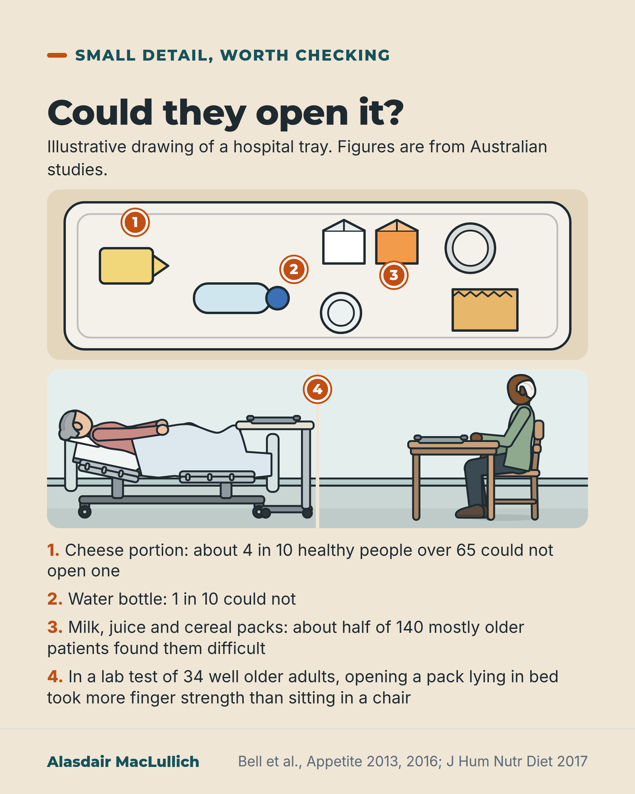

# G128: Can they open the packet?

- Category: C13 Nutrition, swallowing, hydration and mouth care
- Audience: both
- Series: Small detail, real effect
- Post type: public_explanation
- Visual format: annotated scene
- Status: text text_final, visual final
- Working id: C13-P03 (candidate C13-09)

## Insight

In Australian studies, many older people found hospital food packs hard to open, and opening them lying in bed took more finger strength than sitting in a chair. Food returned unopened may never have been within reach.

## Angle and position

Open on the tray: ask whether the person could open the pack before recording food as refused. Population labelled as well Australian volunteers and mostly older Australian inpatients.

Basis: Empirical finding: pack-opening results from Bell 2013, 2016 and 2017, limited to Australian settings. Judgement, marked 'We should': open packets, help people sit up, and record unopened food as 'not opened' not 'refused'. No study tested whether opening packets increases intake.

## X (824 characters)

```text
About four in ten healthy people over 65 could not open a hospital cheese portion.

That was an Australian test of 40 volunteers. One in ten could not open a bottle of water. In another study in four Australian hospitals, about half of 140 mostly older patients found milk, juice and cereal packs difficult to open.

In a laboratory test, 34 healthy older volunteers opened packs lying in a hospital bed and sitting in a chair. Lying down took more finger strength and finer finger control. The researchers concluded that patients should sit up to eat.

UK packs may differ, and none of these studies tested whether opening packs raises how much people eat. Even so, we should open the packet, help the person sit up, and record food that comes back unopened as "not opened", as the person may not have been able to open it.
```

## LinkedIn (1309 characters)

```text
About four in ten healthy people over 65 could not open a hospital cheese portion.

That was the result of an Australian test of 40 volunteers over 65 who lived at home. They tried packs routinely used in New South Wales hospitals. One in ten could not open a bottle of water. Tetra packs, cereal, fruit cups, desserts and biscuits were among the hardest.

Hospital patients reported similar trouble. In four Australian hospitals, about half of 140 mostly older patients found milk, juice and cereal packs difficult to open. "Difficult" is not the same as a count of people who could not open them.

Posture adds to it. In a laboratory test, 34 healthy older volunteers opened packs both lying in a hospital bed and sitting in a chair. Lying down took more finger strength and finer finger control. The researchers concluded that patients should sit up to eat.

These studies have limits. They were done in Australia, and the tests used well volunteers, so UK packs may differ. None tested whether opening packets raises how much people eat.

We should open the packet, help the person sit up before the meal, and record food returned unopened as "not opened", as the person may not have been able to open it. If you visit someone in hospital, ask whether their food is open and open it yourself if it is not.
```

## Bluesky (294 characters)

```text
About four in ten healthy people over 65 could not open a hospital cheese portion, in an Australian test of 40 volunteers. Opening packs in bed took more finger strength than in a chair. UK packs may differ. We should open packets, help people sit up, and record untouched food as "not opened".
```

## Threads (482 characters)

```text
About four in ten healthy people over 65 could not open a hospital cheese portion in an Australian test of 40 volunteers. In four Australian hospitals, about half of 140 mostly older patients found milk, juice and cereal packs difficult.

Opening packs in bed took more finger strength than in a chair. UK packs may differ.

We should open the packet, help the person sit up, and record food that comes back unopened as "not opened", as the person may not have been able to open it.
```

## Source reply

Sources: Bell 2016 https://doi.org/10.1016/j.appet.2015.12.004 ; Bell 2013 https://doi.org/10.1016/j.appet.2012.10.013 ; Bell 2017 https://doi.org/10.1111/jhn.12430

## Visual



Alt text: Annotated drawing of a hospital tray from above with numbered items: cheese portion (about 4 in 10 healthy over-65s could not open one), water bottle (1 in 10), milk, juice and cereal packs (about half of 140 patients struggled). Inset 4: an older woman in bed and an older man in a chair, with a lab finding that opening a pack in bed took more finger strength.

Editable source: `visuals/src/G128.html`

Design instructions: Annotated scene on sand. Top-down tray drawn in SVG with cheese portion, bottle, milk, juice, foil pot, cereal pack, cup; orange pins 1 to 3. Inset of two Kit scenes (older woman in hospital bed reaching to over-bed table; older man seated at table), pin 4. Numbered list below. Claims C13-09-a, C13-09-b.

## Sources and verification

- C13-09-a (supported_with_qualification): Of 40 well older people (over 65) tested on packs routinely used in NSW hospitals, 39% could not open cheese portions and 10% could not open water bottles; tetra packs, water bottles, cereal, fruit cups, desserts, biscuits and cheese portions were the hardest.
  - Source: Bell AF, Walton KL, Tapsell LC. Easy to open? Exploring the 'openability' of hospital food and beverage packaging by older adults. Appetite. 2016;98:125-32.
  - Passage: "The aim of this paper was to assess the ability of well older people living in the community to open food and beverage items routinely used in NSW hospitals ... A sample of 40 older people in good health aged over 65 years from 3 community settings participated in the study. ... Tetra packs, water bottles, cereal, fruit cups, desserts, biscuits and cheese portions appeared to be the most difficult food products to open. Ten percent of the sample could not open the water bottles and 39% could not open cheese portions." (Bell 2016 Abstract)
- C13-09-b (supported_with_qualification): Among 140 mostly older inpatients in four Australian public hospitals, several common packs were found difficult to open by at least 40% of patients, including milk and juices (52%) and cereal (49%).
  - Source: Bell AF, Walton K, Chevis JS, Davies K, Manson C, Wypych A, et al. Accessing packaged food and beverages in hospital. Exploring experiences of patients and staff. Appetite. 2013;60(1):231-8.
  - Passage: "Participants (140 mostly elderly inpatients and 64 staff members) were recruited from four local public hospitals. ... Several food and beverage packages were found difficult to open by at least 40% of patients. These included milk and juices (52%), cereal (49%), condiments (46%), tetra packs (40%) and water bottles (40%). The difficulties were attributed to 'fiddly' packaging, hand strength and vision;" (Bell 2013 Abstract)
- C13-09-c (supported_with_qualification): Opening hospital packs lying in a hospital bed needed more pinch strength and finger dexterity than sitting in a chair; the authors conclude that sitting to eat helps with opening packs.
  - Source: Bell A, Tapsell L, Walton K, Yoxall A. Accessing hospital packaged foods and beverages: the importance of a seated posture when eating. J Hum Nutr Diet. 2017;30(3):394-402.
  - Passage: "the present laboratory study examined the differences between participants opening a selection of products in a hospital bed and a chair. ... in a sample of well older community dwelling adults (n = 34). ... Honey sachets, cheese portions, foil sealed thickened pudding and tetra packs were the most difficult packs to open, with 15% of cheese portions unable to be opened in either the bed or chair posture. Although grip strength was consistent for each posture, pinch grips and dexterity were adversely affected by the bed posture. Lying in a hospital bed required greater pinch strength and dexterity to open packs. ... The present study demonstrates that eating in a seated posture is also advantageous for opening the food and beverage packs used in the NSW hospital food service and supports the notion that patients should sit to eat in hospital." (Bell 2017 Abstract (Methods, Results, Conclusions))
- C13-09-d (supported): The packaging studies are Australian (New South Wales) and mostly in well volunteers; packaging in UK hospitals may differ; recording unopened food as 'not accessible' rather than 'refused' is a judgement.
  - Source: Bell AF, Walton KL, Tapsell LC. Easy to open? Exploring the 'openability' of hospital food and beverage packaging by older adults. Appetite. 2016;98:125-32.; Bell AF, Walton K, Chevis JS, Davies K, Manson C, Wypych A, et al. Accessing packaged food and beverages in hospital. Exploring experiences of patients and staff. Appetite. 2013;60(1):231-8.; Bell A, Tapsell L, Walton K, Yoxall A. Accessing hospital packaged foods and beverages: the importance of a seated posture when eating. J Hum Nutr Diet. 2017;30(3):394-402.
  - Passage: "The aim of this paper was to assess the ability of well older people living in the community to open food and beverage items routinely used in NSW hospitals [Bell 2016]. ... Participants (140 mostly elderly inpatients and 64 staff members) were recruited from four local public hospitals. [Bell 2013; study conducted in the Illawarra region of NSW, Australia]" (Bell 2016 and Bell 2013 Abstracts)

Verification notes: C13-09-a: Bell 2016 abstract (PMID 26686584): 40 well community-dwelling people over 65; 39% could not open cheese portions, 10% water bottles; wording 'about 4 in 10' and '1 in 10'. C13-09-b: Bell 2013 abstract (PMID 23092758): 140 mostly older inpatients in 4 NSW hospitals; 'found difficult', 52% milk and juices, 49% cereal ('about half'). C13-09-c: Bell 2017 abstract (PMID 27731524): 34 healthy volunteers, bed versus chair, more pinch strength and dexterity in bed; authors conclude patients should sit to eat; the 15% figure and any success-rate difference omitted. C13-09-d: Australian setting, UK may differ, no UK study found; the action is judgement ('We should') and no study tested whether opening packs raises intake. The unsourced clause that the same kinds of packs are common in UK hospitals is not used.

## Attention and follow potential

Pause: A recognisable ward detail: the unopened cheese portion on a returned tray, with a number attached.

Gain: A specific thing to do at the bedside (open the pack, sit the person up) and a different way to read an untouched tray.

Follow: Shows the account finds small practical details with evidence behind them, and states what the studies do not show.

## Open issues

None.
