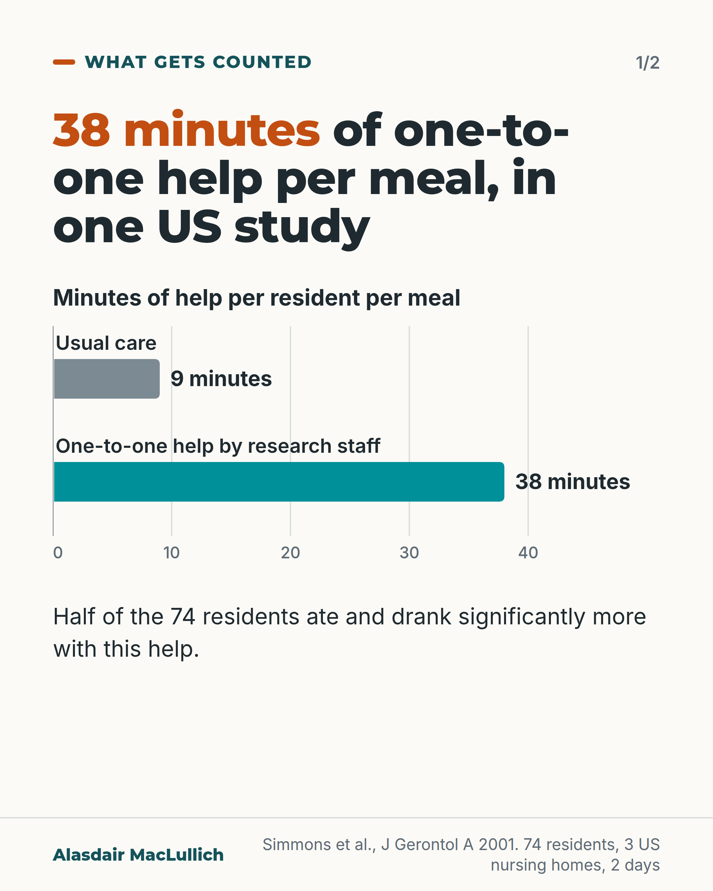
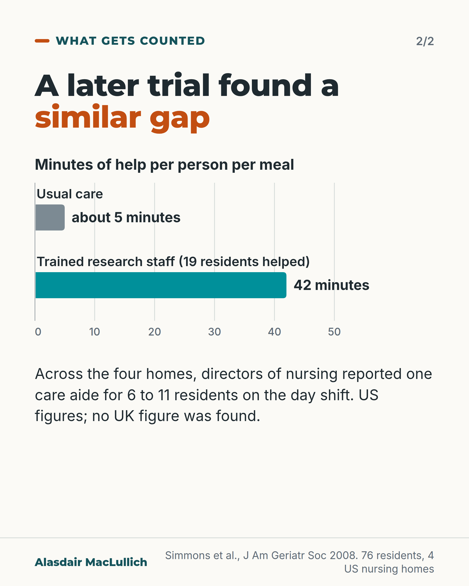

# G129: 38 minutes per meal

- Category: C13 Nutrition, swallowing, hydration and mouth care
- Audience: both
- Series: What gets counted
- Post type: criticism
- Visual format: chart (bars), 2-slide carousel
- Status: text text_final, visual final
- Working id: C13-P04 (candidate C13-36)

## Insight

In US studies, helping one nursing home resident to eat took tens of minutes per meal (38 in 2001, 42 in 2008) against 9 and about 5 in usual care. Mealtime staffing can be planned from how many people need help and how long help takes.

## Angle and position

Staffing plans count people on shift; the minutes a person needs to be helped to eat are rarely counted. When the minutes are missing, the gap is in the plan, not in the effort of care workers.

Basis: Empirical finding: minutes of help and the 2001 intake result (Simmons 2001, 2008, US only, research-staff delivered). Judgement: that mealtime staffing should be planned from the minutes help takes, and where it is not, the shortfall belongs to the plan not to care workers.

## X (893 characters)

```text
Helping one nursing home resident eat a meal took an average of 38 minutes in a US study. In usual care, residents got about 9 minutes of help.

In that 2001 study of 74 residents in three homes, half ate and drank more during two days of one-to-one help than on their usual-care days, by more than chance would explain. The research team gave the help, not the homes' own staff.

A later US trial found a similar gap: 42 minutes per person helped from trained research staff, against about 5 in usual care. Across the four homes, directors of nursing reported one care aide for 6 to 11 residents on the day shift. The authors wrote that most US homes lack the aides to give this help to everyone who needs it.

No UK figure was found. We should plan mealtime staffing from how many people need help and how long it takes. Where the minutes are not counted, the plan has no time for this help.
```

## LinkedIn (1825 characters)

```text
Helping one nursing home resident eat a meal took an average of 38 minutes in a US study. In usual care, residents got about 9 minutes of help.

That 2001 study followed 74 residents in three US nursing homes over two days and six meals. Half of the residents each ate and drank more with one-to-one help than on their usual-care days, by more than chance would explain. The help was given by the research team, not the homes' own staff. The study had no separate control group: residents were compared with their own usual-care days. It did not measure weight.

A later controlled trial, in four US homes, found a similar gap. Trained research staff took an average of 42 minutes per person to help with a meal, mostly one-to-one, for the 19 residents who received mealtime help. In usual care, residents got about 5 minutes of help per meal.

In that trial, directors of nursing reported one care aide for 6 to 11 residents on the day shift. The authors wrote that most US nursing homes do not have enough aides to give this help to everyone who needs it. They also suggested that grouping residents and offering snacks between meals may be more feasible, so one-to-one help at every meal is not the only answer.

Among 76 residents with low intake, 56 in 100 kept or gained weight over 24 weeks with the extra help, against 28 in 100 in usual care. But only 19 of the 76 were given help at meals; 57 were given snacks between meals. So the result should not be credited to the 42 minutes of mealtime help.

These are US figures from 2001 and 2008, and no UK figure was found.

We should plan mealtime staffing from how many people need help and how long it takes, as well as from how many people are on shift. Where the minutes are not counted, the plan has no time for this help, and care workers have no time to give it.
```

## Bluesky (274 characters)

```text
In a US study, one-to-one help with a meal took 38 minutes per nursing home resident; usual care gave about 9. Half of 74 residents ate and drank clearly more than on usual-care days when research staff helped them. We should plan mealtime staffing from how long help takes.
```

## Threads (495 characters)

```text
In a US study, helping one nursing home resident eat took an average of 38 minutes per meal. Usual care gave about 9. Half of the 74 residents ate and drank more with the help than usual, by more than chance would explain. The help came from the research team.

A later US trial found 42 minutes against about 5. No UK figure was found.

We should plan mealtime staffing from how many people need help and how long it takes. Where the minutes are not counted, the plan has no time for this help.
```

## Source reply

Sources: Simmons 2001 https://doi.org/10.1093/gerona/56.12.m790 ; Simmons 2008 https://doi.org/10.1111/j.1532-5415.2008.01801.x

## Visual



Alt text: Bar chart. Minutes of one-to-one mealtime help per resident per meal in a US study of 74 residents: usual care 9 minutes, one-to-one help by research staff 38 minutes. Half of the residents ate and drank significantly more with this help. Simmons 2001, 3 nursing homes, 2 days.



Alt text: Bar chart. Minutes of help per person per meal in a later US trial of 76 residents: usual care about 5 minutes, trained research staff 42 minutes. Directors of nursing reported one care aide for 6 to 11 residents on the day shift. No UK figure was found. Simmons 2008.

Editable source: `visuals/src/G129.html`

Design instructions: Carousel 2 cards, bar charts from chart.js on zero baseline, usual care grey, helped teal, values at bar ends. Axes 0-40 and 0-50 minutes. Claims C13-36-b (9 vs 38) and C13-36-c (about 5 vs 42).

## Sources and verification

- C13-36-a (supported_with_qualification): In 74 residents of three US nursing homes given a two-day, six-meal trial of one-to-one feeding assistance, half significantly increased their food and fluid intake at meals.
  - Source: Simmons SF, Osterweil D, Schnelle JF. Improving food intake in nursing home residents with feeding assistance: a staffing analysis. J Gerontol A Biol Sci Med Sci. 2001;56(12):M790-4.
  - Passage: "Seventy-four residents in three NHs received a 2-day, or six-meal, trial of one-on-one feeding assistance. Total percentage (0% to 100%) of food and fluid consumed during mealtime was estimated across 3 days during usual NH care and 2 days during the intervention. ... One half (50%) of the participants significantly increased their oral food and fluid intake during mealtime." (Simmons 2001 Abstract (Methods, Results))
- C13-36-b (supported_with_qualification): The one-to-one help took an average of 38 minutes per resident per meal, compared with 9 minutes of help given by nursing home staff in usual care; the help was given by research staff.
  - Source: Simmons SF, Osterweil D, Schnelle JF. Improving food intake in nursing home residents with feeding assistance: a staffing analysis. J Gerontol A Biol Sci Med Sci. 2001;56(12):M790-4.; Simmons SF, Keeler E, Zhuo X, Hickey KA, Sato HW, Schnelle JF. Prevention of unintentional weight loss in nursing home residents: a controlled trial of feeding assistance. J Am Geriatr Soc. 2008;56(8):1466-73.
  - Passage: "[Simmons 2001:] The intervention required significantly more staff time to implement (average of 38 minutes per resident/meal vs 9 minutes rendered by NH staff). ... These data suggest that it will almost certainly be necessary to both increase staffing levels and to organize staff better to produce higher quality feeding assistance during mealtimes. [Simmons 2008, Introduction, describing the group's earlier two-day studies:] These feeding assistance interventions required a significant increase in staff time from an average of less than 10 minutes to 35 minutes per resident per meal and one minute or less to 12 minutes per resident per snack. In these studies, research staff implemented the interventions for only a two-day period to determine the immediate effect of the interventions on residents’ oral food and fluid intake." (Simmons 2001 Abstract (Results, Conclusions); Simmons 2008 full text, Introduction)
- C13-36-c (supported): In a later controlled trial (2008) in four US nursing homes, mealtime help given by trained research staff took an average of 42 minutes per person per meal, against about 5 minutes of help in usual care.
  - Source: Simmons SF, Keeler E, Zhuo X, Hickey KA, Sato HW, Schnelle JF. Prevention of unintentional weight loss in nursing home residents: a controlled trial of feeding assistance. J Am Geriatr Soc. 2008;56(8):1466-73.
  - Passage: "[Abstract:] Seventy-six long-stay NH residents at risk for unintentional weight loss. ... Research staff provided feeding assistance twice per day during or between meals, 5 days per week for 24 weeks. ... The average amount of staff time required to provide the interventions was 42 minutes per person per meal and 13 minutes per person per between-meal snack, versus usual care, during which residents received, on average, 5 minutes of assistance per person per meal and less than 1 minute per person per snack. [Results:] Research staff spent an average of 42.19 (± 19.05) minutes per person per meal providing mealtime assistance. Most often (87% of care episodes), assistance was provided one-to-one; ... The average amount of NH staff time spent providing assistance to eat during meals to residents in the control group showed no significant change during the initial 24-week or crossover phases (average < 10 minutes per person per meal at each measurement point for all meals)." (Simmons 2008 Abstract; full text Results)
- C13-36-d (supported_with_qualification): In the 2008 trial, residents gained weight relative to usual care during the feeding-assistance periods, but most of the gain came from between-meal snacks, not mealtime help.
  - Source: Simmons SF, Keeler E, Zhuo X, Hickey KA, Sato HW, Schnelle JF. Prevention of unintentional weight loss in nursing home residents: a controlled trial of feeding assistance. J Am Geriatr Soc. 2008;56(8):1466-73.
  - Passage: "The intervention group experienced a 0.72 unit gain in final BMI value (. Model 1) and a 4-pound gain in final body weight (. Model 3) relative to the control group. ... Overall, 56% of participants maintained or gained weight during intervention compared to 28% during control. ... Of the 76 unique participants who completed intervention, 19 (25%) received mealtime assistance and 57 (75%) received snacks; thus, most of the gain in estimated total daily calories for the intervention group was due to snacks." (Simmons 2008 full text, Results (Intervention Effects))
- C13-36-e (supported_with_qualification): In the 2008 trial homes, day-shift staffing was 6 to 11 residents per nurse aide, and the authors state that most US nursing homes lack the nurse aide staffing to give feeding assistance to all residents who need it.
  - Source: Simmons SF, Keeler E, Zhuo X, Hickey KA, Sato HW, Schnelle JF. Prevention of unintentional weight loss in nursing home residents: a controlled trial of feeding assistance. J Am Geriatr Soc. 2008;56(8):1466-73.; Simmons SF, Osterweil D, Schnelle JF. Improving food intake in nursing home residents with feeding assistance: a staffing analysis. J Gerontol A Biol Sci Med Sci. 2001;56(12):M790-4.
  - Passage: "[Simmons 2008 Methods:] Nurse-aide level staff-to-resident ratios across the four NHs, as reported by the directors-of-nursing, ranged from 6 to 11 residents per nurse aide on the 7am to 3pm shift and 11 to 15 residents per nurse aide on the 3pm to 11pm shift. [Discussion:] Given that most U.S. NHs do not have adequate nurse aide staffing to provide feeding assistance for all residents in need, it may be more feasible in daily care practice to group residents at risk for unintentional weight loss for snack delivery at least twice daily. ... Finally, the interventions were provided by research staff. It is unknown if indigenous NH staff could maintain these interventions with sufficient consistency in daily care practice to have the same effects on residents’ oral intake, weight and BMI status." (Simmons 2008 full text, Methods (Setting) and Discussion)

Verification notes: C13-36-a, -b: Simmons 2001 abstract (PMID 11723156): 74 residents, 3 homes, 2 days, half significantly increased intake, 38 versus 9 minutes; delivery by research staff taken from the same authors' 2008 paper (PMID 18637983, full text). C13-36-c, -d, -e: Simmons 2008 full text: 42 versus about 5 minutes (42 minutes among the 19 residents who received mealtime help), 87% one-to-one, 56% versus 28% kept or gained weight with most of the gain from snacks, day-shift ratios 6 to 11 residents per aide, authors' statement that most US homes lack aide staffing. Qualifications carried: US, 2001 and 2008, research staff, two days and no control group (2001), no UK figure; weight result not credited to mealtime help; no shortfall calculated from ratios times minutes; one-to-one help not the only answer. 'Where the minutes are missing, the gap is in the plan' and staffing-planning advice are judgement.

## Attention and follow potential

Pause: A single number, 38 minutes, for something staffing plans rarely count: how long it takes to help one person eat.

Gain: A way to ask how long mealtime help takes in a given setting, and a reminder that a missed meal can follow the plan rather than the people.

Follow: Shows the account examines the conditions of care work without blaming care workers, and states the limits of US research-staff figures.

## Open issues

None.
