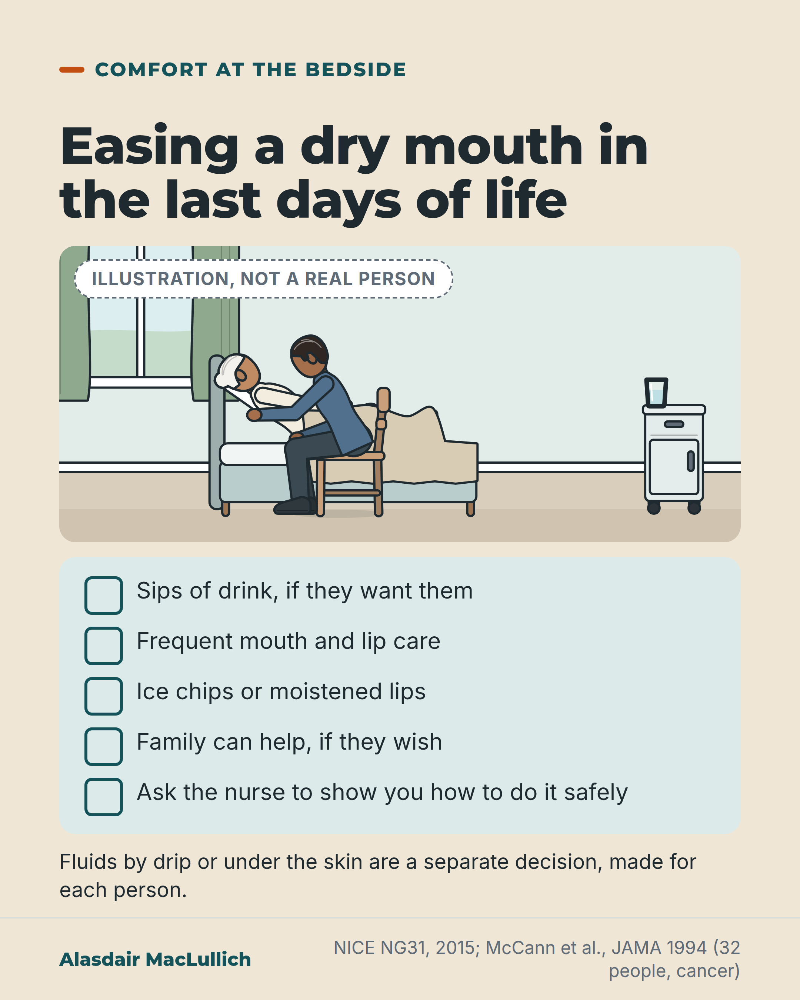

# G130: A dry mouth in the last days of life

- Category: C13 Nutrition, swallowing, hydration and mouth care
- Audience: both
- Series: Care that works
- Post type: good_care
- Visual format: drawn illustration with checklist
- Status: text text_final, visual final
- Working id: C13-P05 (candidate C13-11)

## Insight

Near the end of life, thirst and a dry mouth were relieved in a small study by frequent mouth care, moistened lips and small sips, and NICE advises mouth and lip care that family can share. Fluids by drip are a separate decision for each person, and the trial evidence on them is almost all in cancer.

## Angle and position

Frequent mouth care is something families and staff can do now; drips are neither routine nor ruled out.

Basis: Empirical finding: McCann 1994 (32 people, cancer), Bruera 2013 (129 people, cancer) and the 2023 Cochrane review. Guideline recommendation: NICE NG31 as reported in the Clinical Medicine summary. Judgement: that frequent mouth care should be part of care in the last days of life, and that assisted fluids should be discussed person by person.

## X (955 characters)

```text
Thirst and a dry mouth in the last days of life can be eased with mouth care, lip care and small sips.

A small US study followed 32 people dying in a comfort care unit. The authors described them as terminally ill with cancer, and all could say how they felt. Thirst and a dry mouth could be relieved in every case, usually with mouth care, ice chips, moistened lips and sips of drink. The amounts were far smaller than would be needed to prevent dehydration. There was no comparison group.

UK guidance from NICE (2015) advises helping the person drink if they want to, frequent mouth and lip care, and encouraging family to help if they wish. Fluids by drip or under the skin are a separate decision, considered for each person.

A 2023 Cochrane review (a review that gathers all the trials on a question) found the trials of those fluids were all in people with cancer. If someone close to you is dying, ask the team what mouth care you can help with.
```

## LinkedIn (2186 characters)

```text
Thirst and a dry mouth in the last days of life can be eased with mouth care, lip care and small sips.

In a small US study from 1994, 32 people dying in a comfort care unit were followed from admission to death. The authors described them as terminally ill with cancer. All were mentally aware and able to say how they felt, so the study says little about people who are unable to report thirst. About 6 in 10 had no thirst, or thirst only at first. Whenever hunger, thirst or a dry mouth did occur, it could be relieved, usually with mouth care, ice chips, moistened lips and sips of drink. The amounts were far smaller than would be needed to prevent dehydration. There was no comparison group, and almost all were taking opioids (strong painkillers).

UK guidance from NICE on the last days of life (2015) says to help the person drink if they want to and are able, to offer frequent care of the mouth and lips, and to encourage family to help with mouth care or drinks if they wish, with advice on doing it safely. It says fluids by drip or under the skin should be considered for each person, for example if they have distressing thirst and are unable to drink enough. They should be reviewed, and stopped if they cause harm or the person no longer wants them.

The evidence on those fluids is thin. In a trial in six US hospices, 129 people with advanced cancer were given either a litre of fluid a day or only 100 mL. The larger amount did not show a clear improvement in symptoms, quality of life or survival. The main symptoms measured were fatigue, twitching, drowsiness and hallucinations, not thirst or dry mouth. A 2023 Cochrane review found trials only in people with cancer. There was too little evidence to say whether drips improve quality of life or prolong life. Its authors say the results do not apply to people dying with dementia or other conditions, so the decision has to be made for each person without good evidence to guide it.

Frequent mouth care should be a standard part of care in the last days of life, and fluids by drip should be discussed for each person rather than given or withheld by default. If you want to help, ask the nurse to show you how.
```

## Bluesky (296 characters)

```text
In the last days of life, frequent mouth and lip care and small sips can ease a dry mouth and thirst. UK guidance (NICE) advises this care. A small US study of 32 people with cancer found thirst could be relieved. Fluids by drip are a separate decision for each person. Ask the nurse how to help.
```

## Threads (497 characters)

```text
Thirst and a dry mouth in the last days of life can be eased with mouth care, moistened lips and small sips. In a small US study of 32 mentally aware people with cancer and no comparison group, these were relieved in every case.

NICE guidance (UK, 2015) advises helping the person drink if they want to and encouraging family to help with mouth care. Fluids by drip are decided person by person. Trials of them in a 2023 Cochrane review were all in people with cancer.

Ask the nurse how to help.
```

## Source reply

Sources: NICE NG31 summary https://doi.org/10.7861/clinmedicine.16-3-254 ; McCann 1994 https://doi.org/10.1001/jama.272.16.1263 ; Bruera 2013 https://doi.org/10.1200/JCO.2012.44.6518 ; Cochrane 2023 https://doi.org/10.1002/14651858.CD006273.pub4

## Visual



Alt text: Illustration of a son sitting beside his mother's bed, leaning in to moisten her lips; she rests propped on pillows. A glass sits on the bedside table. Checklist: sips of drink if wanted, frequent mouth and lip care, ice chips or moistened lips, family can help, ask the nurse to show you. Drips are a separate decision.

Editable source: `visuals/src/G130.html`

Design instructions: Sand card. Kit scene: older woman propped in domestic bed, adult son seated leaning in, glass on bedside table, window; badge 'Illustration, not a real person'. Mint panel with five tick items; small note on drips. Sources NICE NG31 and McCann 1994.

## Sources and verification

- C13-11-a (supported): NICE guidance on care of dying adults (NG31) advises supporting people to drink if they wish and are able, offering frequent mouth and lip care, encouraging family to help if they wish, and assessing and discussing clinically assisted hydration person by person.
  - Source: Hodgkinson S, Ruegger J, Field-Smith A, et al. Care of dying adults in the last days of life. Clin Med (Lond). 2016;16(3):254-8.
  - Passage: ""Support the dying person to drink if they wish to and are able to. Check for any difficulties, such as swallowing problems or risk of aspiration. Discuss the risks and benefits of continuing to drink with the dying person and those involved in the dying person's care." "Encourage people important to the dying person to help with mouth and lip care or giving drinks, if they wish to. Provide any necessary aids and give them advice on giving drinks safely." "Assess, preferably daily, the dying person's hydration status, and review the possible need for starting or continuing clinically assisted hydration, respecting the person's wishes and preferences." "Offer frequent care of the mouth and lips to the dying person, and include the management of dry mouth in their care plan, if needed." "Consider a therapeutic trial of clinically assisted hydration if the person has or is at risk of distressing symptoms or signs that could be associated with dehydration, such as thirst or delirium, and if oral hydration is inadequate." "...review the risks and benefits of continuing clinically assisted hydration with the person and those important to them continue if there are signs of clinical benefit and reduce or stop if there are signs of possible harm to the dying person, such as fluid overload, or if they no longer want it." "The evidence for clinically assisted hydration varied from moderate to very low quality."" (Clin Med 2016 concise guideline, Box 1 Recommendations (Maintaining hydration) and commentary; full-text excerpts via Scite)
- C13-11-b (supported_with_qualification): In 32 terminally ill patients in a comfort care unit, most had no hunger or thirst or only at first, and in all patients hunger, thirst and dry mouth could be relieved, usually with small amounts of food and fluid, ice chips and lip lubrication, using far less fluid than needed to prevent dehydration.
  - Source: McCann RM, Hall WJ, Groth-Juncker A. Comfort care for terminally ill patients: the appropriate use of nutrition and hydration. JAMA. 1994;272(16):1263-6.
  - Passage: ""Ten-bed comfort care unit in a 471-bed long-term care facility." "Mentally aware, competent patients with terminal illnesses monitored from time of admission to time of death while residing in the comfort care unit." "Of the 32 patients monitored during the 12 months of study, 20 patients (63%) never experienced any hunger, while 11 patients (34%) had symptoms only initially. Similarly, 20 patients (62%) experienced either no thirst or thirst only initially during their terminal illness. In all patients, symptoms of hunger, thirst, and dry mouth could be alleviated, usually with small amounts of food, fluids, and/or by the application of ice chips and lubrication to the lips." "In this series, patients terminally ill with cancer generally did not experience hunger and those who did needed only small amounts of food for alleviation. Complaints of thirst and dry mouth were relieved with mouth care and sips of liquids far less than that needed to prevent dehydration."" (Abstract: Setting, Patients, Results, Conclusions)
- C13-11-c (supported_with_qualification): In a hospice RCT of 129 people with advanced cancer, 1 litre a day of parenteral fluid did not improve dehydration symptoms, quality of life or survival compared with 100 mL.
  - Source: Bruera E, Hui D, Dalal S, Torres-Vigil I, Trumble J, Roosth J, et al. Parenteral hydration in patients with advanced cancer: a multicenter, double-blind, placebo-controlled randomized trial. J Clin Oncol. 2013;31(1):111-8.
  - Passage: ""We randomly assigned 129 patients with cancer from six hospices to receive parenteral hydration (normal saline 1 L per day) or placebo (normal saline 100 mL per day) daily over 4 hours. The primary outcome was change in the sum of four dehydration symptoms (fatigue, myoclonus, sedation and hallucinations, 0 = best and 40 = worst possible) between day 4 and baseline." ... "We found no significant differences between the two groups for change in the sum of four dehydration symptoms (-3.3 v -2.8, P = .77)" ... "Overall survival did not differ between the two groups (median, 21 v 15 days, P = .83)." "Hydration at 1 L per day did not improve symptoms, quality of life, or survival compared with placebo."" (Abstract: Patients and Methods; Results; Conclusion)
- C13-11-d (supported): Evidence on clinically assisted hydration near death comes almost entirely from people with cancer and is very low certainty; it does not transfer to dementia or other non-cancer conditions.
  - Source: Buchan EJ, Haywood A, Syrmis W, Good P. Medically assisted hydration for adults receiving palliative care. Cochrane Database Syst Rev. 2023;12(12):CD006273.
  - Passage: ""We identified one new study (200 participants), for a total of four studies included in this update (422 participants). All participants had a diagnosis of advanced cancer." ... "We are uncertain whether MAH improves survival (HR 0.36, 95% CI 0.22 to 0.59; 1 study, 200 participants, very low-certainty evidence)." ... "In adults receiving palliative care in the end stage of their illness, there remains insufficient evidence to determine whether MAH improves QoL or prolongs survival, compared with placebo or standard care. Given that all participants were inpatients with advanced cancer at end of life, our findings are not transferable to adults receiving palliative care in other settings, for non-cancer, dementia or neurodegenerative diseases, or for those with an extended prognosis. Clinicians will need to make decisions based on the perceived benefits and harms of MAH for each individual's circumstances, without the benefit of high-quality evidence to guide them."" (Abstract: Main results; Authors' conclusions)

Verification notes: C13-11-a: NICE NG31 recommendations as read verbatim in the Clinical Medicine summary (PMID 27251915, full text); dated 2015, not checked for updates. C13-11-b: McCann 1994 abstract (PMID 7523740): 32 patients, relief in all cases, 'usually' belongs to the method; old, small, no comparison group, almost all on opioids. C13-11-c: Bruera 2013 abstract (PMID 23169523): 129 people with advanced cancer, 1 L versus 100 mL, no clear improvement; symptoms measured were not thirst or dry mouth; stated in the LinkedIn version. C13-11-d: Cochrane 2023 abstract (PMID 38095590): all cancer, very low certainty, does not transfer to dementia or non-cancer conditions. The drip is described as a separate decision, never 'not appropriate'; an evidence gap is not evidence of no benefit (stated). Overlaps with category C19 (care near the end of life); the editor asked that it run once.

## Attention and follow potential

Pause: A practical thing a family member can do at the bedside, framed as care rather than as a gap in treatment.

Gain: Permission and a method to help, and a calm way to understand the separate question of fluids by drip.

Follow: Shows the account writes about the last days of life with practical, evidence-based detail and without false reassurance.

## Open issues

- Topic overlaps with C19; coordinate so that mouth care and hydration in the last days of life runs once across the collection (the editor's note asks for this).
