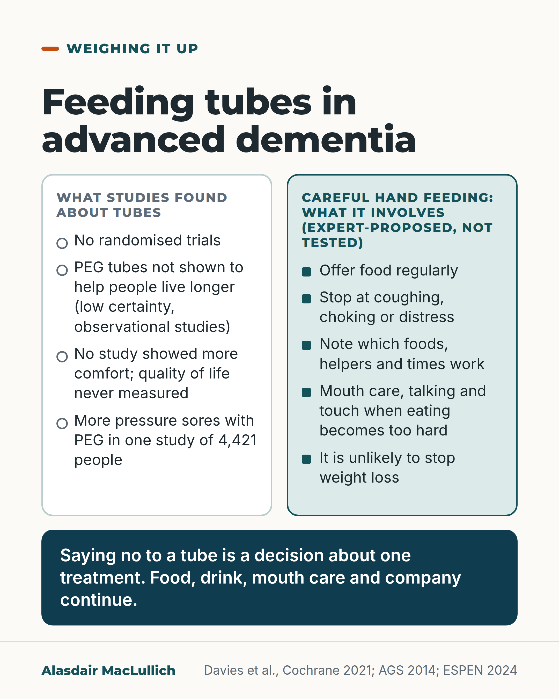

# G131: Feeding tubes in advanced dementia

- Category: C13 Nutrition, swallowing, hydration and mouth care
- Audience: both
- Series: Weighing it up
- Post type: decision_support
- Visual format: comparison
- Status: text text_final, visual final
- Working id: C13-P06 (candidate C13-18)

## Insight

Feeding tubes have not been shown to help people with severe dementia live longer or be more comfortable, and guidance recommends careful hand feeding. Declining a tube is a decision about one treatment; food, drink, mouth care and company continue.

## Angle and position

Give families and practitioners the evidence on one treatment and a description of what careful hand feeding involves, so that declining a tube never reads as withdrawing care.

Basis: Empirical finding: Cochrane 2021 (observational studies only, low and moderate certainty). Guideline recommendations: AGS 2014 and ESPEN 2024 (mostly expert consensus). Ethical judgement, marked 'We should': that careful hand feeding should be offered, tubes should not be routine, and a decision about a tube is never a decision about the person's worth.

## X (1144 characters)

```text
Feeding tubes for people with advanced dementia have not been shown to help them live longer.

A 2021 Cochrane review found no randomised trials (trials that assign treatment by chance). It found 14 observational studies (studies that watched what happened without assigning treatment). Four of them, with 36,816 people in all, looked at PEG tubes (a tube into the stomach through the skin). They did not show longer survival. The certainty of this is low, so better studies could change it. A few small studies of other tube types found longer survival, at very low certainty. No study has shown that a tube makes a person more comfortable, and none measured quality of life. In one observational study of 4,421 people, pressure sores were more common with a PEG.

US guidance from the American Geriatrics Society (2014) advises against tubes in advanced dementia and recommends careful hand feeding. European nutrition guidance (2024) says tube feeding is not an option in severe dementia.

We should treat saying no to a tube as a decision about one treatment. A person's worth is unchanged, and food, drink, mouth care and company continue.
```

## LinkedIn (2215 characters)

```text
Feeding tubes for people with advanced dementia have not been shown to help them live longer.

A 2021 Cochrane review found no randomised trials, only 14 observational studies. Four of the 14 studies looked at PEG tubes (a tube into the stomach through the skin). They did not show longer survival. The certainty of this is low, so better studies could change it. Three of four small studies of other or mixed tube types found longer survival, at very low certainty. All were observational, so the people who received tubes may have differed from those who did not.

No study has shown that a tube makes a person with severe dementia more comfortable. Quality of life was never measured, and the one study that looked at pain and comfort found no difference. In one observational study of 4,421 people, pressure sores were more common in people fed through a PEG; the review rated this moderate certainty, the only finding it rated above low. Tubes have not been shown to prevent pneumonia from food or drink going down the wrong way, and results on pneumonia were inconsistent.

The American Geriatrics Society (2014) advises against feeding tubes for older people with advanced dementia and recommends careful hand feeding. European nutrition guidance (ESPEN, 2024) says tube feeding can be a temporary option in mild or moderate dementia. It says tube feeding is not an option in severe dementia or near the end of life.

Careful hand feeding is a plan for the person. Offer food regularly, stop when they cough, choke or show distress, and write down which foods, ways of helping and times of day work best. Check texture, sitting position, dentures and medicines first. When eating becomes too hard, the mealtime continues with mouth care, talking and touch. This kind of hand feeding focuses on comfort and is unlikely to stop weight loss. This is an expert-proposed approach, not a tested one.

We should offer careful hand feeding and not use tubes routinely in advanced dementia. We should treat saying no to a tube as a decision about one treatment. A person's worth is unchanged.

If you are asked to decide, ask what careful hand feeding would involve each day, and what your relative would have wanted.
```

## Bluesky (294 characters)

```text
Feeding tubes in advanced dementia have not been shown to help people live longer or be more comfortable A 2021 Cochrane review found no trials and low-certainty evidence. Guidance favours careful hand feeding. Saying no to a tube is a choice about one treatment; a person's worth is unchanged.
```

## Threads (491 characters)

```text
Feeding tubes for people with advanced dementia have not been shown to help them live longer None showed more comfort. A 2021 Cochrane review found no trials, only 14 studies that watched what happened, with low certainty.

Guidance recommends careful hand feeding: offering food regularly and stopping at distress. The plan is expert-proposed, not tested.

We should treat saying no to a tube as a choice about one treatment; a person's worth is unchanged. Food, drink and company continue.
```

## Source reply

Sources: Cochrane 2021 https://doi.org/10.1002/14651858.CD013503.pub2 ; AGS 2014 https://doi.org/10.1111/jgs.12924 ; ESPEN 2024 https://doi.org/10.1016/j.clnu.2024.04.039 ; Palecek 2010 https://doi.org/10.1111/j.1532-5415.2010.02740.x

## Visual



Alt text: Comparison card on feeding tubes in advanced dementia. Left: no randomised trials; PEG not shown to help people live longer; no study showed more comfort; more pressure sores in one study of 4,421. Right: careful hand feeding, expert-proposed and untested. Saying no to a tube is a decision about one treatment; food, drink, mouth care and company continue.

Editable source: `visuals/src/G131.html`

Design instructions: Comparison card: white column findings about tubes, mint column careful hand feeding; deep teal band with the closing line in white. No drawing. Sources Davies Cochrane 2021, AGS 2014, ESPEN 2024.

## Sources and verification

- C13-18-a (supported_with_qualification): A 2021 Cochrane review found no randomised trials of tube feeding in severe dementia, only 14 non-randomised studies; studies of PEG tubes found no evidence that they help people live longer (low-certainty evidence).
  - Source: Davies N, Barrado-Martín Y, Vickerstaff V, Rait G, Fukui A, Candy B, et al. Enteral tube feeding for people with severe dementia. Cochrane Database Syst Rev. 2021;8(8):CD013503.
  - Passage: ""We found no eligible RCTs. We included fourteen controlled, non-randomised studies. All the included studies compared outcomes between groups of people who had been assigned to enteral tube feeding or oral feeding by prior decision of a healthcare professional. Some studies controlled for a range of confounding factors, but there were high or very high risks of bias due to confounding in all studies, and high or critical risks of selection bias in some studies. Four studies with 36,816 participants assessed the effect of PEG feeding on survival time. None found any evidence of effects on survival time (low-certainty evidence). Three of four studies using mixed or unspecified enteral tube feeding methods in 310 participants (227 enteral tube feeding, 83 no enteral tube feeding) found them to be associated with longer survival time. The fourth study (1386 participants: 135 enteral tube feeding, 1251 no enteral tube feeding) found no evidence of an effect. The certainty of this body of evidence is very low." Plain language summary: "We included 14 studies that included 49,714 participants. Of these, 6203 were tube-fed and 43,511 were not." ... "PEG may make no difference to how long people live (4 studies, 36,816 people)" ... "Studies of people with either PEG or nasogastric tubes showed tube feeding may increase the length of time people live (4 studies, 1696 people)"" (Abstract, Main results; Plain language summary, What did we find)
- C13-18-b (supported): In one large study (4,421 people), PEG feeding was linked with a higher risk of pressure ulcers; this is the only finding the Cochrane review rated as moderate certainty.
  - Source: Davies N, Barrado-Martín Y, Vickerstaff V, Rait G, Fukui A, Candy B, et al. Enteral tube feeding for people with severe dementia. Cochrane Database Syst Rev. 2021;8(8):CD013503.
  - Passage: ""One study of PEG feeding (4421 participants: 1585 PEG, 2836 no enteral tube feeding) found PEG feeding increased the risk of pressure ulcers (moderate-certainty evidence). Two of three studies reported an increase in the number of pressure ulcers in those receiving mixed or unspecified enteral tube feeding (234 participants: 88 enteral tube feeding, 146 no enteral tube feeding). The third study found no effect (very-low certainty evidence)." Plain language summary: "PEG ... leads to a small increase in the chance of developing pressure sores (1 study, 4421 people)." ... "We have moderate confidence in our finding that pressure ulcers were more common in people who were fed with a PEG tube. However, we have little to very little confidence for our other findings."" (Abstract, Main results; Plain language summary, Main results and limitations)
- C13-18-c (partly_supported): The balance of evidence suggested more pneumonia with tube feeding (Davies 2021).
  - Source: Davies N, Barrado-Martín Y, Vickerstaff V, Rait G, Fukui A, Candy B, et al. Enteral tube feeding for people with severe dementia. Cochrane Database Syst Rev. 2021;8(8):CD013503.; American Geriatrics Society. American Geriatrics Society feeding tubes in advanced dementia position statement. J Am Geriatr Soc. 2014;62(8):1590-3.
  - Passage: "Davies 2021: "Five studies reported a variety of harm-related outcomes with inconsistent results. The balance of evidence suggested increased risk of pneumonia with enteral tube feeding." AGS 2014: "Careful hand feeding should be offered because hand feeding has been shown to be as good as tube feeding for the outcomes of death, aspiration pneumonia, functional status, and comfort."" (Davies 2021 Abstract, Main results; AGS 2014 Abstract)
- C13-18-d (supported_with_qualification): No study has shown that tube feeding makes people with severe dementia more comfortable or improves quality of life: none measured quality of life, and the one study of pain and comfort found no difference.
  - Source: Davies N, Barrado-Martín Y, Vickerstaff V, Rait G, Fukui A, Candy B, et al. Enteral tube feeding for people with severe dementia. Cochrane Database Syst Rev. 2021;8(8):CD013503.
  - Passage: ""None of the included studies assessed quality of life. Only one study, using mixed methods of enteral tube feeding, reported on pain and comfort, finding no difference between groups. In the same study, a higher proportion of carers reported very heavy burden in the enteral tube feeding group compared to no enteral tube feeding." Authors' conclusions: "We found no evidence that tube feeding improves survival; improves quality of life; reduces pain; reduces mortality; decreases behavioural and psychological symptoms of dementia; leads to better nourishment; improves family or carer outcomes such as depression, anxiety, carer burden, or satisfaction with care; and no indication of harm."" (Abstract, Main results and Authors' conclusions)
- C13-18-e (supported): The American Geriatrics Society does not recommend feeding tubes for older adults with advanced dementia, recommends careful hand feeding, and says tube feeding is a treatment that can be accepted or declined according to the person's wishes.
  - Source: American Geriatrics Society. American Geriatrics Society feeding tubes in advanced dementia position statement. J Am Geriatr Soc. 2014;62(8):1590-3.
  - Passage: ""When eating difficulties arise, feeding tubes are not recommended for older adults with advanced dementia. Careful hand feeding should be offered because hand feeding has been shown to be as good as tube feeding for the outcomes of death, aspiration pneumonia, functional status, and comfort. Moreover, tube feeding is associated with agitation, greater use of physical and chemical restraints, healthcare use due to tube-related complications, and development of new pressure ulcers. Efforts to enhance oral feeding by altering the environment and creating patient-centered approaches to feeding should be part of usual care for older adults with advanced dementia. Tube feeding is a medical therapy that an individual's surrogate decision-maker can decline or accept in accordance with advance directives, previously stated wishes, or what it is thought the individual would want."" (Abstract)
- C13-18-f (supported): The 2024 ESPEN dementia guideline says tube or drip feeding and hydration are temporary options in mild or moderate dementia, but not in severe dementia or the last phase of life.
  - Source: Volkert D, Beck AM, Faxén-Irving G, Frühwald T, Hooper L, Keller H, et al. ESPEN guideline on nutrition and hydration in dementia - Update 2024. Clin Nutr. 2024;43(6):1599-1626.
  - Passage: ""Oral nutrition may be supported by eliminating potential causes of malnutrition and dehydration, and adequate social and nursing support (including assistance, utensils, training and oral care)." ... "Enteral and parenteral nutrition and hydration are temporary options in patients with mild or moderate dementia, but not in severe dementia or in the terminal phase of life." ... "Due to a lack of appropriate studies, most recommendations are good practice points."" (Abstract, Results)
- C13-18-h (supported_with_qualification): Careful hand feeding ('comfort feeding only') is an individual plan: feed regularly, stop at signs of distress such as coughing or choking, record the foods, techniques and times of day that work; when eating is no longer possible, continue contact through mouth care, talking and touch. It is unlikely to prevent weight loss.
  - Source: Palecek EJ, Teno JM, Casarett DJ, Hanson LC, Rhodes RL, Mitchell SL. Comfort feeding only: a proposal to bring clarity to decision-making regarding difficulty with eating for persons with advanced dementia. J Am Geriatr Soc. 2010;58(3):580-4.; American Geriatrics Society. American Geriatrics Society feeding tubes in advanced dementia position statement. J Am Geriatr Soc. 2014;62(8):1590-3.
  - Passage: "Palecek 2010 full text: "According to an individualized care plan, she should be fed regularly, with cessation of oral feeding when she begins to show signs of distress (e.g., choking, coughing). Her individualized care plan should document unique signs of distress, which behaviors indicate it is safe to feed, what types of foods are preferable, effective feeding techniques, and at what times of day feeding is preferable. When Mrs. P no longer tolerates oral feedings, the nursing home staff provides an alternative means of positive human interaction, in lieu of feeding, for the remainder of the meal period. Interaction may involve speaking to her and therapeutic touch" ... "In the situation in which the patient is unable to eat without significant distress, the care plan for CFO calls for a form of continued interaction with the resident, which could include assiduous mouth care, speaking to the resident, and therapeutic touch." ... (earlier assessment) "Specific interventions include altering the texture, cohesiveness, viscosity, temperature, and density of Mrs. P's food; changing her posture while eating; environmental modifications; denture adjustment or addressing other dental concerns; and medication adjustment." [reference markers removed] ... (illustrative dialogue) "this order of Comfort Feeding Only places a premium on her comfort during meals but is unlikely to keep her from losing weight." AGS 2014: "Efforts to enhance oral feeding by altering the environment and creating patient-centered approaches to feeding should be part of usual care for older adults with advanced dementia."" (Palecek 2010 full text: sections 'Reframing the discussion' and 'Managing the care of Mrs. P'; AGS 2014 Abstract)
- C13-18-i (supported): Declining a feeding tube does not mean stopping food, drink or care; orders to forgo tube feeding are often wrongly read as 'do not feed'.
  - Source: Palecek EJ, Teno JM, Casarett DJ, Hanson LC, Rhodes RL, Mitchell SL. Comfort feeding only: a proposal to bring clarity to decision-making regarding difficulty with eating for persons with advanced dementia. J Am Geriatr Soc. 2010;58(3):580-4.; American Geriatrics Society. American Geriatrics Society feeding tubes in advanced dementia position statement. J Am Geriatr Soc. 2014;62(8):1590-3.
  - Passage: "Palecek 2010 abstract: "One reason is that orders to forgo artificial hydration and nutrition get wrongly interpreted as "do not feed," resulting in a reluctance of families to agree to them." ... "Comfort feeding only through careful hand feeding, if possible, offers a clear goal-oriented alternative to tube feeding and eliminates the apparent care-no care dichotomy imposed by current orders to forgo artificial hydration and nutrition." AGS 2014: "Tube feeding is a medical therapy that an individual's surrogate decision-maker can decline or accept in accordance with advance directives, previously stated wishes, or what it is thought the individual would want."" (Palecek 2010 Abstract; AGS 2014 Abstract)

Verification notes: C13-18-a, -b, -d: Cochrane 2021 (PMID 34387363, abstract): no RCTs, 14 observational studies, PEG not shown to improve survival (low certainty), 3 of 4 mixed-tube studies longer survival (very low), pressure sores moderate certainty in 4,421 people, increase described as small, no QoL studies, one comfort study with no difference. C13-18-c (partly supported): pneumonia worded as 'not shown to prevent' with inconsistent results, not headlined. C13-18-e: AGS 2014 (PMID 25039796). C13-18-f: ESPEN 2024 (PMID 38772068). C13-18-h: Palecek 2010 full text and AGS; the plan is an expert-proposed approach; 'sitting upright', 'small mouthfuls' not used. C13-18-i: declining a tube is a decision about one treatment; 'never about the person's worth' is judgement marked 'We should'. NICE NG97 (search extract only) is not used. Check with the editor if a UK guideline line is wanted.

## Attention and follow potential

Pause: It opens on the question families and practitioners face and states what the evidence on one treatment is, without telling anyone what to choose.

Gain: A clear statement that declining a tube is not stopping care, and a description of what careful hand feeding involves that can be discussed with the team.

Follow: Shows the account handles a sensitive decision with exact evidence, states uncertainty and keeps the person's dignity separate from a treatment's benefit.

## Open issues

- NICE NG97 wording is available only as a search extract, so it was left out; add a UK guideline line only after the live NICE page is checked.
