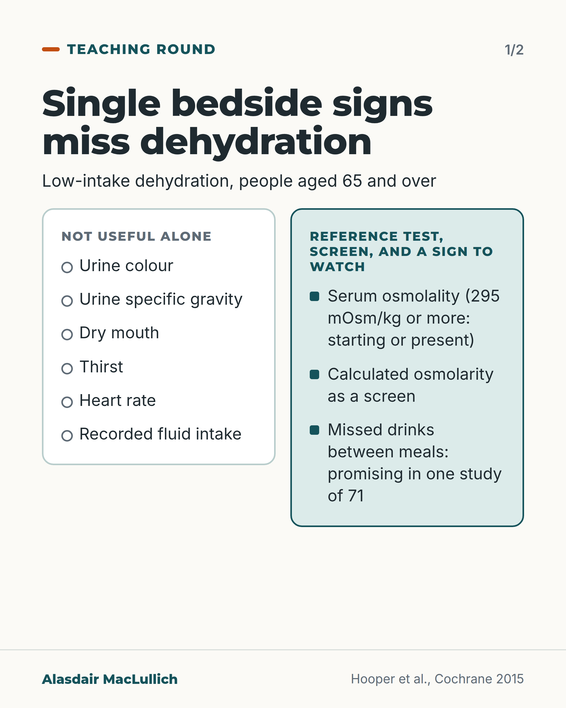
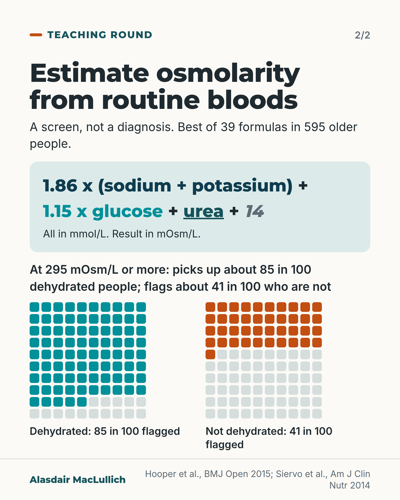

# G132: Bedside signs of dehydration

- Category: C13 Nutrition, swallowing, hydration and mouth care
- Audience: practitioners
- Series: Teaching round
- Post type: teaching
- Visual format: carousel (2 slides)
- Status: text text_final, visual final
- Working id: C13-P07 (candidate C13-20)

## Insight

Urine colour, a dry mouth, thirst, heart rate and recorded fluid intake each fail as a single test for dehydration from too little drinking in people aged 65 and over. Serum osmolality is the reference, and calculated osmolarity is a usable screen when it is not measured.

## Angle and position

Do not diagnose or exclude water-loss dehydration from one bedside sign; measure or calculate osmolality when the answer will change care, and note missed drinks between meals.

Basis: Empirical finding: Cochrane 2015, DRIE 2016 and the osmolarity equation validation (Hooper 2015, Siervo 2014). Clinical interpretation: the advice to use osmolality when the answer changes care.

## X (981 characters)

```text
Urine colour, a dry mouth and thirst each fail as a single test for dehydration from too little drinking in people aged 65 and over.

A Cochrane review of 24 studies found six signs not useful alone for spotting or ruling out dehydration from too little drinking: urine colour, urine specific gravity, dry mouth, thirst, heart rate and recorded fluid intake. They miss many dehydrated people and label others wrongly. In 188 UK care home residents (people with heart or kidney failure excluded), 1 in 5 had a blood osmolality over 300 mOsm/kg, the level counted as dehydrated, and thirst was not linked with it.

Missing drinks between meals looked promising in one study of 71 people. It has not been confirmed.

When osmolality is not measured, 1.86 x (sodium + potassium) + 1.15 x glucose + urea + 14 (all in mmol/L) gives a calculated osmolarity in mOsm/L, which estimates osmolality (mOsm/kg). A calculated result of 295 or more is a reason to check osmolality or look closer.
```

## LinkedIn (2008 characters)

```text
Urine colour, a dry mouth and thirst each fail as a single test for dehydration from too little drinking in people aged 65 and over.

A Cochrane review pooled data from 24 studies. Urine colour, urine specific gravity, dry mouth, thirst, heart rate and recorded fluid intake were each not useful on their own for spotting or ruling out dehydration from not drinking enough. Used alone, they miss many people who are dehydrated and wrongly label others who are not. The review suggests combining tests may help, and it does not call these observations worthless as part of a wider assessment. It covers water-loss (low-intake) dehydration, not salt-and-water loss from vomiting, diarrhoea or bleeding.

The reference was a blood test, serum osmolality: 295 mOsm/kg or more meant dehydration was starting or present, and over 300 meant it was present.

A UK study included 188 care home residents with an average age of 86. People with heart or kidney failure were excluded. One in 5 had a serum osmolality over 300 mOsm/kg, the level counted as current dehydration. Whether residents felt thirsty was not linked with whether they were dehydrated.

Only a few signs showed any promise. In one small study of 71 older people, missing drinks between meals was the most promising, and it has not been confirmed elsewhere.

If measured osmolality (mOsm/kg) is not available, osmolarity (mOsm/L) can be calculated from routine blood results to estimate it: 1.86 x (sodium + potassium) + 1.15 x glucose + urea + 14, all in mmol/L. This was the best of 39 formulas tested in 595 older people. At a cut-point of 295 mOsm/L it picked up about 85 in 100 people who were dehydrated (measured osmolality over 300) and wrongly flagged about 41 in 100 who were not. It is a screen: a result of 295 or more is a reason to check measured osmolality.

In practice: when the answer will change care, check osmolality or calculate osmolarity rather than relying on one bedside sign, and note when drinks between meals are missed.
```

## Bluesky (294 characters)

```text
Urine colour, dry mouth, thirst and heart rate each fail as a single test for dehydration from low intake in people over 65 (Cochrane, 24 studies). Serum osmolality is the reference. Missed drinks between meals looked promising in one small study. Check osmolality when the answer changes care.
```

## Threads (498 characters)

```text
Urine colour, a dry mouth and thirst each fail as a single test for dehydration from too little drinking in people aged 65 and over (Cochrane, 24 studies). They miss many dehydrated people and label others wrongly.

In 188 UK care home residents (people with heart or kidney failure excluded), 1 in 5 had a blood osmolality over 300 mOsm/kg, counted as dehydrated; thirst was not linked with it.

If it will change care, check osmolality (a blood test) or calculate osmolarity from routine results.
```

## Source reply

Sources: Cochrane 2015 https://doi.org/10.1002/14651858.CD009647.pub2 ; DRIE 2016 https://doi.org/10.1093/gerona/glv205 ; Hooper 2015 equation https://doi.org/10.1136/bmjopen-2015-008846 ; Siervo 2014 https://doi.org/10.3945/ajcn.114.086769

## Visual



Alt text: Card 1 of 2. Single bedside signs are not useful alone for low-intake dehydration in people 65 and over: urine colour, urine specific gravity, dry mouth, thirst, heart rate, recorded fluid intake. Alongside: serum osmolality as reference test, calculated osmolarity as a screen, and missed drinks between meals as a promising sign.



Alt text: Card 2 of 2. Calculated osmolarity equals 1.86 times (sodium plus potassium) plus 1.15 times glucose plus urea plus 14, all in mmol/L. At 295 mOsm/L or more it flags about 85 in 100 dehydrated people and 41 in 100 who are not, shown as two icon arrays. A screen, not a diagnosis.

Editable source: `visuals/src/G132.html`

Design instructions: Carousel 2 cards. Card 1 two-column comparison (not useful alone vs reference test, screen, sign). Card 2 equation on mint panel with terms in different tones, two 10x10 icon arrays (85 teal, 41 orange) with captions. Claim C13-20-e.

## Sources and verification

- C13-20-a (supported): A Cochrane review of 24 studies in people aged 65 and over found that common one-off tests, including fluid intake, urine specific gravity, urine colour, urine volume, heart rate, dry mouth and feeling thirsty, should not be relied on alone to detect or rule out water-loss dehydration; single tests miss many dehydrated people and wrongly label well-hydrated people.
  - Source: Hooper L, Abdelhamid A, Attreed NJ, Campbell WW, Channell AM, Chassagne P, et al. Clinical symptoms, signs and tests for identification of impending and current water-loss dehydration in older people. Cochrane Database Syst Rev. 2015;2015(4):CD009647.
  - Passage: ""We included three studies with published diagnostic accuracy data and a further 21 studies provided datasets that we analysed. We assessed 67 tests (at three cut-offs for each continuous outcome) for diagnostic accuracy of water-loss dehydration (primary target condition) and of current dehydration (secondary target condition)." ... "There was sufficient evidence to suggest that several stand-alone tests often used to assess dehydration in older people (including fluid intake, urine specific gravity, urine colour, urine volume, heart rate, dry mouth, feeling thirsty and BIA assessment of intracellular water or extracellular water) are not useful, and should not be relied on individually as ways of assessing presence or absence of dehydration in older people." ... "Individual tests should not be used in this population to indicate dehydration; they miss a high proportion of people with dehydration, and wrongly label those who are adequately hydrated."" (Abstract, Main results and Authors' conclusions)
- C13-20-b (supported): The reference standard was serum osmolality: 295 mOsm/kg or more counted as impending or current water-loss dehydration and over 300 mOsm/kg as current dehydration.
  - Source: Hooper L, Abdelhamid A, Attreed NJ, Campbell WW, Channell AM, Chassagne P, et al. Clinical symptoms, signs and tests for identification of impending and current water-loss dehydration in older people. Cochrane Database Syst Rev. 2015;2015(4):CD009647.
  - Passage: ""Water-loss dehydration was defined primarily as including everyone with either impending or current water-loss dehydration (including all those with serum osmolality ≥ 295 mOsm/kg as being dehydrated)." ... "Diagnostic accuracy of each test was assessed against the best available reference standard for water-loss dehydration (serum or plasma osmolality cut-off ≥ 295 mOsm/kg, serum osmolarity or weight change) within each study." ... "Secondary target conditions were intended as current (> 300 mOsm/kg) and impending (295 to 300 mOsm/kg) water-loss dehydration, but restricted to current dehydration in the final review."" (Abstract, Objectives and Data collection and analysis)
- C13-20-c (supported_with_qualification): Missing drinks between meals and expressing fatigue showed some diagnostic ability in one study of 71 people; no test was consistently useful in more than one study.
  - Source: Hooper L, Abdelhamid A, Attreed NJ, Campbell WW, Channell AM, Chassagne P, et al. Clinical symptoms, signs and tests for identification of impending and current water-loss dehydration in older people. Cochrane Database Syst Rev. 2015;2015(4):CD009647.
  - Passage: ""Only three tests showed any ability to diagnose water-loss dehydration (including both impending and current water-loss dehydration) as stand-alone tests: expressing fatigue (sensitivity 0.71 (95% CI 0.29 to 0.96), specificity 0.75 (95% CI 0.63 to 0.85), in one study with 71 participants, but two additional studies had lower sensitivity); missing drinks between meals (sensitivity 1.00 (95% CI 0.59 to 1.00), specificity 0.77 (95% CI 0.64 to 0.86), in one study with 71 participants) and BIA resistance at 50 kHz ..." ... "No test was consistently useful in more than one study.Combining two tests so that an individual both missed some drinks between meals and expressed fatigue was sensitive at 0.71 (95% CI 0.29 to 0.96) and specific at 0.92 (95% CI 0.83 to 0.97)." ... "Promising tests identified by this review need to be further assessed, as do new methods in development."" (Abstract, Main results and Authors' conclusions)
- C13-20-d (supported): In 188 UK care home residents (mean age 86), 1 in 5 were dehydrated on blood testing, and thirst was not associated with hydration status.
  - Source: Hooper L, Bunn DK, Downing A, Jimoh FO, Groves J, Free C, et al. Which frail older people are dehydrated? The UK DRIE study. J Gerontol A Biol Sci Med Sci. 2016;71(10):1341-7.
  - Passage: ""The Dehydration Recognition In our Elders (DRIE) cohort study included people aged 65 or older living in long-term care without heart or renal failure." ... "DRIE included 188 residents (mean age 86 years, 66% women) of whom 20% were dehydrated (serum osmolality >300 mOsm/kg)." ... "Thirst was not associated with hydration status."" (Abstract, Methods and Results)
- C13-20-e (supported_with_qualification): When measured serum osmolality is not available, calculated osmolarity = 1.86 x (Na + K) + 1.15 x glucose + urea + 14 (all mmol/L) was the best of 39 equations in 595 older people across 5 cohorts; at a cut-point of 295 mOsm/L it had sensitivity 85% and specificity 59%, and the authors suggest laboratories report it as a screen.
  - Source: Hooper L, Abdelhamid A, Ali A, Bunn DK, Jennings A, John WG, et al. Diagnostic accuracy of calculated serum osmolarity to predict dehydration in older people: adding value to pathology laboratory reports. BMJ Open. 2015;5(10):e008846.; Siervo M, Bunn D, Prado CM, Hooper L. Accuracy of prediction equations for serum osmolarity in frail older people with and without diabetes. Am J Clin Nutr. 2014;100(3):867-76.
  - Passage: "Hooper 2015 BMJ Open: "Across 5 cohorts 595 older people were included, of whom 19% were dehydrated (directly measured osmolality>300 mOsm/kg). Of 39 osmolarity equations, 5 showed reasonable agreement with directly measured osmolality and 3 had good predictive accuracy in subgroups with diabetes and poor renal function." ... "The best equation was osmolarity=1.86×(Na++K+)+1.15×glucose+urea+14 (all measured in mmol/L). It appeared useful in people aged ≥65 years with and without diabetes, poor renal function, dehydration, in men and women, with a range of ages, health, cognitive and functional status." ... "Some commonly used osmolarity equations work poorly, and should not be used. Given costs and prevalence of dehydration in older people we suggest use of the best formula by pathology laboratories using a cutpoint of 295 mOsm/L (sensitivity 85%, specificity 59%), to report dehydration risk opportunistically when serum glucose, urea and electrolytes are measured for other reasons in older adults." Siervo 2014: "One [calculated osmolarity = 1.86 × (Na⁺ + K⁺) + 1.15 × glucose + urea +14; all in mmol/L] was characterized by narrower limits of agreement and the capacity to predict serum osmolality within 2% in >80% of participants, regardless of diabetes or hydration status." ... "This equation may be used to predict hydration status in frail older people (as a first-stage screening)"" (Hooper 2015 BMJ Open Abstract, Results and Conclusions; Siervo 2014 Abstract, Results and Conclusions)

Verification notes: C13-20-a, -b, -c: Cochrane 2015 abstract (PMID 25924806): 24 studies, 67 tests, single tests not useful alone, reference serum osmolality 295 or more (impending or current) and over 300 (current); missed drinks between meals in one study of 71 (sensitivity 0.59 to 1.00 lower bound not stated). Scope qualification carried (water-loss dehydration). C13-20-d: DRIE (PMID 26553658): 188 UK residents, mean age 86, 20% dehydrated, thirst not associated; heart and kidney failure excluded. C13-20-e: Hooper 2015 BMJ Open (PMID 26490100) and Siervo 2014 (PMID 25030781): equation, best of 39 in 595 older people; one set of accuracy figures given (Hooper 2015: 85% and 59%); units stated. The practice line (check or calculate osmolality when the answer changes care) is clinical interpretation. The ESPEN optional line (C13-20-f) is not used.

## Attention and follow potential

Pause: Familiar bedside shortcuts (urine colour, dry mouth, thirst) are named in the first line and shown to fail alone.

Gain: A usable alternative (calculated osmolarity) with its accuracy, and a sign to watch (missed drinks) with its limits.

Follow: Shows the account teaches clinical distinctions from the primary evidence, with numbers and units a practitioner can use.

## Open issues

None.
