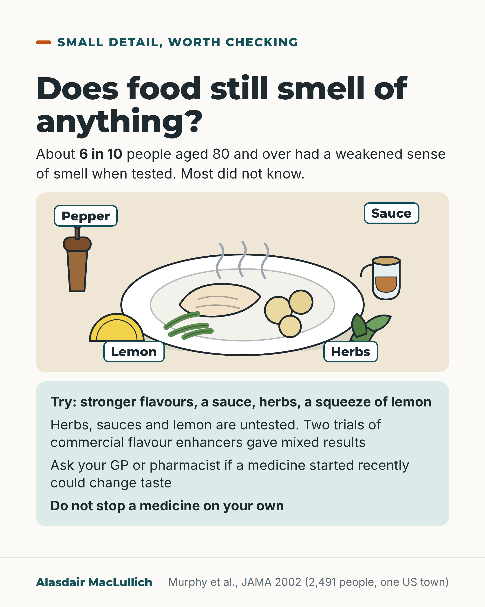

# G133: When food tastes of nothing

- Category: C13 Nutrition, swallowing, hydration and mouth care
- Audience: public
- Series: Small detail, real effect
- Post type: public_explanation
- Visual format: drawn illustration with labels
- Status: text text_final, visual final
- Working id: C13-P08 (candidate C13-23)

## Insight

A weakened sense of smell is very common in people aged 80 and over and most do not know they have it. Smell is a large part of flavour, so food can seem to taste of less.

## Angle and position

Open with a real question and the unnoticed smell loss, then offer things to try, said plainly to be untested, and a check on medicines.

Basis: Empirical finding: Murphy 2002 prevalence of impaired smell and low self-awareness; qualitative link between smell and flavour; medicines can change taste; mixed trials of added flavour. Suggestions (lemon, herbs, sauces) are untested practical ideas, marked as things to try.

## X (869 characters)

```text
Does food still smell of anything to you?

A study in one Wisconsin town around the year 2000 tested the sense of smell of 2,491 people aged 53 to 97. About 6 in 10 of those aged 80 and over had a weakened sense of smell, and most of them did not know.

Smell is one of the biggest parts of flavour, so food can seem to taste of less. Age, illness, medicines, smoking and a blocked nose are all linked with a weaker sense of smell.

Things to try, though none has been tested: stronger flavours, a sauce, herbs or a squeeze of lemon. Two trials of commercial flavour enhancers in Dutch nursing homes disagreed. In the first, residents given flavour-enhanced meals gained about 1 kg while others lost a little. In the second, eating and weight did not change.

If food has tasted wrong since a medicine was started, ask your GP or pharmacist. Do not stop it on your own.
```

## LinkedIn (1584 characters)

```text
Does food still smell of anything to you?

In a US study that tested the sense of smell of 2,491 people aged 53 to 97, about 1 in 4 had a weakened sense of smell. Among those aged 80 and over it was about 6 in 10. Most people with a weak sense of smell did not know they had it: when asked, only 12% to 18% of people aged 80 and over with a weak sense of smell said they had a problem. The study was in one US community, around the year 2000.

Smell is one of the biggest parts of flavour. A weaker sense of smell can make food less enjoyable and seem to taste of less. Smell and taste can fade with age. Illness, medicines, smoking and a blocked nose are also linked with a weaker sense of smell.

Many medicines can dull or change taste, including some blood pressure tablets, antibiotics and antidepressants. How often this happens is not well known. If food has tasted wrong since a medicine was started, ask your GP or pharmacist. Do not stop a medicine on your own.

Things to try: stronger flavours, a sauce, herbs or a squeeze of lemon. These are reasonable ideas, but they have not been tested in trials, and the trials of adding flavour to meals have mixed results. In one Dutch care home study, residents given flavour-enhanced meals gained about 1 kg over 16 weeks while others lost a little. A later randomised trial by the same group found no change in how much residents ate or weighed. Both used commercial flavour enhancers, not herbs or sauces.

If someone you know has stopped enjoying meals, ask their GP or nurse to check their sense of smell and their medicines.
```

## Bluesky (299 characters)

```text
Does food still smell of anything? In one US town, about 6 in 10 people aged 80+ had a weakened sense of smell, and most did not know. Smell is a big part of flavour. Try stronger flavours (untested). Two flavour enhancer trials disagreed. Ask your GP or pharmacist if a medicine could change taste.
```

## Threads (498 characters)

```text
Does food still smell of anything to you?

In a study of 2,491 people in one Wisconsin town, about 6 in 10 of those aged 80 and over had a weakened sense of smell, and most did not know. Smell is a large part of flavour, so food can taste blander.

Things to try (untested): stronger flavours, sauces, herbs, lemon. Two trials of flavour enhancers disagreed: one found weight gain, the other no change. If food has tasted wrong since a new medicine, ask your GP or pharmacist. Do not stop it alone.
```

## Source reply

Sources: Murphy 2002 https://doi.org/10.1001/jama.288.18.2307 ; Schiffman 1997 https://pubmed.ncbi.nlm.nih.gov/9343468/ ; Doty 2008 https://doi.org/10.2165/00002018-200831030-00002 ; Mathey 2001 https://doi.org/10.1093/gerona/56.4.m200 ; Essed 2007 https://doi.org/10.1016/j.appet.2006.06.002

## Visual



Alt text: Drawing of a plate of poached fish, potatoes and green beans with steam, with a pepper mill, sauce jug, lemon wedge and herbs, each labelled. About 6 in 10 people aged 80 and over had a weakened sense of smell on testing. Tips: stronger flavours; these are untested. Ask a GP or pharmacist about medicines; do not stop one yourself.

Editable source: `visuals/src/G133.html`

Design instructions: Light card. SVG plate of fish, potatoes, beans, steam, with pepper mill, sauce jug, lemon, herbs and four labels. Mint panel with tips and caveats. Claim C13-23-a (about 6 in 10, stated in words).

## Sources and verification

- C13-23-a (supported): In a population study of 2,491 people aged 53 to 97 in Wisconsin, about 1 in 4 had an impaired sense of smell on testing, rising to 62.5% of those aged 80 to 97; most did not know (self-report detected only 12% to 18% of cases in the oldest group).
  - Source: Murphy C, Schubert CR, Cruickshanks KJ, Klein BE, Klein R, Nondahl DM. Prevalence of olfactory impairment in older adults. JAMA. 2002;288(18):2307-12.
  - Passage: ""A total of 2491 Beaver Dam, Wis, residents aged 53 to 97 years participating in the 5-year follow-up examination (1998-2000) for the Epidemiology of Hearing Loss Study, a population-based, cross-sectional study." ... "The mean (SD) prevalence of impaired olfaction was 24.5% (1.7%). The prevalence increased with age; 62.5% (95% confidence interval [CI], 57.4%-67.7%) of 80- to 97-year-olds had olfactory impairment. Olfactory impairment was more prevalent among men (adjusted prevalence ratio, 1.92; 95% CI, 1.65-2.19)." ... "Self-reported olfactory impairment was low (9.5%) and this measure became less accurate with age. In the oldest group, aged 80 to 97 years, sensitivity of self-report was 12% for women and 18% for men."" (Abstract, Design, Results)
- C13-23-c (supported_with_qualification): Much of what we call the taste of food comes from smell, so loss of smell can make food seem bland.
  - Source: Shepherd GM. Smell images and the flavour system in the human brain. Nature. 2006;444(7117):316-21.; Schiffman SS. Taste and smell losses in normal aging and disease. JAMA. 1997;278(16):1357-62.; Doty RL, Shaman P, Applebaum SL, Giberson R, Siksorski L, Rosenberg L. Smell identification ability: changes with age. Science. 1984;226(4681):1441-3.
  - Passage: "Shepherd 2006: "Flavour perception is one of the most complex of human behaviours. It involves almost all of the senses, particularly the sense of smell, which is involved through odour images generated in the olfactory pathway." Schiffman 1997: "Deficits in these chemical senses cannot only reduce the pleasure and comfort from food, but represent risk factors for nutritional and immune deficiencies as well as adherence to specific dietary regimens." Doty 1984: "Given these findings, it is not surprising that many elderly persons complain that food lacks flavor"" (Shepherd 2006 Abstract; Schiffman 1997 Abstract, Data synthesis; Doty 1984 Abstract)
- C13-23-d (supported): Loss of taste and smell in later life has several causes: ageing itself, some illnesses (especially Alzheimer's disease), medicines, surgery and environmental exposures; smoking, stroke, nasal congestion and colds are also linked with smell loss.
  - Source: Schiffman SS. Taste and smell losses in normal aging and disease. JAMA. 1997;278(16):1357-62.; Murphy C, Schubert CR, Cruickshanks KJ, Klein BE, Klein R, Nondahl DM. Prevalence of olfactory impairment in older adults. JAMA. 2002;288(18):2307-12.
  - Passage: "Schiffman 1997: "Losses of taste and smell are common in the elderly and result from normal aging, certain disease states (especially Alzheimer disease), medications, surgical interventions, and environmental exposure." Murphy 2002: "Current smoking, stroke, epilepsy, and nasal congestion or upper respiratory tract infection were also associated with increased prevalence of olfactory impairment."" (Schiffman 1997 Abstract, Data synthesis; Murphy 2002 Abstract, Results)
- C13-23-e (supported_with_qualification): Many medicines can dull or distort taste, including some blood pressure medicines, antibiotics and antidepressants; how often this happens is poorly known.
  - Source: Doty RL, Shah M, Bromley SM. Drug-induced taste disorders. Drug Saf. 2008;31(3):199-215.; Schiffman SS. Taste and smell losses in normal aging and disease. JAMA. 1997;278(16):1357-62.
  - Passage: "Doty 2008: "Numerous drugs have the potential to adversely influence a patient's sense of taste, either by decreasing function or producing perceptual distortions or phantom tastes. In some cases, such adverse effects are long lasting and cannot be quickly reversed by drug cessation." ... "In this review, we describe common drug-related taste disturbances and review the major classes of medications associated with them, including antihypertensives, antimicrobials and antidepressants. We point out that there is a dearth of scientific information related to this problem, limiting our understanding of the true nature, incidence and prevalence of drug-related chemosensory disturbances." ... "Unfortunately, stopping a medication is not always an easy option, particularly when one is dealing with life-threatening conditions"" (Doty 2008 Abstract)
- C13-23-f (supported): Trials of adding flavour to meals for older people have had mixed results: in one care home study residents ate more and gained about 1 kg over 16 weeks; a later randomised trial found no change in intake or weight.
  - Source: Mathey MF, Siebelink E, de Graaf C, Van Staveren WA. Flavor enhancement of food improves dietary intake and nutritional status of elderly nursing home residents. J Gerontol A Biol Sci Med Sci. 2001;56(4):M200-5.; Essed NH, van Staveren WA, Kok FJ, de Graaf C. No effect of 16 weeks flavor enhancement on dietary intake and nutritional status of nursing home elderly. Appetite. 48(1):29-36. Epub 2006 Aug 17.; Schiffman SS. Taste and smell losses in normal aging and disease. JAMA. 1997;278(16):1357-62.
  - Passage: "Mathey 2001: "We performed a 16-week parallel group intervention consisting of sprinkling flavor enhancers over the cooked meals of the "flavor" group (n = 36) and not over the meals of the control group (n = 31)." ... "On average, the body weight of the flavor group increased (+1.1 +/- 1.3 kg; p <.05) compared with that of the control group (-0.3 +/- 1.6 kg; p <.05). Daily dietary intake decreased in the control group (-485 +/- 1245 kJ; p <.05) but not in the flavor group (-208 +/- 1115 kJ; p =.28). Intake of the cooked meal increased in the flavor group (133 +/- 367 kJ; p <.05) but not in the control group (85 +/- 392 kJ)." Essed 2006: "We performed a single blind randomized 16 weeks parallel study consisting of a control group (n=23), a MSG group (n=19), a flavor group (n=19) and a flavor plus MSG group (n=22)." ... "After 16 weeks, energy intake and body weight did not increase within the control group, the flavor group, the flavor plus MSG group and the MSG group. Between the groups, no differences were found in changes in energy intake and body weight. Enhancing the taste of a cooked meal with flavor and/or MSG does not lead to a higher energy intake and body weight among nursing home elderly. More research is needed to determine the efficacy of flavor enhancement on intake and nutritional status." Schiffman 1997: "Use of flavor-enhanced food can increase enjoyment of food and have a positive effect on food intake and immune status."" (Mathey 2001 Abstract; Essed 2006 Abstract; Schiffman 1997 Abstract, Conclusions)

Verification notes: C13-23-a: Murphy 2002 (PMID 12425708): 2,491 people aged 53 to 97, about 1 in 4 impaired, 62.5% of 80 to 97, self-report caught 12% to 18% in that group. C13-23-c: Shepherd 2006, Schiffman 1997, Doty 1984: smell is a major part of flavour; not quantified; 'can' not 'often'. C13-23-d: Schiffman 1997 and Murphy 2002: causes are associations. C13-23-e: Doty 2008 (PMID 18302445): many medicines can alter taste; frequency poorly known; advice not to stop a medicine alone. C13-23-f: Mathey 2001 (+1.1 kg versus -0.3 kg) and Essed 2006 (null randomised trial); both used commercial enhancers in Dutch nursing homes; lemon, herbs and sauces are presented as things to try, not tested. Unsupported items (attribution to fussiness or low mood; mouth problems) are not used. The Doty 1984 figures are not used, to avoid mixing two sets of prevalence.

## Attention and follow potential

Pause: A question the reader can answer for themselves or a relative, followed by a surprising number: most people with a weakened sense of smell do not know.

Gain: A new explanation for bland-tasting food, a few things to try, and a safe route (GP or pharmacist) for the medicine question.

Follow: Shows the account gives practical ideas while saying plainly which are untested.

## Open issues

- Overlaps with C14 (senses) on smell and taste; check that C14 does not run the same smell prevalence figure.
