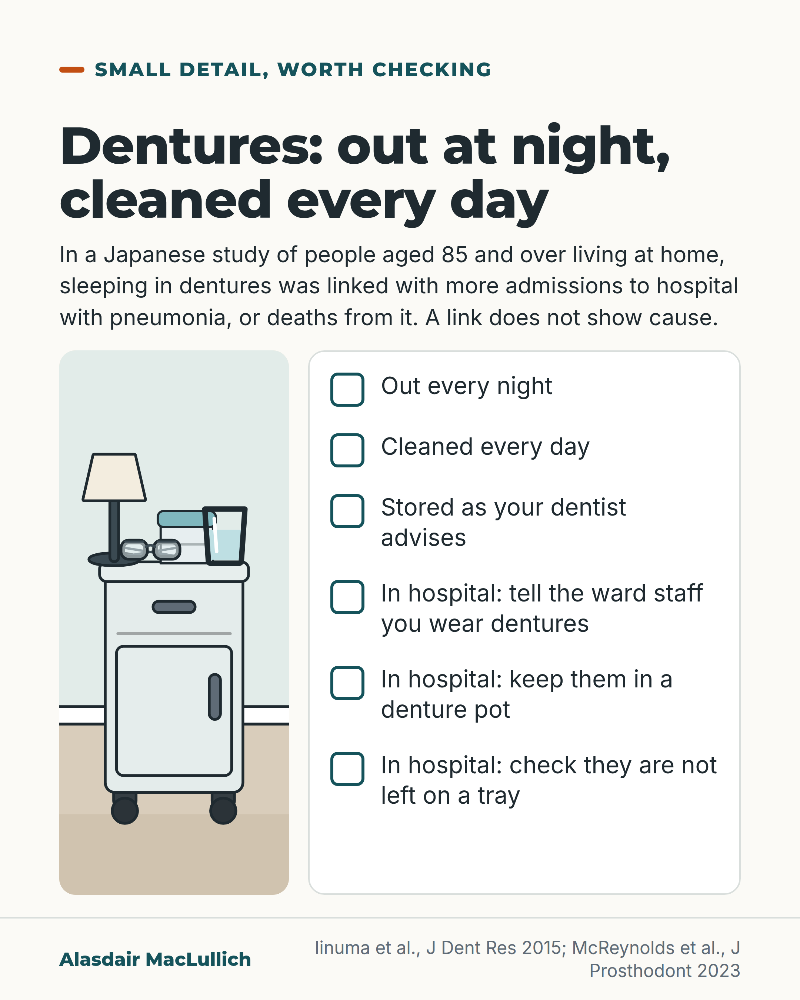

# G134: Dentures out at night

- Category: C13 Nutrition, swallowing, hydration and mouth care
- Audience: public
- Series: Small detail, real effect
- Post type: public_explanation
- Visual format: checklist
- Status: text text_final, visual final
- Working id: C13-P09 (candidate C13-27)

## Insight

Dental specialists advise taking dentures out every night and cleaning them every day. In a Japanese study of people aged 85 and over, sleeping in dentures was linked with more admissions to hospital with pneumonia, or deaths from it, a link that does not prove cause.

## Angle and position

A small nightly habit with dental advice behind it and an association with pneumonia, plus a practical point about dentures going missing in hospital.

Basis: Empirical finding (association): Iinuma 2015, with confounding possible. Expert dental advice: McReynolds 2023 review (not UK official guidance). Service evaluations: denture loss in NHS hospitals. Practical advice for hospital stays follows from those reports.

## X (752 characters)

```text
Dental specialists advise taking dentures out every night and cleaning them every day. The main reason is to prevent sore, inflamed gums under the denture. Follow your own dentist's advice if it differs.

In a Japanese study of 524 people aged 85 and over living at home, about 4 in 10 denture wearers slept in their dentures. Over three years they were more likely than those who took them out to be admitted to hospital with pneumonia, or to die of it. This held after the researchers allowed for other health differences they measured. This link does not show that sleeping in dentures causes pneumonia.

In hospital, dentures go missing. Tell the ward staff you wear dentures, keep them in a denture pot, and check they are not left on a meal tray.
```

## LinkedIn (1458 characters)

```text
Dental specialists advise taking dentures out every night and cleaning them every day. The main reason is to prevent sore, inflamed gums under the denture. Follow your own dentist's advice if it differs.

A Japanese study adds a second reason to think about it. It followed 524 people aged 85 and over living at home, 453 of whom wore dentures. About 4 in 10 denture wearers slept with their dentures in. Over three years they were more likely than those who took them out to be admitted to hospital with pneumonia, or to die of it. This held after the researchers allowed for other health differences they measured. Those who slept in dentures also had more plaque on the tongue and dentures, more gum inflammation, and more yeast (Candida) in the mouth.

This is an association. People who sleep in dentures may differ in health, frailty or care in ways the study did not measure. There were only 48 pneumonia events in the whole group, so the size of the link is uncertain. No trial has tested taking dentures out at night against pneumonia.

Dentures also go missing in hospital. Eleven NHS trusts in south-east England reported 695 lost over five years, and hospital dentists think many losses are never reported. In one hospital the commonest moments were moves between wards, dentures left on meal trays, and during sleep.

If you or your relative wears dentures, tell the ward staff, keep them in a denture pot, and check they are not left on a tray.
```

## Bluesky (297 characters)

```text
Dental specialists advise taking dentures out nightly and cleaning daily. In a Japanese study of people aged 85+, those who slept in dentures were more often admitted to hospital with pneumonia, or died of it, over 3 years. That is a link, not proof. In hospital, tell staff and use a denture pot.
```

## Threads (424 characters)

```text
Dental specialists advise taking dentures out every night and cleaning them every day, mainly to prevent sore gums under the denture.

In a Japanese study of 524 people aged 85 and over, those who slept in dentures were, over three years, more likely to be admitted to hospital with pneumonia, or to die of it. That is a link, not proof of cause.

In hospital, dentures go missing. Tell the ward staff and use a denture pot.
```

## Source reply

Sources: Iinuma 2015 https://doi.org/10.1177/0022034514552493 ; McReynolds 2023 https://doi.org/10.1111/jopr.13687 ; Mann and Doshi 2017 https://doi.org/10.1038/sj.bdj.2017.728 ; Doshi 2022 https://doi.org/10.1038/s41415-022-4137-6

## Visual



Alt text: Checklist card with a drawing of a bedside table holding a lamp, glasses, a denture pot and a glass of water. Dentures: out every night, cleaned every day, stored as the dentist advises. In hospital: tell staff, use a denture pot, check they are not left on a tray. A Japanese study found a link with pneumonia, not proof of cause.

Editable source: `visuals/src/G134.html`

Design instructions: Checklist card. Left Kit bedside table with lamp, glasses, denture pot, glass; right six empty tick boxes. Association sentence under headline. No people.

## Sources and verification

- C13-27-a (supported_with_qualification): In 524 community-living people aged 85 and over (453 denture wearers), about 4 in 10 denture wearers slept in their dentures; overnight wearing was independently associated with a higher risk of hospitalisation for or death from pneumonia over 3 years.
  - Source: Iinuma T, Arai Y, Abe Y, Takayama M, Fukumoto M, Fukui Y, et al. Denture wearing during sleep doubles the risk of pneumonia in the very elderly. J Dent Res. 2015;94(3 Suppl):28S-36S.
  - Passage: ""At baseline, 524 randomly selected seniors (228 men and 296 women; mean age, 87.8 years) were examined for oral health status and oral hygiene behaviors as well as medical assessment, including blood chemistry analysis, and followed up annually until first hospitalization for or death from pneumonia. During a 3-year follow-up period, 48 events associated with pneumonia (20 deaths and 28 acute hospitalizations) were identified. Among 453 denture wearers, 186 (40.8%) who wore their dentures during sleep were at higher risk for pneumonia than those who removed their dentures at night (log rank P = 0.021). In a multivariate Cox model, both perceived swallowing difficulties and overnight denture wearing were independently associated with an approximately 2.3-fold higher risk of the incidence of pneumonia (for perceived swallowing difficulties, hazard ratio [HR], 2.31; and 95% confidence interval [CI], 1.11-4.82; and for denture wearing during sleep, HR, 2.38; and 95% CI, 1.25-4.56)"" (Abstract)
- C13-27-b (supported): People who wore dentures overnight had more tongue and denture plaque, gum inflammation and Candida.
  - Source: Iinuma T, Arai Y, Abe Y, Takayama M, Fukumoto M, Fukui Y, et al. Denture wearing during sleep doubles the risk of pneumonia in the very elderly. J Dent Res. 2015;94(3 Suppl):28S-36S.
  - Passage: ""In addition, those who wore dentures during sleep were more likely to have tongue and denture plaque, gum inflammation, positive culture for Candida albicans, and higher levels of circulating interleukin-6 as compared with their counterparts."" (Abstract)
- C13-27-c (supported_with_qualification): Dental advice is to take dentures out at night and clean them daily.
  - Source: McReynolds DE, Moorthy A, Moneley JO, Jabra-Rizk MA, Sultan AS. Denture stomatitis: an interdisciplinary clinical review. J Prosthodont. 2023;32(7):560-70.
  - Passage: ""Denture stomatitis represents a very common, multifactorial infectious, inflammatory, and hyperplastic condition which is primarily caused by poor oral hygiene, poor denture hygiene, and full-time; mainly night-time denture wear" ... "Effective, long-term treatment of denture stomatitis relies upon sustained patient-driven behavioral change which should focus on daily prosthesis-level cleaning and disinfection, removal of dentures at night, every night, engagement with professional denture maintenance, and when required, denture replacement."" (Abstract: Results; Conclusions)
- C13-27-d (partly_supported): Dentures are lost in hospital, and labelling them before admission helps.
  - Source: Mann J, Doshi M. An investigation into denture loss in hospitals in Kent, Surrey and Sussex. Br Dent J. 2017. doi:10.1038/sj.bdj.2017.728.; Doshi M, Gillway D, Macintyre L. The impact of a quality improvement initiative to reduce denture loss in an acute hospital. Br Dent J. 2022:1-7. doi:10.1038/s41415-022-4137-6.; Raveendran B, Patel P, Doshi M, Emanuel R. A service evaluation of denture-related documentation for inpatients. Br Dent J. 2025. doi:10.1038/s41415-025-8875-0.
  - Passage: "Mann 2017: "Eleven out of 12 trusts returned data about how many dentures were lost in their hospitals, between them 695 dentures were reported lost over five years (2011-16)." Doshi 2022 (Abstract): "In total, 123 dentures were reported as lost or broken between 2016-2021. The most commonly reported reasons for loss were patient transfers between wards, being left on hospital trays, or when patients were sleeping. Patients or carers are more likely to report a lost denture compared to hospital staff." ... "Denture loss is a significant financial burden to the NHS, in addition to causing patients and families distress and is most likely under-reported in many hospitals." Doshi 2022 (full text, Scite excerpt): "Labelling dentures is often promoted as an intervention to reduce denture loss, but these findings suggest that this would not help in hospitals where dentures go missing but are not often found." Raveendran 2025: "The use of dentures was recorded in the notes in 46% (11/24) in ward A, 30% (7/23) in ward B and 35% (7/20) in ward C."" (Mann 2017 Abstract Results; Doshi 2022 Abstract and Discussion (full-text excerpt); Raveendran 2025 Abstract Results)

Verification notes: C13-27-a, -b: Iinuma 2015 abstract (PMID 25294364): 524 aged 85+ at home, 453 denture wearers, about 4 in 10 slept in dentures, adjusted link with hospitalisation for or death from pneumonia over 3 years, 48 events, more plaque, gum inflammation, Candida; 'doubles' and hazard ratio omitted for the public. C13-27-c: McReynolds 2023 expert review (PMID 36988151): out every night, cleaned daily, mainly for denture stomatitis; not UK official guidance (NHS pages not openable); night removal not presented as proven to prevent pneumonia. C13-27-d (partly supported): 695 lost in 11 trusts over 5 years (Mann and Doshi 2017, PMID 28839235), commonest moments from Doshi 2022 (PMID 35379926, full text); 'tell the ward staff' rests on a small service evaluation (PMID 41272113); the labelling tip is not used because the source says labelling may help less in hospital. Lim 2024 meta-analysis found no conclusive evidence that wearing removable dentures at all is a risk factor; not cited in the caption.

## Attention and follow potential

Pause: An everyday habit that most people have never thought of as health advice, with a finding attached and an honest limit.

Gain: Three concrete actions at home and three in hospital, with no overclaim about pneumonia.

Follow: Shows the account separates dental advice, an association and a service problem, and says which is which.

## Open issues

None.
