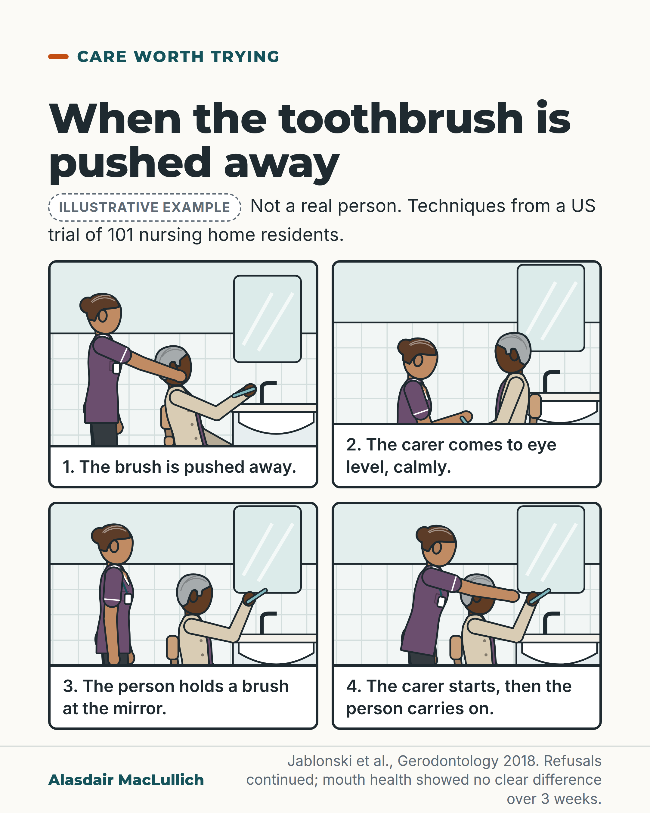

# G135: When the toothbrush is pushed away

- Category: C13 Nutrition, swallowing, hydration and mouth care
- Audience: public
- Series: Care that works
- Post type: good_care
- Visual format: comic strip (4 panels)
- Status: text text_final, visual final
- Working id: C13-P10 (candidate C13-26)

## Insight

In a US trial, calm techniques (coming in at eye level, a mirror, handing over the brush, starting the brushing and letting the person carry on) made mouth care for residents with dementia who often refused it accepted and finished more often and lasted longer. Refusals continued and mouth health did not show a clear difference over three weeks.

## Angle and position

Pushing the toothbrush away is often fear, in the authors' account. Change the approach before concluding that brushing is not possible, and aim to get care done despite some refusal.

Basis: Empirical finding: Jablonski 2018 trial (secondary outcomes positive; primary outcomes resistance and oral health not clearly improved). The fear explanation is the authors' theory, stated as such. Judgement, marked 'we should': change the approach before deciding brushing is not possible.

## X (838 characters)

```text
A person with dementia turns away and pushes the toothbrush aside.

The idea behind one approach is that this is often fear: having something put in your mouth can feel like a threat when you are unable to follow what is happening.

In a US trial in nine nursing homes, 101 residents with dementia who often refused mouth care were split at random into two groups. Trained research staff came in calmly at eye level, used a mirror, handed over the brush, started the brushing and let the person carry on. Compared with carers who cleaned teeth without those techniques, mouth care was accepted and finished more often, and lasted longer.

Refusals did not stop, and over three weeks there was no clear difference in mouth health. When a person pushes the brush away, we should change the approach before deciding brushing is not possible.
```

## LinkedIn (1662 characters)

```text
A person with dementia turns away and pushes the toothbrush aside.

The idea behind one approach is that this is often fear: having something put in your mouth can feel like a threat when you are unable to follow what is happening. That is the authors' theory, and a way of understanding the moment without blaming carers.

In a US trial in nine nursing homes, 101 residents with dementia who often refused mouth care were split at random into two groups. In one, trained research staff used calm techniques. They came to the person at or below eye level, and did mouth care at a sink in front of a mirror. They gave the person a toothbrush to hold, started the brushing and let them carry on. They used gestures and short, one-step instructions, and gently guided the person's hand. If things escalated, a different carer took over. They tried different techniques to find what worked for each person. In the other group, carers cleaned teeth well but without those techniques.

Over three weeks, mouth care was accepted and finished more often, and lasted longer, in the first group. Refusals did not stop, and the trial did not show a clear difference in resistance or in mouth health, which were its main outcomes. People with swallowing difficulty were excluded, and the care was given by the research team rather than the home's own staff. The trial tested the techniques as a set, so no single technique is shown to work.

The researchers concluded that the aim is to get mouth care done despite some refusal, not to make refusal disappear.

When a person pushes the brush away, we should change the approach before deciding that brushing is not possible.
```

## Bluesky (298 characters)

```text
In a US trial of 101 people with dementia who often refused mouth care, staff used eye level, a mirror and a handed-over brush. Mouth care was accepted more often than in the other group. Refusals continued and mouth health showed no clear difference. If they refuse, we should change the approach.
```

## Threads (483 characters)

```text
A person with dementia turns away and pushes the toothbrush aside. One idea is that this is often fear.

In a US trial of 101 nursing home residents, staff used calm techniques: eye level, a mirror, handing over the brush, letting the person carry on. Mouth care was accepted and finished more often than in the comparison group. Refusals continued and mouth health showed no clear difference over three weeks.

We should change the approach before deciding brushing is not possible.
```

## Source reply

Sources: Jablonski 2018 trial https://doi.org/10.1111/ger.12357 ; description of the approach, Jablonski 2012 https://doi.org/10.1891/1541-6577.25.3.163

## Visual



Alt text: Four panel comic, labelled illustrative. In a care home bathroom an older man pushes away a toothbrush; the carer comes to eye level calmly; he holds a brush at the mirror; the carer starts, then he carries on. Techniques from a US trial of 101 residents; refusals continued and mouth health showed no clear difference over 3 weeks.

Editable source: `visuals/src/G135.html`

Design instructions: Four panel comic 2x2 on sand with captions, care home bathroom with mirror and basin. Older Black man with grey hair seated; female carer in plum tunic. Panels: brush pushed away, carer kneels to eye level, he holds brush at mirror, carer's hand with his. Illustrative badge.

## Sources and verification

- C13-26-a (supported_with_qualification): In a randomised trial of 101 nursing home residents with dementia who resisted mouth care, the MOUTh approach doubled the odds of accepting and completing mouth care and lengthened mouth care, but did not clearly reduce resistance or improve oral health.
  - Source: Jablonski RA, Kolanowski AM, Azuero A, Winstead V, Jones-Townsend C, Geisinger ML. Randomised clinical trial: efficacy of strategies to provide oral hygiene activities to nursing home residents with dementia who resist mouth care. Gerodontology. 2018;35(4):365-75.
  - Passage: "Abstract: "One hundred and one nursing home residents with dementia were randomised at the individual level to experimental (n = 55) or control groups (n = 46). One hundred participants provided data for the analyses." "Compared to the control group, persons in the experimental group had twice the odds of allowing mouth care and completing oral hygiene activities; they also allowed longer duration of mouth care (d = 0.56), but showed only small reductions in the intensity of CRBs (d = 0.16) and small differential improvements in oral health (d = 0.18)." Full text, Results 3.1: "During that period, when available for mouth care, NH residents in the experimental group had twice the odds of assenting to mouth care compared to residents in the control group (). Participants in the experimental group had also twice the odds of completing mouth care." Results 3.3: "During the intervention weeks, occurrence of CRB increased in both groups at similar levels (d = 0.01, p = 0.8837)." ... "the magnitude of the effect was small (d=-0.16) and not statistically significant." Methods: "Starting on day 8, participants received mouth care twice daily for three weeks from the trained research assistants." Discussion: "However, the use of research staff to perform the intervention, while supporting internal validity, compromised external validity." "This study also excluded persons with dysphagia."" (Abstract; full text Methods 2.2, Results 3.1 to 3.4, Discussion)
- C13-26-b (supported): MOUTh techniques include approaching at eye level, working at a sink and mirror, avoiding elderspeak, cueing with gestures and short commands, bridging (the person holds a toothbrush), chaining (start the task and let the person finish), distraction, hand-over-hand guidance and 'rescue' by a second carer.
  - Source: Jablonski RA, Kolanowski AM, Azuero A, Winstead V, Jones-Townsend C, Geisinger ML. Randomised clinical trial: efficacy of strategies to provide oral hygiene activities to nursing home residents with dementia who resist mouth care. Gerodontology. 2018;35(4):365-75.; Jablonski RA, Therrien B, Kolanowski A. No more fighting and biting during mouth care: applying the theoretical constructs of threat perception to clinical practice. Res Theory Nurs Pract. 2011;25(3):163-75.
  - Passage: "Jablonski 2018 full text, Methods 2.3: "These strategies included: establishing rapport by approaching the resident at or below eye level with a pleasant and calm demeanor; providing mouth care in front of a sink and in front of a mirror (to access procedural or implicit memories); avoiding elderspeak, a type of sing-song “baby talk”; chaining, which involved starting the mouth care and having the older adult finish the task; cueing by using gestures, pantomimes, and short, 1-step commands; distraction; bridging, where the older adult was asked to hold a toothbrush during mouth care; rescue, where a second experimental mouth care provider replaced the first experimental mouth care provider if care-resistant behaviors were escalating; and hand-over-hand, which involved either the older adult placing his or hand over that of the experimental mouth care provider, or the experimental mouth care provider gently guiding the older adult’s hands.The experimental mouth care providers were expected to select strategies on a trial and error basis." Jablonski 2011: "Nurses can safely and effectively provide mouth care to persons with dementia who resist care by using personalized combinations of 15 threat reduction strategies."" (Jablonski 2018 full text, Methods 2.3 Intervention description; Jablonski 2011 Abstract)
- C13-26-c (supported): The trial authors concluded that managing refusal may be more realistic than eliminating it.
  - Source: Jablonski RA, Kolanowski AM, Azuero A, Winstead V, Jones-Townsend C, Geisinger ML. Randomised clinical trial: efficacy of strategies to provide oral hygiene activities to nursing home residents with dementia who resist mouth care. Gerodontology. 2018;35(4):365-75.
  - Passage: ""The data suggest that this intervention facilitates mouth care among persons with dementia. The management of refusal behaviour may be a clinically more realistic approach than reducing or eradicating refusals."" (Abstract: Conclusion)
- C13-26-d (supported_with_qualification): Resisting mouth care is often a response to feeling threatened.
  - Source: Jablonski RA, Therrien B, Kolanowski A. No more fighting and biting during mouth care: applying the theoretical constructs of threat perception to clinical practice. Res Theory Nurs Pract. 2011;25(3):163-75.
  - Passage: ""Care-resistant behavior is a fear-evoked response to nurses' unintentionally threatening behavior during mouth care."" (Abstract)

Verification notes: C13-26-a: Jablonski 2018 full text (PMID 30004139): 101 residents randomised, 9 US nursing homes, mouth care accepted and completed more often (twice the odds per session; the public caption says 'more often'), longer, but resistance and oral health not clearly improved (primary outcomes), 3 weeks, trained research staff, swallowing difficulty excluded. C13-26-b: techniques as listed (Jablonski 2018 and 2012). C13-26-c: authors' conclusion about managing refusal. C13-26-d: Jablonski 2012 (PMID 22216691): the fear idea is the authors' theory, stated as such. The package, not any single technique, was tested. The two-by-two layout means panel order reads left to right then down.

## Attention and follow potential

Pause: A moment many families and care workers recognise, shown as something to understand rather than to fight.

Gain: Four specific things to try, and an honest sense of what the trial did and did not achieve.

Follow: Shows the account describes good care with its limits, and draws no blame on care workers.

## Open issues

None.
