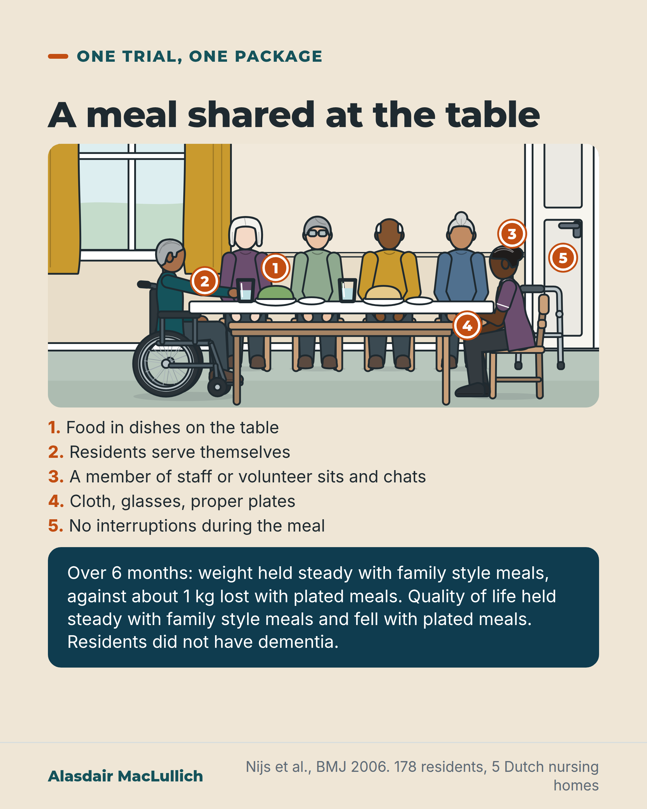

# G136: Meals served family style

- Category: C13 Nutrition, swallowing, hydration and mouth care
- Audience: both
- Series: Care that works
- Post type: good_care
- Visual format: annotated scene
- Status: text text_final, visual final
- Working id: C13-P11 (candidate C13-32)

## Insight

In a Dutch trial in five nursing homes, residents without dementia who ate family style meals held their weight and quality of life steady over six months, while those given plated meals lost about 1 kg and their quality of life scores fell. The meals were a package, including staff sitting and chatting at each table.

## Angle and position

A change of routine rather than a product: the meal as a shared occasion with choice. Residents did not have dementia, and the trial cannot say which part of the package helped.

Basis: Empirical finding: Nijs 2006 randomised trial. Evidence gap stated: dementia (promising but not definitive in reviews), single trial, nursing homes only. Limited judgement: care homes could consider shared-table meals for people able to take part.

## X (982 characters)

```text
In family style meals, food comes in dishes on the table, residents serve themselves, and a member of staff or a volunteer sits and chats at each table.

In a Dutch trial in five nursing homes, wards were randomly given this family style or usual plated meals for six months. The 178 residents did not have dementia; many had stroke or Parkinson's disease.

Residents eating family style held their weight steady, while those given plated meals lost about 1 kg. Quality of life scores held steady with family style meals and fell by about 5 points with plated meals, on a 0 to 100 scale. Family style residents also ate more.

The meals also came with cloths, proper plates and no interruptions, so the trial does not show which part helped. For people with dementia, a 2016 systematic review lists family style meals as promising, but not established. Care homes could try shared-table, self-serve meals for residents able to take part, and see what happens to how much people eat.
```

## LinkedIn (1825 characters)

```text
Food in dishes on the table, residents serving themselves, and a member of staff or a volunteer sitting and chatting at each table.

That was family style mealtimes in a Dutch trial in five nursing homes. Wards were randomly assigned to family style or the usual plated meals for six months. The 178 residents did not have dementia, and many had conditions such as stroke or Parkinson's disease. The 10 wards were the units randomised: each ward as a whole received one kind of meal.

Family style meant more than shared dishes. Tables had cloths, glasses and proper plates. Food came in dishes and most residents served themselves. A member of staff or a volunteer sat and chatted at every table, and nothing else happened in the dining room during the meal.

Over six months, residents who ate family style held their weight steady (up 0.5 kg), while those given plated meals lost about 1 kg, so the gap between the groups was 1.5 kg. Quality of life scores held steady with family style meals and fell by about 5 points with plated meals, on a 0 to 100 scale, so the gap between the groups was about 6 points. Residents eating family style also ate more.

Most of the difference came from the plated group getting worse rather than the family style group improving. The intervention changed several things at once, so the trial does not show which part helped: the shared dishes, the choice, the company or the lack of interruption.

The limits: one trial from 2006, in Dutch nursing homes, with 10 wards. Hospital wards were not studied. For people with dementia, a systematic review lists family style meals as promising. The studies are small and short, so the benefit is not established.

Care homes could try shared-table, self-serve meals for residents able to take part, and see what happens to how much people eat.
```

## Bluesky (298 characters)

```text
In a Dutch trial, nursing home residents without dementia ate family style: shared dishes, self-serve, staff or volunteers chatting at tables. Over 6 months they held weight and quality of life steady; plated-meal residents lost about 1 kg. One trial, several changes at once; unproven in dementia.
```

## Threads (478 characters)

```text
In a Dutch nursing home trial, 178 residents without dementia ate either family style or usual plated meals for six months. Family style meant dishes on the table, self-serve, and a staff member or volunteer sitting and chatting at each table.

Family style held weight steady; plated meals meant about 1 kg lost. Quality of life scores held steady with family style meals and fell with plated meals.

Several things changed at once, in one trial, in residents without dementia.
```

## Source reply

Sources: Nijs 2006 https://doi.org/10.1136/bmj.38825.401181.7C ; Bunn 2016 review https://doi.org/10.1186/s12877-016-0256-8

## Visual



Alt text: Annotated drawing of a care home dining table with a cloth, glasses and dishes. Residents, including a man in a wheelchair, serve themselves while a care worker sits and chats; the door is closed. Over 6 months in a Dutch trial weight held steady with family style meals against about 1 kg lost with plated meals. Residents did not have dementia.

Editable source: `visuals/src/G136.html`

Design instructions: Sand annotated scene (Kit): long cloth-covered table with dishes and glasses, four seated residents, a man in a wheelchair serving himself, a standing frame parked, seated care worker, closed door; orange pins 1 to 5; numbered list; deep teal result panel. Claim C13-32-b.

## Sources and verification

- C13-32-a (supported): In five Dutch nursing homes, 178 residents without dementia (mean age 77) were cluster randomised by ward to family style meals or usual pre-plated service for six months.
  - Source: Nijs KA, de Graaf C, Kok FJ, van Staveren WA. Effect of family style mealtimes on quality of life, physical performance, and body weight of nursing home residents: cluster randomised controlled trial. BMJ. 2006;332(7551):1180-4.
  - Passage: "[Abstract:] To assess the effect of family style mealtimes on quality of life, physical performance, and body weight of nursing home residents without dementia. ... Five Dutch nursing homes. 178 residents (mean age 77 years). Two wards in each home were randomised to intervention (95 participants) or control groups (83). During six months the intervention group took their meals family style and the control group received the usual individual pre-plated service. [Full text, Methods:] In most Dutch nursing homes two types of care are available: psychogeriatric care for residents with dementia or chronic somatic care for patients with conditions such as stroke or Parkinson’s disease. ... We excluded residents in the terminal phase of disease, those needing total parenteral feeding, and those unable to give informed consent owing to a physical or mental condition." (Nijs 2006 Abstract; full text Methods (Participants and study design))
- C13-32-b (supported_with_qualification): Compared with plated meals, family style meals led to better quality of life, fine motor function and body weight over six months: quality of life stayed stable with family style meals and fell with plated meals, and weight stayed stable with family style meals and fell by about 1 kg with plated meals (difference 1.5 kg).
  - Source: Nijs KA, de Graaf C, Kok FJ, van Staveren WA. Effect of family style mealtimes on quality of life, physical performance, and body weight of nursing home residents: cluster randomised controlled trial. BMJ. 2006;332(7551):1180-4.
  - Passage: "[Abstract:] The difference in change between the groups was significant for overall quality of life (6.1 units, 95% confidence interval 2.1 to 10.3), fine motor function (1.8 units, 0.6 to 3.0), and body weight (1.5 kg, 0.6 to 2.4). [Full text, Methods:] The questionnaire consists of 50 statements, scored on a dichotomous scale (yes or no). Each subscale and the total questionnaire could be computed to a range of 0 to 100 ... A high score represents a high quality of life. [Results:] The difference in changes in quality of life between both groups was significant (6.1 units, 95% confidence interval 2.1 to 10.3 units; table 3). The intervention group remained stable (0.4, − 1.8 to 2.5) whereas the control group declined ( − 5.0, − 9.4 to − 0.6). ... Mean body weight remained relatively stable in the intervention group (0.5 kg, − 0.3 to 1.2 kg) but decreased significantly in the control group ( − 1.1, − 1.9 to − 0.2). Changes in body weight between control and intervention groups were significantly different (1.5, 0.6 to 2.4). ... Mean energy intake increased significantly in the intervention group (481 kJ, 84 to 878 kJ) but decreased significantly in the control group ( − 420, − 713 to − 127). Changes in energy intake between control and intervention group were significantly different (991, 504 to 1479)." (Nijs 2006 Abstract; full text Methods (Quality of life) and Results)
- C13-32-c (supported): Family style mealtimes in the trial were a package: tablecloths and proper crockery, cooked food served in dishes on the table with choice, most residents serving themselves, staff sitting and chatting at each table, and no interruptions during meals.
  - Source: Nijs KA, de Graaf C, Kok FJ, van Staveren WA. Effect of family style mealtimes on quality of life, physical performance, and body weight of nursing home residents: cluster randomised controlled trial. BMJ. 2006;332(7551):1180-4.
  - Passage: "[Table 1, Family style mealtimes:] Table dressing: Tablecloth; drinking glasses (no plastic cups); normal plates; full cutlery; napkins; subtle flower arrangements. Food services: Cooked meal served in dishes on table; menu choice between two types of vegetables, meat, and staple foods; no ready to eat sandwiches during breakfast or supper. Staff protocol: Staff sit down at tables and chat with residents; minimum of one nurse or nutrition assistant or volunteer per table; drugs handed out before start of meal; no change of staff during mealtimes ... Residents’ protocol: Balanced seating of residents (typically six per table); residents decide when food is served; most residents serve themselves, with some help from nurse or table companion; mealtimes begin when everybody is seated ... Mealtime protocol: No other activities (for example, cleaning, visits from doctor); dining room closed for visitors and healthcare providers (except where observation by healthcare giver is necessary or visitors help residents) ..." (Nijs 2006 full text, Methods (The intervention) and Table 1)
- C13-32-d (supported_with_qualification): For people with dementia, family style meals are listed as promising in a systematic review, but the evidence is small and not definitive.
  - Source: Bunn DK, Abdelhamid A, Copley M, Cowap V, Dickinson A, Howe A, et al. Effectiveness of interventions to indirectly support food and drink intake in people with dementia: Eating and Drinking Well IN dementiA (EDWINA) systematic review. BMC Geriatr. 2016;16:89.; Nijs KA, de Graaf C, Kok FJ, van Staveren WA. Effect of family style mealtimes on quality of life, physical performance, and body weight of nursing home residents: cluster randomised controlled trial. BMJ. 2006;332(7551):1180-4.
  - Passage: "[Bunn 2016:] We included 56 interventions (reported in 51 studies). Studies were small and there were no clearly effective, or clearly ineffective, interventions. Promising interventions included: eating meals with care-givers, family style meals, soothing mealtime music, constantly accessible snacks and longer mealtimes, ... We found no definitive evidence on effectiveness, or lack of effectiveness, of specific interventions but studies were small and short term. [Nijs 2006, Discussion:] Earlier research showed that residents with dementia benefit from these kinds of interventions. Although we excluded this important group, we think that our principal conclusion may be extended to all nursing home residents." (Bunn 2016 Abstract (Results, Conclusions); Nijs 2006 full text, Discussion)

Verification notes: C13-32-a, -b, -c: Nijs 2006 full text via Undermind (PMID 16679331): 178 residents without dementia, mean age 77, 5 Dutch homes, 10 wards randomised, 6 months; weight +0.5 versus -1.1 kg (gap 1.5 kg); quality of life +0.4 versus -5.0 (gap about 6 points on a 0 to 100 scale); family style residents ate more; package description from Table 1 (the trial's reflection element is left out). Framed as 'held steady', not 'improved'. C13-32-d: Bunn 2016 (PMID 27142469) lists family style meals as promising but not definitive in dementia; the Cochrane review (Herke 2018) found no specific modification established. The final suggestion is limited judgement ('could try').

## Attention and follow potential

Pause: A scene readers will recognise or wish they saw, followed by a measured result for a routine change.

Gain: A concrete picture of what to try, with honest limits (a package, one trial, no dementia).

Follow: Shows the account describes good care in detail and says how far the evidence reaches.

## Open issues

None.
