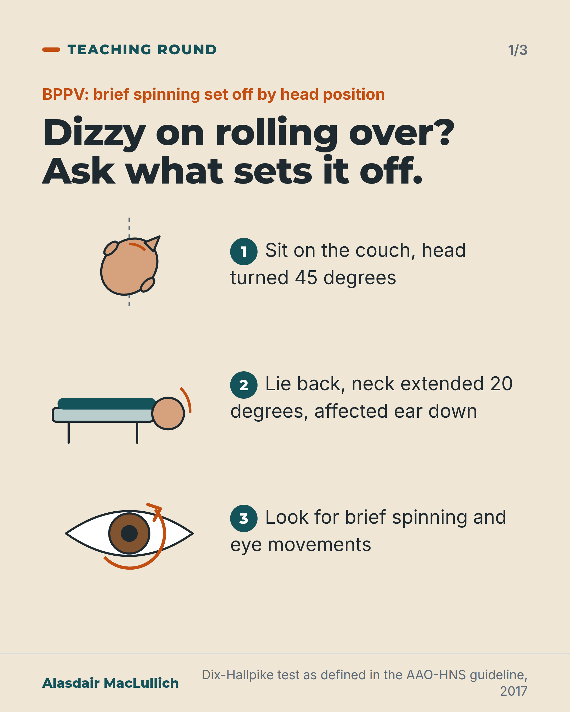
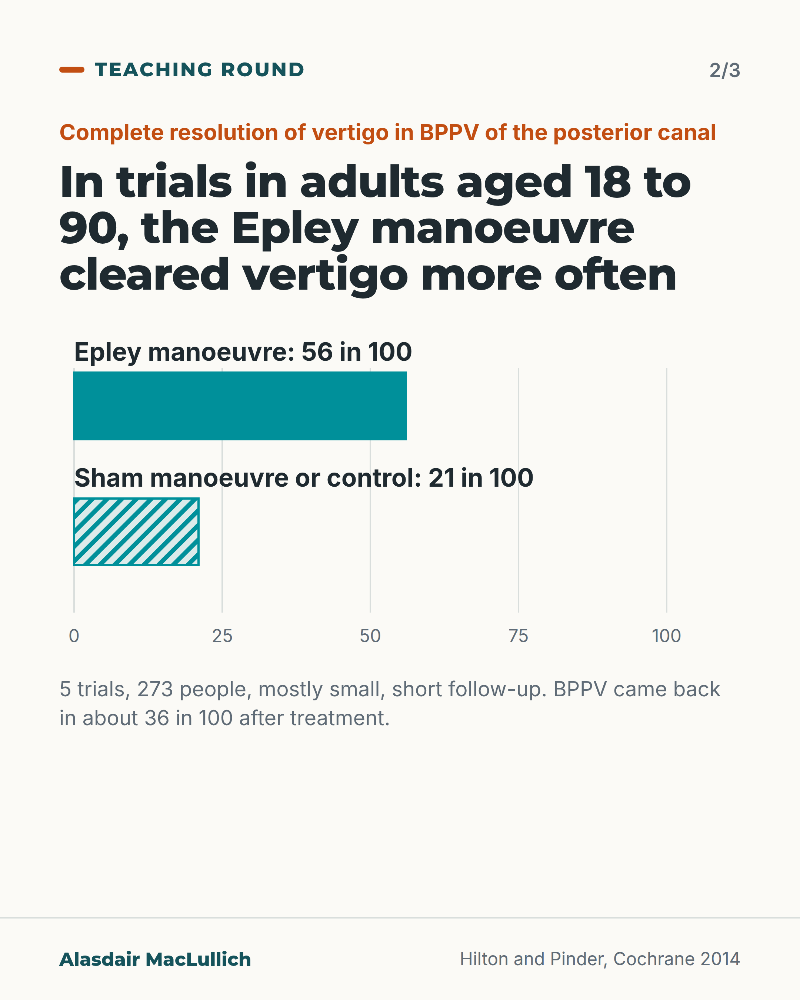
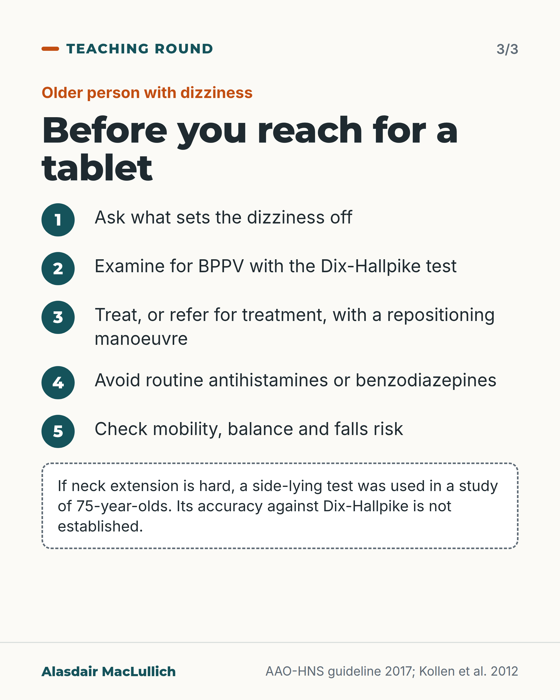

# G137: Dizzy on rolling over: test for BPPV

- Category: C14 Hearing, vision and the senses
- Audience: practitioners
- Series: Teaching round
- Post type: teaching
- Visual format: carousel (3 cards)
- Status: text text_final, visual final
- Working id: C14-P01 (candidate C14-26)

## Insight

Dizziness set off by rolling over in bed or looking up can be BPPV, which has a bedside test (Dix-Hallpike) and a treatment (the Epley repositioning manoeuvre) that cleared vertigo in about 56 in 100 people in trials, against about 21 in 100 with sham or control, in adults aged 18 to 90.

## Angle and position

Dizziness in older people is easily filed under a general label and given a sedating tablet. Ask what sets it off, examine for BPPV, and treat or refer for a repositioning manoeuvre. The 9 in 100 figure is one clinic sample, an association with falls only.

Basis: Mixed. Empirical findings: the 9 in 100 clinic figure and fall association (association only), the Epley trial results and the side-lying test use in 75-year-olds. Guideline recommendations: diagnosis, repositioning treatment, advice against routine sedating suppressants. Clinical interpretation: asking what sets the dizziness off and examining before labelling.

## X (899 characters)

```text
Ask an older person with dizziness what sets it off. A brief spin when they roll over in bed or look up should prompt a Dix-Hallpike test for BPPV, benign paroxysmal positional vertigo.

In one US clinic for older people, about 9 in 100 patients had BPPV that nobody had recognised. They were more likely to have fallen in the previous 3 months. That was one clinic and a snapshot, so it does not show that BPPV caused the falls.

In trials of adults aged 18 to 90 with BPPV of the posterior canal, vertigo fully resolved in about 56 in 100 people after the Epley. It resolved in about 21 in 100 after a sham manoeuvre or a control with no repositioning. BPPV came back in about 36 in 100 people during the trials' short follow-up.

The 2017 US ENT guideline recommends a repositioning manoeuvre such as the Epley for treatment. It advises against routinely giving antihistamines or benzodiazepines.
```

## LinkedIn (1897 characters)

```text
When an older person says they feel dizzy, one question helps: what sets it off?

If the answer is rolling over in bed, lying back or looking up, with a brief spin, the cause may be benign paroxysmal positional vertigo (BPPV), vertigo set off by head position.

In one study of patients at a US inner-city clinic for older people, about 9 in 100 had BPPV that nobody had recognised. Those patients were more likely to have fallen in the previous 3 months. That is one clinic in one country, published in 2000, and a snapshot study is unable to show that BPPV caused the falls.

The 2017 US ENT guideline strongly recommends diagnosing the commonest type with the Dix-Hallpike test, with the head turned 45 degrees and the neck extended 20 degrees. It strongly recommends treating it, or referring for treatment, with a repositioning manoeuvre such as the Epley. It recommends against routinely treating BPPV with sedating anti-dizziness medicines such as antihistamines or benzodiazepines. It also asks clinicians to check mobility, balance and falls risk.

A Cochrane review of mostly small trials with short follow-up included adults aged 18 to 90 with BPPV of the posterior canal. Complete resolution of vertigo came in about 56 in 100 people after the Epley, against about 21 in 100 after a sham manoeuvre or a control with no repositioning. BPPV came back in about 36 in 100 people during those trials' short follow-up. A few people could not tolerate the manoeuvres because of neck problems.

Extending the neck is hard for some older people. A Swedish study of 75-year-olds used a side-lying version of the test, with the head and neck fully supported on the couch, and found BPPV in about 11 in 100 of those tested. How its accuracy compares with Dix-Hallpike is not established.

Before giving a sedating tablet for dizziness in an older person, ask what sets it off and examine for BPPV.
```

## Bluesky (293 characters)

```text
Ask an older person with dizziness what sets it off. A brief spin on rolling over or looking up should prompt a Dix-Hallpike test for BPPV (positional vertigo). In trials, the Epley manoeuvre cleared vertigo in about 56 in 100, against 21 with sham or control. It came back in about 36 in 100.
```

## Threads (494 characters)

```text
Ask an older person with dizziness what sets it off.

A brief spin when they roll over in bed or look up should prompt a Dix-Hallpike test for BPPV, vertigo set off by head position.

In trials in adults, vertigo fully resolved in about 56 in 100 people after the Epley manoeuvre, against about 21 in 100 after a sham or control. It came back in about 36 in 100 during the trials' short follow-up.

The US ENT guideline advises against routinely giving antihistamines or benzodiazepines for it.
```

## Source reply

Sources: https://doi.org/10.1177/0194599816689667 | https://doi.org/10.1002/14651858.CD003162.pub3 | https://doi.org/10.1016/S0194-5998(00)70187-2 | https://doi.org/10.1007/BF03325263

## Visual



Alt text: Three drawn steps of the Dix-Hallpike test: head turned 45 degrees, lying back with the neck extended 20 degrees, then looking for brief spinning and eye movements.



Alt text: Bar chart from a Cochrane review of 5 trials, 273 people: complete resolution of vertigo in 56 in 100 after the Epley manoeuvre against 21 in 100 after sham or control. BPPV came back in about 36 in 100.



Alt text: Checklist for older people with dizziness: ask what sets it off, examine with Dix-Hallpike, treat with a repositioning manoeuvre, avoid routine antihistamines or benzodiazepines, check falls risk. A note says side-lying test accuracy is not established.

Editable source: `visuals/src/G137.html`

Design instructions: Carousel 3 cards (sand, light, light). Card1 schematic drawings of test steps; card2 SVG bars 0-100 (56 solid teal, 21 hatched) claim C14-26-c; card3 steps list plus dashed note.

## Sources and verification

- C14-26-a (supported_with_qualification): In one inner-city geriatric clinic population, 9% had unrecognised BPPV, and those with it were more likely to have had a fall in the previous 3 months.
  - Source: Oghalai JS, Manolidis S, Barth JL, Stewart MG, Jenkins HA. Unrecognized benign paroxysmal positional vertigo in elderly patients. Otolaryngol Head Neck Surg. 2000;122(5):630-4.
  - Passage: "We performed a cross-sectional study to determine the prevalence of unrecognized benign paroxysmal positional vertigo (BPPV) and associated lifestyle sequelae in a public, inner-city geriatric population. Dizziness was found in 61% of patients, whereas balance disorders were found in 77% of patients. Nine percent were found to have unrecognized BPPV. ... Patients with unrecognized BPPV were more likely to have reduced activities of daily living scores, to have sustained a fall in the previous 3 months, and to have depression." (Abstract)
- C14-26-b (supported): Posterior canal BPPV is diagnosed with the Dix-Hallpike test and should be treated, or referred for treatment, with a repositioning procedure; the guideline advises against routinely treating BPPV with sedating vestibular suppressants and asks clinicians to assess mobility and falls risk.
  - Source: Bhattacharyya N, Gubbels SP, Schwartz SR, Edlow JA, El-Kashlan H, Fife T, et al. Clinical practice guideline: benign paroxysmal positional vertigo (update). Otolaryngol Head Neck Surg. 2017;156(3 Suppl):S1-S47.
  - Passage: "The update group made strong recommendations that clinicians should (1) diagnose posterior semicircular canal BPPV when vertigo associated with torsional, upbeating nystagmus is provoked by the Dix-Hallpike maneuver, performed by bringing the patient from an upright to supine position with the head turned 45° to one side and neck extended 20° with the affected ear down, and (2) treat, or refer to a clinician who can treat, patients with posterior canal BPPV with a canalith repositioning procedure. ... The update group made recommendations against ... (3) routinely treating BPPV with vestibular suppressant medications such as antihistamines and/or benzodiazepines. ... (3) assess patients with BPPV for factors that modify management, including impaired mobility or balance, central nervous system disorders, a lack of home support, and/or increased risk for falling" (Abstract, Action Statements)
- C14-26-c (supported): The Epley manoeuvre is effective for posterior canal BPPV.
  - Source: Hilton MP, Pinder DK. The Epley (canalith repositioning) manoeuvre for benign paroxysmal positional vertigo. Cochrane Database Syst Rev. 2014;(12):CD003162.
  - Passage: "Complete resolution of vertigo occurred significantly more often in the Epley treatment group when compared to a sham manoeuvre or control (odds ratio (OR) 4.42, 95% confidence interval (CI) 2.62 to 7.44; five studies, 273 participants); the proportion of patients resolving increased from 21% to 56%. ... Some patients were unable to tolerate the manoeuvres because of cervical spine problems. ... There is evidence that the Epley manoeuvre is a safe, effective treatment for posterior canal BPPV, based on the results of 11, mostly small, randomised controlled trials with relatively short follow-up. There is a high recurrence rate of BPPV after treatment (36%)." (Abstract, Results and Authors' conclusions)
- C14-26-d (supported_with_qualification): A side-lying version of the test, with head and neck supported, can be used in older people when neck extension is limited.
  - Source: Kollen L, Frandin K, Moller M, Fagevik Olsen M, Moller C. Benign paroxysmal positional vertigo is a common cause of dizziness and unsteadiness in a large population of 75-year-olds. Aging Clin Exp Res. 2012;24(4):317-23.
  - Passage: "It is sometimes difficult to perform the Dix-Hallpike test in elderly persons, due to the limited range of motion when extending the neck. In this study, we used a side-lying test to stimulate the posterior semicircular canal, while the head and neck were fully supported on the examination table. ... A representative population sample of 675 persons completed a questionnaire about dizziness and 571 persons underwent side-lying, static balance and dynamic walking tests. ... BPPV was found in 11% and was significantly more common in women (p<0.01)." (Abstract)

Verification notes: C14-26-a (Oghalai 2000, abstract): 9 in 100 and fall in previous 3 months, one US clinic, association only, no sample size in abstract. C14-26-b (AAO-HNS 2017 abstract): Dix-Hallpike, repositioning, advice against antihistamines and benzodiazepines, assess mobility and falls risk; prochlorperazine not named. C14-26-c (Cochrane 2014 abstract): 56 v 21 in 100, 5 studies 273 people, recurrence 36%, some could not tolerate manoeuvres; odds ratio not used. C14-26-d (Kollen 2012 abstract): side-lying test used in 75-year-olds, about 11% BPPV; accuracy against Dix-Hallpike not established, so not offered as an equal. German survey (C14-26-e) not used.

## Attention and follow potential

Pause: A specific question most clinicians can ask in the next clinic, framed around people who are often given a general label.

Gain: A question, a test and a treatment, with the real size of benefit and the limits of the falls link.

Follow: Bedside tests and clinical distinctions explained with their evidence and their limits.

## Open issues

None.
