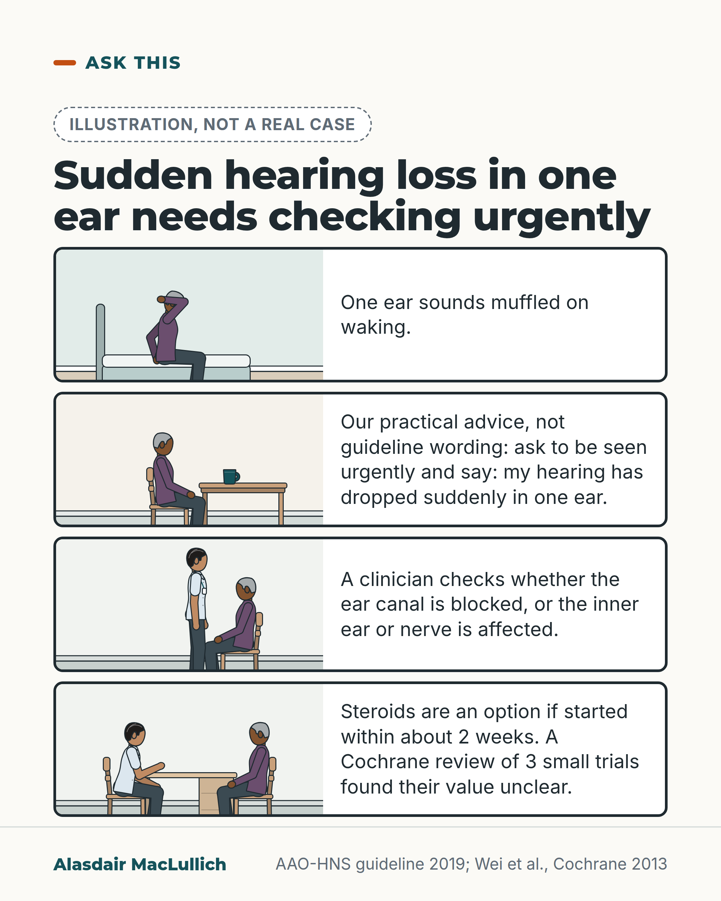

# G138: Sudden hearing loss in one ear: get it checked urgently

- Category: C14 Hearing, vision and the senses
- Audience: public
- Series: Ask this
- Post type: decision_support
- Visual format: comic strip (4 panels, captions under panels, labelled as an illustration)
- Status: text text_final, visual final
- Working id: C14-P02 (candidate C14-10)

## Insight

Hearing that drops suddenly in one ear should be checked urgently, because a clinician first has to tell a blocked ear canal from damage to the inner ear or nerve, and steroid treatment is an option only if started within about two weeks.

## Angle and position

The usual guess is wax. Only an examination can separate a blocked canal from inner-ear or nerve loss, and the treatment window is short. The uncertain benefit of steroids is stated plainly, with the point that waiting can use up the window.

Basis: Mixed. Guideline recommendation (US) and Cochrane findings: urgent assessment, separating conductive from sensorineural loss, steroids an option within 2 weeks with unclear benefit. Practical advice (judgement): ask for an ENT service or emergency department, and the sentence to say on the phone.

## X (657 characters)

```text
One ear sounds muffled on waking, and the usual guess is wax. It could be. It could also be damage to the inner ear or the hearing nerve.

A clinician first needs to tell a blocked ear canal from a problem in the inner ear or nerve. So sudden hearing loss in one ear needs urgent checking, even if wax seems likely.

Steroid treatment is an option if started within about two weeks of the hearing loss beginning. A Cochrane review of three small trials found it unclear whether steroids work.

Our practical advice: ask to be seen urgently by an ear, nose and throat (ENT) service or an emergency department. Say: my hearing has dropped suddenly in one ear.
```

## LinkedIn (1051 characters)

```text
One ear sounds muffled on waking, and the usual guess is wax.

It could be wax. It could also be damage to the inner ear or the hearing nerve. A clinician first needs to tell a blocked ear canal from a problem in the inner ear or nerve. That needs an examination.

That is why sudden hearing loss in one ear should be checked urgently, even when wax seems the likely cause. A US guideline for ear, nose and throat (ENT) specialists says that acting quickly on sudden hearing loss from the inner ear or nerve may improve recovery. It asks for a hearing test as soon as possible, within 14 days of the start.

Steroid treatment is an option if started within about two weeks of the hearing loss starting. A 2013 Cochrane review of three small trials found it unclear whether steroids work. Discuss the choice with the specialist, and ask early.

Our practical advice: if this happens to you or to someone you look after, ask to be seen urgently by an ENT service or an emergency department. On the phone, say: my hearing has dropped suddenly in one ear.
```

## Bluesky (296 characters)

```text
Sudden hearing loss in one ear needs urgent checking, even if wax seems likely. Ask for an ear, nose and throat (ENT) service or an emergency department. Steroids can be offered within about 2 weeks of the loss starting. A Cochrane review of three small trials found it unclear whether they work.
```

## Threads (498 characters)

```text
One ear sounds muffled on waking, and the usual guess is wax.

It could be. It could also be damage to the inner ear or hearing nerve, and a clinician has to examine you to tell which.

Steroids are an option if started within about two weeks of the hearing loss starting. A Cochrane review of three small trials found it unclear whether they work.

Sudden hearing loss in one ear should be checked urgently. Our practical advice: ask for an ear, nose and throat service or an emergency department.
```

## Source reply

Sources: https://doi.org/10.1177/0194599819859885 | https://doi.org/10.1002/14651858.CD003998.pub3

## Visual



Alt text: Four drawn panels, labelled illustration not a real case: an older woman with muffled hearing in one ear on waking, phoning to ask for urgent review, a clinician checking her ear, and a talk about steroids, whose value was unclear in 3 small trials.

Editable source: `visuals/src/G138.html`

Design instructions: Single card, four rows of Kit scenes (bedroom, kitchen, GP room, desk) with captions; illustrative badge.

## Sources and verification

- C14-10-a (supported_with_qualification): Sudden hearing loss should be assessed urgently, first separating a blocked or conductive cause from inner-ear/nerve loss; prompt management may improve recovery.
  - Source: Chandrasekhar SS, Tsai Do BS, Schwartz SR, et al. Clinical practice guideline: sudden hearing loss (update). Otolaryngol Head Neck Surg. 2019;161(1_suppl):S1-S45.
  - Passage: "Prompt recognition and management of sudden sensorineural hearing loss may improve hearing recovery and patient quality of life... (KAS 1) Clinicians should distinguish sensorineural hearing loss from conductive hearing loss when a patient first presents with sudden hearing loss... (KAS 4)... audiometry as soon as possible (within 14 days of symptom onset)" (Abstract)
- C14-10-b (supported): Steroids may be offered early but their benefit is uncertain.
  - Source: Chandrasekhar SS, Tsai Do BS, Schwartz SR, et al. Clinical practice guideline: sudden hearing loss (update). Otolaryngol Head Neck Surg. 2019;161(1_suppl):S1-S45.; Wei BPC, Stathopoulos D, O'Leary S. Steroids for idiopathic sudden sensorineural hearing loss. Cochrane Database Syst Rev. 2013;(7):CD003998.; Plontke SK, Meisner C, Agrawal S, et al. Intratympanic corticosteroids for sudden sensorineural hearing loss. Cochrane Database Syst Rev. 2022;7:CD008080.
  - Passage: "(KAS 8) Clinicians may offer corticosteroids as initial therapy... within 2 weeks of symptom onset. / The value of steroids in the treatment of idiopathic sudden sensorineural hearing loss remains unclear / Systemic corticosteroids are widely used, however their value remains unclear." (Abstracts)

Verification notes: C14-10-a (AAO-HNS 2019 abstract): prompt recognition and management may improve recovery; distinguish conductive from sensorineural; audiometry within 14 days. C14-10-b (AAO-HNS 2019; Cochrane 2013, 2022 abstracts): corticosteroids an option within 2 weeks; value unclear. NICE NG98 24-hour wording (C14-10-c) was a search extract only and is not used; destination (ENT or emergency department) and the phone sentence are given as practical advice, not as a NICE recommendation. The opening situation is a recognisable scene, not a statistic.

## Attention and follow potential

Pause: A recognisable morning situation in which the common guess (wax) is the risky one.

Gain: Knowing that sudden loss in one ear is checked urgently, who to ask, and a sentence to say.

Follow: Clear advice on symptoms people tend to wait out, with the uncertainty stated.

## Open issues

- NICE NG98 24-hour/ENT-or-emergency wording not opened, so no UK time target is stated; the ENT or emergency department destination is practical advice consistent with the revised angle and should be confirmed once NG98 is opened.
