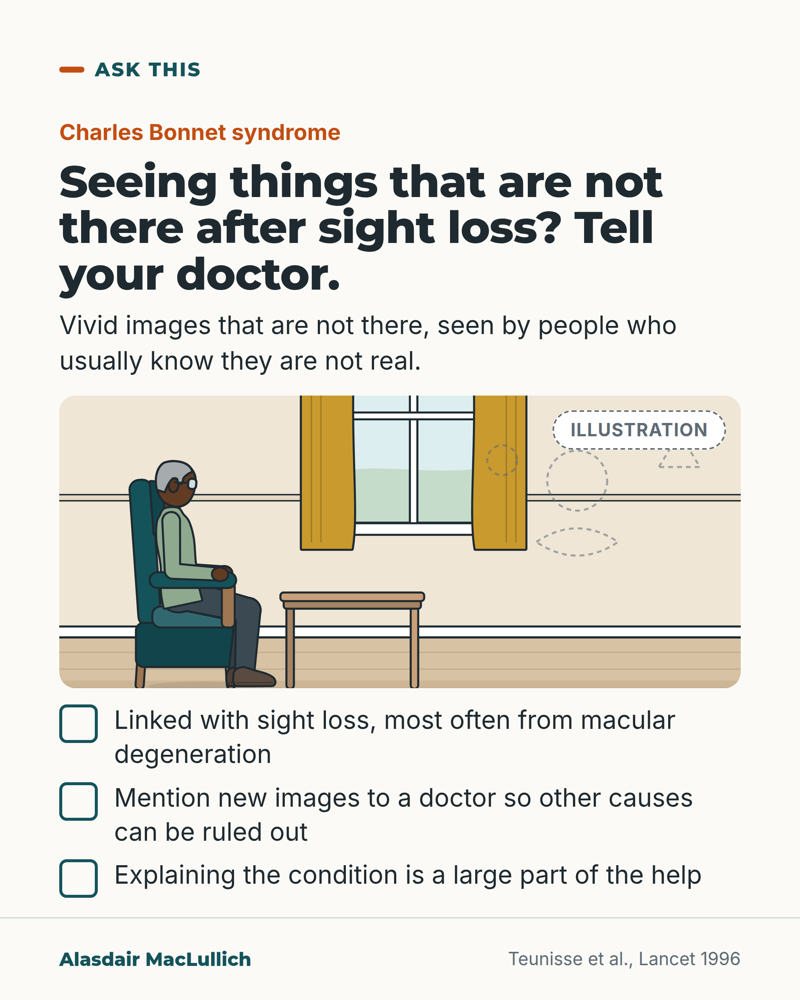

# G139: Seeing things after sight loss

- Category: C14 Hearing, vision and the senses
- Audience: public
- Series: Ask this
- Post type: public_explanation
- Visual format: drawn illustration
- Status: text text_final, visual final
- Working id: C14-P03 (candidate C14-20)

## Insight

Some people with sight loss, most often from macular degeneration, see vivid images that are not there and know they are not real (Charles Bonnet syndrome). Many say nothing for fear of being thought mentally ill; mentioning new images lets other causes be ruled out, and the explanation is a large part of the help.

## Angle and position

The fear of being thought mentally ill keeps people quiet. In a 1990s Dutch study only 1 of 16 who saw a doctor got the right explanation, and all were glad to hear it was not mental illness. We should tell people in advance.

Basis: Mixed. Empirical: the Dutch study and the review of the syndrome. Clinical interpretation: new hallucinations still need assessment for other causes. Ethical judgement: eye clinics should mention the syndrome when sight loss is diagnosed.

## X (794 characters)

```text
Some people with sight loss, most often from macular degeneration, an eye condition, see vivid images that are not there. They usually know the images are unreal. The name is Charles Bonnet syndrome.

In a Dutch study of 505 patients with sight loss, 60 had these images. All knew the images were unreal. Of 16 who had seen a doctor about them, only 1 had been given the right explanation. All were glad to hear it was not mental illness. The patients were a selected group and the study was published in 1996, so awareness may be better now.

People often keep the images to themselves, fearing they will be thought mentally ill. If you see something that is not there, tell your doctor, so other causes can be ruled out. We should tell people about this syndrome when sight loss is diagnosed.
```

## LinkedIn (1193 characters)

```text
Some people with sight loss see vivid images that are not there. They usually know the images are unreal. This is called Charles Bonnet syndrome, and it is most often linked with age-related macular degeneration, an eye condition that damages sight.

The numbers come from a Dutch study, published in 1996, of 505 patients with sight loss. Sixty of them had these images. All 60 knew the images were unreal. Only 1 of the 16 who had seen a doctor about them had been given the right explanation. All were glad to be told it was not mental illness.

That was a selected group of patients, so the 60 in 505 applies only to that group. Awareness may have improved since.

A review describes the syndrome as underreported, because people fear being thought mentally ill. It is also a diagnosis reached after other causes have been ruled out. So a new hallucination, something you see that is not there, should still be mentioned to a doctor. A major part of the treatment is a careful explanation of the condition.

Eye clinics should mention Charles Bonnet syndrome when they tell someone their sight is failing. Then, the first time an image appears, the person knows what it is and who to tell.
```

## Bluesky (296 characters)

```text
Some people with sight loss, often from macular degeneration, see vivid images of things that are not there, and usually know it. The name is Charles Bonnet syndrome. Many tell no one, fearing they will be thought mentally ill. Tell a doctor about any new images so other causes can be ruled out.
```

## Threads (500 characters)

```text
Some people with sight loss see vivid images that are not there, and usually know it. The name is Charles Bonnet syndrome, often linked with macular degeneration.

In a Dutch study of patients with sight loss, only 1 of 16 who saw a doctor about the images was given the right explanation. All were glad to hear it was not mental illness.

If you see something that is not there, tell your doctor so other causes can be ruled out. Eye clinics should mention the syndrome when sight loss is diagnosed.
```

## Source reply

Sources: https://doi.org/10.1016/s0140-6736(96)90869-7 | https://pubmed.ncbi.nlm.nih.gov/30667516/

## Visual



Alt text: Illustration of an older man in an armchair by a window with faint dashed shapes across the room, for Charles Bonnet syndrome. Text: tell your doctor about images that are not there after sight loss; explaining the condition is a large part of the help.

Editable source: `visuals/src/G139.html`

Design instructions: Single card, Kit scene sand with armchair man, window, dashed faint shapes, ticks.

## Sources and verification

- C14-20-a (supported): Charles Bonnet syndrome: complex visual hallucinations in people with sight loss who keep insight; linked to acquired visual loss, often AMD.
  - Source: Teunisse RJ, Cruysberg JR, Hoefnagels WH, Verbeek AL, Zitman FG. Visual hallucinations in psychologically normal people: Charles Bonnet's syndrome. Lancet. 1996;347(9004):794-7.; Molander S, Singh A. [Complex visual hallucinations in the visually impaired, the Charles Bonnet syndrome]. Lakartidningen. 2019;116:FE7L.
  - Passage: "Charles Bonnet syndrome (CBS) is characterised by recurrent, complex and vivid visual hallucinations in the absence of cognitive dysfunction. Individuals with CBS usually maintain insight into the unreal nature of their hallucinatory experiences. There is a strong association between CBS and acquired visual loss and the most commonly described ocular pathology is age-related macular degeneration." (Molander 2019 abstract)
- C14-20-b (supported_with_qualification): Teunisse 1996: 60 of 505 met criteria; all had full insight; correct diagnosis in 1 of 16 who saw a doctor; all glad to be told not mental illness.
  - Source: Teunisse RJ, Cruysberg JR, Hoefnagels WH, Verbeek AL, Zitman FG. Visual hallucinations in psychologically normal people: Charles Bonnet's syndrome. Lancet. 1996;347(9004):794-7.
  - Passage: "After screening 505 visually handicapped patients, 60 were found to meet proposed diagnostic criteria for CBS ... all patients had full insight into the unreal nature of their hallucinations. ... CBS caused considerable distress in only 17 (28%) patients. However, all patients were glad to be told that their hallucinations were not due to mental disease. The proper diagnosis had been made in only one of the 16 patients who had consulted a doctor." (Abstract)
- C14-20-c (supported_with_qualification): CBS is a diagnosis of exclusion; new hallucinations need assessment for other causes; information about benign nature is key treatment.
  - Source: Molander S, Singh A. [Complex visual hallucinations in the visually impaired, the Charles Bonnet syndrome]. Lakartidningen. 2019;116:FE7L.
  - Passage: "It is widely agreed that CBS is an underreported diagnosis caused by patients' reluctance to admit their hallucinatory experience because of fear of being labelled mentally ill. CBS is a diagnosis of exclusion and careful assessment must be made to ensure that other etiologies causing the symptoms are ruled out. ... Thus, a major part of the treatment is careful information about the benign nature of the condition." (Abstract)

Verification notes: C14-20-a (Teunisse 1996 abstract; Molander 2019 abstract): definition, link with acquired sight loss, most often macular degeneration. C14-20-b (Teunisse 1996 abstract): 60 of 505 in a clinic sample, all full insight, 1 of 16 who consulted a doctor properly diagnosed, all glad; stated as a selected group of patients from 1996 and not a general prevalence. C14-20-c (Molander 2019 narrative review): underreported, diagnosis of exclusion, information is a major part of treatment. 'Eye clinics should mention it' is marked as judgement (We should). Other causes are not named. The word hallucination is explained in the LinkedIn text.

## Attention and follow potential

Pause: Anyone who has seen something that is not there and told nobody, and their family.

Gain: A name for the experience, permission to mention it, and the reason it is still worth mentioning.

Follow: Clear explanations of things people are afraid to ask about.

## Open issues

None.
