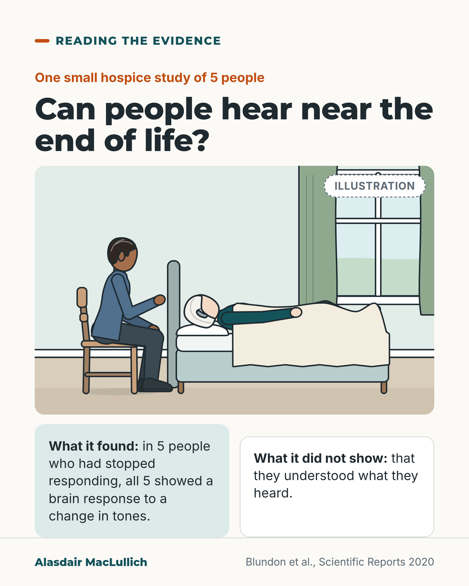

# G140: Hearing near the end of life

- Category: C14 Hearing, vision and the senses
- Audience: public
- Series: Reading the evidence
- Post type: evidence_interpretation
- Visual format: drawn illustration (bedside scene with two text blocks)
- Status: text text_final, visual final
- Working id: C14-P04 (candidate C14-15)

## Insight

The authors of one hospice study say the belief that hearing is the last sense to go rests mostly on anecdote. In a small hospice study, all 5 people who had stopped responding still showed a brain response to a change in tones, which shows part of the hearing system was reacting and does not show they understood.

## Angle and position

Families are often told hearing is the last sense to go. The honest state of the evidence is five people and simple tones, with the authors giving some support to the advice to keep talking. The practical advice (speak to the person, say who you are, keep a hearing aid in if comfortable) is offered as judgement, and the post removes any suggestion that absent or silent relatives failed.

Basis: Mixed. Empirical finding: 5 of 5 had a brain response to tone changes in a hospice EEG study; limited to tones, 5 people, no impaired thinking at entry. Authors' interpretation: some support for continuing to talk. Ethical and practical judgement: speak to the person as someone who may hear; hearing aid in if comfortable.

## X (812 characters)

```text
It is often said that hearing is one of the last senses to stop working when a person is dying. The authors of one study say the belief rests mostly on anecdote. They used brain recordings to look for signs of hearing.

In a Canadian hospice, researchers played tones through headphones to 5 people who had stopped responding and were actively dying. All 5 showed a brain response to a change in the tones, so their hearing system was still reacting.

This does not show that they understood what they heard. It was only 5 people. The sounds were tones, not voices. None had impaired thinking or confusion when they joined.

The authors say it gives some support to the advice to keep talking to a dying relative. We should speak to the person as someone who may hear: say who you are, and talk to them directly.
```

## LinkedIn (1388 characters)

```text
It is often said that hearing is one of the last senses to stop working when a person is dying. The authors of one small hospice study in Canada say the belief rests mostly on anecdote. They looked for signs of hearing with brain recordings.

The researchers played sequences of tones through headphones and recorded brain activity with an EEG. They recorded 5 people who had stopped responding and were actively dying. All 5 showed a brain response to a change in the tones, so part of their hearing system was still reacting. 17 healthy students were recorded for comparison, and all 17 showed the same kind of response. The authors used a somewhat looser analysis than the study whose method they followed, so each person's result is only a hint.

This does not show that they understood what they heard. The sounds were tones, not speech or relatives' voices. Five people is a very small group. All of the patients were free of impaired thinking or confusion when they joined. So the results may not apply to people with dementia.

The authors say the finding gives some support to the advice that loved ones keep talking to a dying relative.

What follows is our judgement. We should speak to the person as someone who may hear. If they usually wear a hearing aid and it is comfortable, keeping it in is a sensible default. Say who you are when you arrive, and talk to them directly.
```

## Bluesky (279 characters)

```text
A small hospice study played tones to 5 people who had stopped responding and were actively dying. All 5 showed a brain response to a change in the tones. This does not show they understood. The authors say it gives some support to the advice to keep talking to a dying relative.
```

## Threads (489 characters)

```text
It is often said that hearing is one of the last senses to stop working near death. The authors of one hospice study say the belief rests mostly on anecdote.

The researchers played tones to 5 people who had stopped responding and were actively dying. All 5 showed a brain response to a change in the tones. That does not show they understood what they heard.

The authors say it gives some support to the advice to keep talking to a dying relative. We should speak directly to the person.
```

## Source reply

Sources: https://doi.org/10.1038/s41598-020-67234-9

## Visual



Alt text: Illustration of an older woman with a hearing aid in bed and a young man sitting beside her. Text: in one small hospice study of 5 unresponsive people, all 5 showed a brain response to tone changes; it did not show they understood what they heard.

Editable source: `visuals/src/G140.html`

Design instructions: Single card, Kit bedside scene, two panels (mint and white).

## Sources and verification

- C14-15-a (supported_with_qualification): In a hospice EEG study, all 5 patients recorded when unresponsive showed a brain response to changes in simple tones; none showed the later response that goes with conscious detection of tone changes; 2 of the 5 showed it to changes in a pattern of tones.
  - Source: Blundon EG, Gallagher RE, Ward LM. Electrophysiological evidence of preserved hearing at the end of life. Sci Rep. 2020;10(1):10336.
  - Passage: "Consistent with control and responsive participants, all (5/5) showed some evidence of either an early fronto-central negativity (MMN), or a later fronto-central positivity (P3a), or both, to tone changes. None of the unresponsive patients showed a centro-parietal positivity (P3b) to the tone changes. One unresponsive patient (20%) showed evidence of a weak late fronto-central positivity (P3a) to pattern changes, and two patients showed stronger centro-parietal positivity (P3b) to pattern changes." (Full text, Results (Unresponsive, actively dying, hospice patients))
- C14-15-b (supported): These responses show part of the hearing system was working but do not show understanding or awareness; the authors say the result lends some credence to advice to keep talking to a dying relative.
  - Source: Blundon EG, Gallagher RE, Ward LM. Electrophysiological evidence of preserved hearing at the end of life. Sci Rep. 2020;10(1):10336.
  - Passage: "It is still unclear how the partial functioning of the auditory change detection system we have reported here relates to normal conscious awareness, in spite of arguments from the existing literature. ... We have presented evidence that at least a few actively dying hospice patients, when they are unable to respond to family or healthcare provider verbal stimuli, nonetheless seem to be hearing and giving neural responses to sequences of simple auditory stimuli. This is consistent with the trope that hearing is one of the last senses to lose function when a person is dying, and lends some credence to the advice that loved ones should keep talking to a dying relative as long as possible." (Discussion)
- C14-15-c (supported): Study size and limits: 13 patients recruited, 4 excluded for noisy EEG, 9 analysed, 5 recorded when unresponsive; most on opioids; no delirium or cognitive impairment at entry.
  - Source: Blundon EG, Gallagher RE, Ward LM. Electrophysiological evidence of preserved hearing at the end of life. Sci Rep. 2020;10(1):10336.
  - Passage: "Data were collected initially from 13 participants, residing in a hospice facility in Vancouver, over a time period of more than two years. ... Data from four patients were excluded because of excessive noise in their EEG. The patient analysis to be described is based on nine patients (four female, age 28 to 88 years, mean age 68.2 years). Eight patients were recorded when they were responsive, five when they were unresponsive. ... Note that most patients were receiving various forms of opioids at both recording sessions." (Full text, Methods (Hospice patients))

Verification notes: C14-15-a (Blundon 2020, full text opened): 5 recorded when unresponsive; 5 of 5 with an MMN or P3a to tone changes; counts used, not 'most'; the P3b results (none to tone changes, 2 of 5 to pattern changes) are deliberately left out so nothing implies awareness. C14-15-b: shows part of the hearing system reacting, not understanding; authors say it lends some credence to the advice to keep talking. C14-15-c: 13 recruited, 4 excluded, 9 analysed, 5 recorded when unresponsive; no impaired thinking or delirium at entry (the word delirium is not used in the post). Speaking to the person, saying who you are, and keeping a hearing aid in are marked as judgement; no guideline cited (C14-15-d not found).

## Attention and follow potential

Pause: Families who have sat with a dying relative, or are about to, and who have heard this saying.

Gain: An accurate answer with its limits stated, and something kind and reasonable to do.

Follow: Careful handling of evidence on sensitive questions, without false comfort.

## Open issues

None.
