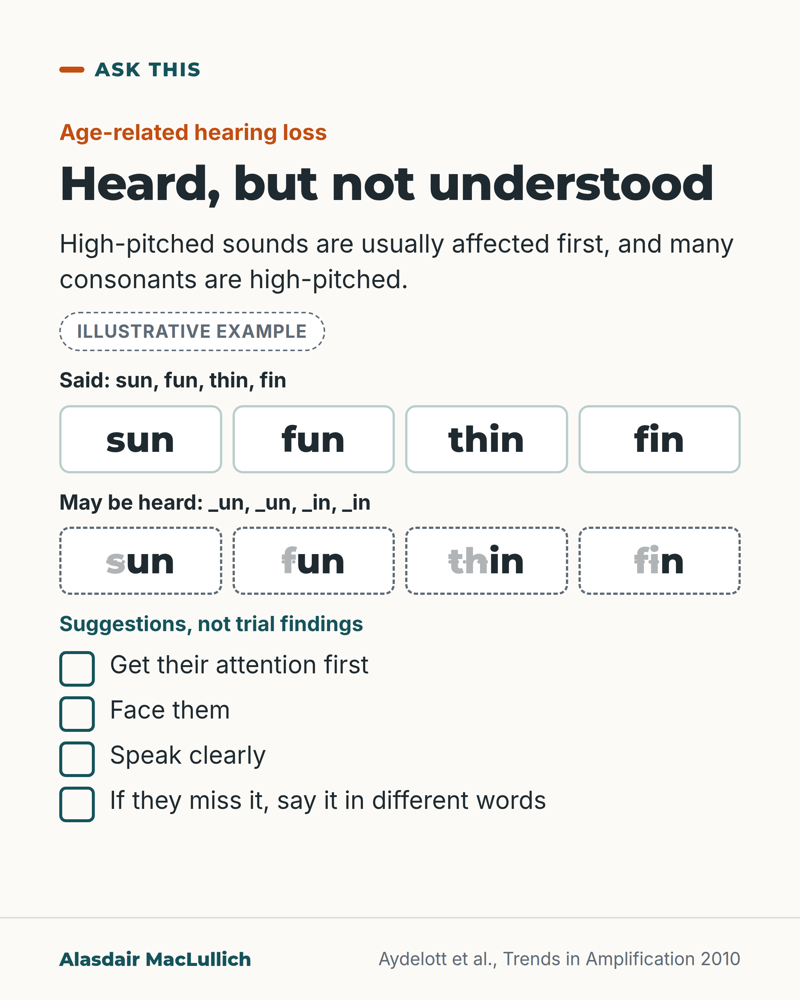

# G141: Loud enough, still unclear

- Category: C14 Hearing, vision and the senses
- Audience: public
- Series: Ask this
- Post type: public_explanation
- Visual format: comparison (illustrative word pairs with the high-pitched first sound faded, plus four suggestions)
- Status: text text_final, visual final
- Working id: C14-P05 (candidate C14-16)

## Insight

Age-related hearing loss usually affects high-pitched sounds first, and many consonants are high-pitched, so a person can hear that someone is talking but miss parts of words. Getting attention, facing the person, speaking clearly and rephrasing are practical suggestions.

## Angle and position

'She hears what she wants to hear' has a physical explanation that removes blame. Clear speech helped listeners with hearing loss in a very small 1985 experiment; the rest (attention, facing, rephrasing) is presented as practical suggestion, not as a finding.

Basis: Mixed. Empirical: high-pitched loss and consonants (review); clearly spoken speech understood better in 5 listeners (1985). Practical judgement: the four suggestions, labelled as such.

## X (689 characters)

```text
'She hears what she wants to hear' is something families say. Age-related hearing loss gives a physical reason it can seem that way.

It usually affects high-pitched sounds first, and many consonants such as s, f and th are high-pitched. So a person can hear that someone is talking but miss parts of words. Illustrative example: sun and fun, or thin and fin, can sound alike.

A very small 1985 experiment tested 5 listeners with hearing loss. They understood clear speech better than ordinary conversation. The gain was similar at each loudness level tested.

Our practical suggestions: get their attention first, face them, speak clearly, and if they miss it, say it in different words.
```

## LinkedIn (1158 characters)

```text
'She hears what she wants to hear' is something families say. Age-related hearing loss gives a physical reason it can seem that way.

Age-related hearing loss usually affects high-pitched sounds first. Many consonants, speech sounds such as s, f and th, are high-pitched. So a person can hear that someone is talking but miss parts of words. Illustrative example: sun and fun, or thin and fin, can sound alike when the first sound is lost.

One finding on what helps comes from a very small experiment in 1985. Five listeners with hearing loss understood clear speech better than ordinary conversation. The gain was similar at each loudness level tested. Five people is very few, and the sentences were nonsense sentences made for the test, so this is only a first indication.

The rest of the advice is our practical suggestion:

1. Get their attention before you speak.
2. Face them, so they can see your mouth.
3. Speak clearly rather than only more loudly.
4. If they miss it, say it again in different words, which gives a second chance with different sounds.

Next time someone says a person only hears what they want to hear, try the four steps first.
```

## Bluesky (293 characters)

```text
Age-related hearing loss usually affects high-pitched sounds first, and many consonants (such as s, f and th) are high-pitched. A person can hear you talking but miss parts of words. Our suggestion: get their attention, face them, speak clearly, and if they miss it, say it in different words.
```

## Threads (420 characters)

```text
'She hears what she wants to hear' is something families say. Age-related hearing loss gives a physical reason it can seem that way.

It usually affects high-pitched sounds first, and many consonants such as s, f and th are high-pitched. A person can hear that you are talking but miss parts of words.

Our suggestions: get their attention first, face them, speak clearly, and if they miss it, say it in different words.
```

## Source reply

Sources: https://doi.org/10.1177/1084713810393751 | https://doi.org/10.1044/jshr.2801.96

## Visual



Alt text: Card on age-related hearing loss: sun, fun, thin, fin with the first sounds faded to _un and _in, labelled illustrative. Four suggestions, not trial findings: get attention, face them, speak clearly, rephrase if missed.

Editable source: `visuals/src/G141.html`

Design instructions: Single card, word cards with faded first sounds, dashed borders, checklist.

## Sources and verification

- C14-16-a (supported): Age-related hearing loss mainly affects high pitches, making consonants inaudible.
  - Source: Aydelott J, Leech R, Crinion J. Normal adult aging and the contextual influences affecting speech and meaningful sound perception. Trends Amplif. 2010;14(4):218-32.
  - Passage: "Age-related hearing loss is typified by high-frequency threshold elevation and associated reductions in speech perception because speech sounds, especially consonants, become inaudible." (Abstract)
- C14-16-b (partly_supported): Speaking clearly helps more than volume; shouting distorts.
  - Source: Picheny MA, Durlach NI, Braida LD. Speaking clearly for the hard of hearing I: intelligibility differences between clear and conversational speech. J Speech Hear Res. 1985;28(1):96-103.
  - Passage: "The average intelligibility difference between clear and conversational speech averaged across talker was found to be 17 percentage points. To a first approximation, this difference was independent of the listener, level, and frequency-gain characteristic." (Abstract)

Verification notes: C14-16-a (Aydelott 2010 abstract): high-frequency loss and inaudible consonants in age-related loss. C14-16-b is partly supported: only the part found in the opened abstract (Picheny 1985: clear speech about 17 percentage points better than conversational speech, independent of level, 5 listeners; the number is not quoted for the public) is used. 'Shouting distorts speech' and the benefit of rephrasing were not found in an opened source, so the post does not say that shouting is harmful and presents rephrasing as a suggestion. The sun/fun and thin/fin pairs are illustrative and labelled.

## Attention and follow potential

Pause: Families who argue about 'selective hearing' and the person who is accused of it.

Gain: A physical explanation that reduces blame, and four things to try.

Follow: Explanations that change how families talk to each other, with the evidence kept honest.

## Open issues

- C14-16-b is partly_supported: only the verified part (clearly spoken speech understood better in 5 listeners in 1985) is used; the volume, rephrasing and attention suggestions are labelled as practical suggestions.
