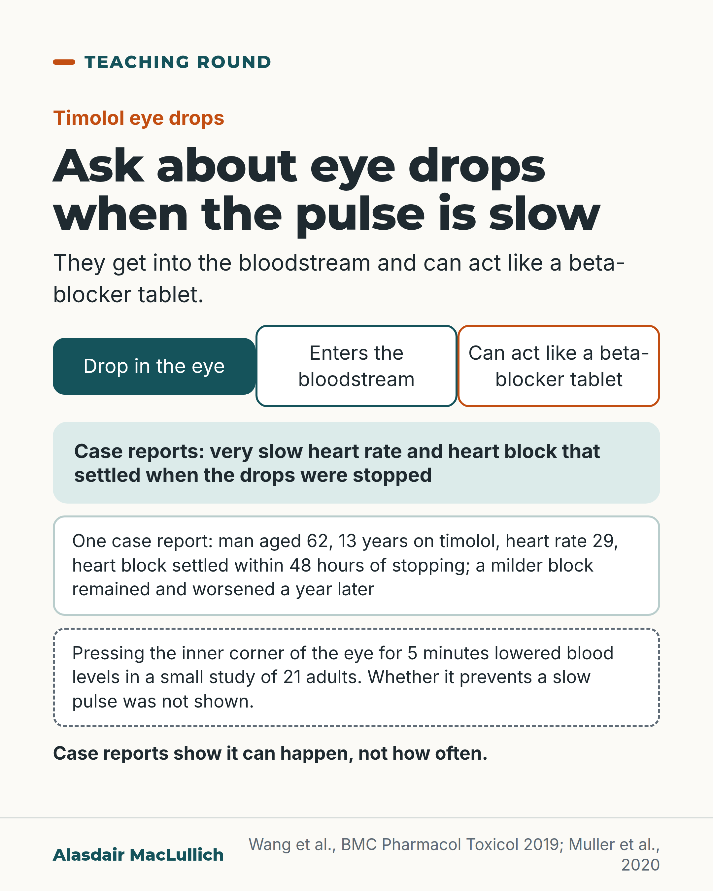

# G142: Eye drops that can slow the heart

- Category: C14 Hearing, vision and the senses
- Audience: practitioners
- Series: Teaching round
- Post type: teaching
- Visual format: diagram (route from eye drop to heart, with an inset of the pressing method)
- Status: text text_final, visual final
- Working id: C14-P06 (candidate C14-19)

## Insight

Timolol eye drops get into the bloodstream and can act like a beta-blocker tablet; case reports describe very slow heart rates and heart block that settled when the drops were stopped. In an older person with a slow pulse, ask about eye drops directly.

## Angle and position

Eye drops are easy to leave off the list of suspects for a slow pulse. Case reports show it can happen, not how often; pressing the inner corner of the eye lowered blood levels in a small trial in adults, but whether it prevents a slow pulse was not shown.

Basis: Mixed. Empirical: systemic absorption; case reports; blood-level reduction by occlusion or tissue press in 21 adults (main outcome was plasma level; heart rate and blood pressure were secondary measures). Clinical interpretation and judgement: ask directly about eye drops, and discuss alternatives with the eye team.

## X (958 characters)

```text
Timolol eye drops get into the bloodstream and can act like a beta-blocker tablet. In an older person with a slow pulse or heart block, ask about eye drops directly.

Case reports describe very slow heart rates and heart block that settled when the drops were stopped. In one, a man of 62, 13 years on timolol, had a heart rate of 29 beats a minute and complete heart block, which settled within 48 hours of stopping. A milder block remained and had worsened a year later. This suggests an underlying conduction problem that the drops made apparent, and the authors recommend long-term follow-up. Case reports show it can happen. They do not show how often.

A small cross-over study of 21 adults tested pressing the inner corner of the eye for 5 minutes after the drop. It lowered the timolol level in the blood. Whether this prevents a slow pulse was not shown. Other types of glaucoma drops exist, so ask the eye team whether a different drop is suitable.
```

## LinkedIn (1546 characters)

```text
Timolol eye drops get into the bloodstream and can act like a beta-blocker tablet. When an older person has a slow pulse or heart block, ask about eye drops directly, because a drop in the eye is easy to overlook.

The evidence is case reports. They describe very slow heart rates and heart block that settled when the drops were stopped. In one case, a man of 62 had used timolol for 13 years. His heart rate was 29 beats a minute with complete atrioventricular block. It settled within 48 hours of stopping the drops. A milder block remained and had worsened a year later. This suggests an underlying conduction problem that the drops made apparent, and the authors recommend long-term follow-up. Case reports show that it can happen. They do not show how often.

A small randomised cross-over trial in 21 adults tested ways to reduce absorption. It compared pressing on the inner corner of the eye for 5 minutes after the drop, a second method using a tissue, and no intervention. Both methods lowered the timolol level in the blood one hour after the drop. The main outcome was the timolol level in the blood. Heart rate and blood pressure were also measured, but the abstract does not report whether they differed from no intervention. The adults were not described as older patients, so a benefit for slow pulse is not shown. The 5 minutes is the method the trial used; no dosing advice follows from it.

For a patient with a slow pulse and a beta-blocker drop, other types of glaucoma drops exist, and the choice belongs with the eye team.
```

## Bluesky (299 characters)

```text
Timolol eye drops reach the bloodstream and can act like a beta-blocker tablet. Case reports describe slow heart rates and heart block that settled when drops stopped; in one, a milder block remained. They show it can happen, not how often. In an older person with a slow pulse, ask about eye drops.
```

## Threads (496 characters)

```text
Timolol eye drops get into the bloodstream and can act like a beta-blocker tablet.

Case reports describe slow heart rates and heart block that settled when drops stopped; in one, a milder block remained and worsened. They show it can happen, not how often.

In a small study of 21 adults, pressing the inner corner of the eye for 5 minutes after the drop lowered the blood timolol level. Whether it prevents a slow pulse was not shown.

In an older person with a slow pulse, ask about eye drops.
```

## Source reply

Sources: https://doi.org/10.1186/s40360-019-0370-2 | https://doi.org/10.1111/ceo.13642

## Visual



Alt text: Diagram: timolol eye drop, enters the bloodstream, can act like a beta-blocker tablet. Notes on a case report of heart rate 29 in a man aged 62, a 21-adult study of pressing the eye corner for 5 minutes, and that case reports do not show how often.

Editable source: `visuals/src/G142.html`

Design instructions: Single card, three-step flow plus notes; claims C14-19-a, C14-19-b.

## Sources and verification

- C14-19-a (supported_with_qualification): Timolol eye drops enter the circulation and cause systemic beta-blockade; case reports describe complete heart block resolving on stopping.
  - Source: Wang Z, Denys I, Chen F, Cai L, Wang X, Kapusta DR, et al. Complete atrioventricular block due to timolol eye drops: a case report and literature review. BMC Pharmacol Toxicol. 2019;20(1):73.
  - Passage: "Despite its topical administration, ophthalmic timolol enters systemic circulation and produces a systemic beta-adrenergic blockade. ... Electrocardiography indicated a heart rate (HR) of 29 bpm with complete atrioventricular (AV) block ... The AV block and bradycardia resolved 48-h after timolol cessation." (Abstract)
- C14-19-b (supported_with_qualification): Nasolacrimal occlusion (5 min) and tissue press method both lowered plasma timolol vs no intervention.
  - Source: Müller L, Jensen BP, Bachmann LM, Wong D, Wells AP. New technique to reduce systemic side effects of timolol eye drops: the tissue press method. Cross-over clinical trial. Clin Exp Ophthalmol. 2020;48(1):24-30.
  - Passage: "These were: (a) nasolacrimal (punctal) occlusion for 5 min, (b) tissue press method or (c) no intervention. Timolol plasma levels were measured 1 h after drop application. ... Plasma timolol concentrations after tissue press method and NLO were significantly lower than those without intervention." (Abstract)

Verification notes: C14-19-a (Wang 2019, abstract): systemic absorption; single case, man 62, 13 years of timolol, heart rate 29, complete AV block, settled 48 hours after stopping; underlying conduction problem unmasked. C14-19-b (Muller 2020, abstract): 21 adults, nasolacrimal occlusion for 5 minutes or tissue press lowered plasma timolol at 1 hour; main outcome plasma level; heart rate, blood pressure and eye pressure were secondary outcomes, not reported against no intervention in the abstract; adults not described as older patients. BNF cautions, contraindication list and press duration from the BNF were not opened and are not used; alternatives are given in general terms only. The tear-duct absorption mechanism is not stated because no claim covers it.

## Attention and follow potential

Pause: Clinicians who have missed it, or seen it missed, in a patient with a slow pulse.

Gain: A specific drug to ask about and a technique studied for reducing absorption, with its limits.

Follow: Teaching points that fall between specialties.

## Open issues

- Schedule at least two weeks from C06-15 (editor's guidance); this post owns the beta-blocker eye drop and slow-heart point.
