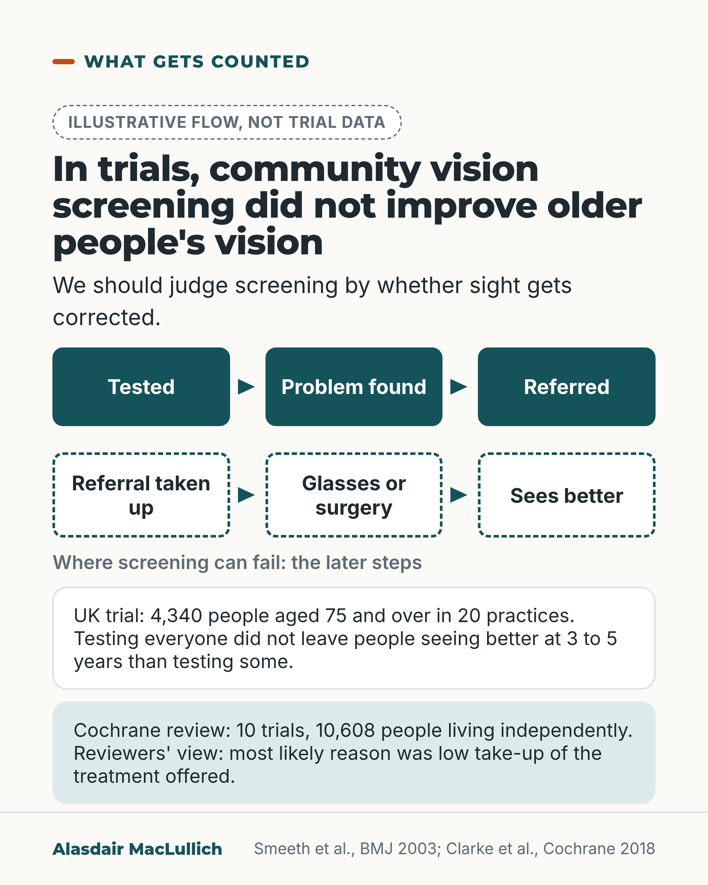

# G143: The vision screening that did not improve vision

- Category: C14 Hearing, vision and the senses
- Audience: practitioners
- Series: What gets counted
- Post type: evidence_interpretation
- Visual format: diagram (flow, labelled illustrative, with two result boxes)
- Status: text text_final, visual final
- Working id: C14-P07 (candidate C14-27)

## Insight

In a UK trial of 4,340 people aged 75 and over, testing everyone's eyesight at a health check did not leave people seeing better 3 to 5 years later than testing only some people, and a Cochrane review of community screening reached the same conclusion; the reviewers thought low take-up of treatment was the most likely reason.

## Angle and position

Screening can be counted by people tested and referred. This trial counted whether eyesight was better years later, and it was not. The trial tested screening, not glasses or cataract surgery. The post argues, as judgement, that programmes should be judged by whether sight gets corrected.

Basis: Mixed. Empirical: the UK trial (universal v targeted screening) and the Cochrane review. Reviewers' interpretation: low take-up. Ethical and practical judgement: judge programmes by whether sight is corrected and make the step from test to treatment easy.

## X (819 characters)

```text
Testing everyone's eyesight at a health check did not leave people aged 75 and over seeing better 3 to 5 years later than testing only some of them.

That was the result of a UK trial of 4,340 people in 20 general practices. The two groups did not differ clearly in how many had poor sight in either eye.

A Cochrane review of 10 trials in over 10,000 older people living independently found that community vision screening did not improve vision. The reviewers thought the most likely reason was that people often did not take up the treatment offered, while many unscreened people appeared to seek help themselves. That is their interpretation, not a tested finding.

We should judge any programme to find sight problems by whether sight gets corrected, and make the step from test to glasses or surgery easy to take.
```

## LinkedIn (1408 characters)

```text
Testing everyone's eyesight at a health check did not leave people aged 75 and over seeing better 3 to 5 years later than testing only some of them.

That was the result of a UK cluster randomised trial of 4,340 people aged 75 and over in 20 general practices. It compared testing everyone with a check that tested only some people, those with health problems. The two groups did not differ clearly in how many had poor sight in either eye, or in scores on a questionnaire about everyday vision. The comparison was universal versus targeted screening, not screening versus none.

A Cochrane review of 10 trials in 10,608 people aged 65 and over, living independently, found the same: community screening did not improve vision. The reviewers thought the most likely reason was that people often did not take up the treatment offered after screening, while many people who were not screened appeared to seek help themselves. Those reasons are the reviewers' interpretation, not a tested finding. They suggested that future trials include more dependent people.

The trials tested screening. They did not test glasses or cataract surgery themselves.

Finding a problem helps only if treatment follows. We should judge any programme to find sight problems by whether sight gets corrected, not by how many people were tested or referred. We should also make the step from test to glasses or surgery easy to take.
```

## Bluesky (298 characters)

```text
Testing everyone's eyesight at a health check did not leave people aged 75 and over seeing better at 3 to 5 years than testing only some, in a UK trial of 4,340 people. A Cochrane review of community screening found no improvement in vision. We should judge screening by whether sight is corrected.
```

## Threads (442 characters)

```text
Testing everyone's eyesight at a health check did not leave people aged 75 and over seeing better 3 to 5 years later than testing only some, in a UK trial of 4,340 people. A Cochrane review of community screening found it did not improve vision.

The reviewers thought the most likely reason was that people often did not take up the treatment offered. That is their interpretation.

We should judge screening by whether sight gets corrected.
```

## Source reply

Sources: https://doi.org/10.1136/bmj.327.7422.1027 | https://doi.org/10.1002/14651858.CD001054.pub3

## Visual



Alt text: Illustrative six-step flow from tested to sees better, with the last three steps dashed as where screening can fail. Boxes summarise a UK trial of 4,340 people aged 75 and over and a Cochrane review of 10 trials, 10,608 people.

Editable source: `visuals/src/G143.html`

Design instructions: Single card, six-box flow (last three dashed) and two result panels.

## Sources and verification

- C14-27-a (supported_with_qualification): In a UK cluster RCT of 4340 people aged 75+, universal vision screening did not improve vision 3-5 years later compared with targeted screening.
  - Source: Smeeth L, Fletcher AE, Hanciles S, Evans J, Wormald R. Screening older people for impaired vision in primary care: cluster randomised trial. BMJ. 2003;327(7422):1027.
  - Passage: "Three to five years after screening, the relative risk of having visual acuity < 6/18 in either eye, comparing universal with targeted screening, was 1.07 (95% confidence interval 0.84 to 1.36; P = 0.58). The mean composite score of the visual function questionnaire was 85.6 in the targeted screening group and 86.0 in the universal group (difference 0.4, 95% confidence interval -1.7 to 2.5, P = 0.69). ... Including a vision screening component by a practice nurse in a pragmatic trial of multidimensional screening for older people did not lead to improved visual outcomes." (Abstract, Results and Conclusions)
- C14-27-b (supported): A Cochrane review found vision screening of older people in the community did not improve vision; most likely reason was low take-up of offered intervention.
  - Source: Clarke EL, Evans JR, Smeeth L. Community screening for visual impairment in older people. Cochrane Database Syst Rev. 2018;2(2):CD001054.
  - Passage: "The evidence from RCTs undertaken to date does not support vision screening for older people living independently in a community setting, whether in isolation or as part of a multi-component screening package. ... The most likely reason for this negative review is that the populations within the trials often did not take up the offered intervention as a result of the vision screening and large proportions of those who did not have vision screening appeared to seek their own intervention." (Abstract, Authors' conclusions)

Verification notes: C14-27-a (Smeeth 2003, abstract): 4,340 aged 75 and over, 20 practices, universal versus targeted screening, no clear difference in acuity below 6/18 in either eye (RR 1.07, 0.84 to 1.36) or questionnaire score at 3 to 5 years; worded as 'did not differ clearly'. C14-27-b (Cochrane 2018, abstract): 10 trials, 10,608 people, community-dwelling aged 65 and over; low take-up is the reviewers' interpretation; reviewers suggest testing more dependent people. The comparator was targeted screening in the UK trial, and this is stated. 'We should judge programmes by whether sight is corrected' is marked as judgement.

## Attention and follow potential

Pause: Practitioners who run, commission or audit health checks, and who count people tested.

Gain: A way to judge any detection programme, and the trial result behind it.

Follow: Trials read for what they actually measured.

## Open issues

None.
