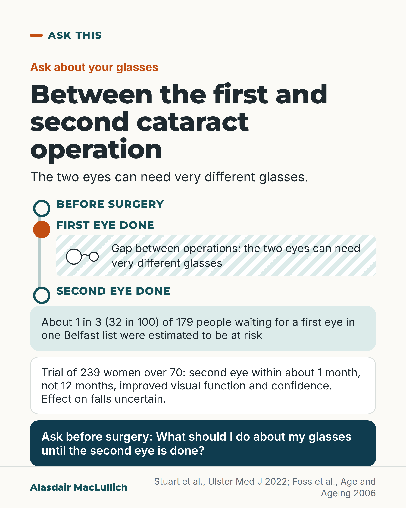

# G144: Between the first and second cataract operation

- Category: C14 Hearing, vision and the senses
- Audience: public
- Series: Ask this
- Post type: public_explanation
- Visual format: diagram (timeline)
- Status: text text_final, visual final
- Working id: C14-P08 (candidate C14-09)

## Insight

After the first cataract operation the two eyes can end up needing very different glasses. In one Belfast waiting list about 1 in 3 people awaiting a first eye were estimated to be at risk, and second-eye surgery probably helps even this out. Ask before surgery what to do about your glasses until the second eye is done.

## Angle and position

The operation is judged a success in the operated eye, and the person goes home with glasses made for the old eye. The post closes on the question to ask. It does not give lens advice or surgical criteria because no opened source supports them.

Basis: Mixed. Empirical: Belfast estimate of risk in one list; second-eye trial in women over 70; systematic review of second-eye surgery. Practical judgement: ask the question before surgery.

## X (693 characters)

```text
After your first cataract operation, the two eyes can end up needing very different glasses.

In one Belfast waiting list, about 1 in 3 people waiting for a first eye were estimated to be at risk of this troublesome imbalance. That is an estimate of risk in one clinic. Symptoms were not measured. Second-eye surgery probably reduces the difference between the eyes.

A trial of 239 women over 70 compared having the second eye done within about a month with waiting a year. Those who had it sooner saw better, especially in depth perception, and felt more confident. Whether it reduced falls was uncertain.

Before surgery, ask: what should I do about my glasses until the second eye is done?
```

## LinkedIn (1355 characters)

```text
After your first cataract operation, the two eyes can end up needing very different glasses. The doctor's word for this is anisometropia, a big difference between the two eyes in the strength of glasses needed.

How common is it? In one Belfast waiting list in 2020, about 1 in 3 of the 179 people waiting for their first eye (32 in 100) were estimated to be at risk of this troublesome imbalance after the operation. That is an estimate of risk in one clinic sample, not a count of people who had symptoms.

A systematic review found moderate evidence that second-eye surgery improved depth perception and the imbalance between the eyes, over and above the benefit of the first operation.

A trial included 239 women over 70 with one cataract still to be done. Those who had the second eye done within about 4 weeks, rather than after about 12 months, saw better and felt more confident. The trial included only women.

More women fell at least once after earlier surgery (40 in 100, against 34 in 100 of those who waited). The total number of falls was lower after earlier surgery. Both differences were too uncertain to be sure of a real effect.

The studies do not say what to do with your glasses in the meantime, and the answer depends on you and your eye team. So ask before surgery:

What should I do about my glasses until the second eye is done?
```

## Bluesky (280 characters)

```text
After your first cataract operation, the two eyes can need very different glasses. In one Belfast list, about 1 in 3 people waiting for a first eye were estimated to be at risk of this imbalance. Before surgery, ask: what should I do about my glasses until the second eye is done?
```

## Threads (496 characters)

```text
After your first cataract operation, the two eyes can end up needing very different glasses.

In one Belfast list, about 1 in 3 waiting for a first eye were estimated at risk of this imbalance. Second-eye surgery probably reduces it.

In a trial of 239 women over 70, a second operation within about a month, not a year later, improved how well they saw and their confidence. The effect on falls was uncertain.

Before surgery, ask: what should I do about my glasses until the second eye is done?
```

## Source reply

Sources: https://doi.org/10.1093/ageing/afj005 | https://pubmed.ncbi.nlm.nih.gov/35169334/ | https://doi.org/10.1016/j.jcrs.2013.08.033

## Visual



Alt text: Timeline from before surgery, first eye done, to second eye done, with a hatched gap and glasses with unequal lenses. About 1 in 3 of 179 in one Belfast list at risk; trial of 239 women over 70. Question to ask about glasses.

Editable source: `visuals/src/G144.html`

Design instructions: Single card, timeline with hatched gap and glasses icon; claims C14-09-a, C14-09-b.

## Sources and verification

- C14-09-a (supported_with_qualification): After first-eye cataract surgery, a substantial share of people may be left with a large difference between the eyes (symptomatic anisometropia) until the second eye is done.
  - Source: Stuart M, Mooney C, Hrabovsky M, Silvestri G, Stewart S. Surgical planning during a pandemic: identifying patients at high risk of severe disease or death due to COVID-19 in a cohort of patients on a cataract surgery waiting list. Ulster Med J. 2022;91(1):19-25.; Ishikawa T, Desapriya E, Puri M, Kerr JM, Hewapathirane DS, Pike I. Evaluating the benefits of second-eye cataract surgery among the elderly. J Cataract Refract Surg. 2013;39(10):1593-603.
  - Passage: "57% of patients were awaiting first eye surgery, and 32% of those patients would be at risk of symptomatic anisometropia postoperatively. [Ishikawa:] We found "moderate" evidence supporting improvement in stereopsis, stereoacuity, and anisometropia over and above the benefits of first-eye surgery." (Abstracts, Results)
- C14-09-b (supported): In an RCT of 239 women over 70, expedited second-eye surgery improved visual function and confidence; the reduction in falls was not statistically significant.
  - Source: Foss AJE, Harwood RH, Osborn F, Gregson RM, Zaman A, Masud T. Falls and health status in elderly women following second eye cataract surgery: a randomised controlled trial. Age Ageing. 2006;35(1):66-71.
  - Passage: "visual function (especially stereopsis) improved in the operated group. ... Rate of falling was reduced by 32% in the operated group, but this was not statistically significant (rate ratio 0.68, 95% CI 0.39, 1.19, P = 0.18). Confidence, visual disability and handicap all improved in the operated compared with the control group. ... The effect on rate of falling remains uncertain." (Abstract)

Verification notes: C14-09-a (Stuart 2022 abstract; Ishikawa 2013 review abstract): 32% of those awaiting a first eye in a 2020 Belfast list estimated at risk of symptomatic anisometropia; estimate not measured symptoms; moderate evidence that second-eye surgery improves anisometropia. C14-09-b (Foss 2006 abstract): 239 women over 70, about 4 weeks v 12 months; visual function, confidence, visual disability improved; falls rate ratio 0.68 (0.39 to 1.19), uncertain. No source for lens-removal advice or NICE criteria was opened, so none is stated. Women only is stated. The 32 in 100 is not offered as a benefit.

## Attention and follow potential

Pause: People on a cataract waiting list, or just after the first eye.

Gain: A question to ask before surgery that most leaflets and appointments may not raise.

Follow: Useful practical details alongside the evidence.

## Open issues

None.
