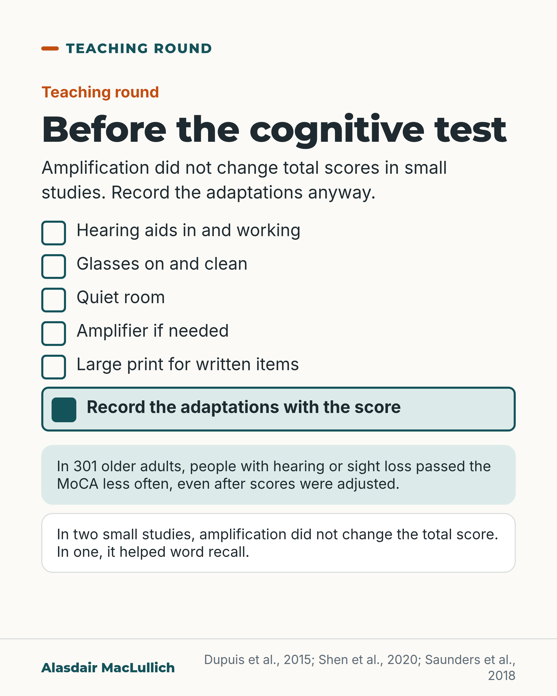

# G145: Set up the cognitive test before you score it

- Category: C14 Hearing, vision and the senses
- Audience: practitioners
- Series: Teaching round
- Post type: teaching
- Visual format: checklist card
- Status: text text_final, visual final
- Working id: C14-P09 (candidate C14-31)

## Insight

Cognitive screening tests are delivered by voice and on paper, and in 301 older adults those with hearing or sight loss passed the MoCA less often even after scores were adjusted. Use hearing aids, glasses and simple adaptations, and record them with the score.

## Angle and position

A person who mishears the words scores as if they forgot them. Amplification did not change total scores in small studies, which is a reason to record the adaptations rather than to skip them. The post is about test administration for practitioners, not about checking hearing before diagnosing dementia.

Basis: Mixed. Empirical: association between sensory loss and lower MoCA pass rates (301 adults, association only); two small studies showing amplification did not change the total MoCA score, with word recall helped in one. Practical judgement: the checklist and recording the adaptations.

## X (679 characters)

```text
A person who mishears the word list in a memory test scores as if they forgot it.

In 301 older adults, people with hearing or sight loss passed the Montreal Cognitive Assessment (MoCA) less often, even after scores were adjusted for items they could not hear or see. That is an association; it could also reflect real differences in thinking.

Two small studies found that amplification did not change the total MoCA score. In one of them it helped word recall. Use aids anyway.

Before the test: hearing aids in and working, glasses on, a quiet room, an amplifier if needed, large print. Then record the adaptations with the score, so the next reader knows how it was obtained.
```

## LinkedIn (1152 characters)

```text
A person who mishears the word list in a memory test scores as if they forgot it.

Cognitive screening tests are delivered by voice and on paper, so hearing and sight are part of the test. A study of 301 community-dwelling older adults, mean age 71, compared pass rates on the Montreal Cognitive Assessment (MoCA). More people with normal hearing and vision passed than people with sensory loss. This held after scores were adjusted for items they could not hear or see. That is an association, and it could also reflect real differences in thinking.

Two small studies in adults with hearing loss found that amplification did not change the total MoCA score; in one of them it helped word recall. The authors of the other study said this should not be taken to mean amplification is unnecessary.

So set the test up, and write down what you did:

1. Hearing aids in and working.
2. Glasses on and clean.
3. A quiet room.
4. A personal amplifier if needed.
5. Large print for written items.
6. Record the adaptations with the score.

The checklist is our practical suggestion. Recording the adaptations tells the next reader how to interpret the score.
```

## Bluesky (298 characters)

```text
Mishearing a memory test word list scores as forgetting it. In 301 older adults, hearing or sight loss was linked with passing the MoCA less often, even after adjusting for items they could not hear or see. In two small studies, amplification did not change the total score. Record the adaptations.
```

## Threads (436 characters)

```text
A person who mishears the word list in a memory test scores as if they forgot it.

In 301 older adults, people with hearing or sight loss passed the MoCA less often, even after scores were adjusted for items they could not hear or see. Two small studies found amplification did not change the total score; in one it helped word recall.

Use hearing aids, glasses, a quiet room and large print, and record the adaptations with the score.
```

## Source reply

Sources: https://doi.org/10.1080/13825585.2014.968084 | https://doi.org/10.1159/000500777 | https://doi.org/10.3766/jaaa.17044

## Visual



Alt text: Checklist before a cognitive test: hearing aids in, glasses on, quiet room, amplifier, large print, and record adaptations with the score. Notes: 301 older adults with hearing or sight loss passed the MoCA less often; amplification did not change total scores.

Editable source: `visuals/src/G145.html`

Design instructions: Single card checklist with emphasised last row and two note panels.

## Sources and verification

- C14-31-a (supported): Sensory loss lowers MoCA pass rates even after score adjustment.
  - Source: Dupuis K, Pichora-Fuller MK, Chasteen AL, Marchuk V, Singh G, Smith SL. Effects of hearing and vision impairments on the Montreal Cognitive Assessment. Neuropsychol Dev Cogn B Aging Neuropsychol Cogn. 2015;22(4):413-37.
  - Passage: "Many standardized measures of cognition include items that must be seen or heard... More participants with normal sensory acuity passed the MoCA compared to those with sensory loss, even after modifying scores to adjust for sensory factors." (Abstract)
- C14-31-b (partly_supported): Amplification during testing restores MoCA scores.
  - Source: Shen J, Sherman M, Souza PE. Test administration methods and cognitive test scores in older adults with hearing loss. Gerontology. 2020;66(1):24-32.; Saunders GH, Odgear I, Cosgrove A, Frederick MT. Impact of hearing loss and amplification on performance on a cognitive screening test. J Am Acad Audiol. 2018;29(7):648-655.
  - Passage: "We did not find any effect of amplification or test modality on the total score of the cognitive screening test (i.e., MoCA). Amplification improved working memory performance as measured by word recall / the use of amplification did not significantly change performance... this should not be taken to suggest the use of amplification during testing is unnecessary" (Abstracts)

Verification notes: C14-31-a (Dupuis 2015 abstract): 301 community adults, mean age 71, fewer with sensory loss passed MoCA even after adjustment; association only. C14-31-b is partly supported: Shen 2020 and Saunders 2018 (abstracts) found amplification did not change the total MoCA score; word recall improved in Shen 2020 only (not reported in Saunders 2018); the Saunders authors caution that this does not mean amplification is unnecessary. Only the verified part is used. The checklist and recording the adaptations are practical judgement, labelled as such. The post does not restate 'check hearing before diagnosing dementia' (E006).

## Attention and follow potential

Pause: Clinicians who do cognitive screens every day and may not have written down how.

Gain: A short pre-test checklist and a reason to record the adaptations.

Follow: Precise teaching on common assessments, with the evidence and its limits.

## Open issues

- C14-31-b is partly_supported: only the verified findings (no change in total MoCA score with amplification in two small studies; word recall helped in one) are used; checklist items are labelled as practical suggestions.
