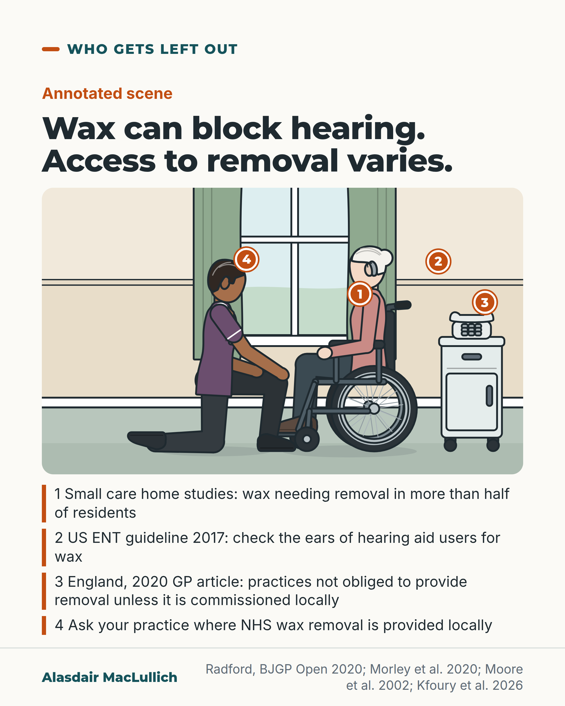

# G146: Earwax: fixable, and harder to get treated

- Category: C14 Hearing, vision and the senses
- Audience: both
- Series: Who gets left out
- Post type: criticism
- Visual format: annotated scene (care home room with four numbered callouts)
- Status: text text_final, visual final
- Working id: C14-P10 (candidate C14-18)

## Insight

Wax needing removal was found in more than half of care home residents in small studies, and in one small study hearing improved in most blocked ears once it was removed. In England NICE says removal should be done in primary care, but a 2020 article by a GP described practices as not obliged to provide it unless it was commissioned locally, with funding varying by area.

## Angle and position

Wax removal is a fixable problem whose availability depends on local commissioning, and getting to hospital for microsuction is hardest for people with poor mobility who rely on carers. The post does not blame GP practices and gives one action: ask where NHS wax removal is provided locally.

Basis: Mixed. Empirical: small care home studies and a 2020 GP article describing access. Service fact: NICE and commissioning as described in a 2020 review (England); arrangements may have changed. Ethical judgement: people who cannot travel or pay should not be the ones who go without.

## X (1105 characters)

```text
Earwax can block the ear canal and dull hearing. In small studies of care home residents, wax needing removal was found in more than half.

One small study followed 29 people newly admitted to a US nursing facility. After wax removal, hearing improved in 80 in 100 ears that had wax blocking the canal, and in 3 in 100 ears that did not.

The 2017 US ENT guideline says clinicians should check for wax in people who use hearing aids.

In England, NICE, the national guidance body, says wax removal should be done in primary care, such as the GP practice. A GP writing in 2020 described practices as not obliged to provide it unless the local health service paid for it, with funding varying from area to area. Local arrangements may have changed since. The same article noted that getting to hospital for microsuction, removal with a suction device, is hard for people with mobility problems who rely on carers or hospital transport.

People who struggle to travel or to pay should be able to get wax removed. If you are told your practice no longer does it, ask where NHS wax removal is provided locally.
```

## LinkedIn (1526 characters)

```text
Wax can block an ear enough to dull hearing, and for some people the fix is hard to get.

In small studies of care home residents, wax needing removal was found in more than half. A study followed 29 people over 65 newly admitted to a US skilled nursing facility. After wax removal, hearing improved in 80 in 100 ears with impacted wax (wax that blocks the ear canal), and in 3 in 100 ears without it. In a study of 51 residents of two care homes in Perth, Australia, 57 in 100 had wax needing removal. These are small studies, not national figures.

The 2017 US ENT guideline also says to check the ears of hearing aid users for wax.

Access to wax removal varies. In England, NICE (the national guidance body) says wax removal should be done in primary care, such as the GP practice. A 2020 article by a GP described practices as not obliged to provide it unless the local health service paid for it, so funding varied from area to area. That description dates from 2020, and local arrangements may have changed since. The article noted that people referred to hospital for microsuction, removal with a suction device, can find it hard to get there, especially if they have mobility problems and rely on carers or hospital transport.

People who struggle to travel or to pay should be able to get wax removed. Care home residents and hearing aid users are two groups in which wax is worth looking for.

If you or someone you care for is told the practice no longer removes wax, ask where NHS wax removal is provided locally.
```

## Bluesky (294 characters)

```text
Earwax can dull hearing. NICE, the national guidance body, says removal in England should be done in primary care (such as the GP practice). A GP's 2020 article said practices need not provide it unless the local health service pays. Ask your practice where NHS wax removal is provided locally.
```

## Threads (492 characters)

```text
In small studies of care home residents, earwax needing removal was found in more than half. In one small study of 29 people, hearing improved in most blocked ears after removal.

In England, NICE, the national guidance body, says removal should be done in primary care, such as the GP practice. A GP's 2020 article said practices need not provide it unless the local health service paid for it.

If you are told your practice no longer does it, ask where NHS wax removal is provided locally.
```

## Source reply

Sources: https://doi.org/10.3399/bjgpopen20X101064 | https://doi.org/10.1136/bmj.n2077 | https://doi.org/10.1186/s12875-026-03325-2 | https://pubmed.ncbi.nlm.nih.gov/12807656/ | https://doi.org/10.1111/ajag.12736

## Visual



Alt text: Care home scene: an older woman in a wheelchair with a hearing aid, a care worker kneeling beside her, a telephone on a table, with four numbered markers. Key: wax in over half of residents in small studies, guideline advice, uneven access in England, ask your practice.

Editable source: `visuals/src/G146.html`

Design instructions: Single card Kit care home scene with four pins and numbered key.

## Sources and verification

- C14-18-a (supported_with_qualification): NICE recommends wax removal in primary care, but it is not a core obligation without commissioning; funding varies and many practices stopped; access hard for people with poor mobility.
  - Source: Radford JC. Treatment of impacted ear wax: a case for increased community-based microsuction. BJGP Open. 2020;4(2):bjgpopen20X101064.; Sharvill J. Ear wax removal and core services in general practice. BMJ. 2021;374:n2077.
  - Passage: "Funding for treatment of impacted earwax is variable across clinical commissioning groups (CCGs). National Institute for Health and Care Excellence(NICE) guidance recommends ear wax removal should be performed in primary care,although without a commissioned service, GPs are under no obligation to do so. The funding for these additional services is variable by CCG area, with many practices now opting out of providing irrigation due to cost, high service demand, and safety implications... This presents problems for access, particularly in patient populations who have mobility issues and rely on carers" (Full text, Introduction and Discussion)
- C14-18-b (supported_with_qualification): Impacted wax is common in care homes and removal improves hearing; hearing aid users at risk.
  - Source: Moore AM, Voytas J, Kowalski D, Maddens M. Cerumen, hearing, and cognition in the elderly. J Am Med Dir Assoc. 2002;3(3):136-9.; Morley H, Panak V, Mulders WHAM, Goulios H, Martini A, Langdon C. Non-chewing diets and cerumen impaction in the external ear canal in a residential aged care population. Australas J Ageing. 2020;39(2):131-136.; Kfoury P, Shah K, Dillard LK, Der C, Mishra P, Patterson RH, Xu MJ. Unpacking cerumen impaction: a systematic review of clinical practice guidelines. BMC Prim Care. 2026;27.
  - Passage: "Nineteen participants (65.5%) had cerumen in at least one ear. Following cerumen removal, hearing improved in 80% of impacted ears compared with 3% of nonimpacted ears / 57% of participants showed excess cerumen requiring removal / Clinicians should perform otoscopy to detect the presence of cerumen in patients with hearing aids" (Abstracts; Kfoury Table 2)

Verification notes: C14-18-a (Radford 2020, full text opened; Sharvill 2021 BMJ letter seen by title only): NICE recommends removal in primary care; without a commissioned service GPs are under no obligation; funding variable by commissioning area; the hospital-referral access problem for people with mobility issues who rely on carers is about getting to appointments for microsuction. Stated as a 2020 description; local arrangements may have changed. RNID figures were a search extract only and are not used. C14-18-b (Moore 2002 and Morley 2020 abstracts; Kfoury 2026 full text): 57 in 100 of 51 residents in Perth needed removal and 65.5 in 100 of 29 US admissions had wax in at least one ear (more than half in both); the hearing outcome (80 v 3 in 100 ears) comes from one study of 29 people, so the post says one small study. Check ears of hearing aid users is from the review of NICE NG98 and AAO-HNS 2017. The fair-access sentence is marked as judgement. Practices are not blamed.

## Attention and follow potential

Pause: People who have been told the practice no longer does ear wax removal, and care home staff and families.

Gain: Knowing the problem is often fixable, that access varies, and one question to ask.

Follow: Clinical detail linked to fair access, without blaming practices.

## Open issues

- Editor asked for the Sharvill 2021 BMJ letter and an RNID survey: the letter was seen by title only (listed in the source reply as further reading; no statement rests on it) and the RNID survey could not be opened, so no RNID numbers are used. The access statement rests on Radford 2020 (full text) and is dated 2020; if a current source on local commissioning is opened later, update it. If the editor judges this still unsupported, the fallback is C14-23, which is itself revise-only.
