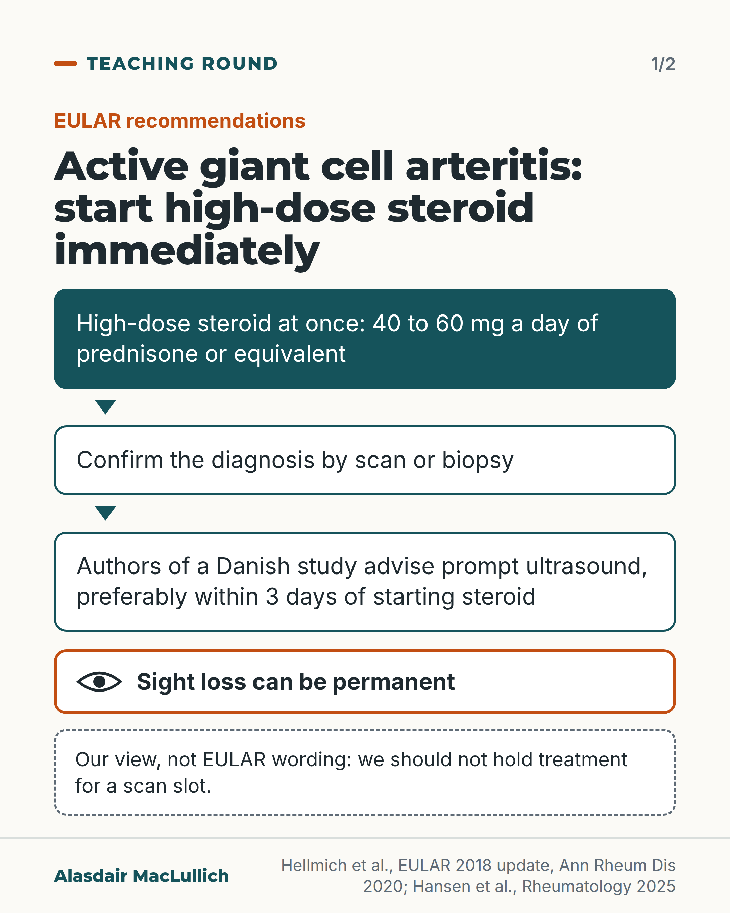
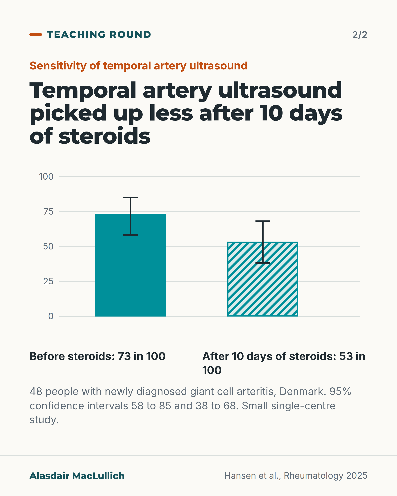

# G147: Active GCA: steroid now, confirm the diagnosis

- Category: C14 Hearing, vision and the senses
- Audience: practitioners
- Series: Teaching round
- Post type: teaching
- Visual format: carousel (2 cards)
- Status: text text_final, visual final
- Working id: C14-P11 (candidate C14-25)

## Insight

EULAR recommends starting high-dose steroid immediately in active giant cell arteritis and confirming the diagnosis by scan or biopsy; temporal artery ultrasound picked up disease in about 73 in 100 people who had it before steroids and about 53 in 100 after 10 days, so scan early. Sight loss can be permanent, and older people with only unusual features were treated later.

## Angle and position

The common delay is waiting for a test before treating. The post attributes 'start immediately' to EULAR, uses a small ultrasound study for the reason to image early, and warns about the vague presentation in older people. It does not use the British guideline, which could not be opened.

Basis: Mixed. Guideline recommendation (EULAR): start immediately in active disease, confirm by imaging or histology. Empirical: ultrasound sensitivity falls by day 10 (48 people); permanent sight loss; atypical presentations linked with delay (case-report review). Judgement: not holding treatment for a scan slot.

## X (899 characters)

```text
Temporal artery ultrasound picked up giant cell arteritis in about 73 in 100 people who had it before steroids, and in about 53 in 100 after 10 days of steroids.

That was a small Danish study of 48 people with new disease. The authors advise ultrasound as soon as possible after starting treatment, preferably within 3 days.

Sight loss can be permanent, which is why this is treated as an emergency. In a review of case reports (median age 72), people with only unusual features had longer delays before treatment. Across the review, the unusual features reported most often were vertigo, scalp ulceration and dry cough.

European (EULAR) recommendations say to start high-dose steroid immediately in active giant cell arteritis: 40 to 60 mg a day of prednisone or equivalent. They say the diagnosis should be confirmed by scan or biopsy. We should start treatment without waiting for a scan slot.
```

## LinkedIn (2004 characters)

```text
Temporal artery ultrasound picked up giant cell arteritis in about 73 in 100 people who had it before steroids, and in about 53 in 100 after 10 days of steroids.

That comes from a small prospective study in Denmark of 48 people with newly diagnosed disease. The 95% confidence interval was 58 to 85 in 100 before steroids and 38 to 68 in 100 after. Ultrasound of all vessels fell less, from 94 to 83 in 100, and that fall was not clearly different from chance. The authors advise ultrasound as soon as possible after starting treatment, preferably within 3 days.

European (EULAR) recommendations say that high-dose glucocorticoid, 40 to 60 mg a day of prednisone or equivalent, should be started immediately in active giant cell arteritis, and that the diagnosis should be confirmed by imaging or biopsy.

The reason for the hurry is sight. Permanent visual loss is the main short-term complication. Treatment does not remove the risk completely: in one French centre, 11 of 502 patients (2.2 in 100) had new permanent sight loss after starting steroids.

Some people have a vague or unusual story. A systematic review of case reports covered 746 people with biopsy-proven disease and at least one unusual feature (median age 72). People who had only unusual features waited longer for treatment to start. Across all 746, the unusual features reported most often were vertigo, scalp ulceration and dry cough. Case reports show that such presentations exist and are linked with delay. They do not show how common they are. The authors advise checking inflammatory markers early in unexplained illness.

In practice (point 1 is EULAR; points 2 to 4 are our reading of the studies above):

1. In active giant cell arteritis, start high-dose steroid immediately.
2. Arrange ultrasound or biopsy promptly, and start treatment without waiting for the slot.
3. Keep sight loss in mind: it can be permanent.
4. In an older person with unexplained illness and unusual features, check inflammatory markers early.
```

## Bluesky (273 characters)

```text
EULAR says start high-dose steroid immediately in active giant cell arteritis and confirm by scan or biopsy. In a small Danish study of 48 people, temporal artery ultrasound picked it up in 73 in 100 before steroids and 53 in 100 after 10 days. Sight loss can be permanent.
```

## Threads (394 characters)

```text
In a small Danish study of 48 people, temporal artery ultrasound picked up giant cell arteritis in about 73 in 100 people who had it before steroids. After 10 days of steroids it picked up about 53 in 100.

EULAR says to start high-dose steroid immediately in active disease and confirm by scan or biopsy. Sight loss can be permanent.

We should start treatment without waiting for a scan slot.
```

## Source reply

Sources: https://doi.org/10.1093/rheumatology/keae551 | https://doi.org/10.1136/annrheumdis-2019-215672 | https://doi.org/10.1007/s11606-024-09141-7

## Visual



Alt text: Flow for active giant cell arteritis: start high-dose steroid at once, confirm by scan or biopsy, early ultrasound within 3 days. Sight loss can be permanent. A note marks our view as ours, not EULAR wording.



Alt text: Bar chart from a Danish study of 48 people: temporal artery ultrasound sensitivity 73 in 100 before steroids and 53 in 100 after 10 days, with confidence intervals 58 to 85 and 38 to 68. Small single-centre study.

Editable source: `visuals/src/G147.html`

Design instructions: Carousel 2: vertical flow with warning box; SVG bars 73 and 53 with CI whiskers, claim C14-25-c.

## Sources and verification

- C14-25-a (supported_with_qualification): European (EULAR) recommendations say high-dose glucocorticoid should be started immediately in active giant cell arteritis, and the diagnosis should be confirmed by imaging or histology.
  - Source: Hellmich B, Agueda A, Monti S, Buttgereit F, de Boysson H, Brouwer E, et al. 2018 Update of the EULAR recommendations for the management of large vessel vasculitis. Ann Rheum Dis. 2020;79(1):19-30.
  - Passage: "We recommend that a suspected diagnosis of LVV should be confirmed by imaging or histology. High dose glucocorticoid therapy (40-60 mg/day prednisone-equivalent) should be initiated immediately for induction of remission in active giant cell arteritis (GCA) or Takayasu arteritis (TAK)." (Abstract)
- C14-25-c (supported_with_qualification): Temporal artery ultrasound becomes less sensitive once glucocorticoid has started, so imaging should be done promptly.
  - Source: Hansen M, Hansen IT, Keller KK, Therkildsen P, Hauge EM, Nielsen BD. Serial assessment of ultrasound sensitivity and scores in patients with giant cell arteritis before and 3 and 10 days after treatment. Rheumatology (Oxford). 2025;64(6):3895-3899.
  - Passage: "Before GC exposure, US sensitivity was 94% (95% CI: 83-99), 73% (95% CI: 58-85), and 71% (95% CI: 56-83) when assessing all vessels, TAs, and large vessels (LVs), respectively. At day 3 and 10, the overall US sensitivity was 92% (95% CI: 78-98, P = 0.16) and 83% (95% CI: 69-92, P = 0.10), respectively. At day 10, the TA-US and LV-US sensitivity was 53% (95% CI: 38-68, P < 0.01) and 60% (95% CI: 44-74, P = 0.13), respectively. ... Consistent with the EULAR recommendations, these findings encourage prompt US assessment, preferably within 3 days, to ensure an accurate diagnosis." (Abstract, Results and Conclusion)
- C14-25-d (supported_with_qualification): Sight loss in giant cell arteritis can be permanent, and can still occur in a small number of people after treatment has started.
  - Source: Castaneda S, Prieto-Pena D, Vicente-Rabaneda EF, Triguero-Martinez A, Roy-Vallejo E, Atienza-Mateo B, et al. Advances in the treatment of giant cell arteritis. J Clin Med. 2022;11(6):1588.; Curumthaullee MF, Liozon E, Dumonteil S, Gondran G, Fauchais AL, Ly KH, et al. Features and risk factors for new (secondary) permanent visual involvement in giant cell arteritis. Clin Exp Rheumatol. 2022;40(4):734-740.; Buttgereit F, Dejaco C, Matteson EL, Dasgupta B. Polymyalgia rheumatica and giant cell arteritis: a systematic review. JAMA. 2016;315(22):2442-58.
  - Passage: "Permanent visual loss is the main short-term complication. [Castaneda 2022, Abstract] ... Eleven out of 502 patients (2.2%) experienced a new PVL including 6 occurrences during the initial therapeutic phase and 5 during the tapering phase. [Curumthaullee 2022, Abstract] ... Headache and visual disturbances including loss of vision are characteristic of GCA. Constitutional symptoms and elevated inflammatory markers (>90%) are common in both diseases. [Buttgereit 2016, Abstract]" (Abstracts)
- C14-25-e (supported_with_qualification): Older people with giant cell arteritis may present with unusual features; people with only unusual features are treated later.
  - Source: Sverdlichenko I, Xie JS, Lu B, Tao B, Lai A, Naidu S, et al. Atypical signs and symptoms of giant cell arteritis: a systematic review. J Gen Intern Med. 2025;40(3):659-665.
  - Passage: "Of 21,828 screened records, 429 studies corresponding to 746 individuals (median [IQR] age 72 [IQR, 66-78] years, 63% female) with at least one atypical feature of GCA were included. Eighty-two percent had both atypical and at least one concurrent typical giant cell arteritis feature, whereas 18% of patients with atypical signs and symptoms only presented with atypical features. ... Patients with atypical features only experienced greater delay in treatment initiation (p < 0.001). The most commonly reported atypical signs/symptoms were vertigo (11.9%), scalp necrosis/ulceration (7.9%), and dry cough (5.8%)." (Abstract, Results and Conclusion)

Verification notes: C14-25-a (EULAR 2018 update, abstract): high-dose glucocorticoid 40 to 60 mg a day prednisone-equivalent initiated immediately in active GCA; suspected diagnosis confirmed by imaging or histology; attributed to EULAR only as 'start immediately'. C14-25-c (Hansen 2025, abstract): 48 people, temporal artery ultrasound sensitivity 73 to 53 in 100 by day 10 (P<0.01), all-vessel 94 to 83 (not clearly different), ultrasound preferably within 3 days. C14-25-d: permanent sight loss main short-term complication (Castaneda 2022); 11 of 502 had new permanent loss after starting steroids (Curumthaullee 2022); 'usually permanent' is not used. C14-25-e (Sverdlichenko 2025): atypical-only presentations, median age 72, longer delay; the 18 in 100 figure is a selected case-report group and is not used; weight loss and jaw ache are not called atypical. BSR 2020 windows, doses for visual symptoms and the BSR guideline are not used (not opened).

## Attention and follow potential

Pause: Clinicians who have waited for a biopsy date or a clinic slot before treating.

Gain: A clear order of actions for a sight-threatening condition, and the evidence for scanning early.

Follow: Direct teaching on time-critical conditions in older people, with the source of each statement named.

## Open issues

- BSR 2020 guideline could not be opened, so no BSR time windows, visual-symptom dose or BSR attribution appear; if Alasdair uploads the BSR PDF the post can be revised.
