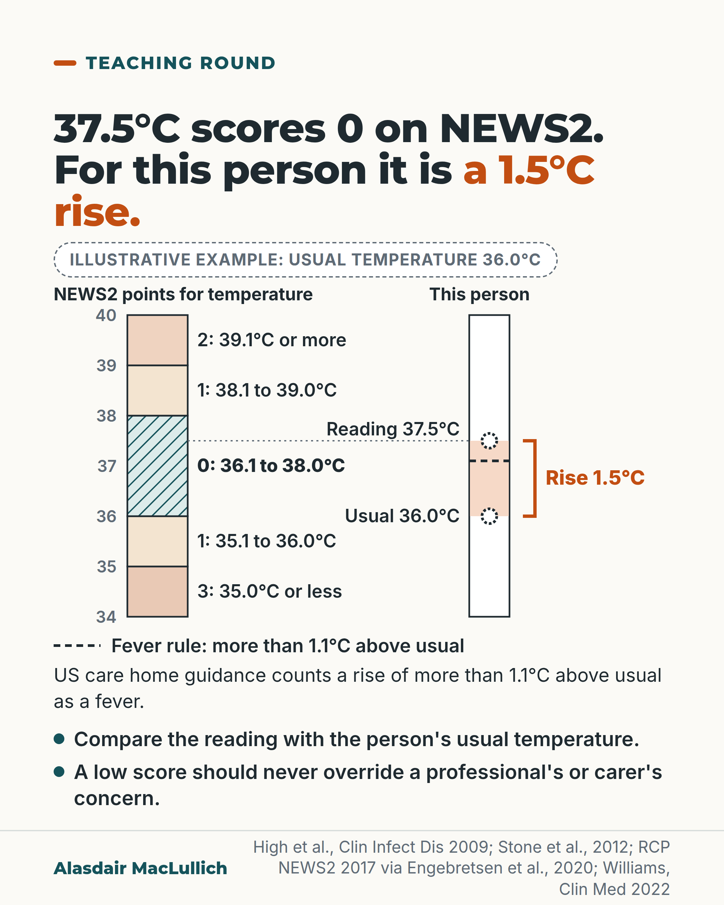

# G148: A normal temperature can be a fever for this person

- Category: C15 Hospital care, emergency care and discharge
- Audience: practitioners
- Series: Teaching round
- Post type: teaching
- Visual format: diagram (paired scales)
- Status: text text_final, visual final
- Working id: C15-P01 (candidate C15-16)

## Insight

NEWS2 scores any temperature from 36.1 to 38.0 C as 0, but US care home guidance counts a rise of more than 1.1 C above the person's usual temperature as a fever, and many older people with serious infection do not develop a typical fever. Compare the reading with their usual temperature and do not stop looking for infection because the score is low.

## Angle and position

Take the score's temperature bands at face value (they score 0) and show, with a labelled illustrative example, how the same reading can be a meaningful rise for one person. Position: when assessing an older person for infection, compare with their usual temperature, and do not let a normal reading or a low early warning score close the question.

Basis: mixed: the NEWS2 bands, the US care home fever definition, the absence of an age adjustment and the 'low score should never override concern' statement are documented findings or statements; the 45 versus 12 in 100 figure is a crude single-centre finding; the instruction to look for the usual temperature and keep the question open is clinical interpretation (judgement), and the 37.5 against 36.0 case is an arithmetic illustration, not a finding.

## X (692 characters)

```text
A temperature of 37.5°C scores 0 on NEWS2 (National Early Warning Score 2), a bedside score built from six measurements. So does every reading from 36.1°C to 38.0°C.

US guidance for care home residents counts a reading more than 1.1°C above the person's usual temperature as a fever. Illustrative example: if someone's usual temperature is 36.0°C, a reading of 37.5°C is 1.5°C above it.

Many older people with a serious infection do not develop a typical fever, and NEWS2 has no adjustment for age. Its developers say a low score should never override a professional's or carer's concern.

If you can, find their usual temperature. Care home charts and earlier hospital records may have it.
```

## LinkedIn (2028 characters)

```text
A temperature of 37.5°C scores 0 on NEWS2 (National Early Warning Score 2), a bedside score built from six measurements. So does every reading from 36.1°C to 38.0°C. A temperature has to reach 38.1°C to score 1 point.

US infection guidance for older people living in care homes counts three things as a fever. First, one oral reading above 37.8°C. Second, repeated oral readings above 37.2°C. Third, any reading more than 1.1°C above the person's usual temperature (ear, mouth or armpit).

Illustrative example: if someone's usual temperature is 36.0°C, a reading of 37.5°C scores nothing on NEWS2, yet it is 1.5°C above their usual, which that guidance would count as a fever.

Many older people with a serious infection do not develop a typical fever. US care home guidance says typical fever is absent in more than half of residents with serious infection. An earlier review put fever as absent or blunted in 20 to 30 in 100 older people with infection. The estimates differ: one describes care home residents, the other older people in general.

In one emergency department study in Taiwan of adults with a blood infection, those without a fever were older, and more of them died within 30 days (45 in 100 versus 12 in 100). That was one hospital, all adult ages, and a crude comparison. These figures show a link. They do not show that the missing fever caused the deaths.

NEWS2 has no adjustment for age. Its developers say a low score should never override a professional's or carer's concern. Temperature is one of its six measurements, and the total score is what triggers escalation.

Limits: the care home rule was written for residents whose usual readings may be recorded. In an emergency department the usual temperature may not be known, and we found no study testing whether the rule improves detection there.

If you can, find the person's usual temperature: care home charts and earlier hospital records may have it. Then compare, and keep looking for infection if a reading looks normal or the score is low.
```

## Bluesky (298 characters)

```text
A reading of 37.5°C scores 0 on NEWS2. If someone's usual is 36.0°C, that is 1.5°C above it (illustrative example). US care home guidance counts a rise over 1.1°C as a fever. Many older people with serious infection have no typical fever. Compare with their usual; keep looking if the score is low.
```

## Threads (462 characters)

```text
A temperature of 37.5°C scores 0 on the early warning score NEWS2. So does anything from 36.1°C to 38.0°C.

US care home guidance counts a reading more than 1.1°C above the person's usual temperature as a fever. Illustrative example: usual 36.0°C, reading 37.5°C, a rise of 1.5°C.

Many older people with a serious infection do not develop a typical fever. If you can, find their usual temperature, and do not stop looking for infection because the score is low.
```

## Source reply

Sources: https://doi.org/10.1086/595683 (IDSA guideline abstract) https://doi.org/10.1086/667743 (revised McGeer criteria) https://doi.org/10.1016/j.resplu.2020.100020 (NEWS2 chart) https://doi.org/10.7861/clinmed.2022-0426 (NEWS2 and the older person) https://doi.org/10.1086/313896 (fever in older people) https://doi.org/10.1016/j.diagmicrobio.2016.08.020 (blood infection without fever)

## Visual



Alt text: Two vertical temperature scales from 34 to 40 degrees C. Left: NEWS2 points, with 36.1 to 38.0 scoring 0 (hatched). Right, an illustrative person with usual 36.0 and reading 37.5, a 1.5 degree rise bracketed in orange and a dashed line at 37.1 for the care home fever rule. A reading of 37.5 scores 0 yet is a rise for this person.

Editable source: `visuals/src/G148.html`

Design instructions: Single 4:5 light card. h1.s with orange em; dashed Illustrative badge; SVG 920x520 with left NEWS2 banded scale (hatched mint 0 band, points written in each band) and right 'This person' scale (usual 36.0, reading 37.5 dotted markers, orange bracket Rise 1.5, dashed fever line at 37.1 with legend below); axis 34 to 40 C. Two tick bullets. Claims C15-16-a, C15-16-c, C15-16-e.

## Sources and verification

- C15-16-a (supported_with_qualification): US guidance for older people in long-term care defines fever as a single oral temperature above 37.8 C, repeated oral readings above 37.2 C (or rectal above 37.5 C), or a single temperature more than 1.1 C above the person's baseline from any site.
  - Source: Stone ND, Ashraf MS, Calder J, Crnich CJ, Crossley K, Drinka PJ, et al. Surveillance definitions of infections in long-term care facilities: revisiting the McGeer criteria. Infect Control Hosp Epidemiol. 2012;33(10):965-77.; High KP, Bradley SF, Gravenstein S, Mehr DR, Quagliarello VJ, Richards C, et al. Clinical practice guideline for the evaluation of fever and infection in older adult residents of long-term care facilities: 2008 update by the Infectious Diseases Society of America. Clin Infect Dis. 2009;48(2):149-71.
  - Passage: "Stone 2012: "The definition of fever was changed from a temperature of greater than 38°C (100.4°F), as in the original McGeer Criteria, to a definition consistent with the 2008 Infectious Diseases Society of America (IDSA) guideline for evaluating fever and infection in older adults residing in LTCFs: either (1) a single oral temperature greater than 37.8°C (100°F) or (2) repeated oral temperatures greater than 37.2°C (99°F) or rectal temperatures greater than 37.5°C (99.5°F) or (3) a single temperature greater than 1.1°C (2°F) over baseline from any site." Table 2: "A. Fever 1. Single oral temperature >37.8°C (>100°F) OR 2. Repeated oral temperatures >37.2°C (99°F) or rectal temperatures >37.5°C (99.5°F) OR 3. Single temperature >1.1°C (2°F) over baseline from any site (oral, tympanic, axillary)"" (Stone 2012, Definitions: Constitutional Criteria for Infection (p. 5) and Table 2 (p. 14))
- C15-16-b (supported_with_qualification): Typical fever is often absent in older people with serious infection.
  - Source: High KP, Bradley SF, Gravenstein S, Mehr DR, Quagliarello VJ, Richards C, et al. Clinical practice guideline for the evaluation of fever and infection in older adult residents of long-term care facilities: 2008 update by the Infectious Diseases Society of America. Clin Infect Dis. 2009;48(2):149-71.; Norman DC. Fever in the elderly. Clin Infect Dis. 2000;31(1):148-51.; Stone ND, Ashraf MS, Calder J, Crnich CJ, Crossley K, Drinka PJ, et al. Surveillance definitions of infections in long-term care facilities: revisiting the McGeer criteria. Infect Control Hosp Epidemiol. 2012;33(10):965-77.
  - Passage: "High 2009 abstract: "Most residents are older and have multiple comorbidities that complicate recognition of infection; for example, typically defined fever is absent in more than one-half of LTCF residents with serious infection." Norman 2000 abstract: "Fever, the cardinal sign of infection, may be absent or blunted 20%-30% of the time." Stone 2012: "The lower threshold will increase sensitivity for detecting infection given the greater likelihood of a lower febrile response in the elderly."" (High 2009 Abstract; Norman 2000 Abstract; Stone 2012 Definitions: Constitutional Criteria (p. 5))
- C15-16-c (supported): NEWS2 gives 0 points for temperatures from 36.1 to 38.0 C.
  - Source: Engebretsen S, Bogstrand ST, Jacobsen D, Vitelli V, Rimstad R. NEWS2 versus a single-parameter system to identify critically ill medical patients in the emergency department. Resusc Plus. 2020;3:100020.
  - Passage: "Engebretsen 2020, Table 1 'NEWS2 and OUH-criteria', Temperature (°C) row: 3 points "≤35.0"; 1 point "35.1–36.0"; 0 points "36.1–38.0"; 1 point "38.1–39.0"; 2 points "≥39.1". NEWS2 is cited to: "Royal College of Physicians. National Early Warning Score (NEWS) 2: Standardising the Assessment of Acute-Illness Severity in the NHS. London: RCP; 2017."" (Engebretsen 2020, Table 1 (p. 2) and reference 8)
- C15-16-d (supported): NEWS2 has no adjustment for age, and a low score should never override a clinician's or carer's concern.
  - Source: Vardy ERLC, Lasserson D, Barker RO, Hanratty B. NEWS2 and the older person. Clin Med (Lond). 2022;22(6):522-4.; Williams B. The National Early Warning Score: from concept to NHS implementation. Clin Med (Lond). 2022;22(6):499-505.
  - Passage: "Vardy 2022: "The National Early Warning Score (NEWS), published in 2012, made no specific adjustments for older people." "Insufficient evidence was available to apply weighting to the NEWS score to account for age." "Study of performance of the NEWS2 specifically in older people is important, as the physiological and vital sign changes seen in response to acute illness may differ for older adults, as well as their acute care preferences." Williams 2022: "An important point emphasised in the original NEWS report, and reiterated subsequently, is that a low score should never override a healthcare professional or carer's concern about a patient's clinical condition if they feel it is necessary to escalate care."" (Vardy 2022 Abstract and 'NEWS2 in older people in hospital' (pp. 522-3); Williams 2022 p. 3)
- C15-16-e (supported_with_qualification): Illustrative example: for a person whose usual temperature is 36.0 C, a reading of 37.5 C scores 0 on NEWS2 but is a rise of 1.5 C, which meets the care home guidance definition of fever (more than 1.1 C over baseline).
  - Source: Engebretsen S, Bogstrand ST, Jacobsen D, Vitelli V, Rimstad R. NEWS2 versus a single-parameter system to identify critically ill medical patients in the emergency department. Resusc Plus. 2020;3:100020.; Stone ND, Ashraf MS, Calder J, Crnich CJ, Crossley K, Drinka PJ, et al. Surveillance definitions of infections in long-term care facilities: revisiting the McGeer criteria. Infect Control Hosp Epidemiol. 2012;33(10):965-77.
  - Passage: "Engebretsen 2020 Table 1: 0 points "36.1–38.0". Stone 2012 Table 2: "3. Single temperature >1.1°C (2°F) over baseline from any site (oral, tympanic, axillary)"" (As for C15-16-a and C15-16-c)
- C15-16-f (supported_with_qualification): In an emergency department, adults with bloodstream infection but no fever were older and had higher 30-day mortality than those with fever.
  - Source: Yo CH, Lee MG, Hsein YC, Lee CC. Risk factors and outcomes of afebrile bacteremia patients in an emergency department. Diagn Microbiol Infect Dis. 2016;86(4):455-9.
  - Passage: ""The afebrile patients were older, have higher Charlson comorbidity index, and had poorer outcomes than the febrile patients." "Finally, the 30-day all-cause mortality was higher in the afebrile group than in the febrile group (45% versus 12%, log-rank P<0.001)."" (Abstract, Results)

Verification notes: C15-16-a: High 2009 (abstract) and Stone 2012 (full text restating IDSA 2008); worded as US guidance for care home residents, not UK guidance. C15-16-b: High 2009 abstract (more than half of care home residents) and Norman 2000 review (20 to 30 in 100); both figures given with their populations in LinkedIn, only 'many' in short captions; 'older people run colder' deliberately not claimed. C15-16-c: NEWS2 bands from Engebretsen 2020 Table 1 reproducing RCP 2017 (full text). C15-16-d: Vardy 2022 and Williams 2022 (full text). C15-16-e: arithmetic example labelled illustrative. C15-16-f: Yo 2016 abstract, single centre, crude, all adults. C15-16-g (practical step) is offered as a suggestion only, as the evidence file requires. Optional claim: the sentence 'temperature is one of six measurements, total score drives escalation' comes from the qualifications of C15-16-c.

## Attention and follow potential

Pause: A temperature that scores nothing on the standard early warning score can still be a clear change for the person in front of you.

Gain: A concrete rule to apply at the bedside: find the usual temperature, compare, and keep the infection question open when the score is low.

Follow: Teaching points that state which source a threshold comes from and what it does not cover.

## Open issues

None.
