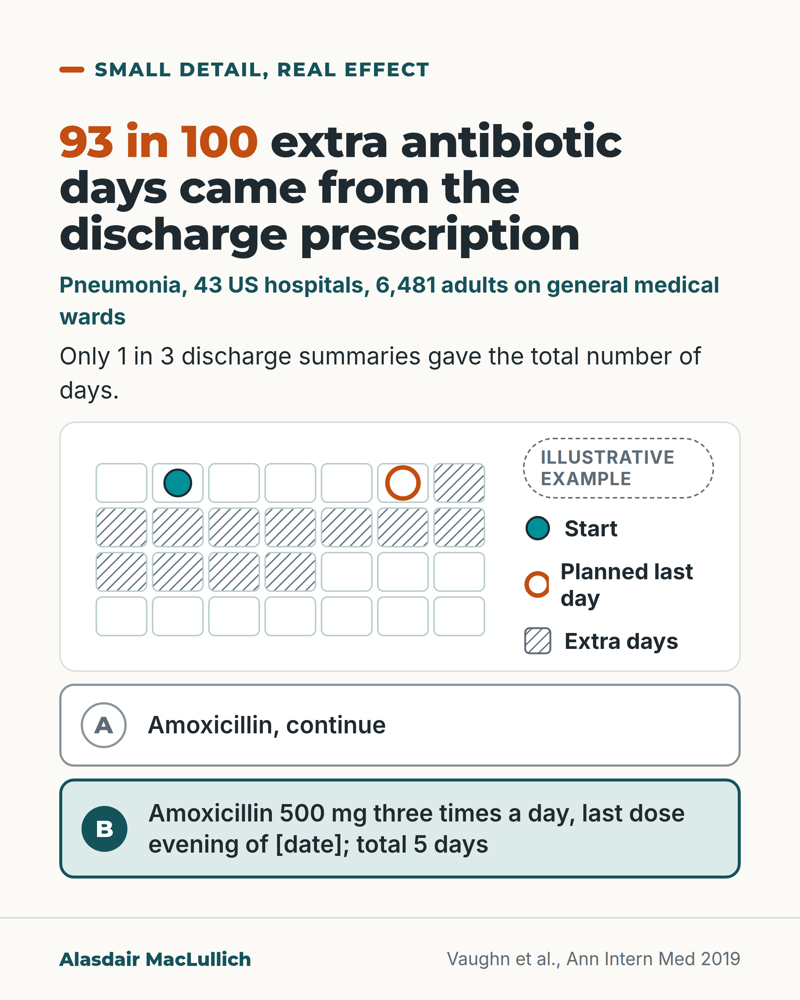

# G149: The antibiotic needs a stop date at discharge

- Category: C15 Hospital care, emergency care and discharge
- Audience: practitioners
- Series: Small detail, real effect
- Post type: teaching
- Visual format: comparison (calendar and two discharge lines)
- Status: text text_final, visual final
- Working id: C15-P02 (candidate C15-01)

## Insight

In 43 US hospitals, 2 in 3 adults hospitalised on general medical wards with pneumonia got more antibiotic days than needed, and 93 in every 100 of the extra days came from the discharge prescription. Writing the last day as a calendar date is a small, checkable step.

## Angle and position

Antibiotic overuse is usually discussed as a decision on admission. This study located almost all the excess at discharge, where a prescription without a total duration runs on. Position: every discharge antibiotic should carry its last day as a date and its total length, and the letter should say who reviews it if the person is not better.

Basis: mixed: the percentages, the link between documentation and fewer extra days, and the lack of better outcomes are empirical (observational) findings; that writing the date would reduce extra days is untested; the recommendation to write the date, the total and the reviewer is clinical judgement.

## X (749 characters)

```text
In 43 US hospitals, 2 in 3 adults with pneumonia on general medical wards got more days of antibiotics than the authors judged necessary. Their median age was 70, and intensive care patients were not included.

93 in every 100 of the extra days came from the antibiotic prescribed at discharge.

Only 1 in 3 discharge summaries said how many days in total. When the total was written down, patients got fewer extra days (about 2.3 versus 2.9 each, on average, after adjustment). That is a link in the data. The study did not test writing a stop date.

People who got extra days did not have fewer deaths, readmissions or return visits.

We should write the last day as a calendar date, with the total course length, on every antibiotic at discharge.
```

## LinkedIn (1855 characters)

```text
In 43 US hospitals, 2 in 3 adults with pneumonia on general medical wards got more days of antibiotics than the authors judged necessary. Their median age was 70, and intensive care patients were not included. "Necessary" meant the shortest effective course set from guidelines: at least 5 days for pneumonia acquired outside hospital, longer if the person was slow to stabilise, with a day of leeway.

Almost all the extra days, 93 in every 100, came from antibiotics prescribed at discharge.

Only 1 in 3 discharge summaries said how many days of antibiotic in total. When the total was written down, patients got fewer extra days (about 2.3 versus 2.9 each, on average, after adjustment). This is an observational link. Careful prescribers may document more, and the study did not test writing a stop date as an intervention.

People who got extra days did not do better: they had no fewer deaths, readmissions or return visits. Among the 6 in 10 patients reached by phone, about 5 in 100 on too-long courses reported side effects, mostly diarrhoea and stomach upset, against about 2 in 100 on the right length. Extra days were not linked with more C. difficile infection.

The study included adults of all ages, not only older people.

A separate French trial included adults admitted with pneumonia (median age 73) who were stable after 3 days. Stopping antibiotics then worked about as well as continuing to day 8: cure at day 15 was 77 in 100 after stopping at day 3, against 68 in 100 after continuing to day 8. The trial allowed for a gap of up to 10 in 100 between the groups. That applied to people who were stable, not in intensive care, on one antibiotic regimen.

We should put three things on every discharge antibiotic:

1. The planned last day as a calendar date.
2. The total course length.
3. Who reviews it if the person is not better.
```

## Bluesky (300 characters)

```text
In 43 US hospitals, 2 in 3 adults with pneumonia on general wards got more antibiotic days than the authors judged needed. 93 in 100 extra days came from the discharge prescription. Extra days were not linked with fewer deaths. We should put the last day and total days on every discharge antibiotic.
```

## Threads (493 characters)

```text
In 43 US hospitals, 2 in 3 adults on general medical wards with pneumonia (median age 70) got more antibiotic days than the authors judged necessary, usually about 2 extra days. 93 in every 100 extra days came from the discharge prescription.

Only 1 in 3 discharge summaries gave the total number of antibiotic days. Patients who got extra days had no fewer deaths or readmissions.

We should write the last day as a calendar date, with the total course length, on every discharge antibiotic.
```

## Source reply

Sources: https://doi.org/10.7326/M18-3640 (Vaughn 2019, Annals of Internal Medicine) https://doi.org/10.1016/S0140-6736(21)00313-5 (French 3-day trial)

## Visual



Alt text: Headline: 93 in 100 extra antibiotic days came from the discharge prescription (pneumonia, 43 US hospitals, 6,481 adults). Only 1 in 3 discharge summaries gave total days. An illustrative calendar marks start day, planned last day and hatched extra days. Line A reads Amoxicillin, continue; line B gives dose, last date and total 5 days.

Editable source: `visuals/src/G149.html`

Design instructions: Single 4:5 light card. h1.s with orange 93 in 100; teal kicker and body; white panel with 7x4 calendar SVG (teal start circle, orange ringed planned last day, hatched extra days) and legend with Illustrative badge; line A grey outline, line B mint with teal outline. Claims C15-01-b, C15-01-c.

## Sources and verification

- C15-01-a (supported): In 6,481 medical patients with pneumonia in 43 Michigan hospitals, two thirds (67.8%) received more antibiotic days than needed.
  - Source: Vaughn VM, Flanders SA, Snyder A, Conlon A, Rogers MAM, Malani AN, et al. Excess antibiotic treatment duration and adverse events in patients hospitalized with pneumonia: a multihospital cohort study. Ann Intern Med. 2019;171(3):153-63.
  - Passage: ""6481 general care medical patients with pneumonia." "Two thirds (67.8% [4391 of 6481]) of patients received excess antibiotic therapy." Full text: "the median age was 70.2 years (interquartile range [IQR], 58.4 to 80.8 years)." "Patients with CAP were expected to have a treatment duration of at least 5 days, with longer courses expected only if time to clinical stability was longer" "treatment duration was considered to be appropriate if the actual duration was within 1 day of the expected duration." "The median excess duration was 2 days (IQR, 0 to 4 days) overall"" (Abstract; full text Results (p. 7) and Methods, Primary Outcome (p. 5))
- C15-01-b (supported): Antibiotics prescribed at discharge accounted for 93.2% of the excess duration.
  - Source: Vaughn VM, Flanders SA, Snyder A, Conlon A, Rogers MAM, Malani AN, et al. Excess antibiotic treatment duration and adverse events in patients hospitalized with pneumonia: a multihospital cohort study. Ann Intern Med. 2019;171(3):153-63.
  - Passage: ""Antibiotics prescribed at discharge accounted for 93.2% of excess duration."" (Abstract, Results)
- C15-01-c (supported_with_qualification): Only a third of discharge summaries documented the total antibiotic duration, and not documenting it was linked with more excess treatment.
  - Source: Vaughn VM, Flanders SA, Snyder A, Conlon A, Rogers MAM, Malani AN, et al. Excess antibiotic treatment duration and adverse events in patients hospitalized with pneumonia: a multihospital cohort study. Ann Intern Med. 2019;171(3):153-63.
  - Passage: "Abstract: "Patients who ... did not have a total antibiotic treatment duration documented at discharge were more likely to receive excess treatment." Full text: "Only a third of patients (32.1% [2080 of 6481]) had a total treatment duration documented in their discharge summary." Table 2 row 'Documentation of total antibiotic treatment duration in discharge summary': No (n = 4401 [67.9%]) predicted excess days per patient 2.9, Reference; Yes (n = 2080 [32.1%]) predicted excess days 2.3, adjusted rate ratio 0.78 (0.70-0.87), P < 0.001." (Abstract; full text Results 'Prescribing at Discharge' (p. 7) and Table 2 (p. 32))
- C15-01-d (supported_with_qualification): Each extra day was linked with 5% higher odds of patient-reported antibiotic side effects, and extra days were not linked with better outcomes.
  - Source: Vaughn VM, Flanders SA, Snyder A, Conlon A, Rogers MAM, Malani AN, et al. Excess antibiotic treatment duration and adverse events in patients hospitalized with pneumonia: a multihospital cohort study. Ann Intern Med. 2019;171(3):153-63.
  - Passage: "Abstract: "Excess treatment was not associated with lower rates of any adverse outcomes, including death, readmission, emergency department visit, or Clostridioides difficile infection. Each excess day of treatment was associated with a 5% increase in the odds of antibiotic-associated adverse events reported by patients after discharge." Full text: "Of these, 60.4% (3592 of 5943) were reached." "Diarrhea, gastrointestinal distress, and mucosal candidiasis were the most common antibiotic-associated adverse events reported by patients" Table 3 patient-reported adverse events: appropriate duration "26/1132 (2.3%)"; excess duration "114/2460 (4.6%)"; adjusted OR per excess day 1.05 (1.02-1.08)." (Abstract; full text Results 'Patient Outcomes' (p. 8), Table 3 (p. 33))
- C15-01-e (not_supported): The risk of C. difficile infection from antibiotics is higher in older people.
  - Source: Vaughn VM, Flanders SA, Snyder A, Conlon A, Rogers MAM, Malani AN, et al. Excess antibiotic treatment duration and adverse events in patients hospitalized with pneumonia: a multihospital cohort study. Ann Intern Med. 2019;171(3):153-63.
  - Passage: "No source opened supports the age claim. In Vaughn 2019 Table 3, C. difficile infection: appropriate duration "11 (0.5%)"; excess duration "22 (0.5%)"; adjusted OR per excess day "0.93 (0.81–1.07)", P = 0.30. Full text: "excess duration was not associated with C difficile infection or provider-documented adverse events"." (Vaughn 2019 Table 3 (p. 33) and Results)
- C15-01-f (supported_with_qualification): Shorter courses work: in stable patients admitted with pneumonia, stopping antibiotics after 3 days was non-inferior to 8 days.
  - Source: Dinh A, Ropers J, Duran C, Davido B, Deconinck L, Matt M, et al. Discontinuing beta-lactam treatment after 3 days for patients with community-acquired pneumonia in non-critical care wards (PTC): a double-blind, randomised, placebo-controlled, non-inferiority trial. Lancet. 2021;397(10280):1195-203.
  - Passage: ""Among patients admitted to hospital with community-acquired pneumonia who met clinical stability criteria, discontinuing β-lactam treatment after 3 days was non-inferior to 8 days of treatment." "In the ITT population, median age was 73·0 years (IQR 57·0-84·0)" "cure at day 15 occurred in 117 (77%) of 152 participants in the placebo group and 102 (68%) of 151 participants in the β-lactam group"" (Abstract, Findings and Interpretation)

Verification notes: C15-01-a to -d: Vaughn 2019 (full text opened; US adults of all ages, median age 70). 'Necessary' is the authors' guideline-based shortest effective duration. Documentation link (2.3 versus 2.9, aRR 0.78) is observational and worded as a link. Side effects: crude 4.6% versus 2.3% among the 60.4% reached by phone, worded 'about 5 in 100 versus about 2 in 100'. C15-01-e: C. difficile age claim not used; the study's null C. difficile finding is mentioned in LinkedIn only. C15-01-f: PTC trial (Dinh 2021, abstract) with stated conditions. NICE NG250/NG138 not quoted (search extract only). Recommendation to write date, total and reviewer is judgement.

## Attention and follow potential

Pause: The extra antibiotic days were mostly written on the way out of hospital, which is easy to miss when prescribing is discussed as an admission decision.

Gain: A one-line change to a discharge prescription that a team can check on its own audit.

Follow: Small, specific, checkable details of care, with the study population and limits stated.

## Open issues

None.
