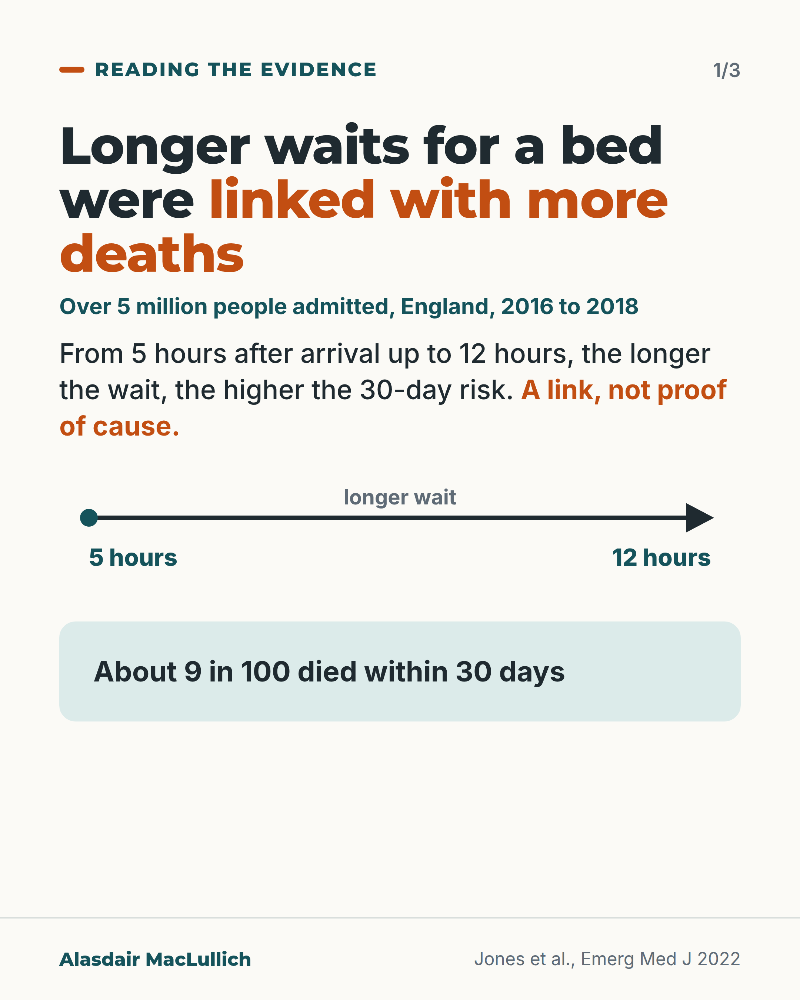
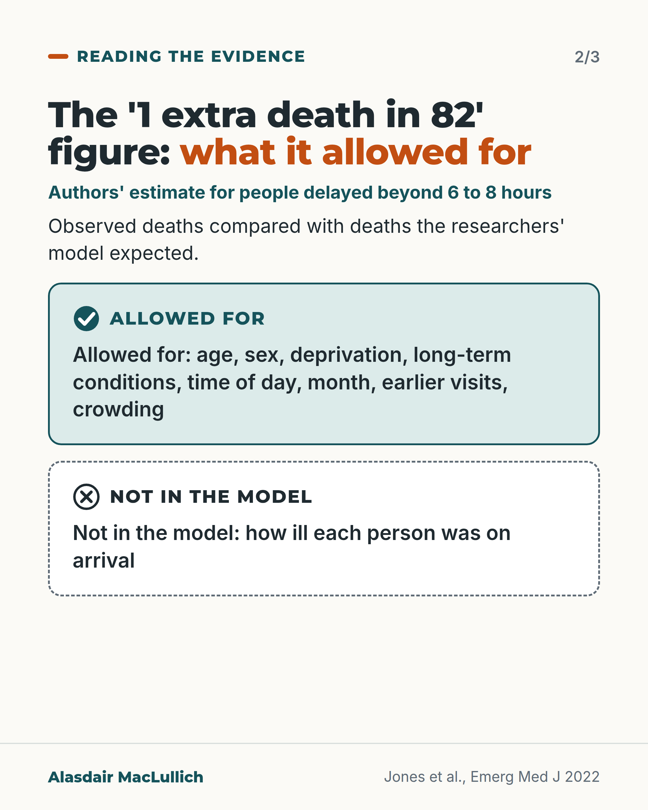
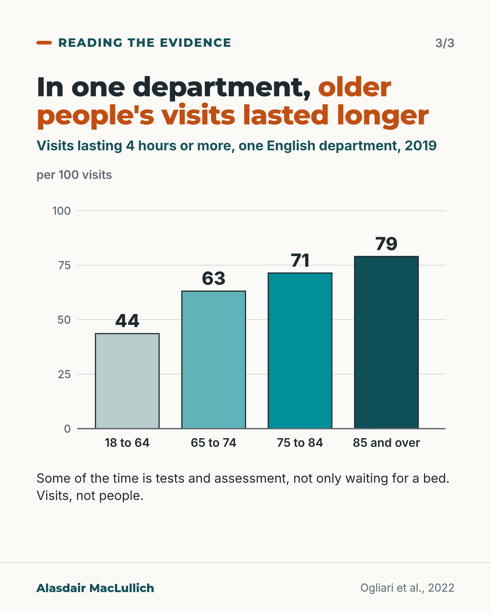

# G151: Longer waits for a bed and deaths within 30 days: reading the English study

- Category: C15 Hospital care, emergency care and discharge
- Audience: both
- Series: Reading the evidence
- Post type: evidence_interpretation
- Visual format: carousel (statement, allowed-for list, vertical bars)
- Status: text text_final, visual final
- Working id: C15-P04 (candidate C15-14)

## Insight

In over 5 million admissions in England, longer waits for a bed after arriving at a major emergency department were linked with more deaths within 30 days, rising from 5 hours up to 12. The authors' estimate of 1 extra death in 82 people delayed beyond 6 to 8 hours is a link, adjusted for some factors but not for how ill people were on arrival.

## Angle and position

The study is often quoted as '1 extra death for every 82'. Read properly, it is observational, covers all adult ages, did not adjust for severity on arrival, and does not prove each hour caused a death. Older people are among those who stay longest. Position: read the figure for what it is, and ask what it was compared with and what was allowed for.

Basis: empirical finding with interpretation: the figures, the adjustment list and the age pattern come from the studies; the advice to ask what a figure was compared with is clinical and statistical interpretation. No policy position is taken.

## X (1015 characters)

```text
People in England who waited longer for a hospital bed after arriving at a major emergency department were more likely to die within 30 days.

The study covered over 5 million people admitted in 2016 to 2018, of all ages. About 9 in 100 died within 30 days. Between 5 and 12 hours after arrival, the longer the wait, the higher the chance of dying within 30 days, compared with the number of deaths the researchers' model expected from each person's age, health and other details.

The authors estimated 1 extra death for every 82 people who waited beyond 6 to 8 hours for a ward bed, compared with the deaths their model expected. The model allowed for age, sex, how socially disadvantaged people were, long-term conditions, time of day, month, earlier visits and crowding. It did not include how ill each person was on arrival.

This is a link in the data. It does not show that the wait caused each death.

When you see a figure like '1 extra death in 82', ask what it was compared with and what was allowed for.
```

## LinkedIn (1852 characters)

```text
People in England who waited longer for a hospital bed after arriving at a major emergency department were more likely to die within 30 days.

The study covered 5,249,891 people admitted from these departments between April 2016 and March 2018. It was not limited to older people. About 9 in 100 died within 30 days. Between 5 and 12 hours after arrival (where reliable timing data stopped), the longer the wait, the higher the chance of dying within 30 days, compared with the number of deaths the researchers' model expected.

The authors estimated 1 extra death for every 82 people whose move to a ward bed was delayed beyond 6 to 8 hours. That is their estimate from comparing observed deaths with the deaths their model expected. It is a link in observational data. It does not show that the wait caused each death.

The model allowed for age, sex, how socially disadvantaged people were, long-term conditions, time of day, month, earlier visits and how crowded the department was. It did not include a measure of how ill each person was on arrival, so sicker patients may differ in ways it did not capture.

A separate study looked at older people. In one large English emergency department in 2019, 79 in 100 visits by people aged 85 or over lasted 4 hours or more. For adults aged 18 to 64 it was 44 in 100. These count visits, not people, and longer stays may partly reflect more tests and assessment, not only waiting for a bed.

Evidence for spending the night in the department is mixed. Among people aged 75 or over, more of those who stayed overnight in France died in hospital (about 16 in 100, against 11 in 100 for those on a ward before midnight). A similar Spanish study did not find a clear difference (about 11 in 100 against 10 in 100).

When you see '1 extra death in 82', ask what it was compared with, and what was allowed for.
```

## Bluesky (298 characters)

```text
In England, of over 5 million people admitted, longer waits for a bed (5 to 12 hours) went with more deaths within 30 days than a model expected. The authors estimated 1 extra death in 82 people delayed beyond 6 to 8 hours. The model left out how ill people were on arrival, so this is a link only.
```

## Threads (498 characters)

```text
People in England who waited longer for a hospital bed were more likely to die within 30 days (over 5 million people admitted in 2016 to 2018, all ages).

The authors estimated 1 extra death for every 82 people who waited beyond 6 to 8 hours for a ward bed, compared with the deaths a model expected. It is a link; the model left out how ill each person was on arrival.

When you see a figure like this, ask what it was compared with and what was allowed for (here, age, sex, long-term conditions).
```

## Source reply

Sources: https://doi.org/10.1136/emermed-2021-211572 (Jones 2022, England) https://doi.org/10.1007/s40520-022-02226-5 (Nottingham, age and length of stay) https://doi.org/10.1001/jamainternmed.2023.5961 (France, overnight stays) https://doi.org/10.1007/s11739-024-03660-1 (Spain, overnight stays)

## Visual



Alt text: Card 1: over 5 million people admitted in England 2016 to 2018; from 5 to 12 hours of waiting the longer the wait the higher the 30-day death risk, a link not proof of cause. About 9 in 100 died within 30 days. An arrow runs from 5 hours to 12 hours.



Alt text: Card 2: the 1 extra death in 82 estimate allowed for age, sex, deprivation, long-term conditions, time, month, earlier visits and crowding, but not how ill each person was on arrival.



Alt text: Card 3: bar chart of visits lasting 4 hours or more in one English department in 2019, per 100 visits: 44 aged 18 to 64, 63 aged 65 to 74, 71 aged 75 to 84, 79 aged 85 and over.

Editable source: `visuals/src/G151.html`

Design instructions: Three 4:5 light cards. Card 1 h1.m, arrow axis 5 hours to 12 hours, mint stat panel (no plotted mortality). Card 2 mint panel with tick icon (Allowed for) and dashed white panel with cross icon (Not in the model). Card 3 custom SVG vertical bars 0 to 100 graded teal. Claims C15-14-a, C15-14-c, C15-14-e.

## Sources and verification

- C15-14-a (supported): The study included 5,249,891 patients admitted from type 1 emergency departments in England from April 2016 to March 2018; crude 30-day mortality was 8.71%.
  - Source: Jones S, Moulton C, Swift S, Molyneux P, Black S, Mason N, et al. Association between delays to patient admission from the emergency department and all-cause 30-day mortality. Emerg Med J. 2022;39(3):168-73.
  - Passage: ""A cross-sectional, retrospective observational study was carried out of patients admitted from every type 1 (major) ED in England between April 2016 and March 2018. The primary outcome was death from all causes within 30 days of admission." "Between April 2016 and March 2018, 26 738 514 people attended an ED, with 7 472 480 patients admitted relating to 5 249 891 individual patients, who constituted the study's dataset. A total of 433 962 deaths occurred within 30 days. The overall crude 30-day mortality rate was 8.71% (95% CI 8.69% to 8.74%)."" (Abstract, Methods and Results)
- C15-14-b (supported_with_qualification): Mortality rose steadily with waits from 5 hours after arrival up to 12 hours; the largest change was an 8% increase in the standardised mortality ratio for waits of more than 6 to 8 hours.
  - Source: Jones S, Moulton C, Swift S, Molyneux P, Black S, Mason N, et al. Association between delays to patient admission from the emergency department and all-cause 30-day mortality. Emerg Med J. 2022;39(3):168-73.
  - Passage: ""A statistically significant linear increase in mortality was found from 5 hours after time of arrival at the ED up to 12 hours (when accurate data collection ceased) (p<0.001). The greatest change in the 30-day standardised mortality ratio was an 8% increase, occurring in the patient cohort that waited in the ED for more than 6 to 8 hours from the time of arrival."" (Abstract, Results)
- C15-14-c (supported_with_qualification): The authors estimated one extra death for every 82 admitted patients delayed beyond 6 to 8 hours from arrival.
  - Source: Jones S, Moulton C, Swift S, Molyneux P, Black S, Mason N, et al. Association between delays to patient admission from the emergency department and all-cause 30-day mortality. Emerg Med J. 2022;39(3):168-73.
  - Passage: ""For every 82 admitted patients whose time to inpatient bed transfer is delayed beyond 6 to 8 hours from time of arrival at the ED, there is one extra death." Methods: "Observed mortality was compared with expected mortality, as calculated using a logistic regression model"" (Abstract, Conclusions and Methods)
- C15-14-d (supported): The model adjusted for sex, age, deprivation, comorbidities, time of day, month, previous attendances and crowding, but not for acute illness severity.
  - Source: Jones S, Moulton C, Swift S, Molyneux P, Black S, Mason N, et al. Association between delays to patient admission from the emergency department and all-cause 30-day mortality. Emerg Med J. 2022;39(3):168-73.
  - Passage: ""expected mortality, as calculated using a logistic regression model to adjust for sex, age, deprivation, comorbidities, hour of day, month, previous ED attendances/emergency admissions and crowding in the department at the time of the attendance."" (Abstract, Methods)
- C15-14-e (supported_with_qualification): Older people are more likely than younger adults to spend 4 hours or more in the emergency department.
  - Source: Ogliari G, Coffey F, Keillor L, Aw D, Azad MY, Allaboudy M, et al. Emergency department use and length of stay by younger and older adults: Nottingham cohort study in the emergency department (NOCED). Aging Clin Exp Res. 2022;34(11):2873-85.
  - Passage: "Abstract: "Attendances of adults aged 65 to 74 years, 75 to 84 years and ≥ 85 years, respectively, had an increased risk (odds ratio (95% confidence interval) of length of ED stay ≥ 4 h of 1.52 (1.45-1.58), 1.65 (1.58-1.72), and 1.84 (1.75-1.93), compared to those of adults 18 to 64 years (all p < 0.001). These findings remained consistent in the subsets of attendances leading to hospital admission and those leading to discharge from ED." Table 3 (attendances with stay ≥4 h): 18-64 years "45,311 (43.6)"; 65-74 "9,027 (63.1)"; 75-84 "11,156 (71.4)"; ≥85 "10,142 (79.0)"." (Abstract; full text Table 3 (p. 9) with denominators from Table 2)
- C15-14-f (supported_with_qualification): In older people (75+) admitted through emergency departments, spending the night in the department was linked with higher in-hospital mortality in France, but a similar Spanish study did not find a clear difference.
  - Source: Roussel M, Teissandier D, Yordanov Y, Balen F, Noizet M, Tazarourte K, et al. Overnight stay in the emergency department and mortality in older patients. JAMA Intern Med. 2023;183(12):1378-85.; Miro O, Aguilo S, Alquezar-Arbe A, Fernandez C, Burillo G, Martinez SG, et al. Overnight stay in Spanish emergency departments and mortality in older patients. Intern Emerg Med. 2024;19(6):1653-65.
  - Passage: "Roussel 2023: "The total sample comprised 1598 patients (median [IQR] age, 86 [80-90] years ...), with 707 (44%) in the ED group and 891 (56%) in the ward group. Patients who spent the night in the ED had a higher in-hospital mortality rate of 15.7% vs 11.1% (adjusted risk ratio [aRR], 1.39; 95% CI, 1.07-1.81). They also had a higher risk of adverse events compared with the ward group (aRR, 1.24; 95% CI, 1.04-1.49)" "In a prespecified subgroup analysis of patients who required assistance with the activities of daily living, spending the night in the ED was associated with a higher in-hospital mortality rate (aRR, 1.81; 95% CI, 1.25-2.61)." Miro 2024: "In-hospital mortality for patients spending the night in the ED the ED group was 10.7% and 9.5% for patients transferred to a ward bed before midnight the ward group (adjusted OR: 1.12, 95%CI: 0.80-1.58)." "No increased risk of in-hospital mortality or prolonged hospitalization was found in older patients waiting overnight in the ED for admission."" (Roussel Abstract, Results; Miro Abstract, Results and Conclusions)

Verification notes: C15-14-a, -b, -c, -d: Jones 2022 abstract only (full text inaccessible); the 1 in 82 is presented as the authors' estimate from observed versus model-expected deaths with no comparison group stated; causal wording of the authors not repeated; 'adjusted for illness' not used. Time-band SMRs seen only in search extracts are not quoted. C15-14-e: Ogliari 2022 (full text), crude percentages, one hospital, 2019, visits not people. C15-14-f: Roussel 2023 (France) and Miro 2024 (Spain) abstracts; both studies stated; subgroup findings not used. Invitation to follow is the one used in this category (about 1 post in 10).

## Attention and follow potential

Pause: A widely quoted figure ('1 in 82') is shown with the gap in what it allowed for, which readers rarely see.

Gain: A method for reading any 'extra deaths' figure: ask the comparison and the adjustment, and see how age changes time in the department.

Follow: Posts in this series take one number at a time and say what it can and cannot show.

## Open issues

None.
